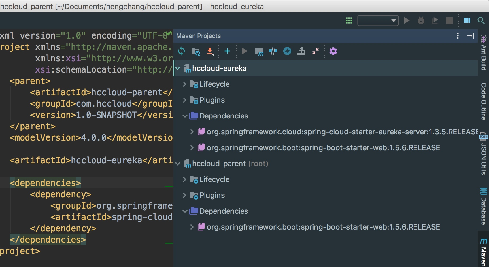

## 目录
zuul原理
zuul过滤器详解
zuul过滤器场景举例
zuul高并发爬坑

## zuul架构
1. 本质是一个web Servelet应用 ZuulServlet
2. 核心是一系列的filter，其作用可以类比Servlet框架的Filter 或者aop
3. zuul请求路由到后端服务的过程中，这些filter参与一些过滤处理

## zuul过滤器架构
请求通过网关落到具体的实例
pre filters 可以做用户认证，做nginx的log  customer filsters
routing filters 连接后端的请求 其实robbion在这里进行了拓展
服务请求做完之后，我们可以进行加工 统计 比如请求的耗时，在pre-filter做个标志，然后在post-filter中获取时间做一个统计。
error filters三个阶段的error都会被发现到然后返回到post-filter 直至response

filter通信
    requestContext

## 如何配置spring cloud zuul
filter type 
error 
pre 
post

static 静态的直接返回了
 
### zuul自定义过滤
filterType 返回过滤器的类型 pre post error static routing customer
filterOrder 返回一个int值指定过滤器的执行顺序，不同的过滤器允许返回相同的数字
shouldFilter 返回一个boolean值来判断该过滤器是否要执行，true表示执行，false表示不执行。
run 过滤器的具体逻辑

### lombok
@component
@slfj
### 演示:
 启动后第一次访问时还是时间还是很长的，2s左右，因为需要一些列的加载。之后的请求就快了很多。

### 拓展场景
1. 身份验证 pre filter 用户认证 oauth jwt 校验合法性
2. Error处理 (error filter)
3. 服务耗时统计(PostFilter) post filter 请求响应 或统计 加工
4. 动态路由(RouteFilter/RobbionRoutingFilter) @EnableZuulProxy

ctx.addZuulResponseHeader()
[Spring Cloud Zuul实现过滤器](www.programcreek.com/java-api-examples/index.php) spring-cloud-netfilx

###  常见问题
高并发下的问题
1. Hystrix熔断超时策略
2. Ribbon负载超时策略

使用Jmeter测试 高并发 Hystrix熔断打开
设置负载均衡读的时间设置为60s
设置  ribbon ...

熔断也会和线程池关联，也就是说线程池满了的时候，熔断也会请求拒绝，报nginx线程池的错误?


zuul.porxy=/api api前缀的请求都经过zuul路由
routes: #todo 路由表定义


```

mvn archetype:generate -DgroupId=com.hccloud -DartifactId=hccloud-parent -DarchetypeArtifactId=maven-archetype-quickstart -DinteractiveMode=false -DarchetypeCatalog=internal

```
spring cloud idea没有提示的原因

下图是工程不可提示的


下图工程是可以提示的


解决方案 看工程的settings
下面两张图是可以提示的


下面两张图是不可提示的


发现hccloud-eureka设置了两点不同处
1. 没有勾选 use module compile output path
2. 勾选了 exclude output paths

另外的补充，也是非常重要的是，看maven


我们发现没有提示的，就是因为maven没有导入。


原因很清晰了，因为idea工程的依赖路径设置的有问题，所以再设置就很麻烦，因此采取最快捷的方式
删除掉idea的目录及有关idea的配置文件，只保留工程目录及源码文件。
最后重新用idea打开工程，构建即可。


经过操作之后，是可以提示了，但是并不是我想要的那种。因为maven中dependencies还是没有正确的显示。


于是，换了下思路，将显示ok的pom覆盖这个蛋疼的，结果ok了...
代码对比


额，最后发现 确实少了那个依赖，也就是说 清理idea的工程配置就可以恢复了。 注意层次结构...


三者同时启动，很酷，自动识别到discovery


更酷的是


spring cloud starter config  给客户端用的  @enableconfigserver是没有的
spring cloud config server


