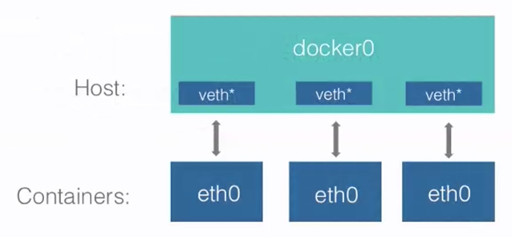

#
## 端口映射转发-p -P

### -P 随机映射转发
当使用 -P 标记时,Docker 会随机映射一个~~`49000~49900`~~ `32768 ～ 61000 `的端口到内部容器开放的网络端口。

```sh
sudo docker run -d -P training/webapp python app.py
ubuntu@ip-172-31-7-64:~$ dpl
CONTAINER ID        IMAGE               COMMAND             CREATED             STATUS              PORTS                     NAMES
4bbf84042c59        training/webapp     "python app.py"     11 seconds ago      Up 9 seconds        0.0.0.0:32768->5000/tcp   quizzical_rosalind

curl http://127.0.0.1:32768
ubuntu@ip-172-31-7-64:~$ curl http://127.0.0.1:32768
Hello world!
```
### -p 指定端口映射
-p(小写的)则可以指定要映射的端口,并且,在一个指定端口上只可以绑定一个容器。支持的格式有 ip:hostPort:containerPort | ip::containerPort |hostPort:containerPort

#### 映射所有接口地址
`hostPort:containerPort`将本地端口映射到容器端口。

```sh
sudo docker run -d -p 5000:5000 training/webapp python app.py
```
此时默认会绑定本地所有接口上的所有地址。

注意：如果未指定任何端口映射转发策略，则会无法访问。

```sh
ubuntu@ip-172-31-7-64:~$ dpl
CONTAINER ID        IMAGE               COMMAND             CREATED             STATUS              PORTS                     NAMES
4bbf84042c59        training/webapp     "python app.py"     3 hours ago         Up 3 hours          0.0.0.0:32772->5000/tcp   quizzical_rosalind

ubuntu@ip-172-31-7-64:~$ docker run -d training/webapp
024d1e4c78ff2c6cf1097190ecaf7b3ae49b762b55678f1675b2072903717231
ubuntu@ip-172-31-7-64:~$ dpl
CONTAINER ID        IMAGE               COMMAND             CREATED             STATUS              PORTS               NAMES
024d1e4c78ff        training/webapp     "python app.py"     6 seconds ago       Up 5 seconds        5000/tcp            quirky_thompson

ubuntu@ip-172-31-7-64:~$ docker run -d -p 5000:5000 training/webapp
6d600d4a6090285921ec7e12be04600157b4301fd83062308a413ab4737cca62
ubuntu@ip-172-31-7-64:~$ dpl
CONTAINER ID        IMAGE               COMMAND             CREATED             STATUS              PORTS                    NAMES
6d600d4a6090        training/webapp     "python app.py"     2 seconds ago       Up 2 seconds        0.0.0.0:5000->5000/tcp   pensive_edison
```
#### 指定绑定地址及端口
`IP::ContainerPort`  
绑定 localhost 的任意端口到容器的 5000 端口,本地主机会自动分配一个端口。

```sh
ubuntu@ip-172-31-7-64:~$ sudo docker run -d -p 127.0.0.1::5000 training/webapp python app.py
e290e2fb5b97912461237fe47f30a46fefc0cacf91582501d3e5d07eecaea34e
ubuntu@ip-172-31-7-64:~$ dpl
CONTAINER ID        IMAGE               COMMAND             CREATED             STATUS              PORTS                       NAMES
e290e2fb5b97        training/webapp     "python app.py"     2 seconds ago       Up 1 second         127.0.0.1:32769->5000/tcp   heuristic_wright
```

也可以使用udp标记指定udp端口

```sh
sudo docker run -d -p 127.0.0.1:5000:5000/udp training/webapp python app.py
```

### 查看端口映射配置

```sh
ubuntu@ip-172-31-7-64:~$ dps
CONTAINER ID        IMAGE                          COMMAND             CREATED             STATUS                PORTS                                   NAMES
e290e2fb5b97        training/webapp                "python app.py"     2 minutes ago       Up 2 minutes          127.0.0.1:32769->5000/tcp               heuristic_wright
6d600d4a6090        training/webapp                "python app.py"     9 minutes ago       Up 9 minutes          0.0.0.0:5000->5000/tcp                  pensive_edison
024d1e4c78ff        training/webapp                "python app.py"     10 minutes ago      Up 10 minutes         5000/tcp                                quirky_thompson
4bbf84042c59        training/webapp                "python app.py"     3 hours ago         Up 3 hours            0.0.0.0:32772->5000/tcp                 quizzical_rosalind
b8465f2c1ac9        ubuntu                         "/bin/bash"         4 hours ago         Up 4 hours                                                    c5
0b31695929e9        ubuntu                         "/bin/bash"         2 days ago          Up 4 hours                                                    c2
907e76a0bbce        twang2218/gitlab-ce-zh:9.4.3   "/assets/wrapper"   4 days ago          Up 3 days (healthy)   22/tcp, 443/tcp, 0.0.0.0:3000->80/tcp   youthful_lalande
ubuntu@ip-172-31-7-64:~$ docker port heuristic_wright 5000
127.0.0.1:32769
ubuntu@ip-172-31-7-64:~$ docker port pensive_edison 5000
0.0.0.0:5000
ubuntu@ip-172-31-7-64:~$ docker port quirky_thompson 5000
Error: No public port '5000/tcp' published for quirky_thompson
```

### 端口映射注意
* 容器有自己的内部网络和ip地址。(使用docker inspect可以查看这些网络配置变量，并且docker还可以有一个可变的网络配置)。
* -p标记可以多次使用来绑定多个端口

```sh
ubuntu@ip-172-31-7-64:~$ sudo docker run -d -p 5001:5000 -p 3001:80 training/webapp python app.py
92de801f36c6e6284a2f2daf80531304639e44914b6b97091c06522d883bb141
ubuntu@ip-172-31-7-64:~$ dpl
CONTAINER ID        IMAGE               COMMAND             CREATED             STATUS              PORTS                                          NAMES
92de801f36c6        training/webapp     "python app.py"     3 seconds ago       Up 2 seconds        0.0.0.0:3001->80/tcp, 0.0.0.0:5001->5000/tcp   affectionate_easley
```
请注意端口的映射，一定要对应容器内部应用的端口，否则是无法访问的。

```sh
ubuntu@ip-172-31-7-64:~$ sudo docker run -d -p 5002:5000 -p 3002:5000 training/webapp python app.py
23f238e1540b520815579760f4269008b846ccf4b457ff3e233b7ad07b44994a
ubuntu@ip-172-31-7-64:~$ dpl
CONTAINER ID        IMAGE               COMMAND             CREATED             STATUS              PORTS                                            NAMES
23f238e1540b        training/webapp     "python app.py"     5 seconds ago       Up 3 seconds        0.0.0.0:3002->5000/tcp, 0.0.0.0:5002->5000/tcp   zealous_montalcini

ubuntu@ip-172-31-7-64:~$ docker port zealous_montalcini
5000/tcp -> 0.0.0.0:3002
5000/tcp -> 0.0.0.0:5002
```


### docker logs查看应用日志
通过docker logs -f 查看应用的信息
```
ubuntu@ip-172-31-7-64:~$ docker logs -f quizzical_rosalind
 * Running on http://0.0.0.0:5000/ (Press CTRL+C to quit)
118.144.139.221 - - [14/Aug/2017 09:44:27] "GET / HTTP/1.1" 200 -
118.144.139.221 - - [14/Aug/2017 09:44:27] "GET /robots.txt HTTP/1.1" 404 -
211.103.184.74 - - [14/Aug/2017 09:44:28] "GET /favicon.ico HTTP/1.1" 404 -
211.103.184.74 - - [14/Aug/2017 09:46:10] "GET / HTTP/1.1" 200 -
118.144.139.214 - - [14/Aug/2017 09:46:22] "GET / HTTP/1.1" 200 -
118.144.139.214 - - [14/Aug/2017 09:46:29] "GET / HTTP/1.1" 200 -
118.144.139.214 - - [14/Aug/2017 09:46:32] "GET / HTTP/1.1" 200 -
```


### exec直接进入应用目录
应用类的docker容器使用exec 可以直接进入到应用目录

```sh
ubuntu@ip-172-31-7-64:~$ dpl
CONTAINER ID        IMAGE               COMMAND             CREATED             STATUS              PORTS                     NAMES
4bbf84042c59        training/webapp     "python app.py"     30 minutes ago      Up 13 minutes       0.0.0.0:32772->5000/tcp   quizzical_rosalind
ubuntu@ip-172-31-7-64:~$ docker exec -it quizzical_rosalind /bin/bash
root@4bbf84042c59:/opt/webapp#
```

注意下面的重要信息 其中的WorkingDir等
```sh
  "Config": {
            "Hostname": "723a8b93a124",
            "Domainname": "",
            "ExposedPorts": {
                "5000/tcp": {}
            },
            "Tty": false,
            "OpenStdin": false,
            "StdinOnce": false,
            "Env": [
                "PATH=/usr/local/sbin:/usr/local/bin:/usr/sbin:/usr/bin:/sbin:/bin"
            ],
            "Cmd": [
                "python",
                "app.py"
            ],
            "Image": "training/webapp",
            "Volumes": null,
            "WorkingDir": "/opt/webapp",
            "Entrypoint": null,
            "OnBuild": null,
            "Labels": {}
        },
```
    
###查看进程相关端口
```sh
root@4bbf84042c59:/opt/webapp# ps -aux | grep 1
root         1  0.0  0.3  52952 14932 ?        Ss   09:58   0:01 python app.py
root         8  0.0  0.0  17944  1204 ?        Ss   09:59   0:00 /bin/bash
root        81  0.0  0.0  18164  1960 ?        Ss+  10:12   0:00 /bin/bash
root        95  0.0  0.0  18164  1980 ?        Ss+  12:00   0:00 /bin/bash
root       117  0.0  0.0  18172  2028 ?        Ss   12:15   0:00 /bin/bash
root       136  0.0  0.0  15560  1132 ?        R+   12:16   0:00 ps -aux
root       137  0.0  0.0  18172   488 ?        R+   12:16   0:00 /bin/bash

root@4bbf84042c59:/opt/webapp# cat app.py
import os

from flask import Flask

app = Flask(__name__)

@app.route('/')
def hello():
    provider = str(os.environ.get('PROVIDER', 'world'))
    return 'Hello '+provider+'!'

if __name__ == '__main__':
    # Bind to PORT if defined, otherwise default to 5000.
    port = int(os.environ.get('PORT', 5000))
    app.run(host='0.0.0.0', port=port)
root@4bbf84042c59:/opt/webapp# netstat -nltp | grep 1
tcp        0      0 0.0.0.0:5000            0.0.0.0:*               LISTEN      1/python
root@4bbf84042c59:/opt/webapp#
```
## docker 互联

docker容器通过docker0为docker提供各种网络连接服务。docker0是linux的虚拟网桥。
```sh
ubuntu@VM-40-206-ubuntu:~$ ifconfig
docker0   Link encap:Ethernet  HWaddr 02:42:2e:22:a8:4a
          inet addr:172.17.0.1  Bcast:0.0.0.0  Mask:255.255.0.0
          UP BROADCAST RUNNING MULTICAST  MTU:1500  Metric:1
          RX packets:2518 errors:0 dropped:0 overruns:0 frame:0
          TX packets:3167 errors:0 dropped:0 overruns:0 carrier:0
          collisions:0 txqueuelen:0
          RX bytes:346414 (346.4 KB)  TX bytes:283094 (283.0 KB)
```




网桥管理程序
sudo apt-get install bridge-utils


```sh
ubuntu@ip-172-31-7-64:~$ brctl
Usage: brctl [commands]
commands:
	addbr     	<bridge>		add bridge
	delbr     	<bridge>		delete bridge
	addif     	<bridge> <device>	add interface to bridge
	delif     	<bridge> <device>	delete interface from bridge
	hairpin   	<bridge> <port> {on|off}	turn hairpin on/off
	setageing 	<bridge> <time>		set ageing time
	setbridgeprio	<bridge> <prio>		set bridge priority
	setfd     	<bridge> <time>		set bridge forward delay
	sethello  	<bridge> <time>		set hello time
	setmaxage 	<bridge> <time>		set max message age
	setpathcost	<bridge> <port> <cost>	set path cost
	setportprio	<bridge> <port> <prio>	set port priority
	show      	[ <bridge> ]		show a list of bridges
	showmacs  	<bridge>		show a list of mac addrs
	showstp   	<bridge>		show bridge stp info
	stp       	<bridge> {on|off}	turn stp on/off
ubuntu@ip-172-31-7-64:~$ brctl show
bridge name	bridge id		STP enabled	interfaces
docker0		8000.0242c0d9f37b	no		veth08c65c5
							veth3be784d
							veth48fcda9
							veth6b4ecf0
							veth9407d36
							vethb184089
							vethb3986ba
							vethcca6ae5
							vethe1a0c91
							vethe9018f8
							vethf8f6c89
```


案例：
创建db容器
```sh
sudo docker run -d --name db training/postgres
```

创建web容器并连接db容器
```sh
sudo docker run -d -P --name web --link db:db training/webapp python app.py
```

Docker的ubuntu镜像安装的容器无ifconfig和ping命令的解决

```sh
apt-get update
apt install net-tools       # ifconfig 
apt install iputils-ping     # ping
```

docker容器的ip地址是变化的(重启后会发生变化)，不可靠的。生产中我们不希望是如此情况，docker提供了本地域名的选项(dns映射)，始终绑定到唯一的docker容器。

