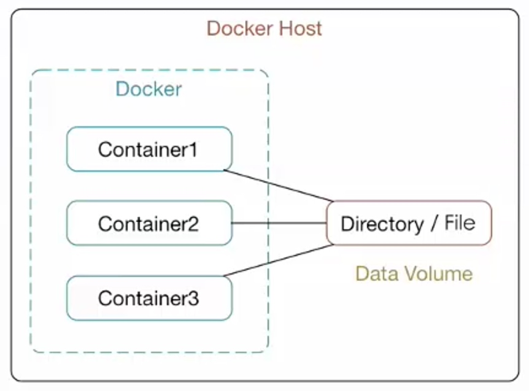

# docker 数据管理
## 数据卷(Data volumes)
### 概念理论
docker的数据卷独立于容器存在宿主机中


数据卷是一个可供一个或多个容器使用的特殊目录,它绕过 UFS,可以提供很多有用的特性:
* 数据卷独立于容器存在，存在于docker host即docker容器所在的宿主机中。因此数据卷的生命周期与容器生命周期也是分离的。数据卷的目的就在于数据的持久化。
* docker数据卷存在于docker宿主机的文件系统中
* docker数据卷可以是目录，也可以是文件
* 容器可以利用数据卷与宿主机进行数据共享
* 同一个目录或文件可以支持多个docker容器的访问(实现了容器之间的数据共享与交换)

数据卷的特点:
* 数据卷是在容器启动时初始化的，如果容器使用的镜像在挂载点包含了数据，这些数据会被拷贝到新的初始化的数据卷中
* 数据卷可以在容器之间共享和重用
* 可以对数据卷里的内容直接进行修改
* 数据卷的变化不会影响到镜像的更新
* 卷会一直存在，即使挂载数据卷的容器已经被删除

* 数据卷可以在容器之间共享和重用 
* 对数据卷的修改会立马生效
* 对数据卷的更新,不会影响镜像
* 数据卷默认会一直存在,即使容器被删除

### 数据卷的使用
####添加数据卷 
使用方法
`docker run -v localDir:ContainerDir `

```sh
ubuntu@ip-172-31-7-64:~$ docker run -it -v ~/dataVolume:/data ubuntu /bin/bash
root@89028a81afb0:/# ls
bin  boot  data  dev  etc  home  lib  lib64  media  mnt  opt  proc  root  run  sbin  srv  sys  tmp  usr  var
root@89028a81afb0:/# echo "I'm in container" > data/c1
root@89028a81afb0:/# cat data/c1
I'm in container
root@89028a81afb0:/# exit
exit
ubuntu@ip-172-31-7-64:~$ dpl
CONTAINER ID        IMAGE               COMMAND             CREATED             STATUS                     PORTS               NAMES
89028a81afb0        ubuntu              "/bin/bash"         51 seconds ago      Exited (0) 4 seconds ago                       stupefied_volhard
ubuntu@ip-172-31-7-64:~$ cat dataVolume/c1
I'm in container
```

注意dest必须是绝对路径

```sh
ubuntu@ip-172-31-7-64:~$ docker run -v ~/dataVolume:data --name c2 ubuntu /bin/bash
docker: Error response from daemon: invalid bind mount spec "/home/ubuntu/dataVolume:data": invalid volume specification: '/home/ubuntu/dataVolume:data': invalid mount config for type "bind": invalid mount path: 'data' mount path must be absolute.
See 'docker run --help'.
```

#### 查看数据卷挂载
查看挂载的目录
`docker inspect container`
通过inspect命令看到Mounts选项中有数据卷的具体定义。

```sh
ubuntu@ip-172-31-7-64:~$ docker inspect stupefied_volhard
[
    {
       ...... 
        "Mounts": [
            {
                "Type": "bind",
                "Source": "/home/ubuntu/dataVolume",
                "Destination": "/data",
                "Mode": "",
                "RW": true,
                "Propagation": ""
            }
        ],
        .....
    }
]
```

#### 添加数据卷的访问权限
方法:在指定数据卷目录后添加访问权限
`docker run -v src:dest:ro`  ro为只读权限


无法写入文件
但是vim是可以打开文件的。说明该目录确实是只读的。

```sh
ubuntu@ip-172-31-7-64:~$ docker run -it -v ~/dataVolume:/data:ro --name c2 ubuntu /bin/bash
root@85ea3ff687de:/# echo "in c2" > /data/c2
bash: /data/c2: Read-only file system
root@85ea3ff687de:/# exit
exit
ubuntu@ip-172-31-7-64:~$ docker inspect c2
[
    {
      
        "Mounts": [
            {
                "Type": "bind",
                "Source": "/home/ubuntu/dataVolume",
                "Destination": "/data",
                "Mode": "ro",
                "RW": false,
                "Propagation": ""
            }
        ],

    }
]
```
 我们可以通过inspect命令查看数据卷的读写读写权限。
 
#### 使用Dockerfie创建包含数据卷的镜像
Dockerfile指令`VOLUME:["/data","..."]` 
然后通过该镜像创建容器。

```sh

ubuntu@ip-172-31-7-64:~$ sudo docker build -t myubuntu .
Sending build context to Docker daemon  46.25MB
Step 1/3 : FROM ubuntu
 ---> 14f60031763d
Step 2/3 : VOLUME /data
 ---> Running in 07d0b089d920
 ---> 2adae64ad768
Removing intermediate container 07d0b089d920
Step 3/3 : CMD /bin/bash
 ---> Running in b3c646a4f401
 ---> 16c6fb33bca8
Removing intermediate container b3c646a4f401
Successfully built 16c6fb33bca8
Successfully tagged myubuntu:latest
ubuntu@ip-172-31-7-64:~$ docker run -it myubuntu --name cdv01   ##顺序不要颠倒
docker: Error response from daemon: oci runtime error: container_linux.go:247: starting container process caused "exec: \"--name\": executable file not found in $PATH".
ubuntu@ip-172-31-7-64:~$ docker run -it  --name cdv01 myubuntu
root@173170fb06e6:/# ls
bin  boot  data  dev  etc  home  lib  lib64  media  mnt  opt  proc  root  run  sbin  srv  sys  tmp  usr  var
root@173170fb06e6:/#
```


```sh
$ cat Dockerfile
from ubuntu
volume ["/dataVolume01","/dataVolume2"]
cmd /bin/bash

ubuntu@ip-172-31-7-64:~$ docker run -it --name cdv02 myubuntu   ===>tab
myubuntu          myubuntu2         myubuntu2:latest  myubuntu:latest
ubuntu@ip-172-31-7-64:~$ docker run -it --name cdv02 myubuntu2
root@1de702ad9215:/# ls
bin  boot  dataVolume01  dataVolume2  dev  etc  home  lib  lib64  media  mnt  opt  proc  root  run  sbin  srv  sys  tmp  usr  var
```
 
 我们来关注下使用Dockerfile的挂载信息。通过查看我们发现src是docker来生成的，并且每次创建不同的容器，本地的docker文件路径也是不一样的。并且这样的目录数据是服务被容器共享的。容器启动时在镜像中创建的数据卷都会被进行一次完整的初始化，那么根据镜像指定数据卷创建的容器所使用的数据卷就没有办法进行数据共享。我们不能访问本地目录时，该如何在容器间共享数据呢？解决方案是数据卷容器。
```sh
$ docker inspect cdv01

"Mounts": [
       {
           "Type": "volume",
           "Name": "91b8c9c20a93db71d5afe4af36857e78c95d3590391608508ac0cacdcd0edf28",
           "Source": "/var/lib/docker/volumes/91b8c9c20a93db71d5afe4af36857e78c95d3590391608508ac0cacdcd0edf28/_data",
           "Destination": "/data",
           "Driver": "local",
           "Mode": "",
           "RW": true,
           "Propagation": ""
       }
   ],
```
 
 
```sh
$ docker inspect cdv02
 "Mounts": [
            {
                "Type": "volume",
                "Name": "7080a64f6f5ccb4fe6ea33ca8ed8106b5d3aa1734566b85a2a49c46c0bae5148",
                "Source": "/var/lib/docker/volumes/7080a64f6f5ccb4fe6ea33ca8ed8106b5d3aa1734566b85a2a49c46c0bae5148/_data",
                "Destination": "/dataVolume01",
                "Driver": "local",
                "Mode": "",
                "RW": true,
                "Propagation": ""
            },
            {
                "Type": "volume",
                "Name": "50ed80d419446154c6c6b7ec68ece306fea86984884f604cef557afc59510148",
                "Source": "/var/lib/docker/volumes/50ed80d419446154c6c6b7ec68ece306fea86984884f604cef557afc59510148/_data",
                "Destination": "/dataVolume2",
                "Driver": "local",
                "Mode": "",
                "RW": true,
                "Propagation": ""
            }
        ],
```

#### 数据共享实验

```sh
ubuntu@ip-172-31-7-64:~$ docker run -it -v ~/dataVolume:/data ubuntu /bin/bash
root@fa58fba3a035:/# echo "in c1" > /data/c1
root@fa58fba3a035:/# exit
exit
ubuntu@ip-172-31-7-64:~$ cat ~/dataVolume/c1
in c1
ubuntu@ip-172-31-7-64:~$ docker run --name c2 -it -v ~/dataVolume:/data ubuntu /bin/bash
root@0b31695929e9:/# cat /data/c
c1  c2
root@0b31695929e9:/# cat /data/c1
in c1
root@0b31695929e9:/# cat /data/c2
c2 in container
root@0b31695929e9:/# echo "c22" > /data/c3
root@0b31695929e9:/# exit
exit
ubuntu@ip-172-31-7-64:~$ dps
CONTAINER ID        IMAGE                          COMMAND             CREATED             STATUS                  PORTS                                   NAMES
907e76a0bbce        twang2218/gitlab-ce-zh:9.4.3   "/assets/wrapper"   2 days ago          Up 41 hours (healthy)   22/tcp, 443/tcp, 0.0.0.0:3000->80/tcp   youthful_lalande
ubuntu@ip-172-31-7-64:~$ dpa
CONTAINER ID        IMAGE                          COMMAND             CREATED              STATUS                     PORTS                                   NAMES
0b31695929e9        ubuntu                         "/bin/bash"         About a minute ago   Exited (0) 6 seconds ago                                           c2
fa58fba3a035        ubuntu                         "/bin/bash"         2 minutes ago        Exited (0) 2 minutes ago                                           nifty_johnson
907e76a0bbce        twang2218/gitlab-ce-zh:9.4.3   "/assets/wrapper"   2 days ago           Up 41 hours (healthy)      22/tcp, 443/tcp, 0.0.0.0:3000->80/tcp   youthful_lalande
ubuntu@ip-172-31-7-64:~$ docker exec nifty_johnson cat /data/c3
Error response from daemon: Container fa58fba3a035db11cd16993fce43ca5e0f50a093e45c10ca34f49608dd631a3f is not running
ubuntu@ip-172-31-7-64:~$ docker restart nifty_johnson
nifty_johnson
ubuntu@ip-172-31-7-64:~$ docker exec nifty_johnson cat /data/c3
c22
```

