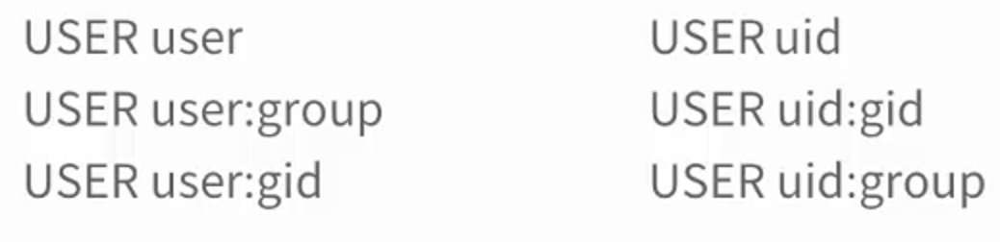
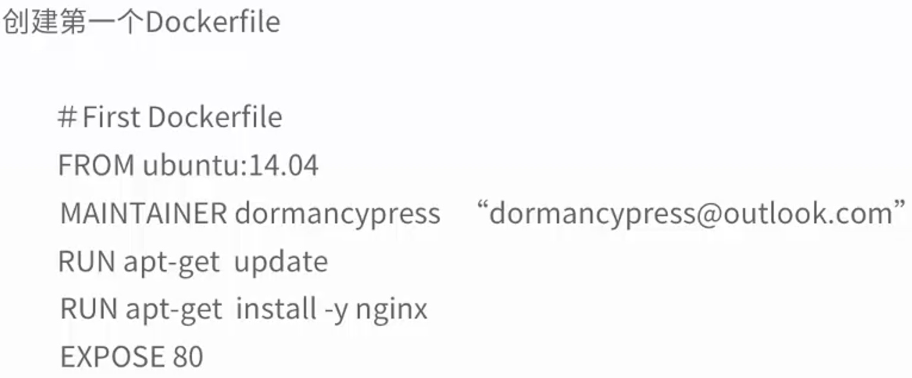
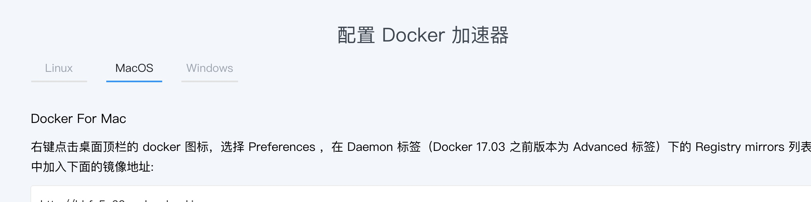
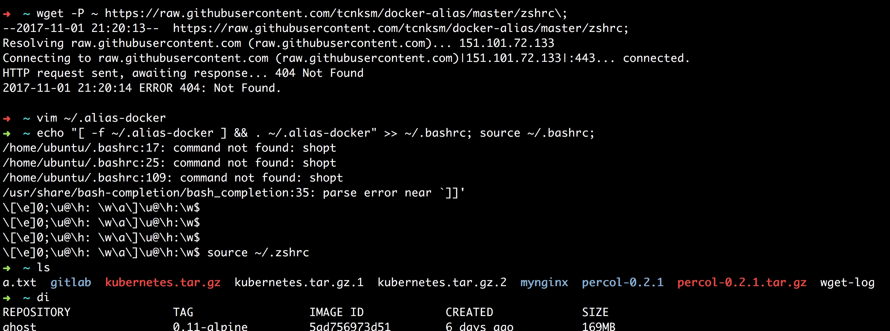
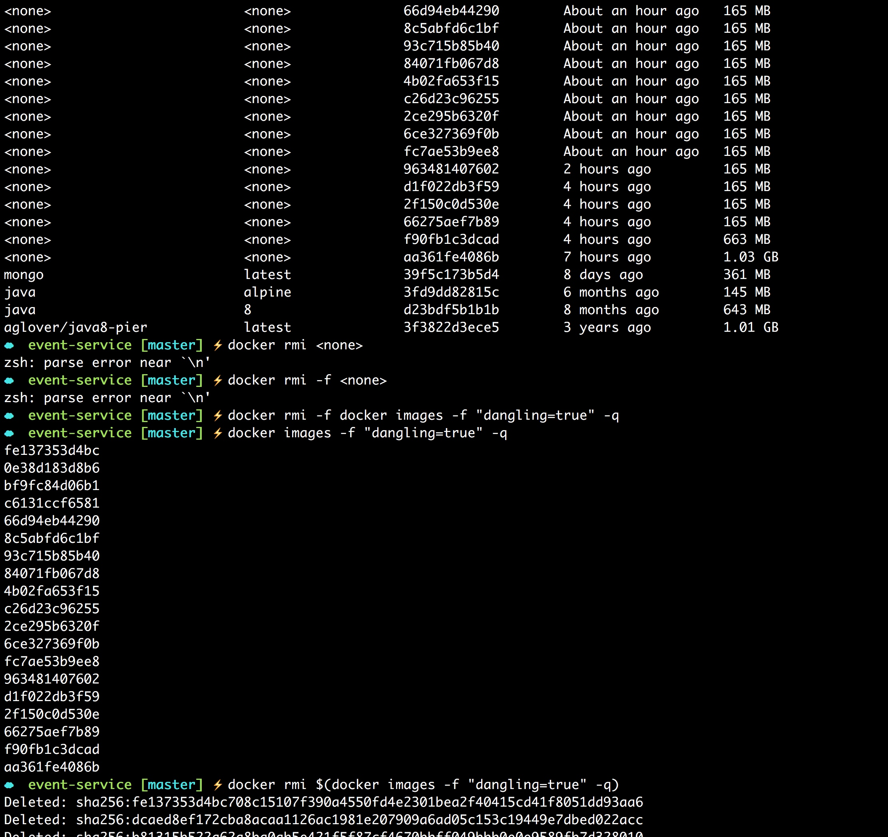

# docker基础操作
命令用法很简单，记住一条即可。
`docker command --help`

## 安装
daocloud的安装脚本 
```sh
curl -sSL https://get.daocloud.io/docker | sh
```

阿里云
```sh
curl -sSL http://acs-public-mirror.oss-cn-hangzhou.aliyuncs.com/docker-engine/internet | sh -
```
## 1. 拉取镜像 docker pull
`docker pull <Image>`
如果没有仓库，则说明是从默认的dockerHub仓库下载，但国内网络环境你懂的。最佳的方式是使用云服务商的dockerHub加速器。阿里云和腾讯云的加速器都非常不错。

## 2. 查看镜像

`docker images`命令列出本地已经下载的镜像

```sh
$ docker images
REPOSITORY          TAG                 IMAGE ID            CREATED             SIZE
ubuntu              latest              14f60031763d        2 weeks ago         120MB
ubuntu              14.04               54333f1de4ed        2 weeks ago         188MB
```

具体的用法及参数

```sh
$ docker images --help

Usage:	docker images [OPTIONS] [REPOSITORY[:TAG]]

List images

Options:
  -a, --all             Show all images (default hides intermediate images)
      --digests         Show digests
  -f, --filter filter   Filter output based on conditions provided
      --format string   Pretty-print images using a Go template
      --help            Print usage
      --no-trunc        Don't truncate output
  -q, --quiet           Only show numeric IDs
```
## 启动容器

```sh
$ docker run --help

Usage:	docker run [OPTIONS] IMAGE [COMMAND] [ARG...]

Run a command in a new container

Options:
      --add-host list                  Add a custom host-to-IP mapping (host:ip)
  -a, --attach list                    Attach to STDIN, STDOUT or STDERR
      --blkio-weight uint16            Block IO (relative weight), between 10 and 1000, or 0 to disable (default 0)
      --blkio-weight-device list       Block IO weight (relative device weight) (default [])
      --cap-add list                   Add Linux capabilities
      --cap-drop list                  Drop Linux capabilities
      --cgroup-parent string           Optional parent cgroup for the container
      --cidfile string                 Write the container ID to the file
      --cpu-period int                 Limit CPU CFS (Completely Fair Scheduler) period
      --cpu-quota int                  Limit CPU CFS (Completely Fair Scheduler) quota
      --cpu-rt-period int              Limit CPU real-time period in microseconds
      --cpu-rt-runtime int             Limit CPU real-time runtime in microseconds
  -c, --cpu-shares int                 CPU shares (relative weight)
      --cpus decimal                   Number of CPUs
      --cpuset-cpus string             CPUs in which to allow execution (0-3, 0,1)
      --cpuset-mems string             MEMs in which to allow execution (0-3, 0,1)
  -d, --detach                         Run container in background and print container ID
      --detach-keys string             Override the key sequence for detaching a container
      --device list                    Add a host device to the container
      --device-cgroup-rule list        Add a rule to the cgroup allowed devices list
      --device-read-bps list           Limit read rate (bytes per second) from a device (default [])
      --device-read-iops list          Limit read rate (IO per second) from a device (default [])
      --device-write-bps list          Limit write rate (bytes per second) to a device (default [])
      --device-write-iops list         Limit write rate (IO per second) to a device (default [])
      --disable-content-trust          Skip image verification (default true)
      --dns list                       Set custom DNS servers
      --dns-option list                Set DNS options
      --dns-search list                Set custom DNS search domains
      --entrypoint string              Overwrite the default ENTRYPOINT of the image
  -e, --env list                       Set environment variables
      --env-file list                  Read in a file of environment variables
      --expose list                    Expose a port or a range of ports
      --group-add list                 Add additional groups to join
      --health-cmd string              Command to run to check health
      --health-interval duration       Time between running the check (ns|us|ms|s|m|h) (default 0s)
      --health-retries int             Consecutive failures needed to report unhealthy
      --health-start-period duration   Start period for the container to initialize before starting health-retries
                                       countdown (ns|us|ms|s|m|h) (default 0s)
      --health-timeout duration        Maximum time to allow one check to run (ns|us|ms|s|m|h) (default 0s)
      --help                           Print usage
  -h, --hostname string                Container host name
      --init                           Run an init inside the container that forwards signals and reaps processes
  -i, --interactive                    Keep STDIN open even if not attached
      --ip string                      IPv4 address (e.g., 172.30.100.104)
      --ip6 string                     IPv6 address (e.g., 2001:db8::33)
      --ipc string                     IPC namespace to use
      --isolation string               Container isolation technology
      --kernel-memory bytes            Kernel memory limit
  -l, --label list                     Set meta data on a container
      --label-file list                Read in a line delimited file of labels
      --link list                      Add link to another container
      --link-local-ip list             Container IPv4/IPv6 link-local addresses
      --log-driver string              Logging driver for the container
      --log-opt list                   Log driver options
      --mac-address string             Container MAC address (e.g., 92:d0:c6:0a:29:33)
  -m, --memory bytes                   Memory limit
      --memory-reservation bytes       Memory soft limit
      --memory-swap bytes              Swap limit equal to memory plus swap: '-1' to enable unlimited swap
      --memory-swappiness int          Tune container memory swappiness (0 to 100) (default -1)
      --mount mount                    Attach a filesystem mount to the container
      --name string                    Assign a name to the container
      --network string                 Connect a container to a network (default "default")
      --network-alias list             Add network-scoped alias for the container
      --no-healthcheck                 Disable any container-specified HEALTHCHECK
      --oom-kill-disable               Disable OOM Killer
      --oom-score-adj int              Tune host's OOM preferences (-1000 to 1000)
      --pid string                     PID namespace to use
      --pids-limit int                 Tune container pids limit (set -1 for unlimited)
      --privileged                     Give extended privileges to this container
  -p, --publish list                   Publish a container's port(s) to the host
  -P, --publish-all                    Publish all exposed ports to random ports
      --read-only                      Mount the container's root filesystem as read only
      --restart string                 Restart policy to apply when a container exits (default "no")
      --rm                             Automatically remove the container when it exits
      --runtime string                 Runtime to use for this container
      --security-opt list              Security Options
      --shm-size bytes                 Size of /dev/shm
      --sig-proxy                      Proxy received signals to the process (default true)
      --stop-signal string             Signal to stop a container (default "SIGTERM")
      --stop-timeout int               Timeout (in seconds) to stop a container
      --storage-opt list               Storage driver options for the container
      --sysctl map                     Sysctl options (default map[])
      --tmpfs list                     Mount a tmpfs directory
  -t, --tty                            Allocate a pseudo-TTY
      --ulimit ulimit                  Ulimit options (default [])
  -u, --user string                    Username or UID (format: <name|uid>[:<group|gid>])
      --userns string                  User namespace to use
      --uts string                     UTS namespace to use
  -v, --volume list                    Bind mount a volume
      --volume-driver string           Optional volume driver for the container
      --volumes-from list              Mount volumes from the specified container(s)
  -w, --workdir string                 Working directory inside the container
 
```
### 3. 命令行式启动容器 (Ad hoc方式执行容器命令)
所谓ad hoc方式就是 一次性执行完成后即销毁。

格式: `docker run image [command] [arg]`   

```sh
$ docker run ubuntu echo 'hello docker'
hello docker
```

```sh
$ docker run ubuntu echo 'hello docker'
hello docker
```

run在新容器中执行命令，如果镜像不存在则到dockerHub中下载。注意指定镜像的方式最好加指定的tag，否则会默认的添加image:latest，没有匹配的，则会远程拉取下载。另一种方式可以通过指定唯一的ImageId即可。

```sh
$ docker run ubuntu echo "hello world"
hello world
$ docker run ubuntu:14.04 echo "hello world"
hello world
```
注意第一个其实默认为`ubuntu:latest`的方式


当命令执行完毕后，该容器就会终止，以上命令只是执行一个命令(ad hoc)，我们可以通过

`docker ps -a`查看所有的容器(运行中的和执行过的)

```sh
$ docker ps -a
CONTAINER ID        IMAGE               COMMAND                 CREATED             STATUS                      PORTS               NAMES
07df14a317da        ubuntu              "echo 'hello docker'"   2 minutes ago       Exited (0) 2 minutes ago
```
我们发现通过`docker run image command arg`命令是一次性启动容器执行命令执行完毕后销毁容器。

Ctrl+C退出，container就停止了，按`ctrl-p ctrl-q`(组合键)可以退出到宿主机，而保持container仍然在运行。另外，如果-d启动但后面的命令执行完就结束了，后台运行容器，不会进入到容器。
### 4. 交互式启动容器(始终运行直到退出)
格式: `docker run -i -t image /bin/bash`
* `-i` --interactive=true|false false是默认  代表:交互式 保持打开
* `-t` --tty=true|false false是默认   代表:伪终端
* `-i -t` 可以缩略为 `-it`效果等同
* /bin/bash 指定运行的shell 可默认省略

```sh
docker@fengqichao:~$  docker run -i -t ubuntu /bin/bash
root@eff926ba2186:/# echo 'hello world'
hello world
root@eff926ba2186:/# ps -ef
UID        PID  PPID  C STIME TTY          TIME CMD
root         1     0  0 03:19 ?        00:00:00 /bin/bash
root        13     1  0 03:21 ?        00:00:00 ps -ef
root@eff926ba2186:/# exit
exit
```


总结3,4两小节 
当利用 docker run 来创建容器时,Docker 在后台运行的标准操作包括: 
>1. 检查本地是否存在指定的镜像,不存在就从公有仓库下载
>2. 利用镜像创建并启动一个容器 
>3. 分配一个文件系统,并在只读的镜像层外面挂载一层可读写层 
>4. 从宿主主机配置的网桥接口中桥接一个虚拟接口到容器中去 
>5. 从地址池配置一个 ip 地址给容器 
>6. 执行用户指定的应用程序 
>7. 执行完毕后容器被终止

但给我们进行容器内部执行top或ps命令时，看到的进程真的是只有运行的bash进程，这可谓是货真价实的轻量级虚拟化，Docker对资源的利用率是极高的。


### 5. 后台运行及log

docker logs : 获取容器的日志
语法:
`docker logs [OPTIONS] CONTAINER`
OPTIONS说明：

```sh
-f : 跟踪日志输出
--since :显示某个开始时间的所有日志
-t : 显示时间戳
--tail :仅列出最新N条容器日志
```

```sh
$ sudo docker run -d ubuntu:14.04 /bin/sh -c  "while true; do echo hello world >> out.txt; sleep 1; done"
3aa5c9587ec6bb4a65e363e8f264b84bdb74ec079b66b531683248cb0cc14d4c
$ dps
CONTAINER ID        IMAGE               COMMAND                  CREATED             STATUS              PORTS               NAMES
3aa5c9587ec6        ubuntu:14.04        "/bin/sh -c 'while..."   13 seconds ago      Up 12 seconds                           nervous_nightingale
094cc6b45666        ubuntu:14.04        "/bin/sh -c 'while..."   11 minutes ago      Up 11 minutes                           brave_leavitt
f6777103d420        ubuntu:14.04        "/bin/sh -c 'while..."   14 minutes ago      Up 14 minutes                           amazing_borg
a4bba758a357        ubuntu:14.04        "/bin/sh -c 'while..."   21 minutes ago      Up 21 minutes                           admiring_albattani
$ docker exec -it nervous_nightingale /bin/bash
root@3aa5c9587ec6:/# tail -f -n 5 out.txt
hello world
hello world
hello world
hello world
hello world
hello world
...
```

```sh
docker run  ubuntu:14.04 /bin/sh -c  "while true; do echo hello world; sleep 1; done"
```
上述命令直接echo不重定向 并且也不使用-d参数，则会输出到宿主机控制台打印。
那么使用了-d后台执行（守护态运行），该如何查看输出呢。  

可以使用`docker logs ImageId`查看  

```sh
$ docker run -d  ubuntu:14.04 /bin/sh -c  "while true; do echo hello world; sleep 1; done"
4e68334f01e87e4ff616ee5b28b9df3348c69797cda56734768a745076b34962
$ docker logs 4e6
hello world
hello world
......
```

注意容器运行的长久和-d参数并无关系。而是和run执行的命令有关。

```sh
$ docker run -d ubuntu /bin/bash echo "helo"
de23886dbb5ec0336a7338f02ba87b24d1ae1b8f388f377e2f0513155e1bef71
$ dps
CONTAINER ID        IMAGE               COMMAND                  CREATED             STATUS              PORTS               NAMES
3aa5c9587ec6        ubuntu:14.04        "/bin/sh -c 'while..."   3 minutes ago       Up 3 minutes                            nervous_nightingale
094cc6b45666        ubuntu:14.04        "/bin/sh -c 'while..."   15 minutes ago      Up 15 minutes                           brave_leavitt
f6777103d420        ubuntu:14.04        "/bin/sh -c 'while..."   17 minutes ago      Up 17 minutes                           amazing_borg
a4bba758a357        ubuntu:14.04        "/bin/sh -c 'while..."   24 minutes ago      Up 24 minutes                           admiring_albattani
$ dpa
CONTAINER ID        IMAGE                          COMMAND                  CREATED             STATUS                        PORTS               NAMES
de23886dbb5e        ubuntu                         "/bin/bash echo helo"    9 seconds ago       Exited (126) 8 seconds ago                        compassionate_hermann
```
## 5. 查看容器

镜像可以理解为类/模板(静态)，而容器则为对象/实例(动态)。

`docker inspect -f {{format}} container`

```sh
ubuntu@ip-172-31-7-64:~$ docker inspect -f {{.Name}} 23f23
/zealous_montalcini
```

### 开机启动--restart=always

```sh
docker run -d -p 9997:9999 --restart=always myapp:myapp
```
[Docker容器开机自动启动（在宿主机重启后或者Docker服务重启后）](http://molewan.blog.51cto.com/287340/1743902)
### docker ps

`docker ps [-a]|[-l]`  

* 默认不加任何参数将返回正在运行的容器
* -a 查看所有的容器(已销毁和正运行的)
* -l 最新创建的容器 

注意:`docker ps`命令返回的字段`Containter ID`和`Names`字段均为docker为容器自动分配的。

```sh
$ docker ps
CONTAINER ID        IMAGE               COMMAND             CREATED             STATUS              PORTS               NAMES

$  docker ps -l
CONTAINER ID        IMAGE               COMMAND             CREATED             STATUS                     PORTS               NAMES
eff926ba2186        ubuntu              "/bin/bash"         5 minutes ago       Exited (0) 3 minutes ago                       laughing_kilby

$ docker ps -a
CONTAINER ID        IMAGE               COMMAND                 CREATED             STATUS                         PORTS               NAMES
eff926ba2186        ubuntu              "/bin/bash"             5 minutes ago       Exited (0) 3 minutes ago                           laughing_kilby
07df14a317da        ubuntu              "echo 'hello docker'"   19 minutes ago      Exited (0) 19 minutes ago                          unruffled_meninsky
```

更详细通过命令`docker ps --help`查看

```sh
$ docker ps --help

Usage:	docker ps [OPTIONS]

List containers

Options:
  -a, --all             Show all containers (default shows just running)
  -f, --filter filter   Filter output based on conditions provided
      --format string   Pretty-print containers using a Go template
      --help            Print usage
  -n, --last int        Show n last created containers (includes all states) (default -1)
  -l, --latest          Show the latest created container (includes all states)
      --no-trunc        Don't truncate output
  -q, --quiet           Only display numeric IDs
  -s, --size            Display total file sizes
```

### docker inspect

`docker inspect [containter id] | [name]`    
该命令会自省容器的配置信息  
注意container id可以唯一的标识就行比如前4位唯一标识，只需使用4位即可。
但是name需要全名，是全匹配。

```sh
$ docker ps -l
CONTAINER ID        IMAGE               COMMAND             CREATED             STATUS                       PORTS               NAMES
bab10e1eb6fc        ubuntu              "/bin/bash"         10 minutes ago      Exited (127) 7 minutes ago                       goofy_hamilton

$ docker inspect bab10e1eb6fc
[
    {
        "Id": "bab10e1eb6fc6a3841c0dbc0bc65ac3f9bfe3074cc145261b38eed0b24f96445",
        "Created": "2017-04-13T10:16:46.373541887Z",
        "Path": "/bin/bash",
        "Args": [],
        "State": {
            "Status": "exited",
            "Running": false,
            "Paused": false,
            "Restarting": false,
            "OOMKilled": false,
            "Dead": false,
            "Pid": 0,
            "ExitCode": 127,
            "Error": "",
            "StartedAt": "2017-04-13T10:16:46.575904921Z",
            "FinishedAt": "2017-04-13T10:19:56.042879432Z"
        },
        "Image": "sha256:6a2f32de169d14e6f8a84538eaa28f2629872d7d4f580a303b296c60db36fbd7",
        "ResolvConfPath": "/var/lib/docker/containers/bab10e1eb6fc6a3841c0dbc0bc65ac3f9bfe3074cc145261b38eed0b24f96445/resolv.conf",
        "HostnamePath": "/var/lib/docker/containers/bab10e1eb6fc6a3841c0dbc0bc65ac3f9bfe3074cc145261b38eed0b24f96445/hostname",
        "HostsPath": "/var/lib/docker/containers/bab10e1eb6fc6a3841c0dbc0bc65ac3f9bfe3074cc145261b38eed0b24f96445/hosts",
        "LogPath": "/var/lib/docker/containers/bab10e1eb6fc6a3841c0dbc0bc65ac3f9bfe3074cc145261b38eed0b24f96445/bab10e1eb6fc6a3841c0dbc0bc65ac3f9bfe3074cc145261b38eed0b24f96445-json.log",
        "Name": "/goofy_hamilton",
        "RestartCount": 0,
        "Driver": "aufs",
        "MountLabel": "",
        "ProcessLabel": "",
        "AppArmorProfile": "docker-default",
        "ExecIDs": null,
        "HostConfig": {
            "Binds": null,
            "ContainerIDFile": "",
            "LogConfig": {
                "Type": "json-file",
                "Config": {}
            },
            "NetworkMode": "default",
            "PortBindings": {},
            "RestartPolicy": {
                "Name": "no",
                "MaximumRetryCount": 0
            },
            "AutoRemove": false,
            "VolumeDriver": "",
            "VolumesFrom": null,
            "CapAdd": null,
            "CapDrop": null,
            "Dns": [],
            "DnsOptions": [],
            "DnsSearch": [],
            "ExtraHosts": null,
            "GroupAdd": null,
            "IpcMode": "",
            "Cgroup": "",
            "Links": null,
            "OomScoreAdj": 0,
            "PidMode": "",
            "Privileged": false,
            "PublishAllPorts": false,
            "ReadonlyRootfs": false,
            "SecurityOpt": null,
            "UTSMode": "",
            "UsernsMode": "",
            "ShmSize": 67108864,
            "Runtime": "runc",
            "ConsoleSize": [
                0,
                0
            ],
            "Isolation": "",
            "CpuShares": 0,
            "Memory": 0,
            "NanoCpus": 0,
            "CgroupParent": "",
            "BlkioWeight": 0,
            "BlkioWeightDevice": null,
            "BlkioDeviceReadBps": null,
            "BlkioDeviceWriteBps": null,
            "BlkioDeviceReadIOps": null,
            "BlkioDeviceWriteIOps": null,
            "CpuPeriod": 0,
            "CpuQuota": 0,
            "CpuRealtimePeriod": 0,
            "CpuRealtimeRuntime": 0,
            "CpusetCpus": "",
            "CpusetMems": "",
            "Devices": [],
            "DeviceCgroupRules": null,
            "DiskQuota": 0,
            "KernelMemory": 0,
            "MemoryReservation": 0,
            "MemorySwap": 0,
            "MemorySwappiness": -1,
            "OomKillDisable": false,
            "PidsLimit": 0,
            "Ulimits": null,
            "CpuCount": 0,
            "CpuPercent": 0,
            "IOMaximumIOps": 0,
            "IOMaximumBandwidth": 0
        },
        "GraphDriver": {
            "Data": null,
            "Name": "aufs"
        },
        "Mounts": [],
        "Config": {
            "Hostname": "bab10e1eb6fc",
            "Domainname": "",
            "User": "",
            "AttachStdin": true,
            "AttachStdout": true,
            "AttachStderr": true,
            "Tty": true,
            "OpenStdin": true,
            "StdinOnce": true,
            "Env": [
                "PATH=/usr/local/sbin:/usr/local/bin:/usr/sbin:/usr/bin:/sbin:/bin"
            ],
            "Cmd": [
                "/bin/bash"
            ],
            "Image": "ubuntu",
            "Volumes": null,
            "WorkingDir": "",
            "Entrypoint": null,
            "OnBuild": null,
            "Labels": {}
        },
        "NetworkSettings": {
            "Bridge": "",
            "SandboxID": "f4f485387af4e09ce28a768e6017d75d5f8ad907f1748df6b28639492ba69dfe",
            "HairpinMode": false,
            "LinkLocalIPv6Address": "",
            "LinkLocalIPv6PrefixLen": 0,
            "Ports": {},
            "SandboxKey": "/var/run/docker/netns/f4f485387af4",
            "SecondaryIPAddresses": null,
            "SecondaryIPv6Addresses": null,
            "EndpointID": "",
            "Gateway": "",
            "GlobalIPv6Address": "",
            "GlobalIPv6PrefixLen": 0,
            "IPAddress": "",
            "IPPrefixLen": 0,
            "IPv6Gateway": "",
            "MacAddress": "",
            "Networks": {
                "bridge": {
                    "IPAMConfig": null,
                    "Links": null,
                    "Aliases": null,
                    "NetworkID": "543bb1bb052c6afd07e436954bfc66188000e72ebde4fba5ad749ca0409c927f",
                    "EndpointID": "",
                    "Gateway": "",
                    "IPAddress": "",
                    "IPPrefixLen": 0,
                    "IPv6Gateway": "",
                    "GlobalIPv6Address": "",
                    "GlobalIPv6PrefixLen": 0,
                    "MacAddress": ""
                }
            }
        }
    }
]

```

###docker top
可以使用docker+通常的linux命令方式

```sh
$ docker top my-nginx
UID                 PID                 PPID                C                   STIME               TTY                 TIME                CMD
root                2106                2090                0                   Aug09               ?                   00:00:00            nginx: master process nginx -g daemon off;
syslog              2136                2106                0                   Aug09               ?                   00:00:00            nginx: worker process
```
## 停止后台运行的容器
`docker stop <[id]|[name]>`
## 重启容器
`docker restart <[id] | [name]>`

## 6. 删除容器
### 启动时指定删除参数
通过`docker ps -a`我们看到容器终止了但并未从磁盘中删除，如果只是临时启动查看调试，最好是在容器使用完就立即删除。可以在容器启动时指定删除参数 --rm,
`docker run -it --rm ubuntu`

```sh
$ docker ps -a
CONTAINER ID        IMAGE               COMMAND             CREATED             STATUS              PORTS               NAMES

$ docker run -it --rm ubuntu

root@ad012ed44bad:/# cat /etc/os-release
NAME="Ubuntu"
VERSION="16.04.2 LTS (Xenial Xerus)"
ID=ubuntu
ID_LIKE=debian
PRETTY_NAME="Ubuntu 16.04.2 LTS"
VERSION_ID="16.04"
HOME_URL="http://www.ubuntu.com/"
SUPPORT_URL="http://help.ubuntu.com/"
BUG_REPORT_URL="http://bugs.launchpad.net/ubuntu/"
VERSION_CODENAME=xenial
UBUNTU_CODENAME=xenial

root@ad012ed44bad:/# exit
exit

$ docker ps -a
CONTAINER ID        IMAGE               COMMAND             CREATED             STATUS              PORTS               NAMES
```
### 手动删除
`docker rm [containterId][containerName]`
可以一次指定多个id或name进行批量删除。

### 指定范围删除
可以使用-q列出id，-a（all）

```sh
$ docker rm $(docker ps -a -q)
55786ea74515
3919977d3196
2e560729b00e
ecf071aa33e9
cda92d5f5a3d
$ docker ps -a
CONTAINER ID        IMAGE               COMMAND             CREATED             STATUS              PORTS               NAMES
```
### 删除正在运行中的容器
docker rm -f id|name

```sh
ubuntu@ip-172-31-7-64:~$ dps
CONTAINER ID        IMAGE                          COMMAND             CREATED             STATUS                  PORTS                                   NAMES
7940bb3835e9        ubuntu                         "/bin/bash"         2 hours ago         Up 2 hours                                                      sad_bhaskara
907e76a0bbce        twang2218/gitlab-ce-zh:9.4.3   "/assets/wrapper"   2 days ago          Up 39 hours (healthy)   22/tcp, 443/tcp, 0.0.0.0:3000->80/tcp   youthful_lalande
ubuntu@ip-172-31-7-64:~$ docker rm 794
Error response from daemon: You cannot remove a running container 7940bb3835e9211f4bec43fed39df871dabd560f7b6d442ab734d3716f170e7a. Stop the container before attempting removal or force remove
ubuntu@ip-172-31-7-64:~$ docker rm -f 794
794
ubuntu@ip-172-31-7-64:~$ dps
CONTAINER ID        IMAGE                          COMMAND             CREATED             STATUS                  PORTS                                   NAMES
907e76a0bbce        twang2218/gitlab-ce-zh:9.4.3   "/assets/wrapper"   2 days ago          Up 39 hours (healthy)   22/tcp, 443/tcp, 0.0.0.0:3000->80/tcp   youthful_lalande
```
### 清除所有停止状态的容器
docker rm $(docker ps -a -q)

```sh
ubuntu@ip-172-31-7-64:~$ docker rm $(docker ps -a -q)
8866b7a94a13
3efcf02ffdef
......
Error response from daemon: You cannot remove a running container 907e76a0bbced90f77c62545833c4f14b659281dfc4f8b181744fae250092501. Stop the container before attempting removal or force remove
```
注意:该组合命令会试图删除已经停止的容器，和docker rm命令类似，不会删除运行中的容器。删除所有，的话加上-f即可。但生产中尽量小心删除操作。 

## 删除镜像
`docker rmi [options] Image [Image...]`


```sh
$ docker rmi --help

Usage:	docker rmi [OPTIONS] IMAGE [IMAGE...]

Remove one or more images

Options:
  -f, --force      Force removal of the image
      --help       Print usage
      --no-prune   Do not delete untagged parents
```

## 7. 指定名称、端口、后台运行容器

```sh
$ docker run --name webserver -d -p 80:80 nginx
Unable to find image 'nginx:latest' locally
latest: Pulling from library/nginx
94ed0c431eb5: Pull complete
9406c100a1c3: Pull complete
aa74daafd50c: Pull complete
Digest: sha256:788fa27763db6d69ad3444e8ba72f947df9e7e163bad7c1f5614f8fd27a311c3
Status: Downloaded newer image for nginx:latest
c8d74c1b40fcd95234568b9a98deb77a3a9fe2c29fac02094b1724cb6550e263

$ docker ps -a
CONTAINER ID        IMAGE               COMMAND                  CREATED             STATUS              PORTS                NAMES
c8d74c1b40fc        nginx               "nginx -g 'daemon ..."   53 seconds ago      Up 52 seconds       0.0.0.0:80->80/tcp   webserver
```


## 9. 进入容器执行操作

### exec  
```sh
$ docker exec -it webserver bash

root@c8d74c1b40fc:/# echo '<h1>Hello, Docker!</h1>' > /usr/share/nginx/html/index.html
root@c8d74c1b40fc:/# exit
exit

$ docker ps
CONTAINER ID        IMAGE               COMMAND                  CREATED             STATUS              PORTS                NAMES
c8d74c1b40fc        nginx               "nginx -g 'daemon ..."   7 minutes ago       Up 7 minutes        0.0.0.0:80->80/tcp   webserver
```
注意: exec后面的bash不能省略

这种操作生产中一般不用，而是使用Dockerfile来定制镜像


### attach    
### ncenter  
ubuntu14.04 及以前版本需要下载安装

```sh
wget https://www.kernel.org/pub/linux/utils/util-linux/v2.29/util-linux-2.29.tar.xz; tar xJvf util-linux-2.29.tar.xz;
cd util-linux-2.29;
./configure --without-ncurses && make nsenter;
sudo cp nsenter /usr/local/bin;
```  

使用bashrc_docker添加一些alias
```sh
wget -P ~ https://github.com/yeasy/docker_practice/raw/master/_local/.bashrc_docker;
echo "[ -f ~/.bashrc_docker ] && . ~/.bashrc_docker" >> ~/.bashrc; source ~/.bashrc;
```

docker-enter containerId

注意:docker-enter可能因为ncenter没有安装无法使用，需先安装ncenter。另外docker-enter脚本执行过程中可能因为权限或路径的问题，需要修改下脚本

```sh
vim ~/.bashrc_docker
if [ -z "$1" ]; then
            # No command given.
            # Use su to clear all host environment variables except for TERM,
            # initialize the environment variables HOME, SHELL, USER, LOGNAME, PATH,
            # and start a login shell.
            #sudo $NSENTER "$OPTS" su - root
            "$NSENTER" $OPTS /bin/su - root  ## 需要添加
            sudo $NSENTER --target $PID --mount --uts --ipc --net --pid su - root
        else
            # Use env to clear all host environment variables.
            sudo $NSENTER --target $PID --mount --uts --ipc --net --pid env -i $@
        fi
```

docker-center ContainerID
```sh
ubuntu@ip-172-31-7-64:~$ dpl
CONTAINER ID        IMAGE               COMMAND             CREATED             STATUS              PORTS               NAMES
7940bb3835e9        ubuntu              "/bin/bash"         About an hour ago   Up About an hour                        sad_bhaskara
ubuntu@ip-172-31-7-64:~$ docker-enter 794
mesg: ttyname failed: Success
root@7940bb3835e9:~# ifconfig
-su: ifconfig: command not found
root@7940bb3835e9:~# exit
logout
ubuntu@ip-172-31-7-64:~$ dpl
CONTAINER ID        IMAGE               COMMAND             CREATED             STATUS              PORTS               NAMES
7940bb3835e9        ubuntu              "/bin/bash"         About an hour ago   Up About an hour                        sad_bhaskara
```

## 10. 查看容器的修改
我们进入到容器中修改了nginx的欢迎页，相当于修改了容器的存储层。

```sh
$ docker diff webserver
C /root
A /root/.bash_history
C /run
A /run/nginx.pid
C /usr
C /usr/share
C /usr/share/nginx
C /usr/share/nginx/html
C /usr/share/nginx/html/index.html
C /var
C /var/cache
C /var/cache/nginx
A /var/cache/nginx/client_temp
A /var/cache/nginx/fastcgi_temp
A /var/cache/nginx/proxy_temp
A /var/cache/nginx/scgi_temp
A /var/cache/nginx/uwsgi_temp
```
## 11. 提交容器修改

```sh
$ docker commit \
>     --author "gomaster.me" \
>     --message "修改了nginx欢迎页" \
>     webserver \
>     nginx:v2
sha256:2668bc9d4355941ff856b33c1b89afef0f16cb26d20e3dd99c634b1e419ec526

$ docker images -a
REPOSITORY          TAG                 IMAGE ID            CREATED              SIZE
nginx               v2                  2668bc9d4355        About a minute ago   107MB
nginx               latest              b8efb18f159b        13 days ago          107MB
ubuntu              latest              14f60031763d        2 weeks ago          120MB
ubuntu              14.04               54333f1de4ed        2 weeks ago          188MB
```

dcoker commit可以提交保留镜像的修改，但是我们看到很多无关的内容也都被加了进来。这属于一种黑箱操作。生产中除非被入侵后作为证据保留提交，一般都使用Dockerfile来定制镜像

## 12. 查看镜像历史
`docker history nginx:v2`


```sh
$ docker history nginx:v2
IMAGE               CREATED             CREATED BY                                      SIZE                COMMENT
2668bc9d4355        3 minutes ago       nginx -g daemon off;                            97B                 修改了nginx欢迎页
b8efb18f159b        13 days ago         /bin/sh -c #(nop)  CMD ["nginx" "-g" "daem...   0B
<missing>           13 days ago         /bin/sh -c #(nop)  STOPSIGNAL [SIGTERM]         0B
<missing>           13 days ago         /bin/sh -c #(nop)  EXPOSE 80/tcp                0B
<missing>           13 days ago         /bin/sh -c ln -sf /dev/stdout /var/log/ngi...   22B
<missing>           13 days ago         /bin/sh -c apt-get update  && apt-get inst...   52.2MB
<missing>           13 days ago         /bin/sh -c #(nop)  ENV NJS_VERSION=1.13.3....   0B
<missing>           13 days ago         /bin/sh -c #(nop)  ENV NGINX_VERSION=1.13....   0B
<missing>           13 days ago         /bin/sh -c #(nop)  MAINTAINER NGINX Docker...   0B
<missing>           2 weeks ago         /bin/sh -c #(nop)  CMD ["bash"]                 0B
<missing>           2 weeks ago         /bin/sh -c #(nop) ADD file:fa8dd9a679f473a...   55.3MB
$
```

## 13. 使用定制镜像
根据之前提交的镜像修改，我们可以指定运行定制过的镜像。

```sh
$ docker run --name web2 -d -p 81:80 nginx:v2
0f9d91cbf6339270dbd5f79adb4c8316a9a43314e03afa12b60a902dcf2ff62d
```
将容器nginx运行的80端口转发映射到了宿主机的81端口。

注意端口的运行与转发

注意下面的web4，nginx默认启动在80端口，而容器指定的是-p 82:81 虽然没有冲突可以启动，但是服务是访问不了的
```
$ docker ps -a
CONTAINER ID        IMAGE               COMMAND                  CREATED              STATUS              PORTS                        NAMES
594db566b3c0        nginx:v2            "nginx -g 'daemon ..."   51 seconds ago       Up 50 seconds       80/tcp, 0.0.0.0:82->81/tcp   web4
c0676feff795        nginx:v2            "nginx -g 'daemon ..."   About a minute ago   Created                                          web3
0f9d91cbf633        nginx:v2            "nginx -g 'daemon ..."   4 minutes ago        Up 4 minutes        0.0.0.0:81->80/tcp           web2
c8d74c1b40fc        nginx               "nginx -g 'daemon ..."   24 minutes ago       Up 24 minutes       0.0.0.0:80->80/tcp           webserver
```

## 14. Dockerfile定制镜像
### Dockerfile分类与指令
####1. 镜像基本构建指令
##### FROM
##### MAINTAINER
##### RUN
##### EXPOSE

>要将 EXPOSE 和在运行时使用 -p <宿主端口>:<容器端口> 区分开来。-p，是映射宿主端口和容器端口，换句话说，就是将容器的对应端口服务公开给外界访问，而 EXPOSE 仅仅是声明容器打算使用什么端口而已，并不会自动在宿主进行端口映射。

####2. 指定容器运行时运行的命令
* CMD
* ENTRYPOINT

##### CMD指令
Docker不是虚拟机，而是进程，进程启动可以有参数。
CMD 指令就是用于指定默认的容器主进程的启动命令的。
用来提供容器运行的默认命令，与run命令类似，都是执行命令。

**区别**
1. **RUN指定的命令是在镜像构建过程中执行的，CMD指定的命令是在容器运行中执行的**。
2. 当我们使用docker run命令启动一个容器时，指定了一个容器运行时的命令，那么cmd指令中的命令会被覆盖，不会被执行。也就是说cmd指令是运来指定容器运行时的默认行为。

CMD指令有两种独立模式和一种搭配模式
1. exec模式
`CMD ["executable","param1","param2"] `
相比shell模式，exec模式更推荐
注意exec命令会被解析为以下形式
`CMD ["sh","-c","execcutable param1 param2"] ` 
2. shell模式
`CMD command param1 param2 `
3. 与ENTRYPOINT搭配使用模式
作为ENTRYPOINT指令的默认参数
`CMD ["param1","param2"] `

```sh
~/mynginx$ cat Dockerfile

FROM nginx
MAINTAINER gomaster.me@sina.com "xx@qq.com"
RUN echo "Hello Docker!" > /usr/share/nginx/html/index.html
EXPOSE 80
CMD ["/usr/sbin/nginx","-g","daemon off;"]
```
注意CMD的写法 尤其是最后一个参数`dammon off`后的`;`不能省略，否则启动失败。 

启动  
```sh
docker run -d --name my-nginx -p 80:80 nginx
```

可以使用docker+通常的linux命令方式  

```sh
$ docker top my-nginx
UID                 PID                 PPID                C                   STIME               TTY                 TIME                CMD
root                2106                2090                0                   Aug09               ?                   00:00:00            nginx: master process nginx -g daemon off;
syslog              2136                2106                0                   Aug09               ?                   00:00:00            nginx: worker process
```

##### ENTRYPOINT
ENTRYPOINT指令和CMD指令相似，**唯一区别在于其不会被run命令中的执行命令覆盖**。 

* exec模式
ENTRYPOINT ["executable","param1","param2"] 
* shell模式
ENTRYPOINT command param1 param2 

注意:使用ENTRYPOINT模式，可以手动 docker run --entrypoint覆盖

##### ENTRYPOINT和CMD组合使用
根据其特点，使用ENTRYPOINT指定执行指令，CMD指定指令默认的参数。
也就是说docker run可以指定CMD覆盖，如果不覆盖则使用Dockerfile中CMD的定义，而ENTRYPOINT则不论如何都会执行。

##### 容器主进程和前台执行
我们一定要弄清楚容器是进程而非虚拟机，容器是为主进程存在而存在，当主进程退出，容器也就消亡。容器并非虚拟机，其应用都应该以前台执行，而不是向虚拟机或物理机一样启动后台服务进程，容器没有后台服务的概念。  
`CMD service nginx start`这种形式错误在于将应用以后台守护进程的形式启动nginx服务。而该命令会被解析为`CMD["sh","-c","service nginx start"]`，因此主进程是`sh`，当`service nginx start`执行完毕后，`sh`主进程也随之结束。而sh作为主进程退出了，容器自然退出了。

解决方案是**直接执行可执行文件，并且要求以前台形式运行**。
`CMD ["nginx","-g","daemon off;"]`
####3. 目录文件指令
* ADD
* COPY
* VOLUME

##### ADD&&COPY
ADD和COPY都是将文件或目录复制到使用Dockerfile定义的镜像中。支持两个参数 src,dest 来源地址和目标地址。
文件或目录的来源可以是本地地址，也可以是远程的url。
如果是本地地址，必须是构建目录中的相对地址。远程url不推荐使用，更建议使用curl或wget获取文件。
目标路径需要指定镜像中的绝对路径。

区别:
ADD 包含类似tar的解压功能
如果单纯复制文件，Docker推荐使用COPY
`COPY index.html /usr/share/nginx/html/`

```sh
/mynginx$ cat Dockerfile
FROM nginx
MAINTAINER gomaster.me@sina.com "xx@qq.com"
#RUN echo "Hello Docker!" > /usr/share/nginx/html/index.html
COPY index.html /usr/share/nginx/html/
EXPOSE 80
CMD ["/usr/sbin/nginx","-g","daemon off;"]
```
没有特殊需求的话，docker官方推荐尽量使用copy，而add的行为并不是那么好控制。也就是可以遵循复制使用copy，仅解压的时候使用add。

##### VOLUME

VOLUME["/data"]向容器内添加卷。
一个卷是可以存在一个或多个容器的特定目录。VOLUME添加的目录可以绕过联合文件系统，并提供共享数据，或对数据持久化的功能。  


####4. 环境设置指令
指定镜像在构建及容器在运行时的环境设置
* WORKDIR 
`/path/to/workdir 从镜像创建一个新容器时，在容器内部设置工作目录` ENTRYPOINT，CMD等命令都会在该目录下执行。也可以使用该命令为其他命令指定工作目录，需要注意的是WORKDIR通常使用绝对路径，如果是相对路径，工作路径会一直传递下去。例如:

```
WORKDIR /a
WORKDIR b
WORKDIR c
RUN pwd

/a/b/c
```


```sh
FROM node:slim
RUN mkdir /app
WORKDIR /app
CMD [ "npm", "start" ]
```
* ENV

```
ENV key=value
ENV key=value ...
```

用来设置环境变量。与WORKDIR指令类似。
环境变量中的指令作用于构建过程中以及运行过程中。

* USER
`USER daemon`
用来指定镜像为哪类用户运行。
例如:  

```sh
USER nginx
```



如果不指定USER，默认为root用户

#### 5. 触发器指令
* ONBUILD [INSTRUCTION]
可以为镜像添加触发器，当一个镜像被用作其他镜像的基础镜像时，该触发器会被执行。当子镜像在构建时会出发触发器中的指令

需要构建一个基础镜像，然后在该镜像上再构建子镜像，子镜像构建时才会触发指令。
注意下面的`# Executing 1 build trigger...`

```sh
/mynginx$ vim Dockerfile
/mynginx$ docker build -t cp-nginx-onbuild-base .
Sending build context to Docker daemon  3.072kB
Step 1/5 : FROM cp-nginx-onbuild
# Executing 1 build trigger...
Step 1/1 : COPY index.html /usr/share/nginx/html/
 ---> 661a4052ec85
Removing intermediate container 4a169d813d41
Step 2/5 : MAINTAINER gomaster.me@sina.com "xx@qq.com"
 ---> Running in 41e098584a53
 ---> cbef1a831846
Removing intermediate container 41e098584a53
Step 3/5 : ONBUILD copy index.html /usr/share/nginx/html/
 ---> Running in 2f25d77742b5
 ---> 552adcf0878e
Removing intermediate container 2f25d77742b5
Step 4/5 : EXPOSE 80
 ---> Running in 958c678635c6
 ---> 7b3f18ef4f9e
Removing intermediate container 958c678635c6
Step 5/5 : CMD /usr/sbin/nginx -g daemon off;
 ---> Running in 191f772117bf
 ---> b1808c62e3a3
Removing intermediate container 191f772117bf
Successfully built b1808c62e3a3
Successfully tagged cp-nginx-onbuild-base:latest
/mynginx$ docker run --name cp-nginx-onbuild-base -p 9994:80 -d cp-nginx-onbuild-base
ccffda2996b4793ec3de76e827f2af3c9a9bc6465789ba088a858f96c5d6ee3b
```
#### 6. HEALTHCHECK

```sh
HEALTHCHECK --interval=5s --timeout=3s \
CMD curl -fs http://localhost/ || exit 1
```
### 编辑Dockerfile文件

```sh
~/mynginx$ cat Dockerfile
FROM nginx
RUN echo "Hello Docker!" > /usr/share/nginx/html/index.html
```

### docker build

```sh
~/mynginx$ docker build -t nginx:v3 .
Sending build context to Docker daemon  2.048kB
Step 1/2 : FROM nginx
 ---> b8efb18f159b
Step 2/2 : RUN echo "Hello Docker!" > /usr/share/nginx/html/index.html
 ---> Running in f49677321de0
 ---> 542a777224ae
Removing intermediate container f49677321de0
Successfully built 542a777224ae
Successfully tagged nginx:v3

$ docker run -it -d -p 85:80 --name web2.0 nginx:v3
$ docker ps
CONTAINER ID        IMAGE               COMMAND                  CREATED             STATUS              PORTS                NAMES
10c1bb9d9329        nginx:v3            "nginx -g 'daemon ..."   3 minutes ago       Up 3 minutes        0.0.0.0:85->80/tcp   web2.0
```

注意 `.` 代表的不是指定路径，而是指定上下文路径(docker enginee是cs结构，而build命令是在server端执行的，如何让服务端获得本地文件呢？上下文路径就特别重要)，Dockerfile中命令指定的路径都是上下文路径，也是相对路径。
所以一般将Dockerfile放到项目的根目录或空目录然后将所需文件复制过来，如果有不需要的文件，可以类似的使用如.gitignore的方式使用.dockerignore文件定义忽略的文件。

下图则为没有真正理解 `.` 的上下文含义。一定要避免该中情形。docker build 命令会首先将上下文目录和子目录发送到docker daemon中，因此如果构建上下文在一个非空目录下，会将不需要的目录全部发送。


下面的图片中有什么优点，有什么缺点呢?


### 其他方式build镜像
### git url
`docker build https://github.com/twang2218/gitlab-ce-zh.git\#:gitlab-9.4.3`
[1.8bug](https://github.com/moby/moby/issues/33686)
gitlab尽量单独部署一台机器，4g以上内存，低配机器安装都是个问题呢。


## 查看unhealthy的容器状态

```sh
$ docker ps
CONTAINER ID        IMAGE                          COMMAND                  CREATED             STATUS                   PORTS                                   NAMES
ed235fa04001        twang2218/gitlab-ce-zh:9.4.3   "/assets/wrapper"        2 hours ago         Up 2 hours (unhealthy)   22/tcp, 443/tcp, 0.0.0.0:3000->80/tcp   inspiring_mcclintock
5d3c556c20ee        nginx:v3                       "nginx -g 'daemon ..."   3 hours ago         Up 3 hours               0.0.0.0:8888->80/tcp                    web-nginxv3
$ docker inspect --format '{{json .State.Health}}' inspiring_mcclintock | python -m json.tool
{
    "FailingStreak": 136,
    "Log": [
        {
            "End": "2017-08-09T18:18:54.473248048+08:00",
            "ExitCode": -1,
            "Output": "rpc error: code = 2 desc = containerd: container not found",
            "Start": "2017-08-09T18:18:54.467226404+08:00"
        },
        {
            "End": "2017-08-09T18:19:54.478155603+08:00",
            "ExitCode": -1,
            "Output": "rpc error: code = 2 desc = containerd: container not found",
            "Start": "2017-08-09T18:19:54.473353039+08:00"
        },
        {
            "End": "2017-08-09T18:20:54.485160036+08:00",
            "ExitCode": -1,
            "Output": "rpc error: code = 2 desc = containerd: container not found",
            "Start": "2017-08-09T18:20:54.478275134+08:00"
        },
        {
            "End": "2017-08-09T18:21:54.490044376+08:00",
            "ExitCode": -1,
            "Output": "rpc error: code = 2 desc = containerd: container not found",
            "Start": "2017-08-09T18:21:54.485308758+08:00"
        },
        {
            "End": "2017-08-09T18:22:54.497147517+08:00",
            "ExitCode": -1,
            "Output": "rpc error: code = 2 desc = containerd: container not found",
            "Start": "2017-08-09T18:22:54.490164636+08:00"
        }
    ],
    "Status": "unhealthy"
}
```
## 调试和history
在构建过程中我们可以看到有中间层镜像生成，那么这些中间层镜像我们可以在以后进行容器运行调试，如果信息清屏掉，可以使用`docker history image`

```sh
/mynginx$ docker history cp-nginx-onbuild-base
IMAGE               CREATED             CREATED BY                                      SIZE                COMMENT
b1808c62e3a3        24 minutes ago      /bin/sh -c #(nop)  CMD ["/usr/sbin/nginx" ...   0B
7b3f18ef4f9e        24 minutes ago      /bin/sh -c #(nop)  EXPOSE 80/tcp                0B
552adcf0878e        24 minutes ago      /bin/sh -c #(nop)  ONBUILD COPY index.html...   0B
cbef1a831846        24 minutes ago      /bin/sh -c #(nop)  MAINTAINER gomaster.me@...   0B
661a4052ec85        24 minutes ago      /bin/sh -c #(nop) COPY file:1c5874c1653c5d...   25B
8d774a3846c9        33 minutes ago      /bin/sh -c #(nop)  CMD ["/usr/sbin/nginx" ...   0B
8be8ed29faee        33 minutes ago      /bin/sh -c #(nop)  EXPOSE 80/tcp                0B
09fed8f10f53        33 minutes ago      /bin/sh -c #(nop)  ONBUILD COPY index.html...   0B
415d66c633e7        33 minutes ago      /bin/sh -c #(nop)  MAINTAINER gomaster.me@...   0B
9495c99c3918        About an hour ago   /bin/sh -c #(nop)  CMD ["/usr/sbin/nginx" ...   0B
6279fb43655c        About an hour ago   /bin/sh -c #(nop)  EXPOSE 80/tcp                0B
5df578f063fd        About an hour ago   /bin/sh -c #(nop) COPY file:5b8a2ab52016d0...   17B
58e4551a85bb        12 hours ago        /bin/sh -c #(nop)  MAINTAINER gomaster.me@...   0B
b8efb18f159b        2 weeks ago         /bin/sh -c #(nop)  CMD ["nginx" "-g" "daem...   0B
<missing>           2 weeks ago         /bin/sh -c #(nop)  STOPSIGNAL [SIGTERM]         0B
<missing>           2 weeks ago         /bin/sh -c #(nop)  EXPOSE 80/tcp                0B
<missing>           2 weeks ago         /bin/sh -c ln -sf /dev/stdout /var/log/ngi...   22B
<missing>           2 weeks ago         /bin/sh -c apt-get update  && apt-get inst...   52.2MB
<missing>           2 weeks ago         /bin/sh -c #(nop)  ENV NJS_VERSION=1.13.3....   0B
<missing>           2 weeks ago         /bin/sh -c #(nop)  ENV NGINX_VERSION=1.13....   0B
<missing>           2 weeks ago         /bin/sh -c #(nop)  MAINTAINER NGINX Docker...   0B
<missing>           2 weeks ago         /bin/sh -c #(nop)  CMD ["bash"]                 0B
<missing>           2 weeks ago         /bin/sh -c #(nop) ADD file:fa8dd9a679f473a...   55.3MB
```
## gitlab中国社区镜像
`docker run -d -p 3000:80 twang2218/gitlab-ce-zh:9.4.3 `   
[一个很不错的gitlab社区版本](https://github.com/twang2218/gitlab-ce-zh)

## DockerHub加速器


* DaoCloud
aws上使用了该daoCloud版本的加速器速度极速飙升！！真的是飙升！！！
[daocloud docker镜像加速器](https://www.daocloud.io/mirror#accelerator-doc)

```
curl -sSL https://get.daocloud.io/daotools/set_mirror.sh | sh -s http://bbfa5e62.m.daocloud.io
```
>该脚本可以将 --registry-mirror 加入到你的 Docker 配置文件 /etc/default/docker 中。适用于 Ubuntu14.04、Debian、CentOS6 、CentOS7、Fedora、Arch Linux、openSUSE Leap 42.1，其他版本可能有细微不同。更多详情请访问文档。

```sh
ubuntu@ip-172-31-11-218:~$ curl -sSL https://get.daocloud.io/daotools/set_mirror.sh | sh -s http://bbfa5e62.m.daocloud.io
docker version >= 1.12
{"registry-mirrors": ["http://bbfa5e62.m.daocloud.io"]}
Success.
You need to restart docker to take effect: sudo service docker restart
```

mac版本



[腾讯云docker等加速服务](https://github.com/tencentyun/qcloud-documents/blob/master/product/%E8%AE%A1%E7%AE%97%E4%B8%8E%E7%BD%91%E7%BB%9C/%E4%BA%91%E6%9C%8D%E5%8A%A1%E5%99%A8/Linux%E7%B3%BB%E7%BB%9F%E4%BA%91%E6%9C%8D%E5%8A%A1%E5%99%A8%E8%BF%90%E7%BB%B4%E6%89%8B%E5%86%8C/%E4%BD%BF%E7%94%A8%E8%85%BE%E8%AE%AF%E4%BA%91%E8%BD%AF%E4%BB%B6%E6%BA%90%E5%8A%A0%E9%80%9F%E8%BD%AF%E4%BB%B6%E5%8C%85%E4%B8%8B%E8%BD%BD%E5%92%8C%E6%9B%B4%E6%96%B0.md)  
[腾讯各镜像](https://market.qcloud.com/categories/67)  
[腾讯云dockerHub加速器](https://www.qcloud.com/document/product/457/7207)  
[docker普通用户不使用sudo的方法](http://www.cnblogs.com/ksir16/p/6530587.html)  


* 阿里云
[阿里云Docker 镜像加速器](https://yq.aliyun.com/articles/29941)

## 一些问题

### 建立docker用户组
1. 建立docker组:  
`$ sudo groupadd docker`
2. 将当前用户加入docker组:  
`$ sudo usermod -aG docker $USER`

### why daemon off with nginx on docker
[docker运行nginx为什么要使用 daemon off](https://segmentfault.com/a/1190000009583997)

### docker网络入门 端口转发
[Docker网络原则入门：EXPOSE，-p，-P，-link](http://dockone.io/article/455)

### docker alias
[docker useful tip](https://kartar.net/2014/03/useful-docker-bash-functions-and-aliases/)
[docker alias](https://github.com/tcnksm/docker-alias/blob/master/zshrc)

脚本
```sh
## 建议将下行命令直接替换成我的github地址的文件 
wget -P ~ https://raw.githubusercontent.com/tcnksm/docker-alias/master/zshrc;

## 注意下一行脚本需根据具体的src目录调整下
mv raw.githubusercontent.com/tcnksm/docker-alias/master/zshrc .alias-docker;
echo "[ -f ~/.alias-docker ] && . ~/.alias-docker" >> ~/.bashrc; source ~/.bashrc;
```

如果服务请求不到，可以直接引入进来。


为了方便，我直接在github上做了一个仓库，以后可以方便使用。

### 
[启动服务后如何保持Docker容器运行？](https://gxnotes.com/article/106906.html)

[下面是容器的常用操作命令](https://www.ibm.com/developerworks/community/blogs/132cfa78-44b0-4376-85d0-d3096cd30d3f/entry/%E5%AE%9E%E7%8E%B0%E5%AE%B9%E5%99%A8%E7%9A%84%E5%BA%95%E5%B1%82%E6%8A%80%E6%9C%AF_%E6%AF%8F%E5%A4%A95%E5%88%86%E9%92%9F%E7%8E%A9%E8%BD%AC_Docker_%E5%AE%B9%E5%99%A8%E6%8A%80%E6%9C%AF_30?lang=en)：

```
create      创建容器  

run         运行容器  

pause       暂停容器  

unpause     取消暂停继续运行容器  

stop        发送 SIGTERM 停止容器  

kill        发送 SIGKILL 快速停止容器  

start       启动容器  

restart     重启容器  

attach      attach 到容器启动进程的终端  

exec        在容器中启动新进程，通常使用 "-it" 参数  

logs        显示容器启动进程的控制台输出，用 "-f" 持续打印  

rm          从磁盘中删除容器


```
### docker 批量删除
批量删除未打标签的images
`docker rmi $(docker images -f "dangling=true" -q)`



###docker小技巧
[docker 小技巧](http://blog.sina.com.cn/s/blog_53ab41fd0101lrvv.html)

### docker问答系列
[Docker问答录系列——Docker引擎相关问题(四)](http://chuansong.me/n/1459002051928)

