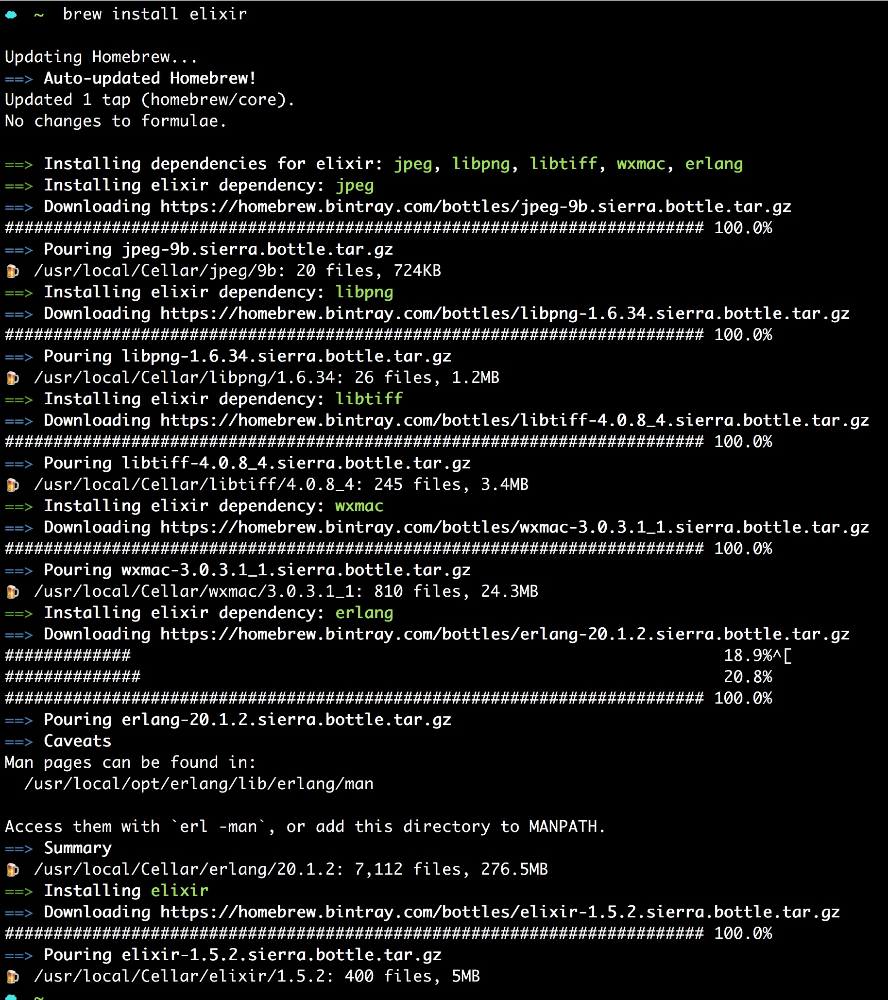
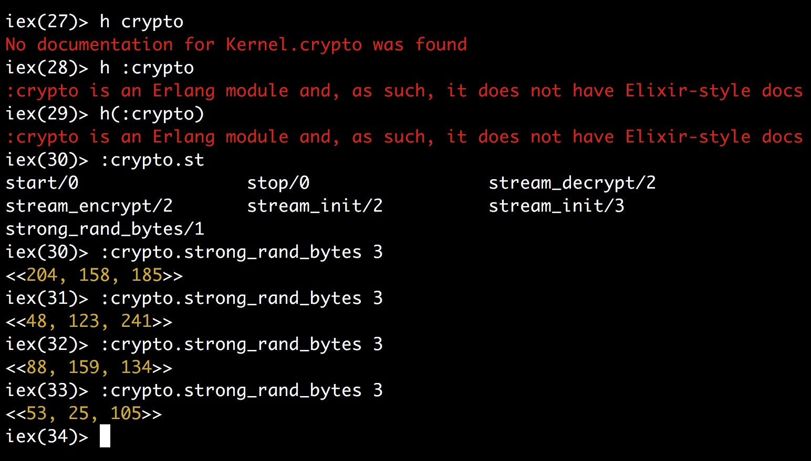
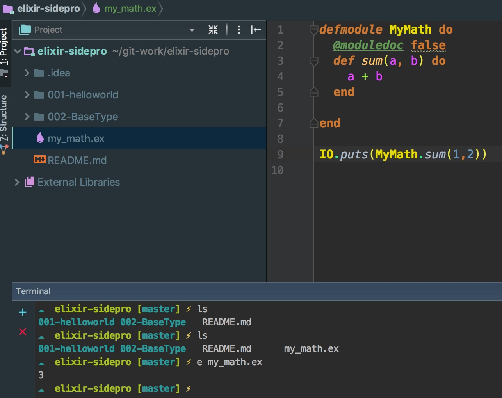

# elixir


elixir 原子可以用来直接引用 Erlang 标准库的模块，包括内置的模块。



[Add new element to list-- improper list](https://stackoverflow.com/questions/35528875/add-new-element-to-list)


case中的模式匹配

```elixir
iex(20)> case {1,2,3} do
...(20)>  {4,5,6} -> "won't match"
...(20)>  {1,x,3} -> "bind x to 2. the x = #{x}"
...(20)> end
"bind x to 2. the x = 2"
```
模式匹配将绑定被匹配的变量

```elixir
iex(30)> case 10 do
...(30)>  y -> "matched the y = #{y}"
...(30)> end
"matched the y = 10"
```
当为单变量匹配的时候，最容易出错，因为任何时候都相当于 x=#{matchItem} 是等号赋值的操作，所以一定要使用`^x`进行之前值的匹配


```elixir
iex(32)> x = 1
1
iex(33)> case 10 do
...(33)>  x -> "shouldn't matched ! but matched and the x = #{x}!!! "
...(33)>  _ -> "will match"
...(33)> end
"shouldn't matched ! but matched and the x = 10"
iex(34)> x
1
```


```elixir
iex(35)> x = 1
1
iex(36)> case 10 do
...(36)>  ^x -> "won't match"
...(36)>  _ -> "will match"
...(36)> end
"will match"
```


```elixir
iex(43)> x
1
iex(44)> case [1,2,3] do
...(44)>  [1,x,3] -> "x match"
...(44)>  _ -> "match"
...(44)> end
"x match"
iex(45)> x
1
iex(46)> case [1,2,3] do
...(46)>  [1,^x,3] -> "x match"
...(46)> _ -> "will match"
...(46)> end
"will match"
iex(47)>
```

匿名函数与模式匹配

```elixir
iex(49)> f = fn
...(49)>  x,y when x>0 -> x+y
...(49)>  x,y -> x*y
...(49)> end
#Function<12.99386804/2 in :erl_eval.expr/5>
iex(50)> f.(1,3)
4
iex(51)> f.(-1,3)
-3
```

在匿名函数中的case模式匹配需要参数个数一致。
```elixir
iex(53)> case {1,2,3} do
...(53)>  {4,5,6} -> "won't match"
...(53)>  {1,x} -> "match?"
...(53)>  _ -> "default"
...(53)> end
"default"
iex(54)> f = fn
...(54)>  x,y when x>0 -> x*y
...(54)>  x,y,z -> x*y*z
...(54)> end
** (CompileError) iex:54: cannot mix clauses with different arities in anonymous functions
```

elixir的关键字列表
```elixir
iex(59)> if true do
...(59)>  "true"
...(59)> else
...(59)>  "false"
...(59)> end
"true"
iex(60)> if true, do
** (SyntaxError) iex:60: unexpected token "do". In case you wanted to write a "do" expression, you must either separate the keyword argument with comma or use do-blocks. For example, the following construct:

    if some_condition? do
      :this
    else
      :that
    end

is syntactic sugar for the Elixir construct:

    if(some_condition?, do: :this, else: :that)

where "some_condition?" is the first argument and the second argument is a keyword list.

Syntax error before: do

iex(60)> if true, do: "true"
"true"
```

代码61和62等同
```elixir
iex(60)> if true, do: "true"
"true"
iex(61)> if true, do: 1+2
3
iex(62)> if true do
...(62)>  1+2
...(62)> end
3
```


```elixir
iex(1)> if true do
...(1)>  a = 10
...(1)>  a = 10 + 90
...(1)> end
100

iex(3)> if true, do: (
...(3)>  a = 10
...(3)>  a = 10 + 90
...(3)> )
100
```


```elixir
iex(5)> if true do
...(5)>  :this
...(5)> else
...(5)>  :that
...(5)> end
:this

iex(6)> if true, do: :this, else: :that
:this
# 实际上是键值列表
iex(22)> if(true,[do: :this, else: :that])
:this
```


```elixir
iex(7)> is_number if true, do: 1+2
true

iex(8)> is_number (if true do
...(8)>  1+2
...(8)> end)
true
```

byte elixir字符串与utf8编码 

```elixir
iex(46)> i "hello"
Term
  "hello"
Data type
  BitString
Byte size
  5
Description
  This is a string: a UTF-8 encoded binary. It's printed surrounded by
  "double quotes" because all UTF-8 encoded codepoints in it are printable.
Raw representation
  <<104, 101, 108, 108, 111>>
Reference modules
  String, :binary
Implemented protocols
  IEx.Info, Collectable, Inspect, List.Chars, String.Chars
iex(47)> i 'hello'
Term
  'hello'
Data type
  List
Description
  This is a list of integers that is printed as a sequence of characters
  delimited by single quotes because all the integers in it represent valid
  ASCII characters. Conventionally, such lists of integers are referred to as
  "charlists" (more precisely, a charlist is a list of Unicode codepoints,
  and ASCII is a subset of Unicode).
Raw representation
  [104, 101, 108, 108, 111]
Reference modules
  List
Implemented protocols
  IEx.Info, Collectable, Enumerable, Inspect, List.Chars, String.Chars
iex(48)>

```

```elixir
iex(38)> str = "hello中国"
"hello中国"
iex(39)> i str
Term
  "hello中国"
Data type
  BitString
Byte size
  11
Description
  This is a string: a UTF-8 encoded binary. It's printed surrounded by
  "double quotes" because all UTF-8 encoded codepoints in it are printable.
Raw representation
  <<104, 101, 108, 108, 111, 228, 184, 173, 229, 155, 189>>
Reference modules
  String, :binary
Implemented protocols
  IEx.Info, Collectable, Inspect, List.Chars, String.Chars
iex(40)> ?h
104
iex(41)> ?e
101
iex(42)> byte_size str
11
iex(43)> length str
** (ArgumentError) argument error
    :erlang.length("hello中国")

iex(43)> String.length str
7
iex(44)>
```

查看字符串的二进制表达 小技巧
```elixir
iex(64)> str
"hello中国"
iex(65)> str <> <<0>>
<<104, 101, 108, 108, 111, 228, 184, 173, 229, 155, 189, 0>>

iex(69)> 'hello中国'
[104, 101, 108, 108, 111, 20013, 22269]
```


```elixir
iex(66)> str
"hello中国"
iex(67)> "hello" <> rest = str
"hello中国"
iex(68)> rest
"中国"
```


```elixir
iex(75)> str
"hello中国"
iex(76)> to_
to_char_list/1    to_charlist/1     to_string/1
iex(76)> to_string str
"hello中国"
iex(77)> to_char
to_char_list/1    to_charlist/1
iex(77)> to_char_list str
warning: Kernel.to_char_list/1 is deprecated, use Kernel.to_charlist/1
  iex:77

[104, 101, 108, 108, 111, 20013, 22269]
iex(78)> to_char
to_char_list/1    to_charlist/1
iex(78)> Kernel.to_
to_charlist/1    to_string/1
iex(78)> Kernel.to_charlist str
[104, 101, 108, 108, 111, 20013, 22269]
```


```elixir
iex(99)> [{:a,1},{:b,2}] = [a: 1, b: 2]
[a: 1, b: 2]
iex(100)> [{:a,1},{:b,2}] == [a: 1, b: 2]
true
iex(101)> [{:a,1},{:b,2}] === [a: 1, b: 2]
true

iex(5)> list
[a: 1, b: 2]
iex(6)> list[b]
** (CompileError) iex:6: undefined function b/0
    (stdlib) lists.erl:1354: :lists.mapfoldl/3
    (stdlib) lists.erl:1355: :lists.mapfoldl/3

iex(6)> list[:b]
2
```


```elixir
iex(58)> defmodule MyMath do
...(58)>  def sum a,b do # def sum(a,b) do
...(58)>    a+b
...(58)>  end
...(58)> end
{:module, MyMath,
 <<70, 79, 82, 49, 0, 0, 3, 156, 66, 69, 65, 77, 65, 116, 85, 56, 0, 0, 0, 85,
   0, 0, 0, 9, 13, 69, 108, 105, 120, 105, 114, 46, 77, 121, 77, 97, 116, 104,
   8, 95, 95, 105, 110, 102, 111, 95, 95, ...>>, {:sum, 2}}
iex(59)> MyMath.sum
sum/2
iex(59)> MyMath.sum(3,4)
7
```

模块



```elixir
iex(68)> [1 | [2 | [3 | [4 | [5]]]]]
[1, 2, 3, 4, 5]
```

递归调用
[Elixir 简明笔记（十七） --- 控制结构之递归与迭代](http://blog.jiamin.info/2016/11/02/Elixir%20%E7%AE%80%E6%98%8E%E7%AC%94%E8%AE%B0%EF%BC%88%E5%8D%81%E4%B8%83%EF%BC%89%20---%20%E6%8E%A7%E5%88%B6%E7%BB%93%E6%9E%84%E4%B9%8B%E9%80%92%E5%BD%92%E4%B8%8E%E8%BF%AD%E4%BB%A3/)
[递归与尾递归](http://www.jianshu.com/p/1f69cb4525ec)
[JavaScript 程序员眼中的 Elixir：递归](http://www.very-geek.com/article/elixir-for-javascript-programmer-part-04/)

[elixir递归](https://my.oschina.net/ljzn/blog/726764)

