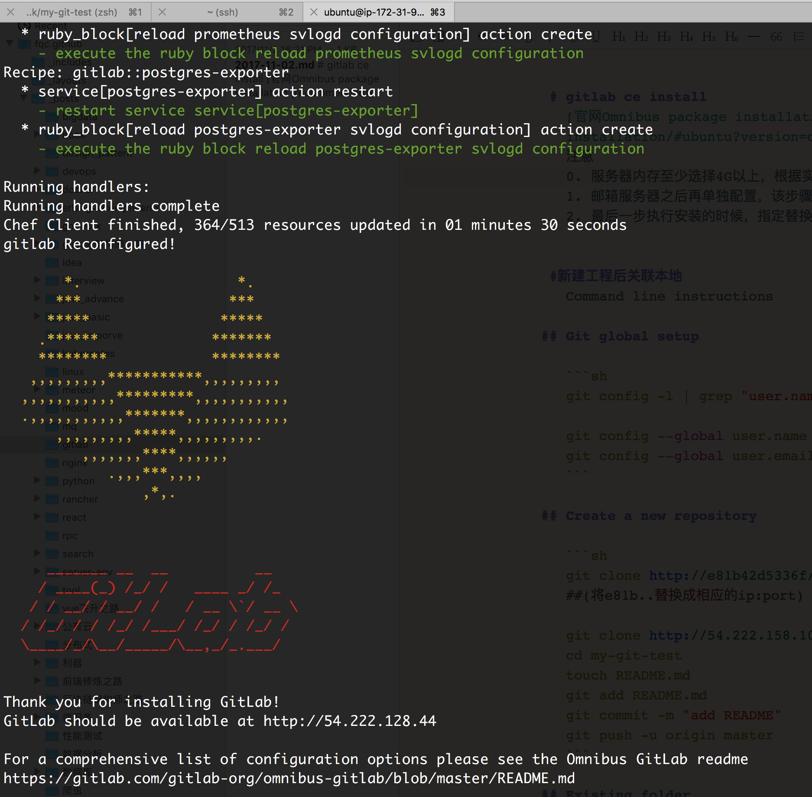
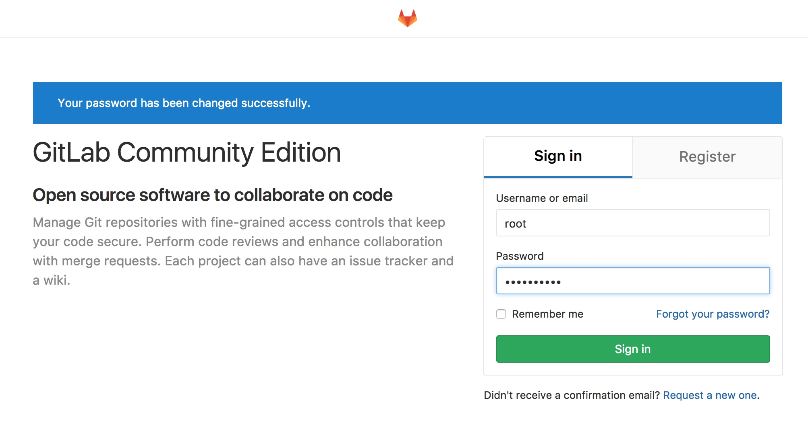

# gitlab ce install
[官网Omnibus package installation (recommended)](https://about.gitlab.com/installation/#ubuntu?version=ce)
注意
0. 服务器内存至少选择4G以上，根据实际使用，最好是8G以上。
1. 邮箱服务器之后再单独配置，该步骤安装时跳过即可。
2. 最后一步执行安装的时候，指定替换"git@gitlab.com"的服务器地址。或者之后配置也行。
也就是真正执行了3条命令。(docker方式更简单，但是有些网络的坑，docker方式更适合快速检验新版本的功能)

```sh
sudo apt-get install -y curl openssh-server ca-certificates
curl -sS https://packages.gitlab.com/install/repositories/gitlab/gitlab-ce/script.deb.sh | sudo bash
sudo EXTERNAL_URL="http://54.222.128.44" apt-get install gitlab-ce
```
## 安装


## 访问


默认第一次访问时需要修改root账户密码。




#新建工程后关联本地
Command line instructions

## Git global setup

```sh
git config -l | grep "user.name\|user.email" ## 查看下当前的配置

git config --global user.name "fqc"
git config --global user.email "feng-qichao@qq.com"
```

## Create a new repository

```sh
git clone http://e81b42d5336f/root/my-git-test.git ==>
##(将e81b..替换成相应的ip:port) 

git clone http://54.222.158.102:3000/root/my-git-test.git
cd my-git-test
touch README.md
git add README.md
git commit -m "add README"
git push -u origin master
```

## Existing folder

```sh
cd existing_folder
git init
git remote add origin http://e81b42d5336f/root/my-git-test.git
git add .
git commit -m "Initial commit"
git push -u origin master
```

## Existing Git repository

```sh
cd existing_repo
git remote add origin http://e81b42d5336f/root/my-git-test.git
git push -u origin --all
git push -u origin --tags
```

