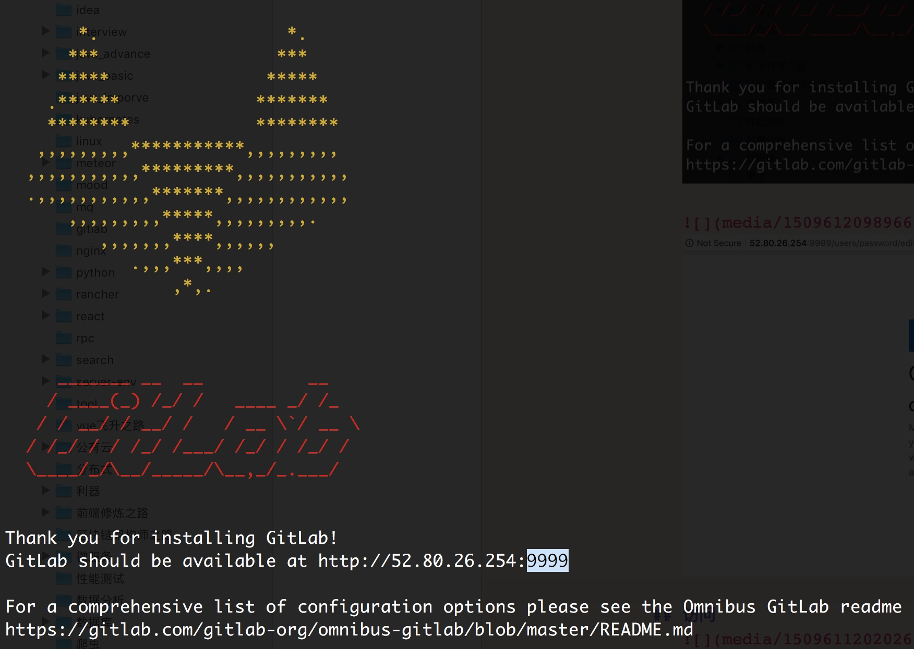

# gitlab ce install
[官网Omnibus package installation (recommended)](https://about.gitlab.com/installation/#ubuntu?version=ce)
注意
0. 服务器内存至少选择4G以上，根据实际使用，最好是8G以上。
1. 邮箱服务器之后再单独配置，该步骤安装时跳过即可。
2. 最后一步执行安装的时候，指定替换"git@gitlab.com"的服务器地址。或者之后配置也行。ip+port[port可以省略，默认80端口]
也就是真正执行了3条命令。(docker方式更简单，但是有些网络的坑，docker方式更适合快速检验新版本的功能)


```sh
sudo apt-get install -y curl openssh-server ca-certificates
curl -sS https://packages.gitlab.com/install/repositories/gitlab/gitlab-ce/script.deb.sh | sudo bash
sudo EXTERNAL_URL="http://54.222.128.44" apt-get install gitlab-ce
```

## 机型
aws t2.large 2vcpu 8G 50G存储  这些参数都可以动态扩容

## 安装


也可以配置成Ip+端口的形式



## 访问


默认第一次访问时需要修改root账户密码。


#新建工程后关联本地
Command line instructions

## http or ssh?

首选ssh方式
配置方式，很简单，可以参照官网。


```ssh
☁  git-work  git config -l | grep "user.name\|user.email"
user.name=fqc
user.email=feng-qichao@qq.com
☁  git-work  pbcopy < ~/.ssh/id_rsa.pub
☁  git-work  ssh -T git@52.80.26.254
Welcome to GitLab, Administrator!


注意:即使有端口方式，也不需要再单独加。(而docker方式则通不过，需要单独设置)
```
http方式，注意 clone后面的地址方式为http:....


ssh方式，注意git clone 方式为git@...


## Git global setup

```sh
git config -l | grep "user.name\|user.email" ## 查看下当前的配置

git config --global user.name "fqc"
git config --global user.email "feng-qichao@qq.com"
```

## Create a new repository

```sh
git clone http://e81b42d5336f/root/my-git-test.git ==>
##(将e81b..替换成相应的ip:port)  还要注意 ssh 或 http方式

git clone http://54.222.158.102:3000/root/my-git-test.git
cd my-git-test
touch README.md
git add README.md
git commit -m "add README"
git push -u origin master
```

## Existing folder

```sh
cd existing_folder
git init
git remote add origin http://e81b42d5336f/root/my-git-test.git
git add .
git commit -m "Initial commit"
git push -u origin master
```

## Existing Git repository

```sh
cd existing_repo
git remote add origin http://e81b42d5336f/root/my-git-test.git
git push -u origin --all
git push -u origin --tags
```

## gitlab 设置时区
方式一、 修改配置文件
find / -name gitlab.yml

```sh
~$ sudo find / -name gitlab.yml
/opt/gitlab/embedded/service/gitlab-rails/config/gitlab.yml
/var/opt/gitlab/gitlab-rails/etc/gitlab.yml
~$ sudo vim /opt/gitlab/embedded/service/gitlab-rails/config/gitlab.yml
```


方式二、 [官网方式](https://docs.gitlab.com/ce/workflow/timezone.html)


## 设置时间12/24小时格式
发现默认的设置是12小时
[How to change the time format display to 24h](https://gitlab.com/gitlab-org/gitlab-ce/issues/15670)


经过 gitlab-ctl reconfigure之后变成了..所以修改被置回去了。


## ci cd


[getting started with ci](http://52.80.26.254:9999/help/ci/quick_start/README)


```sh
GitLab offers a continuous integration service. If you
add a .gitlab-ci.yml file to the root directory of your repository,
and configure your GitLab project to use a Runner, then each commit or
push, triggers your CI pipeline.
On any push to your repository, GitLab will look for the .gitlab-ci.yml
file and start jobs on Runners according to the contents of the file,
for that commit.
Because .gitlab-ci.yml is in the repository and is version controlled, old
versions still build successfully, forks can easily make use of CI, branches can
have different pipelines and jobs, and you have a single source of truth for CI.
You can read more about the reasons why we are using .gitlab-ci.yml in our
blog about it.

in .gitlab.yml always use spaces, not tabs.

1. Add .gitlab-ci.yml to the root directory of your repository
2. Configure a Runner
```
只需要提供.gitlab-ci.yml就可以跑，但不会执行完成，因为还需要配置真正的执行引擎，gitlab runner


### 配置gitlab runner


[官网gitlab-ci-cd安装](https://about.gitlab.com/features/gitlab-ci-cd/)
[gitlab-runner安装](https://docs.gitlab.com/runner/install/linux-repository.html)
[gitlab-runner register](https://docs.gitlab.com/runner/register/index.html)


需要先准备好docker环境。
另外gitlab-runner最好是在与gitlab分离的环境上。


安装配置好docker，一切就绪，也可以正常执行了，但是在build项目时候太慢了，需要修改下maven
中央仓库


无计可施，build stage 最后跑了14分钟多，不过有意思的是看到后面的构建了缓存。


开始跑test stage，

居然也跑了12分钟，不过庆幸的是也看到了create chache


这次工程提交到构建完成一共用了26分钟......还好有cache


哈哈，终于只跑了18秒!!!yes!!!!!!


### 文章
[gitlab+runner](https://jicki.me/2016/10/16/GitLab-Runner-CN/) 该作者也写了spring cloud ,k8s的内容挺不错
[搭建自己的 Gitlab CI Runner](https://lutaonan.com/blog/gitlab-ci-runner/)
[使用Gitlab-Runner Docker 构建 node 项目](http://yangblink.com/2016/11/21/%E4%BD%BF%E7%94%A8Gitlab-Runner-Docker-%E6%9E%84%E5%BB%BA-node-%E9%A1%B9%E7%9B%AE/) 
## 注意gitlab-reconfige命令会覆盖或清空掉修改过的配置
# 官方文档
[官网文档汇总](https://docs.gitlab.com/ee/README.html)


