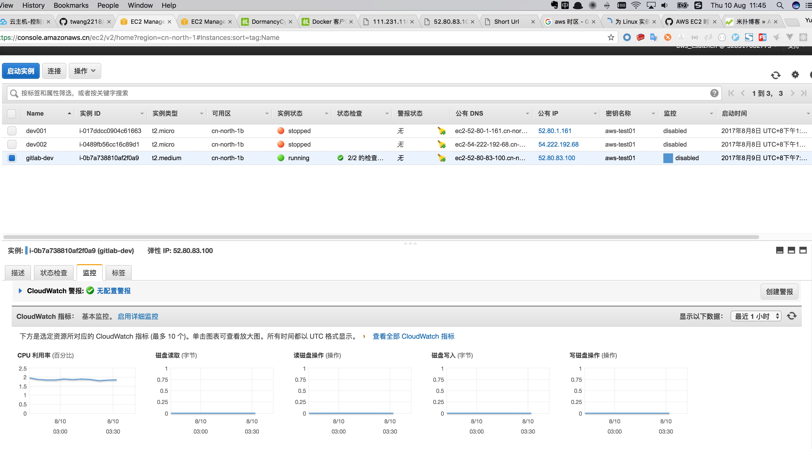

[aws k8s 微服务](https://t.goodrain.com/t/k8s/269)
[aws 微服务](https://aws.amazon.com/cn/about-aws/events/webinar/deep-dive-to-ecs-03282017/)

[AWS EC2 时区设置](https://gist.github.com/github101/3426337)


```
设置时区
ec2实例和国外vps默认的时区都是当地的，不适合国内使用，通过手动修改自己的时区

ln -sf /usr/share/zoneinfo/Asia/Shanghai /etc/localtime

date一下看看已经更改过来了
```

