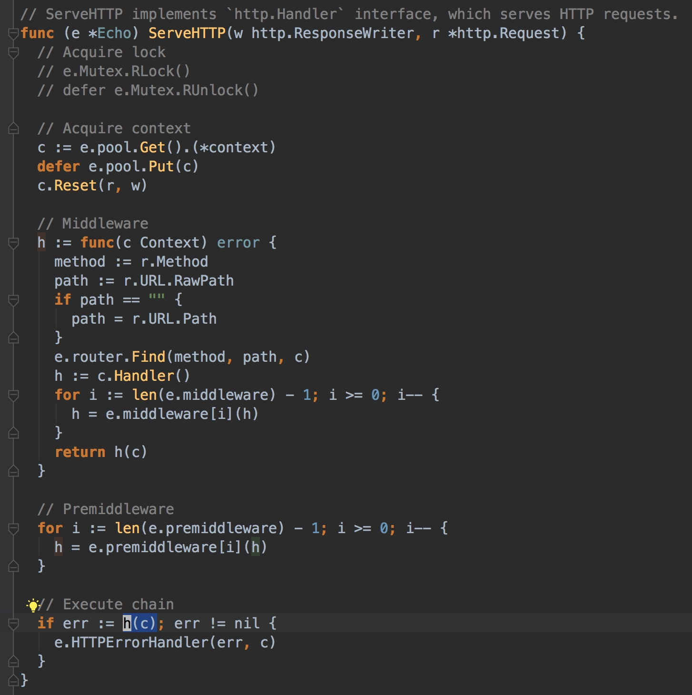
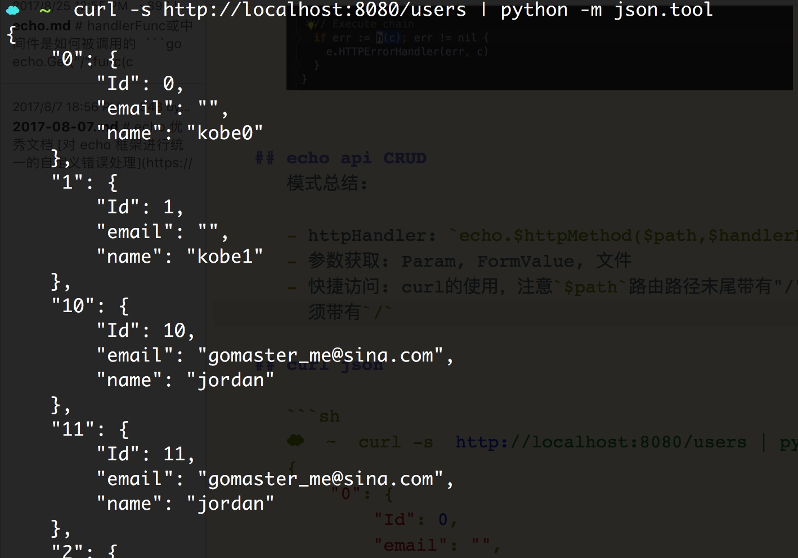

# handlerFunc或中间件是如何被调用的

```go
echo.Get("/",func(c echo.Context) error {
    return c.String(http.StatusOK,"hello")
})
echo.start(":8080")
```
Get方法的参数一个是路由路径，另外一个是封装的handlerFunc，最终在ServeHTTP方法调用。



## echo api CRUD
模式总结:

- httpHandler: `echo.$httpMethod($path,$handlerFunc)`
- 参数获取: PathParam, QueryParam,FormValue,FormFile(配合os创建打开并copy流还要defer关闭流) 文件
- 快捷访问: curl的使用，注意`$path`路由路径末尾带有"/"将是全匹配，也就是访问时必须带有`/`
- 返回值 c.String(httpStatus) c.Json(..) c.Html(status,ok)
## curl json

```sh
☁  ~  curl -s  http://localhost:8080/users | python -m json.tool
{
    "0": {
        "Id": 0,
        "email": "",
        "name": "kobe0"
    },
    "1": {
        "Id": 1,
        "email": "",
        "name": "kobe1"
    },
    "2": {
        "Id": 2,
        "email": "",
        "name": "kobe2"
    }
}
```
当然，也看到了个有趣的,到第10个之后居然看不到了，最大就是第九，向前一翻，原来其按照字典顺序来排列的。  




```go
package usercontroller

import (
	"github.com/labstack/echo"
	"myecho/model"
	"strconv"
	"net/http"
	"fmt"
	"os"
	"io"
)

var usermap = make(map[int]model.User, 5)

func init() {
	for i := 0; i < 3; i++ {
		usermap[i] = model.User{Id: i, Name: "kobe" + strconv.Itoa(i)}
	}
	fmt.Println(usermap)
}
func GetUser(c echo.Context) error {
	id := c.Param("id")
	nid, err := checkIdErr(id)
	if !err {
		return c.String(http.StatusBadRequest, "id类型有误！请传入整形")
	}

	user, ok := usermap[nid]
	if !ok {
		return c.String(http.StatusOK, "没有找到该用户")
	}

	//return c.String(http.StatusOK, user.String())
	return c.JSON(http.StatusOK, user)
}
func checkIdErr(id string) (int, bool) {
	fmt.Println("id==", id)
	//id, error = strconv.Atoi(id)//注意前面的id其实已经确定了类型，现在做了类型转换，需要申明新变量
	nid, error := strconv.Atoi(id)
	if error != nil {
		//log.Fatal("nid 类型有误!")
		//c.Logger().Fatal("id 类型有误")
		//Fatal都会将服务器关停..绝不要这样使用
		return nid, false
	}
	return nid, true
}

func SaveUser(c echo.Context) error {
	/*id := c.Param("id")
	nid, err := checkIdErr(id)

	if !err {
		return c.String(http.StatusBadRequest, "id类型有误！请传入整形")
	}
	_, ok := usermap[nid]
	if ok {
		return c.String(http.StatusBadRequest, "该用户id已经存在")
	}
	*/

	//业务id肯定是系统给予

	// form value
	//$~ curl -F "name=jordan" -F "email=gomaster_me@sina.com" http://localhost:8080/user/save
	//name:jordan,email:gomaster_me@sina.com
	name := c.FormValue("name")
	email := c.FormValue("email")
	avatar, err := c.FormFile("avatar")
	if err != nil {
		return c.String(http.StatusBadRequest, "文件上传有误")
	}

	src, err := avatar.Open()
	if err != nil {
		return c.String(http.StatusBadRequest, "文件上传有误")
	}
	defer src.Close()

	dest, err := os.Create(avatar.Filename)
	if err != nil {
		return c.String(http.StatusBadRequest, "文件创建错误")
	}
	defer dest.Close()

	_, err = io.Copy(dest, src)
	if err != nil {
		return c.String(http.StatusBadRequest, "文件拷贝错误")
	}

	nid := len(usermap)
	usermap[nid] = model.User{Id: nid, Name: name, Email: email }
	return c.JSON(http.StatusOK, usermap[nid])

	//☁  ~  curl -F "name=jordan" -F "email=gomaster_me@sina.com" http://localhost:8080/user/save
	//{"Id":3,"name":"jordan","email":"gomaster_me@sina.com"}%                                                                      ☁  ~  curl http://localhost:8080/users/3
	//{"Id":3,"name":"jordan","email":"gomaster_me@sina.com"}%                                                                      ☁  ~  curl http://localhost:8080/users/4
	//没有找到该用户%

	//文件上传
	//curl -F "name=Joe Smith" -F "avatar=@/path/to/your/avatar.png" http://localhost:8080/user/save
}

func GetAll(c echo.Context) error {
	return c.JSON(http.StatusOK, usermap)
}

func UpdateUser(c echo.Context) error {
	id := c.Param("id")
	nid, err := checkIdErr(id)

	if !err {
		return c.String(http.StatusBadRequest, "id类型有误！请传入整形")
	}

	user, ok := usermap[nid]
	if ok {
		user.Name = c.FormValue("name")
		user.Email = c.FormValue("email")
		usermap[nid] = user //原值修改
		return c.String(http.StatusOK, "修改成功=>"+user.String())
	}

	return c.JSON(http.StatusBadRequest, "用户不存在，请查证后再操作")

	/*
	☁  _posts [master] curl -F "name=jordan" -F "email=gomaster_me@sina.com" http://localhost:8080/users/1              [master|]
{"message":"Method Not Allowed"}%                                                                                             ☁  _posts [master] curl -X PUT -F "name=jordan" -F "email=gomaster_me@sina.com" http://localhost:8080/users/1       [master|]
修改成功=>id:1,name:jordan%                                                                                                   ☁  _posts [master] curl -s http://localhost:8080/users | python -m json.tool                                        [master|]
{
    "0": {
        "Id": 0,
        "email": "",
        "name": "kobe0"
    },
    "1": {
        "Id": 1,
        "email": "gomaster_me@sina.com",
        "name": "jordan"
    },
    "2": {
        "Id": 2,
        "email": "",
        "name": "kobe2"
    }
}
☁  _posts [master]

	*/
}

func DeleteUser(c echo.Context) error {
	id := c.Param("id")
	nid, err := checkIdErr(id)

	if !err {
		return c.String(http.StatusBadRequest, "id类型有误！请传入整形")
	}

	user, ok := usermap[nid]
	if ok {
		delete(usermap, nid)
		return c.String(http.StatusOK, "删除成功=>"+user.String())
	}

	return c.JSON(http.StatusBadRequest, "用户不存在，请查证后再操作")

	/*☁  ~  curl -X DELETE  http://localhost:8080/users/1
	删除成功=>id:1,name:kobe1%                                                                                                    ☁  ~  curl -s http://localhost:8080/users | python -m json.tool
	{
		"0": {
	"Id": 0,
	"email": "",
	"name": "kobe0"
	},
		"2": {
	"Id": 2,
	"email": "",
	"name": "kobe2"
	}
	}*/
}

```

