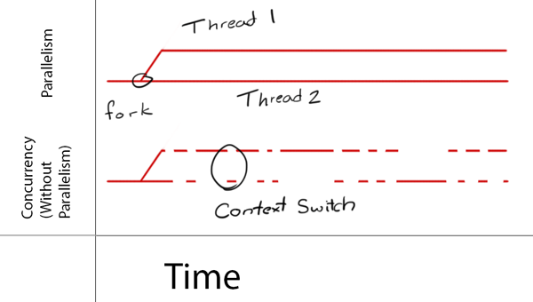

# concurrency vs parallelism
Concurrency vs Parallelism

In a few words,

Concurrency is like `talking and drinking`, you can switch back and forth but you cannot really do both at the same time. Parallelism is like `walking and drinking`, you can actually do both at the same time.

Concurrency_vs_Parallelism

When you have only one cpu, you can only do concurrency. The overall time spent is the same as running in series. When you have multiple cpus, you can actually run things in parallel at the same time. The overall time spent can be a lot shorter.

