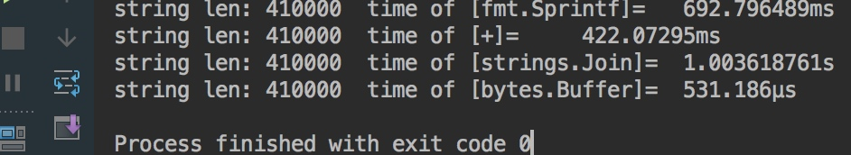
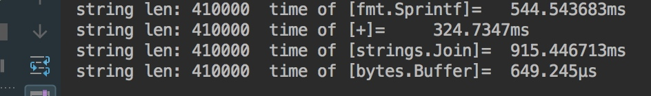
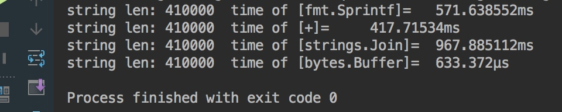

1、写出下面代码输出内容。

```go
package main

import (
	"fmt"
)

func main() {
	defer_call()
}

func defer_call() {
	defer func() { fmt.Println("打印前") }()
	defer func() { fmt.Println("打印中") }()
	defer func() { fmt.Println("打印后") }()

	panic("触发异常")
}
```
案例分析:考察golang的异常处理机制和defer机制。panic触发异常，而defer压栈延迟执行，最终panic会将异常向上抛出。
执行结果:

```go
打印后
打印中
打印前
panic: 触发异常

......堆栈异常信息
```

延伸阅读:

- [关于golang的panic recover异常错误处理](http://xiaorui.cc/2016/03/09/%E5%85%B3%E4%BA%8Egolang%E7%9A%84panic-recover%E5%BC%82%E5%B8%B8%E9%94%99%E8%AF%AF%E5%A4%84%E7%90%86/)
- [Go语言中使用Defer几个场景](http://developer.51cto.com/art/201306/400489.htm)


2、请指出下面代码的问题并说明原因

```go
type student struct {
	Name string
	Age  int
}

func pase_student() {
	m := make(map[string]*student)
	stus := []student{
		{Name: "zhou", Age: 24},
		{Name: "li", Age: 23},
		{Name: "wang", Age: 22},
	}
	for _, stu := range stus {
		m[stu.Name] = &stu
	}
}
```
案例解析: go的迭代变量会复用地址，也就说`stu`取地址`&stu`始终是一样的地址，所以循环体中的代码问题在于每个m存储的student实例地址是一样的。 解决方案可以将map中的指针声明修改为结构体类型。

3、下面的代码会输出什么，并说明原因

```go
func main() {
	runtime.GOMAXPROCS(1)
	wg := sync.WaitGroup{}
	wg.Add(20)
	for i := 0; i < 10; i++ {
		go func() {
			fmt.Println("i: ", i)
			wg.Done()
		}()
	}
	for i := 0; i < 10; i++ {
		go func(i int) {
			fmt.Println("i: ", i)
			wg.Done()
		}(i)
	}
	wg.Wait()
}
```

## 边界检查

```go
package main

import "fmt"

func max(numbers ...int) int {
	var largest int
	for _, v := range numbers {
		if v > largest {
			largest = v
		}
	}
	return largest
}

func main() {
	//greatest := max(4, 7, 9, 123, 543, 23, 435, 53, 125)
	//greatest := max(-1, -2) //如果都是负数将是错误的
	greatest := max2(-1, -2)
	fmt.Println(greatest)
}
func max2(numbers ...int) int {
	var largest int
	for i, v := range numbers {
		if v > largest || i == 0 {
			largest = v
		}
	}
	return largest
}

/*
FYI
For your code to also work with only negative numbers such as

greatest := max(-200 -700)

include this as your range statement
for i, v := range numbers {
	if v > largest || i == 0 {
		largest = v
	}
}

What does that code do?

The first time through the range loop
the index, i, will be zero
so largest will be set to the first number

Originally largest is set to the zero value for an int, which is zero

Zero would be greater than any negative number

if you only have negative numbers
you need largest to be something less than zero

Thanks to Ricardo G for this code improvement!
*/

```

## slice容量
问题:我们知道切片的容量将随着随着长度的增大而自动扩容，那么下面的代码能否正常运行?如果不行，该如何解决?
```go
package main

import "fmt"

func main() {

	greeting := make([]string, 3, 5)
	// 3 is length - number of elements referred to by the slice
	// 5 is capacity - number of elements in the underlying array

	greeting[0] = "Good morning!"
	greeting[1] = "Bonjour!"
	greeting[2] = "buenos dias!"
	greeting[3] = "suprabadham"

	fmt.Println(greeting[2])
}

```
## 可变参数的使用

`append（slice []Type,elem ...Type）`

- `...`符号可以解引用slice为可变参数
- 添加类型必须是一致的
- slice是开闭区间

```go
package main

import "fmt"

func main() {

	mySlice := []int{1, 2, 3, 4, 5}
	myOtherSlice := []int{6, 7, 8, 9}
	otherSlice := []int{11,12,13}
	//otherStringSlice:=[]string{"hello","world"}
	mySlice = append(mySlice, myOtherSlice...)
	mySlice = append(mySlice,otherSlice...)
	//mySlice = append(mySlice,otherStringSlice...)

	fmt.Println(mySlice)
}

```
## 去掉周三

```go
package main

import "fmt"

func main() {

	mySlice := []string{"Monday", "Tuesday"}
	myOtherSlice := []string{"Wednesday", "Thursday", "Friday"}

	mySlice = append(mySlice, myOtherSlice...)
	fmt.Println(mySlice)

	mySlice = append(mySlice[:2], mySlice[3:]...)
	fmt.Println(mySlice)

}
```

## golang中的字符串连接有哪几种?哪种最高效

[字符串连接哪一种方式最高效](https://gocn.io/question/265)








strings.Join 最慢
fmt.Sprintf 和 string + 差不多
bytes.Buffer又比上者快约500倍


## 请使用两种方式将下列代码改进

```go
ch := make(chan int)
ch <- 100
fmt.Println(<-ch)
```

```sh
//fatal error: all goroutines are asleep - deadlock!
```


分析：
原因是：
ch <- 100，是`unbuffered channel`，它会block，直到有人把它发送的消息取走。因此，第6行的语句永远无法执行，造成死锁

go判断死锁的代码位于：
src/pkg/runtime/proc.c

改进方式1:

```go
ch := make(chan int,1)
ch <- 100
fmt.Println(<-ch)
```

改进方式2：

```go
ch := make(chan int)
go func(){
    ch <- 100
}()
fmt.Println(<-ch)
```

# 流水线问题

[用goroutine打印4个文件内容](https://gocn.io/question/768)

```go
func main(){
    var wg sync.WaitGroup
    exit := make(chan bool)
    ch := make(chan int,4)
    
    for i:=0; i <cap(ch); i++ {
        wg.Add(1)
        go func(id int) {
            defer wg.Done()
            fmt.Println(id,"->",i+1)
        }(i)
        close(exit)
    }
    
    wg.Wati()
    <-exit
}
```


[如何理解默认阻塞的channel](https://golangtc.com/t/545b3529421aa960c7000082)
[go deadlock](http://blog.sina.com.cn/s/blog_630c58cb01016j1u.html)


[golang 实现一种环形队列，及周期任务](http://blog.csdn.net/u013597671/article/details/76339825)

[扛住100亿次请求？我们来试一试](http://blog.csdn.net/mergerly/article/details/76243804)

[进一步认识golang并发](http://blog.csdn.net/gophers/article/details/24665419)
[golang每日一练](http://www.sunaloe.cn/)

[multiply thread    ](https://github.com/houjingbiao/Code-Template/blob/master/01.multithread.md)

[golang流水线问题](https://www.google.com/search?q=golang+%E6%B5%81%E6%B0%B4%E7%BA%BF%E9%97%AE%E9%A2%98&safe=active&ei=QruwWc6pHMH2jwPK3aOICQ&start=0&sa=N&biw=1920&bih=1006)

http://www.sunaloe.cn/about

http://fuxiaohei.me/2017/4/22/gopherchina-2017.html   
>interface{} 另一个特殊场景就是空接口，对应的代码就是需要类型推断：
```go
func do(v interface{}){
    switch t := v.(type){
        case int:
            fmt.Printf("int - %d",t)
        case error:
            fmt.Printf("error - %s",t.Error())
        default:
            fmt.Printf("interface - %v",t)
    }
}
```
不到万不得已不要这么写代码。否则需要推断类型的 case 越来越多，代码可维护性瞬间下降。


# 闭包引用问题

下列代码输出什么?

```go
package main

import (
	"fmt"
	"os"
)

func main() {
	for i := 0; i < 3; i++ {
		go func() {
			fmt.Println(i)
		}()
	}
	os.Stdin.Read(make([]byte,1))
}
```

上述原因在于main执行太快，而goroutine都没来得及执行，i已经变味了3

那么我们可以采取让main执行慢一些，生成的3个goroutine将会有看能正常执行
```go
package main

import (
	"fmt"
	"time"
)

func main() {
	for i := 0; i < 3; i++ {
		go func() {
			fmt.Println(i)
		}()
		time.Sleep(1 * time.Second)
	}
}

```


```go
	for i := 0; i < 3; i++ {
		go func(v int) {
			fmt.Println(v)
		}(i)
		time.Sleep(1 * time.Second)
	}
```

```go
for i := 0; i < 3; i++ {
      v := i
		go func() {
			fmt.Println(v)
		}()
		time.Sleep(1 * time.Second)
	}
```

# redis实现优先级
[redis实现优先级](http://www.cnblogs.com/nullcc/p/5924244.html)

# 迭代channel类型数据的注意

为避免死锁，迭代channel的时候一定要注意注意对channel的关闭。

```go
func main() {
    c := make(chan bool)
    go func() {
        fmt.Println("test") 
        c <- true
        close(c) //需要加上，否则panic
    }()
    
    for v := range c {
        fmt.Println(v)
    }
}
```

