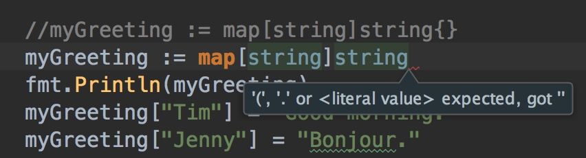

## 数组

- 类型`[n]T`是`n`个`T`类型的数组(只是在普通类型`T`的基础上加了`[n]`)
- 长度是数组类型的一部分
- 可以根据索引指定默认值 {index:value}

```go
primes7 := [...]int{0:1,1:2,2:3}
fmt.Printf("%v", primes7)
```
- go会根据默认索引下标，自动推断其长度

```go
arr := [...]int{99:1}
fmt.Printf("len(arr):%v", len(arr))
```
arr长度为100

### 数组的长度是类型的一部分 
**即长度不同的数组类型不同，不能相互赋值。 ** 
- 如果数组中的元素是确定的，可以[n]int{1,2,3,4,5}写为[...]int{1,2,3,4,5}，[...]int{}也可以编译通过

```go
var x int
var a [10]int
var b [9]int
a=b //类型不同不能赋值，不能编译通过
```

将变量a声明为拥有10个int类型的数组。  

**数组的长度是其类型的一部分**(比如`a [10]string`，变量a的类型为`[10]string`)。所以数组是不能够改变大小的。这看起来限制很大，但不用担心，Go语言提供了很方便的形式操作数组。  

```go
func main() {
	var a [10]string
	a[0] = "hello"
	a[1] = "world"
	fmt.Println(a[0], a[1])
	fmt.Printf("%v,%T\n", a, a)
	fmt.Printf("%q,%T\n", a, a)

	primes := [5]int{1, 2, 3, 4, 5}
	fmt.Printf("%v, %T", primes, primes)

	primes2 := []int{1, 23, 2, 2, 3, 4}
	fmt.Printf("%v, %T", primes2, primes2)

	primes3 := [20]int{}
	var primes4 [20]int
	primes5 := [20]int{9:1} //索引与对应值的初始化方式
	fmt.Printf("%v\n,%v\n,%v\n", primes3, primes4, primes5)

	primes6 := [...]int{1,2,3,4,5}
	fmt.Printf("%v", primes6)
}

// hello world
// [hello world        ],[10]string
// ["hello" "world" "" "" "" "" "" "" "" ""],[10]string
// [1 2 3 4 5], [5]int
// [1 23 2 2 3 4], []int
// [0 0 0 0 0 0 0 0 0 0 0 0 0 0 0 0 0 0 0 0]
// ,[0 0 0 0 0 0 0 0 0 0 0 0 0 0 0 0 0 0 0 0]
// ,[0 0 0 0 0 0 0 0 0 1 0 0 0 0 0 0 0 0 0 0]
// [1 2 3 4 5]
```

### 使用索引和对应值的方式初始化数组
```go
package main

import "fmt"

type currency int

const (
	USD currency = iota
	EUR
	GBP
	RMB
)

func main() {
	symbol := [...]string{USD: "$", EUR: "€", GBP: "£", RMB: "¥"}
	fmt.Printf("%v,%v,%v,%v\n",symbol[USD],symbol[EUR],symbol[GBP],symbol[RMB] )
	for cur, val := range symbol {
		fmt.Println(cur,val)
	}
}

```

### 数组的遍历

```go
package main

import "fmt"

func main() {
	arr := [3]int{1,2,3}
	for i, val := range arr {
		fmt.Printf("arr[%d] = %d\n", i, val)
	}

	for _, val := range arr {
		fmt.Println(val)
	}
}
```

- 指向数组的指针
	- &获取变量指针地址
	- new关键字方式
	- 不论是数组本身还是指向数组的指针，都可以通过下标赋值的方式修改值

```go
arr := [...]int{9:1}
fmt.Printf("len(arr):%v\n", len(arr))
var p *[10]int = &arr
fmt.Printf("%v", p)
// len(arr):10
// &[0 0 0 0 0 0 0 0 0 1]
```

```go
arr := new([5]int)
fmt.Println(arr)
// &[0 0 0 0 0]
```

```go
arr1 := [10]int{}
arr1[4] = 5 
fmt.Println(arr1)

arr2 := new([10]int)
arr2[4] = 5
fmt.Println(arr2)

// [0 0 0 0 5 0 0 0 0 0]
// &[0 0 0 0 5 0 0 0 0 0]
```
- 指针数组

```go
x, y := 1, 2
var arr [2]*int = [2]*int{&x, &y}
fmt.Printf("%v", arr)
// [0xc42000e270 0xc42000e278]
```

- 多维数组

```go
//arr := [2][3]int{
// 	{1,2,3},
// 	{4,5,6}
// }
//上述方式编译不通过
arr := [2][3]int{
	{1,2,3,},
	// {4,5,6}} //方式1
	{4,5,6}, //方式2
}
fmt.Println(arr)

// [[1 2 3] [4 5 6]]
```

### 数组长度根据最长的下标所决定，未指定则为默认值

```go
package main

import "fmt"

func main() {
	// arr数组长度根据最长的下标所决定，未指定则为默认值
	arr := [...]int{0: 1, 1: 2, 2: 3}
	fmt.Println(arr[2])
	//arr = [...]int{4: 1, 5: 2, 6: 9} //compile error 因为数组的长度不同
	arr = [...]int{0: 1, 1: 2, 2: 9}

	arr2 := [...]int{1: 2, 2: 3, 5: 4}
	fmt.Println(arr2)
}

```

### 数组的使用

当调用一个函数的时候,函数的每个调用参数将会被赋值给函数内部的参数变量,所以函数 参数变量接收的是一个复制的副本,并不是原始调用的变量。因为函数参数传递的机制导致 传递大的数组类型将是低效的,并且对数组参数的任何的修改都是发生在复制的数组上,并 不能直接修改调用时原始的数组变量。在这个方面,Go语言对待数组的方式和其它很多编程 语言不同,其它编程语言可能会隐式地将数组作为引用或指针对象传入被调用的函数。

当然,我们可以显式地传入一个数组指针,那样的话函数通过指针对数组的任何修改都可以 直接反馈到调用者。下面的函数用于给[32]byte类型的数组清零:

注意:**变量赋值语句并不代表使用了该变量**
```go
package main

func main() {

}

func zero(ptr *[32]byte) {
	for _, val := range ptr {
		val = 0 // compile err : unused variable val 
		//fmt.Println(value)
	}
}
```

```go
package main

import "fmt"

func main() {
	arr := [32]byte{1,2,3}
	fmt.Println(arr)
	zero(&arr)
	fmt.Println(arr)
}

func zero(ptr *[32]byte) {
	for i := range ptr {
		fmt.Println(ptr[i])
		ptr[i] = 0
	}
}

```

```go
package main

import "fmt"

func main() {
	arr := [32]byte{1, 2, 3}
	fmt.Println(arr)
	zero(&arr)
	fmt.Println(arr)
}

/*func zero(ptr *[32]byte) {
	for i := range ptr {
		fmt.Println(ptr[i])
		ptr[i] = 0
	}
}*/

func zero(ptr *[32]byte) {
	//ptr = [32]byte{}
	*ptr = [32]byte{}
}

```

```go
package main

import "fmt"

func main() {
	s := []rune{}
	for _, val := range "hello" {
		s = append(s, val)
	}
	fmt.Printf("%q\n",s)
}

```

### 冒泡排序

1. 初级版

```go
package main

import "fmt"

func main() {
	arr := [...]int{3, 12, 23, 12, 9, 11, 89}

	for i := 0; i < len(arr); i++ {
		for j := i; j < len(arr); j++ {
			if arr[i] < arr[j] {
				arr[i], arr[j] = arr[j], arr[i]
			}
		}
	}

	fmt.Println(arr)
}
```

2. 优化版

- len(arr)表达式提取出变量，无需每次都计算
- 第一次遍历，j可以从i的下一位开始，无需和自己比较，故`j:=i+1`

```go
package main

import "fmt"

func main() {
	arr := [5]int{56, 98, 1, -1, 99}
	num := len(arr)
	fmt.Println(arr)

	for i := 0; i < num; i++ {
		for j := i + 1; j < num; j++ {
			if arr[i] < arr[j] {
				arr[i], arr[j] = arr[j], arr[i]
			}
		}
	}

	fmt.Println(arr)
}
```

```go
package main

import "fmt"

func main() {
	arr := [5]int{1, 73, 2019, 38, 0}
	fmt.Printf("排序前:-> %v\n", arr)

	slice := bubbleSort(arr[:])

	fmt.Printf("排序后:-> %v\n", slice)
}
func bubbleSort(arr []int) []int {
	len := len(arr)
	for i := 0; i < len; i++ {
		for j := i + 1; j < len; j++ {
			if arr[i] < arr[j] {
				arr[i], arr[j] = arr[j], arr[i]
			}
		}
	}
	return arr
}

// 排序前:-> [1 73 2019 38 0]
// 排序后:-> [2019 73 38 1 0]
```

- 数组的比较
相等比较，无大小比较  
`arr1 == arr2`   
`arr1 > arr2` 编译错误

## 切片slice

- 数组有固定大小。而切片则为数组元素提供动态大小且灵活的视图
- 在实际应用功能中，切片比数组更加通用 
- 类型`[]T`表示元素类型为`T`的切片([10]int的切片类型为[]int，以此类推)
- 注意下标为[x:y]，闭开区间 
- slice的容量最好提前估计好，否则可能多次分配内存地址，导致程序效率低下

下面的表达式表示为数组`a`的前5个元素创建一个切片。
 
```go
a[0:5] //a[0]~a[4]
```

案例

```go
package main

import "fmt"

func main() {
	primes := [6]int{1,2,3,4,5,6}

	var s []int = primes[1:4]
	fmt.Printf("%v\n,%q\n",s,s)
}

// [2 3 4]
// ,['\x02' '\x03' '\x04']
```

案例

```go
func main() {
	a := [10]int{1, 2, 3, 4, 5, 6, 7, 8, 9, 0}
	fmt.Printf("%v, %T\n", a, a)
	b := a[0:5]
	fmt.Printf("%v, %T\n", b, b)
	c :=a[:]
	fmt.Printf("%v, %T", c, c)
}

// [1 2 3 4 5 6 7 8 9 0], [10]int
// [1 2 3 4 5], []int
// [1 2 3 4 5 6 7 8 9 0], []int
```

## 切片就像是数组的引用

- 切片不存储任何的数据，它只描述底层数组的一段
- **修改切片元素会更改底层数组对应的元素**
- **共享底层数组的其他切片都会观测到这些修改**
- 当append超出了slice的容量，将会重新分配地址，将指向新的底层数组

案例一

```go
func main() {
	a := [10]int{1, 2, 3, 4, 5, 6, 7, 8, 9, 0}
	fmt.Printf("%v, %T\n", a, a)
	b := a[0:5]
	b[0] = 11
	fmt.Printf("%v, %T\n", b, b)
	c :=a[:]
	fmt.Printf("%v, %T", c, c)
}
// [1 2 3 4 5 6 7 8 9 0], [10]int
// [11 2 3 4 5], []int
// [11 2 3 4 5 6 7 8 9 0], []int
```

案例二

```go
package main

import "fmt"

func main() {
	names := [4]string{
		"John",
		"Paul",
		"George",
		"Ringo",
	}

	fmt.Println(names)

	//var a []string = names[0:2]
	// := 短变量声明不要任何的多余 只需要一个名称是最地道的Go写法
	a := names[0:2]
	b := names[1:3]
	fmt.Println(a, b)

	b[0] = "XXX"
	fmt.Println(a, b)
	fmt.Println(names)
}
// [John Paul George Ringo]
// [John Paul] [Paul George]
// [John XXX] [XXX George]
// [John XXX George Ringo]
```

```go
s := []int{1,2,3,4,5}
s1 := s[2:5]
s2 := s[1:3]
fmt.Println(s1,s2)
s1[0] = 9
fmt.Println(s1,s2)
// [3 4 5] [2 3]
// [9 4 5] [2 9]
```

```go
s := []int{1,2,3,4,5}
s1 := s[2:5]
s2 := s[1:3]
fmt.Println(s1,s2)
s2 = append(s2,6,7,8,11,12,13,14,15)
s1[0] = 9
fmt.Println(s1,s2)

// [3 4 5] [2 3]
// [9 4 5] [2 3 6 7 8 11 12 13 14 15]
```

## 切片字面量

切片字面量类似没有长度的数组字面量。例如数组字面量:

```go
[3]bool{true,true,false}
```

下面则会创建一个和上面相同的数组，然后构建一个引用了该数组的切片:

```go
[]bool{true,true,false}
```

案例:
```go
package main

import "fmt"

type x struct { // 结构为{a int b bool}的x类型 xxx结构的yyy类型
	a int
	b bool
}

func main() {
	q := []int{1, 3, 5, 23}
	fmt.Println(q)

	r := []bool{true, false, true, true, false}
	fmt.Println(r)

	y := []x{
		{1, false},
		{2, true},
		{3, false},
		{4, true},
	}
	fmt.Println(y)

	m := []struct {
		bool
		int
	}{
		{true, 1},
		{false, 2},
		{true, 3},
		{false, 4}, // 要么使用`,`结尾重启一行`}`。 要么 直接使用 {false,4}}结尾（推荐使用该种方式）
	}
	fmt.Println(m)
	fmt.Println("%T",m)
}

// [1 3 5 23]
// [true false true true false]
// [{1 false} {2 true} {3 false} {4 true}]
// [{true 1} {false 2} {true 3} {false 4}]
// []struct { bool; int }
```

## 切片的默认行为

- 当使用切片时，可以使用默认行为忽略下标边界。  
- 左边界默认为0，右边界默认为切片的长度。    

例如如下数组:   
`var a [10]int`  

其切片表达式与其相等:  

```go
package main

import "fmt"

func main() {
	var a [10]int
	fmt.Printf("%v\n", a[0:10])
	fmt.Printf("%v\n", a[0:])
	fmt.Printf("%v\n", a[:10])
	fmt.Printf("%v\n", a[:])
}
```

案例

```go
package main

import "fmt"

func main() {
	//s := [10]int{2, 3, 5, 7, 11, 13}
	//em. s=s[1:4] Cannot use s[1:4](type []int) as type [10]int in assignment
	// 这里强化下概念，数组的长度是数组类型的一部分

	s := []int{2, 3, 5, 7, 11, 13} //切片字面量
	s = s[1:4]
	fmt.Println(s)

	s = s[:2]
	fmt.Println(s)

	s = s[1:]
	fmt.Println(s)
}
// [3 5 7]
// [3 5]
// [5]
```

## 切片长度和容量

- 一个切片有长度和容量
- 切片的长度是其拥有的元素的个数
- 切片容量是从它的第一个元素开始，直到底层数组的最后一个元素的个数
- 切片`s`的长度和容量可以通过表达式`len(s)`和`cap(s)`获取
- 重新分配容量发生在[n:] n!=0的时候
- 重新定义长度为0的切片 [:n]

你可以通过重新切片来拓展切片的长度，只要它拥有足够的容量。如果长度超出了容量，会发生什么?可以通过以下案例尝试:  

```go
package main

import "fmt"

func main() {
	s := []int{2, 3, 5, 7, 11, 13}
	printSlice(s)

    //重新切片 定义长度为0的切片
	s = s[:0]
	printSlice(s)

    // 向外拓展切片长度，长度变化，容量不变
	s = s[:4]
	printSlice(s)

	// 丢弃切片前两个值，注意这里将重新分配容量！！！
	s = s[2:]
	printSlice(s)

	//s = s[4:]
	//printSlice(s)
	/**
	panic: runtime error: slice bounds out of range

goroutine 1 [running]:
main.main()
	/Users/fqc/github/golang_sidepro/src/github.com/fqc/tour/go_tour.go:18 +0xe0
exit status 2
	*/
}

func printSlice(s []int) {
	fmt.Printf("len=%d, cap=%d, %v\n", len(s), cap(s), s)
}

// len=6, cap=6, [2 3 5 7 11 13]
// len=0, cap=6, []
// len=4, cap=6, [2 3 5 7]
// len=2, cap=4, [5 7]

```

注意:  

```go
package main

import "fmt"

func main() {
	s := []int{1, 2, 3, 4, 5, 6}
	printSlice(s)
	s = s[4:5] // 发生了容量的变化，注意是cap(s)-n 6-4=2
	printSlice(s)
	
}

func printSlice(s []int) {
	fmt.Printf("len=%d, cap=%d, %v\n", len(s), cap(s), s)
}

// len=6, cap=6, [1 2 3 4 5 6]
// len=1, cap=2, [5]
```

## copy 函数

```go
s1 := []int{1, 2, 3, 4, 5}
s2 := []int{7, 8, 9}
fmt.Printf("%p,%p\n",s1,s2)
//copy(s2, s1) // [1 2 3 4 5] [1 2 3]
copy(s1,s2) // [7 8 9 4 5] [7 8 9]
fmt.Println(s1,s2)
fmt.Printf("%p,%p\n",s1,s2)
```

## nil切片

切片的默认值(零值)为`nil`。**nil切片长度、容量都为0，且<font color="red">没有底层数组</font>**。 

```go
package main

import "fmt"

func main() {
	var s []int
	// s1 := []int  //type []int is not an expression
	s1 := []int{}//非nil
	fmt.Printf("%T, %v,len=%d,cap=%d\n", s, s, len(s), cap(s))
	fmt.Printf("%T, %v,len=%d,cap=%d\n", s, s, len(s1), cap(s1))

	if s == nil {
		fmt.Printf("s是nil %v\n", s)
	}

	if s1 != nil {
		fmt.Printf("s1不是nil %v\n", s1)
	}

    //可以更直观的这样写
	switch {
	case s == nil:
		fmt.Println("s是nil")
	case s2 == nil:
		fmt.Println("s2是nil")
	}

}

// []int, [],len=0,cap=0
// []int, [],len=0,cap=0
// s是nil []
// s1不是nil []
```

## 使用make创建切片
切片可以使用内置的`make`函数创建。这也是你可以创建动态长度的数组方式。  
`make`函数**分配一个默认零值的数组并且返回一个指向该数组的切片**

```go
a := make([]int,5) // len(a)=5
```

`make`函数的第三个参数可以指定容量。注意:`len(s) <= cap(s)`

```go
b := make([]int,0,5) // len(b)=0,cap(b)=5
b = b[:cap(b)] // len(b)=5,cap(b)=5
b = b[1:] // len(b)=4,cap(b)=4
```

```go
package main

import "fmt"

func main() {
	a := make([]int,5)	
	printSlice("a",a)
	
	b := make([]int,0,5)
	printSlice("b",b)

	c := b[:2]
	printSlice("c",c)

	d := c[2:5]
	printSlice("d",d)
}

func printSlice(s string, x []int) {
	fmt.Printf("%s len=%d cap=%d %v\n",s,len(x),cap(x),x)
}

// a len=5 cap=5 [0 0 0 0 0]
// b len=0 cap=5 []
// c len=2 cap=5 [0 0]
// d len=3 cap=3 [0 0 0]
```
规律总结:一旦`[a:]`其容量就可能发生改变。其他时候不变。  


## 比较make和var
```go
package main

import (
	"fmt"
)

func main() {
	student := []string{}
	students := [][]string{}
	student[0] = "Todd"
	// student = append(student, "Todd")
	fmt.Println(student)
	fmt.Println(students)
}

```


```go
package main

import (
	"fmt"
)

func main() {
	var student []string
	var students [][]string
	student[0] = "Todd"
	// student = append(student, "Todd")
	fmt.Println(student)
	fmt.Println(students)
}

```


```go
package main

import (
	"fmt"
)

func main() {
	student := make([]string, 35)
	students := make([][]string, 35)
	student[0] = "Todd"
	// student = append(student, "Todd")
	fmt.Println(student)
	fmt.Println(students)
}
```

## 切片的切片
切片可以容纳任意类型，包括其他的切片。  

```go
package main

import (
	"fmt"
	"strings"
)

func main() {
	// Create a tic-tac-toe board.井字棋
	board := [][]string{
		[]string{"_", "_", "_"},
		[]string{"_", "_", "_"},
		[]string{"_", "_", "_"},
	}

	// The players take turns.
	board[0][0] = "X"
	board[2][2] = "O"
	board[1][2] = "X"
	board[1][0] = "O"
	board[0][2] = "X"

	for i := 0; i < len(board); i++ {
		fmt.Printf("%s\n", strings.Join(board[i], " "))
	}
}
// X _ X
// O _ X
// _ _ O

```
注意:strings.Join()

## 追加切片
追加新元素是很常见的，Go提供了内置的`append`函数。[append帮助文档](https://golang.org/pkg/builtin/#append)。  

```go
func append(s []T, vs ...T) []T
```
append函数的第一个参数为T类型的切片，其余类型为T的值追加到切片。  
append函数的返回值是所有原始的切片元素加上提供的值。  

当`s`的底层数组容量太小不能够适应容纳给定的值，将重新分配更大的数组。返回的切片将指向新分配的数组。  
学习更多的关于切片的内容，可以阅读[ Slices: usage and internals article.](https://blog.golang.org/go-slices-usage-and-internals)

```go
package main

import "fmt"

func main() {
	var s []int
	printSlice(s)
	
	s = append(s,0)
	printSlice(s)

	s = append(s,1)
	printSlice(s)

	s = append(s,2,3,4)
	printSlice(s)
}

func printSlice(s []int) {
	fmt.Printf("len=%d cap=%d %v\n",len(s),cap(s),s)
}

// len=0 cap=0 []
// len=1 cap=1 [0]
// len=2 cap=2 [0 1]
// len=5 cap=6 [0 1 2 3 4]
```

### 模拟append函数

```go
package main

import "fmt"

func main() {
	m := []int{1, 2, 3, 4}
	n := 5
	m = appendInt(m, n)
	fmt.Println(m)
}

func appendInt(x []int, y int) []int {
	var z []int //中转副本
	zlen := len(x) + 1
	if zlen<=cap(x) {
		z = x[:zlen] //注意这里并未超过len(x) 其实等价于 z=x
	} else{
		zcap := zlen
		if zcap < 2*len(x){// 增长空间
			zcap = 2*len(x)
		}
		z = make([]int, zlen, zcap)
		copy(z,x)
	}

	z[len(x)] = y
	return z
}

```

```go
package main

import "fmt"

func main() {
	m := []int{1, 2, 3, 4}
	//n := []int{5, 6, 7}
	//m = appendInt(m, n)
	m = appendInt(m, 5, 6, 7)
	fmt.Println(m)
}

func appendInt(x []int, y ...int) []int {
	var z []int //中转副本
	zlen := len(x) + len(y)
	if zlen <= cap(x) {
		z = x[:zlen] //注意这里并未超过len(x) 其实等价于 z=x
	} else {
		zcap := zlen
		if zcap < 2*len(x) { // 增长空间
			zcap = 2 * len(x)
		}
		z = make([]int, zlen, zcap)
		copy(z, x)
	}
	//z[len(x):] = y //cannot assign to z[len(x):]
	copy(z[len(x):], y)
	return z
}

```

```go
package main

import "fmt"

func main() {
	runes := []rune("hello world")
	fmt.Println(string(runes))
	fmt.Printf("%c\n", runes)
	fmt.Printf("%q\n", runes)

	aa := append([]int{12, 3}, 12, 12)
	fmt.Println(aa)

	bb := append([]rune{}, 2, 3) // 注意 ide的声明有时候未赋值时先忽略，未必是自己写的又问题
	fmt.Println(bb)
}
```

## 可变参数
参数数量可变的函数称为可变参函数，典型的例子就是fmt.Printf和类似的函数。Printf函数先接受一个必备的参数，然后接收任意个后续的参数。  

```go
package main

import "fmt"

func main() {
	fmt.Printf("%v\n", sum(1, 2, 3, 4,5))
}

func sum(vals ...int) int {
	total := 0
	for _,v := range vals {
		println(v)
		total += v
	}
	return total
}

```
如果原始参数类型已经是切片类型，该如何传参?
只需要最后一个参数加上省略符...
```go
var ints = []int{4,5,6}
fmt.Printf("%v\n", sum(ints...))
fmt.Printf("%v\n", sum([]int{1,2,3}...))
```

注意可变参数和切片只是作为参数行为类似，但是实际类型还是有区别的。
```go
func main() {
	fmt.Printf("%T\t%T\n", add1, add2) // func(...int)	func([]int)
}

func add1(vals ...int) {}
func add2(vals []int)  {}
```

可变参数经常被用于格式化字符串

```go
func Errorf(linenum int, format string, args ...interface{}) {
	fmt.Fprintf(os.Stderr,"Line:%d",linenum)
	fmt.Fprintf(os.Stderr,format,args...)
	fmt.Fprintf(os.Stderr)
}
linenum, name := 12, "count"
Errorf(linenum,"undefined:%s",name)
```
interface{}表示函数的最后一个参数可以接受任意类型。  


### 可变参数类型底层类型是slice，但不能传入slice类型。
其实道理和`var myInt int`道理是一样的，不能定义int类型，却传入myInt，go是强类型语言。

```go
package main

import "fmt"

func main() {
	n := average(43, 56, 87, 12, 45, 57)
	fmt.Println(n)
}

func average(sf ...float64) float64 {
//func average(sf []float64) float64 { //无法编译通过
	fmt.Println(sf)
	fmt.Printf("%T \n", sf)
	var total float64
	for _, v := range sf {
		total += v
	}
	return total / float64(len(sf))
}

```


实参和参数需要对应。
```go
package main

import "fmt"

func main() {
	data := []float64{43, 56, 87, 12, 45, 57}
	n := average(data)
	fmt.Println(n)
}

func average(sf []float64) float64 {
	total := 0.0
	for _, v := range sf {
		total += v
	}
	return total / float64(len(sf))
}
```

### 解引用slice...

```go
package main

import "fmt"

func main() {
	foo(1, 2)
	foo(1, 2, 3)
	aSlice := []int{1, 2, 3, 4}
	foo(aSlice...)
	//foo(aSlice) //can't use aSlice(type []int) as int
	foo()
}

func foo(numbers ...int) {
	fmt.Println(numbers)
}
```

三个点
上面我们看到有三个点"..."的特殊标记。那么这三个点"..."有啥作用呢？

2.1 不定参数
如上所述，在定义不定参数时，表示从该参数开始记录不定参数

2.2 解引用slice
当要传递若干个值到不定参数函数中得时候，可以手动书写每个参数，也可以将一个slice传递给该函数：

    YourFunc (YourSlice...)
通过"..."可以将slice中得参数对应的传递给函数。相当于python中得“*args”

这里要注意的是，`解引用slice目前只能在不定参数函数传递参数时使用，在其他地方使用会报错`。


## range
`for`循环的`range`形式可以迭代`slice`(切片)或`map`(映射)上。  
 当使用for循环并使用range跨越迭代切片时，每次迭代都会返回两个值。第一个值是`index`当前元素的索引下标，**第二个值是该下标素对应元素的一份副本**。  

```go
package main

import "fmt"

var pow = []int{1, 2, 4, 8, 16, 32, 64, 128}

func main() {
	for i, v := range pow {
		fmt.Printf("2**%d = %d\n", i, v)
	}
	fmt.Printf("%s\n", "--------------------")
	for i := 0; i < len(pow); i++ {
		fmt.Printf("2**%d = %d\n", i, pow[i])
	}
}

// 2**0 = 1
// 2**1 = 2
// 2**2 = 4
// 2**3 = 8
// 2**4 = 16
// 2**5 = 32
// 2**6 = 64
// 2**7 = 128
// --------------------
// 2**0 = 1
// 2**1 = 2
// 2**2 = 4
// 2**3 = 8
// 2**4 = 16
// 2**5 = 32
// 2**6 = 64
// 2**7 = 128
```

可以通过`_`赋值来忽略`index`或`value`。  
如果只需要索引下标，去掉`i,v := range`中的`,v`部分即可。   
```go
package main

import "fmt"

func main() {
	pow := make([]int, 10)
	for i := range pow {
		pow[i] = 1 << uint(i) // == 2**i
	}

	for _,value := range pow {
		fmt.Printf("%d\n",value)
	}
}

// 1
// 2
// 4
// 8
// 16
// 32
// 64
// 128
// 256
// 512
```


注意:在操作slice的过程中有可能修改其内容，因此返回时重赋值操作是必要的。
```go
package main

import "fmt"

func main() {
	a, b := nonempty([]string{"hello world", "", "china"})
	fmt.Println(a, b)

	//好的方式
	c = nonempty([]string{"hello","world","",china})
	fmt.Println(c)
}

func nonempty(s []string) ([]string, []string) {
	i := 0
	for _, val := range s {
		fmt.Println(val)
		if val != "" {
			s[i] = val
			i++
		}
	}
	return s, s[:i]
}
// [hello world china china] [hello world china]
```


```go
package main

import "fmt"

func main() {
	//好的方式
	s := []string{"hello", "world", "", "china"}
	//fmt.Println(nonempty(s))
	//fmt.Println(s)

	fmt.Printf("%q\n",nonempty(s)) // ["hello" "world" "china"]
	fmt.Printf("%q\n",s) // ["hello" "world" "china" "china"]
	
}

func nonempty(s []string) []string {
	i := 0
	for _, val := range s {
		if val != "" {
			s[i] = val
			i++
		}
	}
	return s[:i]
}

```
## 练习: 切片

练习：切片
实现 `Pic`函数 。它应当返回一个长度为`dy`的切片，其中每个元素是一个长度为`dx`，元素类型为`uint8`的切片。当你运行此程序时，它会将每个整数解释为灰度值（好吧，其实是蓝度值）并显示它所对应的图像。

图像的选择由你来定。几个有趣的函数包括 `(x+y)/2` 、`x*y` 、 `x^y` 、 `x*log(y)` 和 `x%(y+1)` 。

（提示：你需要使用循环来分配 `[][]uint8` 中的每个 `[]uint8` ； 请使用 `uint8(intValue)` 在类型之间转换）

```go
package main

import (
	"golang.org/x/tour/pic"
)

func Pic(dx,dy int) [][]uint8 {
	var ret = make([][]uint8 ,dy)
	for i := 0;i < dy;i++{
		ret[i] = make([]uint8 ,dx)
		for j := 0;j < dx;j++ {
			ret[i][j] = uint8(dx^dy +(dx+dy)/2)
		}
	}
	return ret
}

func main(){
	pic.Show(Pic)
}

/**
iVBORw0KGgoAAAANSUhEUgAAAQAAAAEACAIAAADTED8xAAACwklEQVR4nOzTMREAIAzAwB6Hf8sgo0P+FWTJnXkDVWc7ADYZgDQDkGYA0gxAmgFIMwBpBiDNAKQZgDQDkGYA0gxAmgFIMwBpBiDNAKQZgDQDkGYA0gxAmgFIMwBpBiDNAKQZgDQDkGYA0gxAmgFIMwBpBiDNAKQZgDQDkGYA0gxAmgFIMwBpBiDNAKQZgDQDkGYA0gxAmgFIMwBpBiDNAKQZgDQDkGYA0gxAmgFIMwBpBiDNAKQZgDQDkGYA0gxAmgFIMwBpBiDNAKQZgDQDkGYA0gxAmgFIMwBpBiDNAKQZgDQDkGYA0gxAmgFIMwBpBiDNAKQZgDQDkGYA0gxAmgFIMwBpBiDNAKQZgDQDkGYA0gxAmgFIMwBpBiDNAKQZgDQDkGYA0gxAmgFIMwBpBiDNAKQZgDQDkGYA0gxAmgFIMwBpBiDNAKQZgDQDkGYA0gxAmgFIMwBpBiDNAKQZgDQDkGYA0gxAmgFIMwBpBiDNAKQZgDQDkGYA0gxAmgFIMwBpBiDNAKQZgDQDkGYA0gxAmgFIMwBpBiDNAKQZgDQDkGYA0gxAmgFIMwBpBiDNAKQZgDQDkGYA0gxAmgFIMwBpBiDNAKQZgDQDkGYA0gxAmgFIMwBpBiDNAKQZgDQDkGYA0gxAmgFIMwBpBiDNAKQZgDQDkGYA0gxAmgFIMwBpBiDNAKQZgDQDkGYA0gxAmgFIMwBpBiDNAKQZgDQDkGYA0gxAmgFIMwBpBiDNAKQZgDQDkGYA0gxAmgFIMwBpBiDNAKQZgDQDkGYA0gxAmgFIMwBpBiDNAKQZgDQDkGYA0gxAmgFIMwBpBiDNAKQZgDQDkGYA0gxAmgFIMwBpBiDNAKQZgDQDkGYA0gxAmgFIMwBpBiDNAKQZgDQDkGYA0gxAmgFIMwBpBiDNAKQZgDQDkGYA0gxAmgFIMwBpPwAA//9aqAMCcHlkOwAAAABJRU5ErkJggg==
*/
```

### 使用slice模拟stack

```go
package main

import "fmt"

func main() {
	stack := []int{1,2,3,4,5,6}
	stack = remove(stack,2)
	fmt.Printf("%v\n",stack)
}

func remove(slice []int, i int) []int {
	copy(slice[i:],slice[i+1:])
	return slice[:len(slice)-1]
}

// [1 2 4 5 6]
```

[切片的追加删除插入操作](http://www.cnblogs.com/dajianshi/p/4235142.html)
## Map映射
**Map映射将键映射到值** 以`k,v`键值对的形式出现。  
映射的默认零值是`nil`。一个`nil`映射既没有`key`，也不能添加`key`。  
key不能是map类型
make函数返回给定类型的map，并已经将其初始化处于备用状态。 最好优先使用make函数  

```go
package main

import "fmt"

type student struct {
	id  int
	age string
}

func main() {
	stus := make(map[string]student) // false 
	//var stus map[string]student    // nil true
	fmt.Println(stus == nil)
}

```

```go
package main

import "fmt"

type Vertex struct {
	Lat, Long float64 //注意这里是两个float64类型 Long容易被看错(有其他语言基础的同学 比如Java Long类型)
}

var m map[string]Vertex

func main() {
	m = make(map[string]Vertex)
	m["Bell Labs"] = Vertex {
		40.68433, -74.39967,
	}
	fmt.Println(m["Bell Labs"])
}

// {40.68433 -74.39967}
```
## 注意 map nil

```go
package main

import "fmt"

func main() {

	var myGreeting map[string]string
	fmt.Println(myGreeting)
	fmt.Println(myGreeting == nil)
}

// add these lines:
/*
	myGreeting["Tim"] = "Good morning."
	myGreeting["Jenny"] = "Bonjour."
*/
// and you will get this:
// panic: assignment to entry in nil map
```
要么使用`:=`(注意使用map的字面量的方式)，要么使用make



```go
package main

import "fmt"

func main() {

	myGreeting := map[string]string{}
	fmt.Println(myGreeting)
	myGreeting["Tim"] = "Good morning."
	myGreeting["Jenny"] = "Bonjour."

	fmt.Println(myGreeting)
}
```
## 映射的字面值(匿名映射)
映射的字面值类似结构体字面值，但是`key`是必须的。  

```go
package main

import "fmt"

type Vertex struct {
	Lat, Long float64
}

var m = map[string]Vertex{
	"Bell Labs": Vertex{ // Vertex可以省略
		40.68433, -74.39967,
	},
	"Google": Vertex{ // Vertex可以省略
		37.42202, -122.08408,
	},
	"Facebook": {
		3.143122, -129302.0,
	},
}

func main() {
	fmt.Println(m)
}
// map[Facebook:{3.143122 -129302} Bell Labs:{40.68433 -74.39967} Google:{37.42202 -122.08408}]
```

注意：如果顶级类型只是一个类型名，可以在map字面声明中省略它。  
请注意段落结尾符 `}}`或`))`，如果不是的话，需要使用`,`。只要有`}}`或`))` 可以省略`,`，否则不行。快捷键使用`ctrl+shift+j`可以迅速解决该问题(在Gogland IDE中)。

## 映射的操作
### crud操作
- 插入或修改映射`m`的元素  

```go
m[key] = elem
```

- 检索或查找元素

```go
elem = m[key]
```

- 删除元素

```go
delete(m,key)
```

- 通过双赋值检测某个key是否存在

```go
elem, ok = m[key]
```

如果`key`存在`m`中，`ok`为`true`。否则，`ok`为`false`。  
同样读取`key`不存在`m`中，`elem`则为映射的元素的类型的默认值值(零值)。  
注意：如果elem或ok还没有声明，可以使用短变量声明:

```go
elem, ok := m[key]
```

```go
package main

import (
	"fmt"
)

func main() {
	m := make(map[string]int)

	m["Answer"] = 48
	fmt.Println("The value:", m["Answer"])

	m["Answer"] = 58
	fmt.Println("The value:", m["Answer"])

	delete(m, "Answer")
	fmt.Println("The value:", m["Answer"])

	v, ok := m["Answer"]
	fmt.Println("The value:", v, "Present?", ok)
}

/**
The value: 48
The value: 58
The value: 0
The value: 0 Present? false
*/
```

### 注意delete删除不存在的key没有任何的错误

```go
package main

import "fmt"

func main() {

	myGreeting := map[int]string{
		0: "Good morning!",
		1: "Bonjour!",
		2: "Buenos dias!",
		3: "Bongiorno!",
	}

	fmt.Println(myGreeting)
	delete(myGreeting, 7)
	fmt.Println(myGreeting)
}

```

### 预判段删除
```go
package main

import "fmt"

func main() {

	myGreeting := map[int]string{
		0: "Good morning!",
		1: "Bonjour!",
		2: "Buenos dias!",
		3: "Bongiorno!",
	}

	fmt.Println(myGreeting)

	if val, exists := myGreeting[7]; exists {
		delete(myGreeting, 7)
		fmt.Println("val: ", val)
		fmt.Println("exists: ", exists)
	} else {
		fmt.Println("That value doesn't exist.")
		fmt.Println("val: ", val)
		fmt.Println("exists: ", exists)
	}

	fmt.Println(myGreeting)
}

```

```go
	var m map[int]string
	m = map[int]string{}
	fmt.Println(m)

	m =map[int]string{1:"a",2:"b",3:"c"}
	fmt.Println(m)

	n := map[int]string{4:"a",5:"b",6:"c"}
	fmt.Println(n)

	for key, value := range m {
		fmt.Println(key,":",value)
	}

	o := make(map[string]int)
	for key, value := range n {
		o[value] = key
	}
	fmt.Println(o)
```

- 对map的间接排序

```go
package main

import (
	"fmt"
	"sort"
)

func main() {
	var m map[int]string
	m = map[int]string{}
	fmt.Println(m)

	m = map[int]string{1: "a", 2: "b", 3: "c"}
	fmt.Println(m)

	s := make([]int, len(m))
	i := 0

	for key := range m {
		s[i] = key
		i++
	}

	fmt.Println(s)
	sort.Ints(s)
	fmt.Println(s)
	for  value := range s {
		fmt.Println(m[s[value]])
	}
}

```


## 练习：映射
实现`WordCount`。它应该返回在字符串`s`中的每个单词出现的次数的集合。`wc.Test`函数将为提供的函数跑测试并打印成功或失败。提示:[strings.Fields](https://golang.org/pkg/strings/#Fields)会有很大帮助

**待实现程序**:  
```go
package main

import (
	"golang.org/x/tour/wc"
)

func WordCount(s string) map[string]int {
	return map[string]int{"x": 1}
}

func main() {
	wc.Test(WordCount)
}
```

```go
package main

import (
    "strings"
	"golang.org/x/tour/wc"
）

func WordCount(s string) map[string]int {
   vmap := make(map[string]int) 
   strs := strings.Fields(s)
   len  := len(strs)

   for i := 0; i < len; i++ {
	   vmap[strs[i]] = vmap[strs[i]] + 1
	   // vmap[strs[i]] ++
   }
   return vmap
}

func main() {
	wc.Test(WordCount)
}

// PASS
//  f("I am learning Go!") = 
//   map[string]int{"I":1, "am":1, "learning":1, "Go!":1}
// PASS
//  f("The quick brown fox jumped over the lazy dog.") = 
//   map[string]int{"brown":1, "over":1, "dog.":1, "lazy":1, "The":1, "quick":1, "fox":1, "jumped":1, "the":1}
// PASS
//  f("I ate a donut. Then I ate another donut.") = 
//   map[string]int{"Then":1, "another":1, "I":2, "ate":2, "a":1, "donut.":2}
// PASS
//  f("A man a plan a canal panama.") = 
//   map[string]int{"man":1, "a":2, "plan":1, "canal":1, "panama.":1, "A":1}

// 注意这里是无序的
```


## 函数值

**函数也是值**。 他们可以**像其他值一样传递**。

函数值可以被用于函数的参数和返回值。 

```go
package main

import (
	"math"
	"fmt"
)

func compute(fn func(float64, float64) float64) float64 {
	return fn(3, 4)
}

// func hyport(x, y float64) float64{
//	return math.Sqrt(x*x + y*y)
// }

func main() {
	
	hyport := func(x, y float64) float64 {
		return math.Sqrt(x*x + y*y)
	}

	fmt.Println(hyport(5, 12))

	fmt.Println(compute(hyport))
	fmt.Println(compute(math.Pow))
}
// 13
// 5
// 81
```

## 函数的闭包
Go的函数可以是个闭包。闭包是一个函数值，它引用了函数体之外的变量。该函数可以访问并赋予其引用的变量的值。换句话说，也就是这个函数被`"绑定"`在了这些变量上。 

例如，`add`函数返回一个闭包，每个闭包都被绑定到了它自己的`sum`变量上

```go
package main

import "fmt"

func adder() func(int) int {
	sum := 0
	return func(x int) int {
		sum += x
		return sum
	}
}

func main() {
	pos, neg := adder(), adder()

	for i := 0; i < 10; i++ {
		fmt.Println(
			pos(i),
			neg(-2*i))
	}
}

// 0 0
// 1 -2
// 3 -6
// 6 -12
// 10 -20
// 15 -30
// 21 -42
// 28 -56
// 36 -72
// 45 -90
```

## 斐波那契 闭包练习
我们来做个有趣的函数。  
实现斐波那契函数，其返回一个函数(闭包)返回[斐波那契数列](https://en.wikipedia.org/wiki/Fibonacci_number)(0,1,1,2,3,5...)  

```go
package main

import "fmt"

// fibonacci is a function that returns
// a function that returns an int.
func fib() func() int { //func() int 是一个闭包类型
	x := 0
	y := 1
	return func() int {
		x, y = y, x+y
		return x
	}
}

func main() {
	
	f := fib() 
	for i := 0; i < 10; i++ {
		fmt.Println(f())
	}

	fmt.Println("--------------------")
	for i := 0; i < 10; i++ {
		fmt.Println(fib()())//注意: 每次的引用都回到了原点
	}
}

// 1
// 1
// 2
// 3
// 5
// 8
// 13
// 21
// 34
// 55
// --------------------
// 1
// 1
// 1
// 1
// 1
// 1
// 1
// 1
// 1
// 1
```


