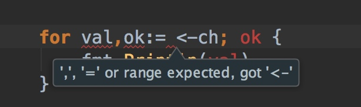

## 并发 concurrency

### 数据结构Channel

- Channel是Go程序(Goroutine)的一种高级数据结构。它可作为不同Goroutine之间的桥梁即数据传输通道，在通道内传递的指定类型消息，我们将其称为通道的类型化数据(或类型元素)。  
- Channel定义
通过描述，我们自然能想到一个Channel的定义:  
`chan T`   
chan关键字代表通道 T代表通道内传递数据的类型  
- 在通道内消息的传递是安全的。  
- Goroutine代表Go并发程序，由Go runtime运行时系统调度，依托于内核线程并发执行代码。  
- 通道的初始化
通道类型比较特殊，没有字面值，只能使用make函数初始化构造`值`。  

### channel的定义
`make(chan int, 5)`
第一个参数代表 **元素类型** 为int的通道
第二个参数代表 **通道的长度** 为5，实际代表**缓存的长度**为5
也就是说上面的通道创建含义为构建一个缓存大小为5，元素类型为int的**通道值**。  

注意:   
  这里着重强调了`值`的概念。当我们在编译的时候，单独声明`chan int`或`make(chan int, 5)`，编译器都无法编译通过。 尤其是在`make(chan int, 5)`编译提示 `make(chan int, 5), evaluated but not used`。值必须赋予变量或被使用。这里也印证了Go的哲学，去除无用的。

### 通道发送和接收
通道中**缓存**即**通道暂存的数据**为先进先出结构，针对于通道值而言，越早被放入(发送)到通道的元素越早被放出通道(接收)。  
~~send -> channel -> receiver~~    `receiver <- channel <- sender`

- `<-`
符号`<-`为向通道中发送(write/send)或接收(read/receive)数据

声明一个通道并向该通道发送值，然后从该通道中取出值。 这里我把通道想像为我的电脑屏幕或者手机屏幕，自己联想吧，当然普遍联想为**管道**或者**传送带**...... 

```Go
ch := make(chan int, 1)
ch <- 99
fmt.Println(<-ch) // 99
```
### 通道返回值(val,ok)

读取通道值可以返回两个值，`val`代表读取的通道元素值，`ok`代表通道的状态。

```Go
ch := make(chan int, 1)
ch <- 99
val, ok := <-ch
if !ok {
	fmt.Println("channel has been closed")
	return
}
fmt.Println(val)
```

第二参数`ok`为bool类型，代表通道值是否有效或通道已关闭。在接收之前或过程中，通道值被关闭了，接收或写操作立即结束并返回一个通道元素类型的零值(这里通道元素类型为int，因此零值则为0)，那么零值容易混淆，我们并不知道0是否正常返回，因此有了第二个布尔返回值代表通道值的状态，我们对于判断就心里有底了。  

### 通道值是一种队列集合


通道值是队列集合，不要以下面的方式去迭代channel

```go
package main

import "fmt"

func main() {
	ch := make(chan int, 1)
	ch <- 99

	/*for val,ok:= <-ch; ok {
		fmt.Println(val)
	}
 */
	val, ok := <-ch
	for ok { //死循环
		fmt.Println(val)
	}

}
```

关闭通道可以通过程序自动终止或者通过内置函数`close(c chan <- Type)`手动关闭。

关于channel的几点注意事项:
- 通道有效的前提下，直至通道被填充满会阻塞(被放入缓存的数据等于通道长度)，否则都为异步
- 有效通道，接收通道值会在其已空时(没有缓存数据)阻塞
- 在向关闭的通道发送数据将会引起恐慌
- 重复关闭通道会引起恐慌
- 通道类型为引用类型，零值为nil

```Go
package main

import "fmt"

func main() {
	ch := make(chan int)
	ch <- 99 //非缓冲通道，发送数据会被阻塞，下面的取数据则造成死锁
	val, ok := <-ch // 接收方会一直等到有数据来
	if !ok {
		fmt.Println("channel has been closed")
		return
	}
	fmt.Println(val)
}
// fatal error: all Goroutines are asleep - deadlock!
//
// Goroutine 1 [chan send]:
// main.main()
// 	/Users/fqc/work/src/run.Go:7 +0x7a
```

上述情况，有两种解决方案。分为有缓存和无缓存通道情况。
1.
如果是无缓存通道，需要接收端准备好之后，才能发送，否则出现阻塞情况。确实，通道中不能存放缓存的时候，需要接收端准备好之后才能发送，否则通道阻塞异常。
我们知道匿名函数闭包会后执行
```go
package main

import "fmt"

func main() {
	ch := make(chan int)
	//ch <- 99
	defer close(ch)
	go func() { ch <- 99 }()
	val, ok := <-ch
	if ok {
		fmt.Println("channel has been closed")
	}
	fmt.Println(val)
}
```
send被执行前(proceed)通讯(communication)一直被阻塞着。如前所言，无缓存的channel只有在receiver准备好后send才被执行。如果有缓存，并且缓存未满，则send会被执行。

2. 有缓存情况，需要缓存未满，发送端可以发送，通道不阻塞

```Go
package main

import "fmt"

func main() {
	ch := make(chan int,1)
	ch <- 99 //带缓存的通道，直至缓存填满为同步，否则为异步
	val, ok := <-ch // 接收方可以随时取数据，直至缓存数据为空时阻塞
	if ok {
		fmt.Println("channel has been closed")
		return
	}
	fmt.Println(val)
}
```

总结:  
非缓存通道，发送方在向通道值发送数据的时候会立即阻塞，直到接收方来消费数据。 
`make(chan T, n)`，其中n>0缓存通道，发送方会立即拷贝数据到缓存直到等于缓存长度进入阻塞，接收方可随时取数据，直到缓存数据为空时阻塞。 `make(chan T,0)`，其中n=0
### 阻塞
缺省情况下，发送和接收会一直阻塞着，直到另一方准备好。这种方式可以用来在gororutine中进行同步，而不必使用显示的锁或者条件变量。

```go
package main

import "fmt"

func sum(s []int, c chan int) {
	print(s)
	sum := 0
	for _, v := range s {
		sum += v
	}
	c <- sum // send sum to c
}

func print(s []int) {
	fmt.Println(s)
}

func main() {
	s := []int{7, 2, 8, -9, 4, 0}
	c := make(chan int)
	go sum(s[:len(s)/2], c)
	go sum(s[len(s)/2:], c)
	x, y := <-c, <-c // receive from c
	fmt.Println(x, y, x+y)
}
```

分批次的并发执行任务

```go
package main

import "fmt"

func sum(s []int, ch chan int) {
	sum := 0
	for _, v := range s {
		sum += v
	}
	ch <- sum
}

func main() {
	arr := []int{1, 2, 3, 4, 5, 6}

	ch := make(chan int, len(arr)) //其实使用缓冲也可以->通过缓存的使用，可以尽量避免阻塞，提供应用的性能。

	go sum(arr[:len(arr)/2], ch)//拆分一般发送到channel中，进行累加操作
	go sum(arr[len(arr)/2:], ch)

	x, y := <-ch, <-ch
	fmt.Println(x,y,x+y)//注意x,y的值不一定，两者可能互换，但是x+y的和是一定的。注意：不论是阻塞还是缓存通道，x,y的值都不一定。因为开启的goroutine是cpu不可控的。
}
```

### for...range
```go
package main

import "fmt"

func main() {
	ch := make(chan int) // make(chan int,10)
	
	go func() {
		for i := 0; i < 10; i++ {
			ch <- i
		}
		close(ch)
	}()

	for value := range ch {
		fmt.Println(value)
	}

	fmt.Println("finished")
}
```
### select

select语句选择一组可能的send操作和receive操作去处理。它类似switch,但是只是用来处理通讯(communication)操作。
它的case可以是send语句，也可以是receive语句，亦或者default。

receive语句可以将值赋值给一个或者两个变量。它必须是一个receive操作。

最多允许有一个default case,它可以放在case列表的任何位置，尽管我们大部分会将它放在最后。

```go
package main

import "fmt"

func fib(ch, quit chan int) {  //fib=fibonacci
	x, y := 0, 1
	for {
		select {
		case ch <- x: //发送数据
			x, y = y, x+y
		case <-quit:
			fmt.Println("quit")
			return
		}
	}
}

func main() {
	ch := make(chan int)
	quit := make(chan int)

	go func() {
		for i := 0; i < 10; i++ {
			//ch <- i
			fmt.Println(<-ch) //取数据
		}
		quit <- 0
	}()

	fib(ch, quit)

}
```


### select与超时处理的巧妙应用

```go
package main

import (
	"fmt"
	"time"
)

func main() {
	ch := make(chan int)
	go func() {
		time.Sleep(2 * time.Second)
		ch <- 100
	}()

	for {
		select {
		case res := <-ch:
			fmt.Println(res)
			//case time.After(time.Second): // select case must be receive, send or assign recv
		case <-time.After(time.Second): //其实它利用的是time.After方法，它返回一个类型为<-chan Time的单向的channel，在指定的时间发送一个当前时间给返回的channel中。
			fmt.Println("timeout")
			return //否则死循环打印timeout
		}
	}
}

```

[golang实践--如何实现万次/秒的定时任务管理器](http://www.chongchonggou.com/g_645214621.html)
### timer
timer是一个定时器，代表未来的一个单一事件，你可以告诉timer你要等待多长时间，它提供一个Channel，在将来的那个时间那个Channel提供了一个时间值。下面的例子中第二行会阻塞2秒钟左右的时间，直到时间到了才会继续执行。
当然如果你只是想单纯的等待的话，可以使用time.Sleep来实现。

```go
package main

import (
	"fmt"
	"time"
)

func main() {
	timer1 := time.NewTimer(time.Second * 2)
	<-timer1.C
	fmt.Println("Timer 1 expired")
	//fmt.Println("time 2 second")
}
```


timer.Stop停止计时器
```go
package main

import (
	"fmt"
	"time"
)

func main() {
	timer2 := time.NewTimer(time.Second)
	go func() {
		<-timer2.C
		fmt.Println("Timer 2 expired")
	}()
	stop2 := timer2.Stop()//使得expired无法执行
	if stop2 {
		fmt.Println("Timer 2 stopped")
	}

	time.Sleep(10*time.Second)
}

```
### ticker
ticker是一个定时触发的计时器，它会以一个间隔(interval)往Channel发送一个事件(当前时间)，而Channel的接收者可以以固定的时间间隔从Channel中读取事件。下面的例子中ticker每500毫秒触发一次，你可以观察输出的时间。

```go
package main

import (
	"fmt"
	"time"
)

func main() {
	ticker := time.NewTicker(time.Millisecond * 500)
	go func() {
		for t := range ticker.C {
			fmt.Println("Tick at", t)
		}
	}()

	time.Sleep(10*time.Second)
}
```
类似timer, ticker也可以通过Stop方法来停止。一旦它停止，接收者不再会从channel中接收数据了。
## 单向通道与多项通道  
除了按照有无缓存划分通道的种类，还可以通过通道的方向划分为单向通道和双向通道，而双向通道是默认的。  
单向通道即数据只能按照一个方向进行传输，按照发送者和接受者的数据流方向的不同，可以分为接收通道和发送通道。  
```Go
type Sender chan<- int // 发送者通道
type Receiver <-chan int // 接受者通道
```
注意
1. 发送者通道 `chan<-` 箭头**指向**通道
2. 接受者通道 `<-chan` 箭头**来自**通道
类型Receiver,Sender代表接收/发送通道类型，chan关键字后跟随的箭头符号代表了数据的流向

###
```Go
package main
import (
	"fmt"
	"time"
)

func main() {
	Go Run()
	time.Sleep(2 * time.Second)
}

func Run() {
	fmt.Println("Go concurrency")
}
```

使用匿名函数
```Go
package main

import (
	"fmt"
	"time"
)

func main() {
	Go func() {
		fmt.Println("hello concurrency")
	}()
	time.Sleep(2 * time.Second)
}

func Run() {
	fmt.Println("Go concurrency")
}
```

### 更优雅的通信，而非不靠谱的线程睡眠
Go可以使用通信机制解决共享内存带来的苦恼。    
- Channel是Goroutine通信的桥梁，大都是阻塞同步的   
- 使用make创建，close关闭
- 可使用for range 对Channel进行迭代不断操作
- 引用类型
- 可以设置缓存大小，未填满前不会阻塞
- 可以设置单向、双向通道

channel读消息会阻塞同步的，直到通道中有消息写入，channel读取到才会继续执行。  

```Go
package main

import "fmt"

func main() {
	c := make(chan bool)
	Go func() {
		fmt.Println("Goroutine")
		c <- true // 存 发送消息
	}()
	<-c //取 接收消息 main执行到这里会阻塞，直到匿名函数中存入了true，channel读取到才会继续执行。
}

```

迭代chaanel时需要明确的正确的执行关闭了channel，否则会造成死锁
```Go
package main

import "fmt"

func main() {
	c := make(chan bool)
	Go func() {
		fmt.Println("Goroutine")
		c <- true
		close(c)
	}()
	for val := range c {
		fmt.Println(val)
	}
}

// Goroutine
// true
```

没有正确关闭channel导致死锁

```Go
...
//close(c)
...

// fatal error: all Goroutines are asleep - deadlock!
// Goroutine
//
// true
// Goroutine 1 [chan receive]:
// main.main()
// 	/Users/fqc/work/src/run.Go:12 +0x85
```

使用make函数都是双向通道channel，可存可取
单向通道，只能存或取，一般用在参数传递上，目的在于防止误读误写操作。  

未设置缓存大小时，缓存为零值，那么它将是阻塞同步的。设置缓存而没有存满的时候该通道为异步的，不会发生阻塞。  
有缓存和无缓存的区别  

```Go
package main

import "fmt"

func main() {
	c := make(chan bool)
	Go func() {
		fmt.Println("Goroutine")
		<-c
	}()
	c <- true
}
// Goroutine
```

`c := make(chan bool, 1)`  
将不会输出。   
```Go
c := make(chan bool)
Go func() {
	fmt.Println("Goroutine")
	<-c
}()
c <- true // 无缓存的时候是阻塞的，里面的内容需要被写完或消息被发送完。因此有缓存的时候还可以被写入
```

有缓存的时候，异步，都会向下执行
诀窍:首先认为是瀑布执行，然后分析关键点 1.看读写顺序 2.看有无缓存
阻塞或异步的时候，读始终需要让写先执行
阻塞的时候，读取的时候需要有消息，否则一直阻塞
异步的时候，读更快嘛...
有缓存的时候爱读不读，没缓存的时候需要等待写入玩 读出来，这和实际开发中联系 缓存可以不去读，但无缓存需要强制去读
有缓存是异步的，无缓存是同步阻塞的。

如何让有缓存的时候，也想让其同步，该如何实现?


## select
>如果存在多个channel的时候,我们该如何操作呢,Go里面提供了一个关键字 select ,通过select可以监听channel上的数据流动。

>select 默认是阻塞的,只有当监听的channel中有发送或接收可以进行时才会运行,当多个channel都准备好的时候,select是随机的选择一个执行的。
```go
package main

import "fmt"

func fibonacci(c, quit chan int) {
	x, y := 1, 1
	for {
		select {
		case c <- x:
			x, y = y, x + y
		case <-quit:
			fmt.Println("quit")
			return
		default:
			//fmt.Println("default") // 程序阻塞时，默认执行
		}

	}
}

func main() {
	c := make(chan int)
	quit := make(chan int)
	go func() {
		for i := 0; i < 10; i++ {
			fmt.Println(<-c)
		}
		quit <- 0
	}()
	fibonacci(c, quit)
}
```

有时候会出现goroutine阻塞的情况,那么我们如何避免整个程序进入阻塞的情况呢?我们可以利用select来 设置超时,通过如下的方式实现:


```go
package main

import "time"

func main() {
	c := make(chan int)
	o := make(chan bool)
	go func() {
		for {
			select {
			case v := <-c:
				println(v)
			case <-time.After(5 * time.Second):
				println("timeout")
				o <- true
				break
			}
		}
	}()
	<-o
}
// timeout  
```

[golang-channel详解](http://colobu.com/2016/04/14/Golang-Channels/)


