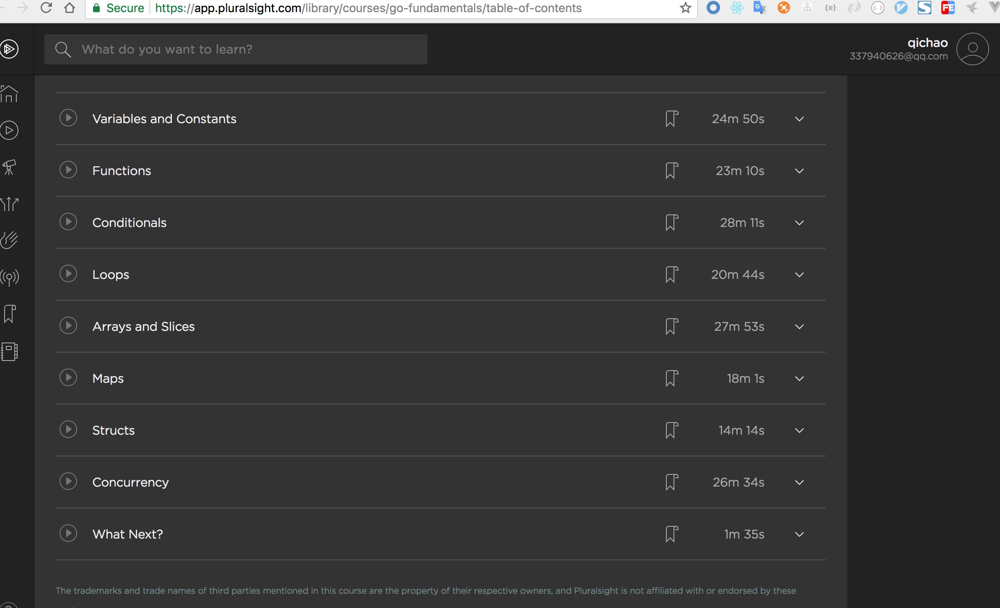

## 书籍
[无闻go语言入门翻译](http://wiki.jikexueyuan.com/project/the-way-to-go/)
[go语言圣经](https://www.kancloud.cn/hartnett/gopl-zh/126044)
[go圣经 gitbook](http://docs.ruanjiadeng.com/gopl-zh/index.html)
## 资料
[go中关于闭包的坑](http://www.jianshu.com/p/fa21e6fada70)
## 博客
[golang数据结构算法博客](http://blog.csdn.net/rufidmx/article/details/10226105)

safaribooksonline  OREILLY

[go in action author video](http://www.informit.com/store/ultimate-go-programming-livelessons-9780134757483)

[modern golang](https://www.safaribooksonline.com/library/view/modern-golang-programming/9781787125254/)

