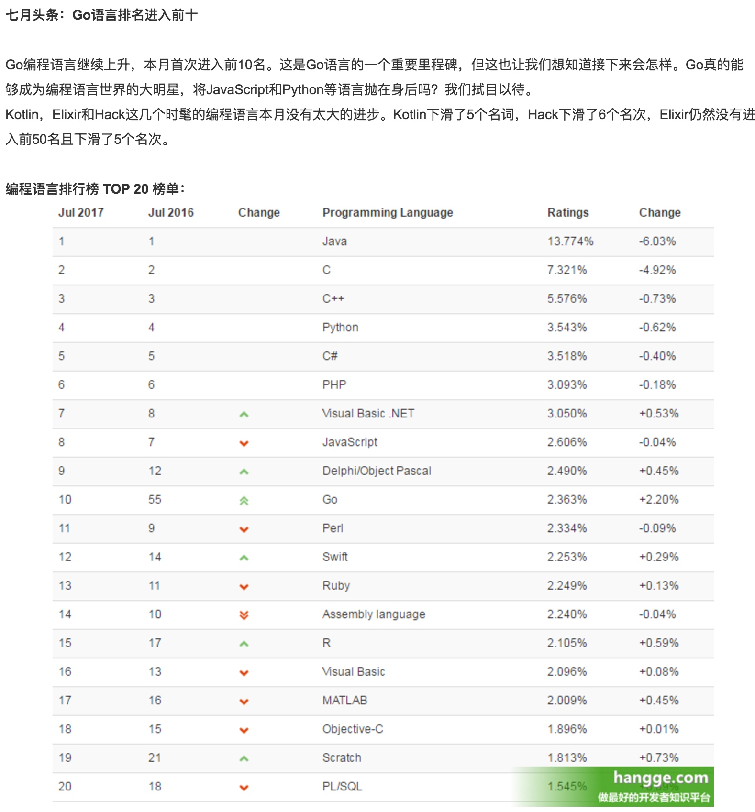
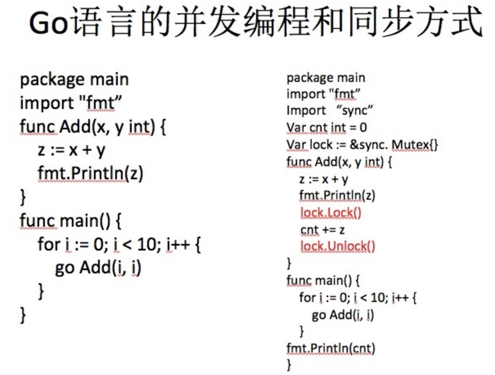
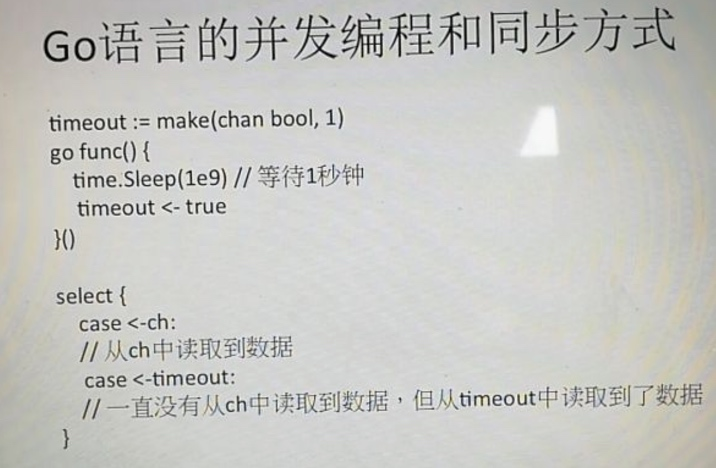
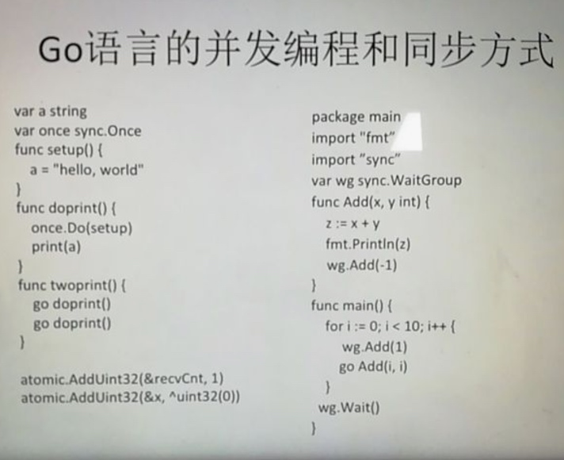
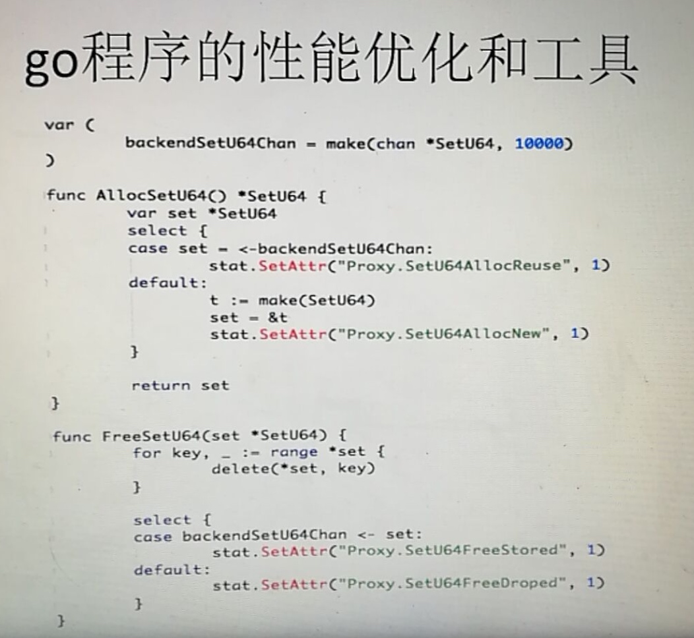
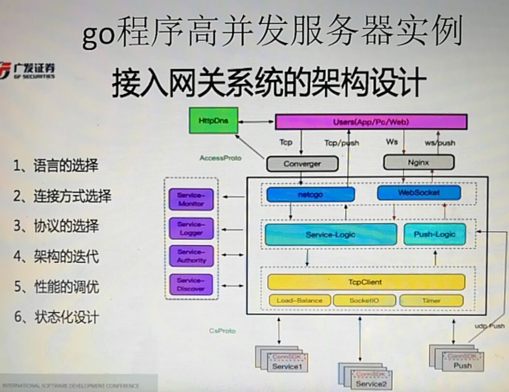
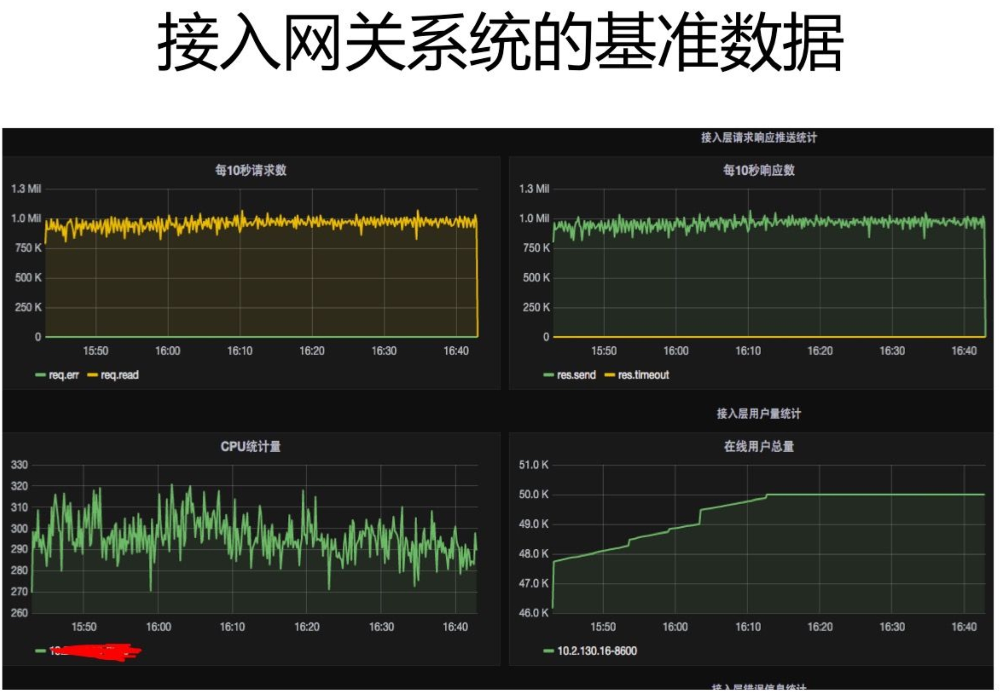

# golang资源

##博客
[一个pass开发者](http://www.zoues.com) 关注PaaS/Devops/Golang

[Grab新加坡、北京研发中心招聘 ](https://gocn.io/article/357) [grab新加坡 golang](https://www.v2ex.com/t/272343)


```sh
和Grab团队比较熟，所以匿了。新加坡是Grab的总部，那为啥要在北京等地方建团队？先说说新加坡site的几个硬伤：1、人力成本高：只要有互联网经验的，就算刚毕业起薪不低过2w (人民币，以下同),  经理级别的最少5w。而且技术人员还贼难找。小有名气经验的工资加倍。2、工程师难找：早前工程师在新加坡是苦逼又低薪的工种，所以本地人都往法务、牙科、市场等专业跑，导致近几年的毕业生都是来自东南亚各国如越南、马来、泰国、印度尼西亚等。可是这些人要的工资已是他们国家的5到10倍，那是不是在这些国家建个开发中心比较划算？3、生产力和技术能力欠缺：新加坡本身只有约5百万人(号称6百万，可是那是连佣人工地劳工等也算进去)，用的也是欧美的Facebook，Gmail等应用居多，没什么有规模的本地应用和网站，所以大部分新加坡工程师对处理大流量大请求的架构没多少经验，再加上现在新加坡流行做conference做hackathon给talk，积聚一些名气就跳槽，也没多少人肯静下心来做实事。所以就会有无数的分享会，而其实大都是自我演秀，没干货。4、内部政治：就不说了。

作者：匿名用户
链接：https://www.zhihu.com/question/40062082/answer/183132262
来源：知乎
著作权归作者所有。商业转载请联系作者获得授权，非商业转载请注明出处。
```

[知乎live grab](https://www.zhihu.com/lives/855417462244659200)

## golang语言并发服务器开发实战


4月份 才18，6月份就第10了










在上一ppt中会有阻塞的问题，而这里使用select则可以解决，一个请求下来等待回包，等了10秒还未有回包数据，此时应该做响应的处理，不能继续等待，而是做些其他的事情。 超时机制，就可以通过select和timeout来设计。也可在外层再加个for {} 循环。 用携程不断的读取操作。




全局唯一性操作  原子性操作

协程没有完，主协程一完。
需要使用waitGroup做线程间的协调。


高并发下使用go如何处理?
1. 一个请求生成一个goroutine，类似于多线程的模式
2. 使用单进程的nodejs的多路重写的机制
3. 当并发很大的时候，该如何去做？ 预分配进程在哪里，然后将请求分配到预分配的进程或线程当中去，依

据经验来看，当并发请求不大的时候，不必考虑太多，使用1，2即可。
当大于上千上万的时候，不能像之前一样，来个请求就创建goroutine，处理完再销毁，其中还会存在大量的内存垃圾。需要考虑内存的回收，这时是两个问题
1.内存的回收，有GC问题的，GC会影响性能，使得系统的响应速度变慢。
2.Go语言的调度，一台机器的核数是有限的，其调度在请求量加剧的时候，cpu调度也会产生性能的大量开销

那该如何解决成千上万级的并发量该怎么做？
在go语言的层面上，一般采用预分配goroutine的方式来分发 做并发模型。在万级别的并发编程中是适用的。如果更高呢？则会有其他的解决方案，分布式方案，消息队列等等 也和业务相关。




面对GC的时候，该如何优化？
1. 尽量减少对象的创建。对象少，回收的也少。在适当的场合多使用指针，多复用对象，避免不必要的复制操作。
2. 如何提高复用率? 
阅读代码程序，在队列中取，用，返回..


pprof的使用
[pprof](http://www.cnblogs.com/yjf512/archive/2012/12/27/2835331.html)
[](http://studygolang.com/articles/1720)
[](http://studygolang.com/articles/9693)
[](http://www.cnblogs.com/zhangqingping/p/4345071.html)   pprof的使用
[gc日志分析](http://studygolang.com/articles/1720)

[Go调优神器trace介绍](http://studygolang.com/articles/9693)



[ppt地址](http://ppt.geekbang.org/slide/show/724)




100台机器到10台机器的提升

c epool  内存队列
协程组集中化处理请求
一个业务模块对一组协程组

