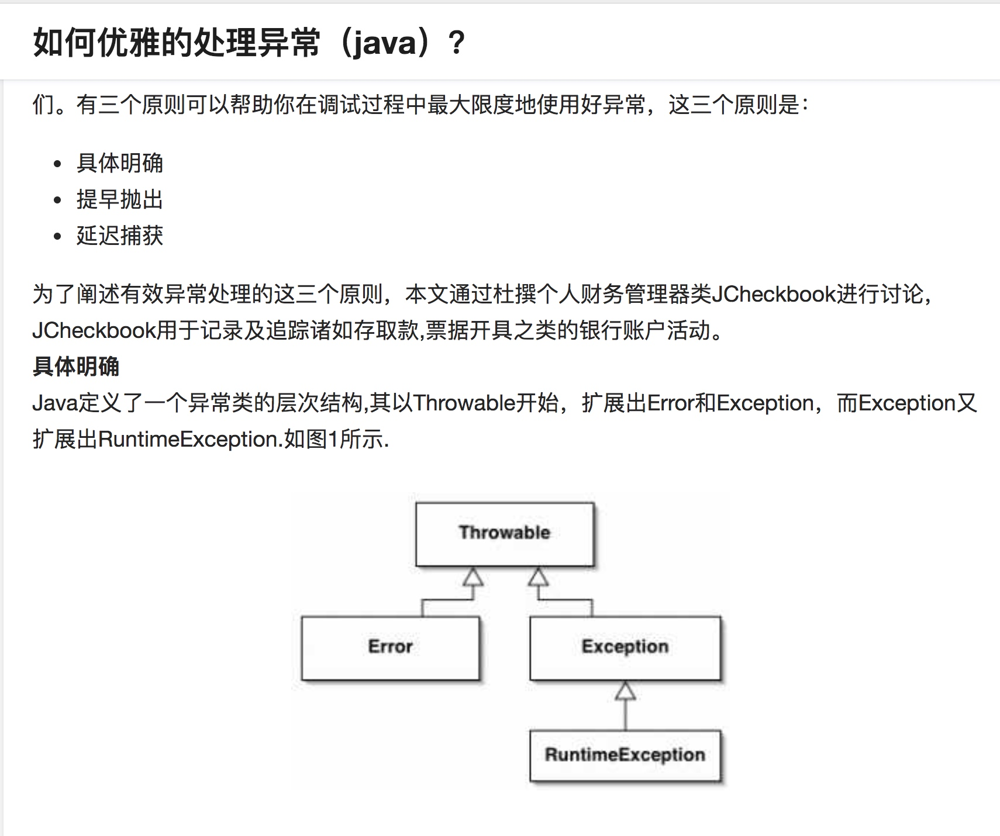
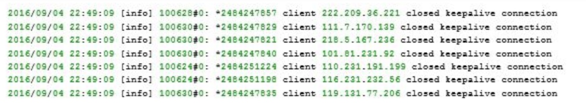

[Java 面试宝典](http://wiki.jikexueyuan.com/project/java-interview-bible/)
[Java工程师面试题整理 社招版](https://zhuanlan.zhihu.com/p/21551758)
[2016Java面试题整理 github java interview](https://github.com/it-interview/easy-java)
[Java面试题 全方位 包含sql 框架等 场景面试题](https://www.jfox.info/)
[最强求职攻略:java程序员如何通过阿里、百度的招聘面试](https://www.jfox.info/%E6%9C%80%E5%BC%BA%E6%B1%82%E8%81%8C%E6%94%BB%E7%95%A5java%E7%A8%8B%E5%BA%8F%E5%91%98%E5%A6%82%E4%BD%95%E9%80%9A%E8%BF%87%E9%98%BF%E9%87%8C%E7%99%BE%E5%BA%A6%E7%9A%84%E6%8B%9B%E8%81%98%E9%9D%A2.html)
[牛客网 常考java面试题](https://www.nowcoder.com/ta/review-java)
[Java面试题整理](https://dongchuan.gitbooks.io/java-interview-question/content/sql/one_to_multi.html)

#基础

## 继承和形参

```java
public class PrintWhoAmI {
    public static void main(String[] args) {
        A a = new B();
        test(a); // please print result
    }

    public static void test(A a) {
        System.out.println("test A");
        a.whoAmI();
    }

    public static void test(B b) {
        System.out.println("test B");
        b.whoAmI();
    }
}

class A {
    public void whoAmI() {
        System.out.println("I'm A");
    }
}

class B extends A {
    @Override
    public void whoAmI() {
        System.out.println("I'm B");
    }
}
```

解析: 
该题主要考察继承和形参。继承中"父类引用指向子类实现"，子类调用负责具体实现。而形参则由父类引用决定。所以`A a = new B()`中形参有`a`决定，所以编译器会调用`test(A a)`，而方法执行中`a.whoAmI()`则由具体的`new B()`决定。 
因此将会输出

```java
test A
I'm B
```


## 当执行  new Son(); 时，会输出什么？

```java
public class Father {  
    private String name="FATHER";  
    public Father(){  
        whoAmI();  
        tellName(name);  
    }  
    public void whoAmI(){  
        System.out.println("Father says, I am " + name);  
    }  
    public void tellName(String name){  
        System.out.println("Father's name is " + name);  
    }  
}  
  
public class Son extends Father {  
    private String name="SON";  
    public Son(){  
        whoAmI();  
        tellName(name);  
    }  
    public void whoAmI(){  
        System.out.println("Son says, I am " + name);  
    }  
    public void tellName(String name){  
        System.out.println("Son's name is " + name);  
    }  
}
```

 
最终结果如下：

```java
Son says, I am null
Son's name is FATHER
Son says, I am SON
Son's name is SON
```

解析: 
1.创建Son的时候先创建Father，而Father中的whoAmI是已经被Son覆盖了，因此这里打印的name这个field是Son中的field，而此时还没有构造Son，因此Son中的name的值是null(这里即使是写了String name = "SON"也是没有用的，因为父类没有构造结束之前，这里是不会被执行的)。
2.Father在执行tellName的时候，传递的参数name是Father自身的name这个field值，这个值是已经被赋值为"FATHER"的，因此会打印出“Son's name is FATHER”
3.Father构造完毕后开始构造Son，这里的打印结果就可以按照常规方式来解释了。 


## java中的equals,hashCode的区别和联系?

```java
1. public boolean equals(Object) 和 int hashCode() 这两个方法都定义在Object顶级类当中，Java中的每个对象都同时含有这两个方法。equals方法是比较对象是否相等，而hashCode则是返回对象的散列值，在Object类中的默认实现是“将该对象的内部地址转换成一个整数返回”。
2. 在对象比较的情况下，一般需要同时重写equals和hashCode方法，同时重写hashCode的原因在于散列值的计算是由equals逻辑中定义的字段值而来。否则equals方法也一般不会起效。
3. 在构造散列表的时候，由于哈希碰撞问题以及元素重复问题，需要注意hashCode和equals方法的重写问题。判断对象equals之前是需要先判断hashCode的。
4. 在equals逻辑中不要直接调用属性字段值，在orm框架中会有延迟加载问题，需要调用getter方法
5. a、如果两个对象equals，Java运行时环境会认为他们的hashcode一定相等。 
   b、如果两个对象不equals，他们的hashcode有可能相等。 
   c、如果两个对象hashcode相等，他们不一定equals。 
   d、如果两个对象hashcode不相等，他们一定不equals。 
   总之一句话 如果对象equals相等，那么需要重写hashCode确保相等，反之则不一定。
```

[ Java 中的 ==, equals 与 hashCode 的区别与联系](http://blog.csdn.net/justloveyou_/article/details/52464440)
[Java hashCode() 和 equals()的若干问题解答](http://www.cnblogs.com/skywang12345/p/3324958.html)
[由==到equals再到hashCode方法](http://tracylihui.github.io/2015/09/29/java/%E7%94%B1==%E5%88%B0equals%E5%86%8D%E5%88%B0hashCode%E6%96%B9%E6%B3%95/)

[如何“记住” equals 和 == 的区别？](https://www.zhihu.com/question/26872848/answer/34364603)
[从一道面试题彻底搞懂hashCode与equals的作用与区别及应当注意的细节](http://blog.csdn.net/lijiecao0226/article/details/24609559)

```
作者：leeon
链接：https://www.zhihu.com/question/26872848/answer/34364603
来源：知乎
著作权归作者所有。商业转载请联系作者获得授权，非商业转载请注明出处。

又是这个问题哈， @金波 的回答是我看到最喜欢的，一句话很清晰的比较了两个方法。Java 语言里的 equals方法其实是交给开发者去覆写的，让开发者自己去定义满足什么条件的两个Object是equal的。所以我们不能单纯的说equals到底比较的是什么。你想知道一个类的equals方法是什么意思就是要去看定义。Java中默认的 equals方法实现如下：public boolean equals(Object obj) {
    return (this == obj);
}
而String类则覆写了这个方法,直观的讲就是比较字符是不是都相同。public boolean equals(Object anObject) {
    if (this == anObject) {
        return true;
    }
    if (anObject instanceof String) {
        String anotherString = (String)anObject;
        int n = count;
        if (n == anotherString.count) {
            char v1[] = value;
            char v2[] = anotherString.value;
            int i = offset;
            int j = anotherString.offset;
            while (n-- != 0) {
                if (v1[i++] != v2[j++])
                    return false;
            }
            return true;
        }
    }
    return false;
}
equals如何比较并不重要，但是不理解equals存在的目的就容易踩坑。比如这里面的一个例子http://atleeon.com/code/2013/11/29/java-equals-hashcode/
```

[](http://blog.csdn.net/lclai/article/details/6195104)
[](https://my.oschina.net/yongqingfan/blog/628174)
[HASHCODE和HASHMAP、HASHTABLE](http://www.debugrun.com/a/WXl4bmk.html)

```java
HashCode的作用

首先，想要明白hashCode的作用，你必须要先知道Java中的集合。
　　总的来说，Java中的集合（Collection）有两类，一类是List，再有一类是Set。你知道它们的区别吗？前者集合内的元素是有序的，元素可以重复；后者元素无序，但元素不可重复。那么这里就有一个比较严重的问题了：要想保证元素不重复，可两个元素是否重复应该依据什么来判断呢？这就是Object.equals方法了。但是，如果每增加一个元素就检查一次，那么当元素很多时，后添加到集合中的元素比较的次数就非常多了。也就是说，如果集合中现在已经有1000个元素，那么第1001个元素加入集合时，它就要调用1000次equals方法。这显然会大大降低效率。
    于是，Java采用了哈希表的原理。哈希（Hash）实际上是个人名，由于他提出一哈希算法的概念，所以就以他的名字命名了。哈希算法也称为散列算法，是将数据依特定算法直接指定到一个地址上。如果详细讲解哈希算法，那需要更多的文章篇幅，我在这里就不介绍了。初学者可以这样理解，hashCode方法实际上返回的就是对象存储的物理地址（PS：这是一种算法，数据结构里面有提到。在某一个地址上（对应一个哈希值，该值并不特指内存地址），存储的是一个链表。在put一个新值时，根据该新值计算出哈希值，找到相应的位置，发现该位置已经蹲了一个，则新值就链接到旧值的下面，由旧值指向（next）它（也可能是倒过来指。。。）。可以参考HashMap）。
    这样一来，当集合要添加新的元素时，先调用这个元素的hashCode方法，就一下子能定位到它应该放置的物理位置上。如果这个位置上没有元素，它就可以直接存储在这个位置上，不用再进行任何比较了；如果这个位置上已经有元素了，就调用它的equals方法与新元素进行比较，相同的话就不存了，不相同就散列其它的地址。所以这里存在一个冲突解决的问题。这样一来实际调用equals方法的次数就大大降低了，几乎只需要一两次。
    所以，Java对于eqauls方法和hashCode方法是这样规定的：
1、如果两个对象相同，那么它们的hashCode值一定要相同；
2、如果两个对象的hashCode相同，它们并不一定相同
    上面说的对象相同指的是用eqauls方法比较。
    你当然可以不按要求去做了，但你会发现，相同的对象可以出现在Set集合中。同时，增加新元素的效率会大大下降。
```


## 描述下java的Error、Exception的区别，试着举例几种RuntimeException.

[如何优雅的处理java异常](https://www.zhihu.com/question/28254987)


[](https://my.oschina.net/hanzhankang/blog/195529)
[](http://www.runoob.com/java/java-exceptions.html)
[](http://blog.csdn.net/mr_pang/article/details/49624425)
[](http://outofmemory.cn/c/java-outOfMemoryError)


## 讲解java克隆的作用以及深浅克隆的原理区别


## 简述线程同步的几种方式
方法同步
代码块同步
volatile轻量级同步，但非线程安全
ReentrantLock 重入锁
ThreadLocal
阻塞队列 LinkedBlockingQueue
使用原子变量实现线程同步 注：BlockingQueue<E>定义了阻塞队列的常用方法，尤其是三种添加元素的方法，我们要多加注意，当队列满时：

　　add()方法会抛出异常

　　offer()方法返回false

　　put()方法会阻塞
使用原子变量(需要使用线程同步的根本原因在于对普通变量的操作不是原子的。)


[java7种线程同步方式总结](http://www.cnblogs.com/XHJT/p/3897440.html)
[Java线程同步几种方式的代码案例](http://www.codeceo.com/article/java-multi-thread-sync.html)
[实现线程同步的几种方式](http://blog.csdn.net/Small_Lee/article/details/51453019)
[线程同步的几种方式原理](http://blog.csdn.net/yubo198/article/details/2070417)

ThreadLocal的实现原理及使用场景
[java ThreadLocal(应用场景及使用方式及原理)](http://blog.csdn.net/coslay/article/details/38293689)
[Java多线程系列八——volatile和ThreadLocal](https://www.yuanmas.com/info/mZzg6kD0OK.html)


## volatile 关键字的理解


```java
在多线程并发编程中synchronized和Volatile都扮演着重要的角色，Volatile是轻量级的synchronized，它在多处理器开发中保证了共享变量的“可见性”。
可见性的意思是当一个线程修改一个共享变量时，另外一个线程能读到这个修改的值。


Java语言规范第三版中对volatile的定义如下： java编程语言允许线程访问共享变量，为了确保共享变量能被准确和一致的更新，线程应该确保通过排他锁单独获得这个变量。Java语言提供了volatile，在某些情况下比锁更加方便。如果一个字段被声明成volatile，java线程内存模型确保所有线程看到这个变量的值是一致的。

```

个人定义:在多线程开发中，jvm线程内存模型确保所有线程看到的共享变量的值是一致的。

为何使用volatile? 
它比synchronized的使用和执行成本更低。因为它不会引起`线程上下文的切换和调度`。

volatile的实现原理
即volatile如何实现线程间共享变量的可见性?


```java
那么Volatile是如何来保证可见性的呢？在x86处理器下通过工具获取JIT编译器生成的汇编指令来看看对Volatile进行写操作CPU会做什么事情。

Java代码：

instance = new Singleton();//instance是volatile变量

汇编代码：

0x01a3de1d: movb $0x0,0x1104800(%esi);

0x01a3de24: lock addl $0x0,(%esp);

有volatile变量修饰的共享变量进行写操作的时候会多第二行汇编代码，通过查IA-32架构软件开发者手册可知，lock前缀的指令在多核处理器下会引发了两件事情。

将当前处理器缓存行的数据会写回到系统内存。
这个写回内存的操作会引起在其他CPU里缓存了该内存地址的数据无效。
处理器为了提高处理速度，不直接和内存进行通讯，而是先将系统内存的数据读到内部缓存（L1,L2或其他）后再进行操作，但操作完之后不知道何时会写到内存，如果对声明了Volatile变量进行写操作，JVM就会向处理器发送一条Lock前缀的指令，将这个变量所在缓存行的数据写回到系统内存。但是就算写回到内存，如果其他处理器缓存的值还是旧的，再执行计算操作就会有问题，所以在多处理器下，为了保证各个处理器的缓存是一致的，就会实现缓存一致性协议，每个处理器通过嗅探在总线上传播的数据来检查自己缓存的值是不是过期了，当处理器发现自己缓存行对应的内存地址被修改，就会将当前处理器的缓存行设置成无效状态，当处理器要对这个数据进行修改操作的时候，会强制重新从系统内存里把数据读到处理器缓存里。

这两件事情在IA-32软件开发者架构手册的第三册的多处理器管理章节（第八章）中有详细阐述。
```


```java
Volatile 变量具有 synchronized 的可见性特性，但是不具备原子特性。这就是说线程能够自动发现 volatile 变量的最新值。Volatile 变量可用于提供线程安全，但是只能应用于非常有限的一组用例：多个变量之间或者某个变量的当前值与修改后值之间没有约束。因此，单独使用 volatile 还不足以实现计数器、互斥锁或任何具有与多个变量相关的不变式（Invariants）的类（例如 “start <=end”）。
出于简易性或可伸缩性的考虑，您可能倾向于使用 volatile 变量而不是锁。当使用 volatile 变量而非锁时，某些习惯用法（idiom）更加易于编码和阅读。此外，volatile 变量不会像锁那样造成线程阻塞，因此也很少造成可伸缩性问题。在某些情况下，如果读操作远远大于写操作，volatile 变量还可以提供优于锁的性能优势。
```

比较适合的场景
在某些情况下，如果读操作远远大于写操作，volatile 变量还可以提供优于锁的性能优势。
volatile 操作不会像锁一样造成阻塞，因此，在能够安全使用 volatile 的情况下，volatile 可以提供一些优于锁的可伸缩特性。如果读操作的次数要远远超过写操作，与锁相比，volatile 变量通常能够减少同步的性能开销。

正确使用 volatile 的模式
很多并发性专家事实上往往引导用户远离 volatile 变量，因为使用它们要比使用锁更加容易出错。然而，如果谨慎地遵循一些良好定义的模式，就能够在很多场合内安全地使用 volatile 变量。要始终牢记使用 volatile 的限制 —— 只有在状态真正独立于程序内其他内容时才能使用 volatile —— 这条规则能够避免将这些模式扩展到不安全的用例。

模式 #1：状态标志
模式 #2：一次性安全发布（one-time safe publication）
模式 #3：独立观察（independent observation）
模式 #4：“volatile bean” 模式
模式 #5：开销较低的读－写锁策略
缺点: 非线程安钻的 虽具备synchronized的可见性，但非原子性操作(也就是非互斥性)

部分内容源自以下优秀文章
[聊聊并发（一）——深入分析Volatile的实现原理](http://www.infoq.com/cn/articles/ftf-java-volatile)
doge lea 追加字节数 填充64位cpu宽  LinkedTransferQueue
[IBM java理论与实践](https://www.ibm.com/developerworks/cn/java/j-jtp06197.html)

[Java并发包](http://www.raychase.net/1912)
[volatile的原理及案例讲解](https://www.youtube.com/watch?v=SC2jXxOPe5E)
[volatile的实现原理及应用场景](http://www.jianshu.com/p/d577c2817af8)
[volatile的使用场景](https://segmentfault.com/q/1010000003927792)

## ThreadLocal的原理及使用场景

[线程范围内共享数据](http://blog.csdn.net/eson_15/article/details/51531941)
[【java并发】ThreadLocal类以及应用技巧](http://blog.csdn.net/eson_15/article/details/51540502)

[java ThreadLocal(应用场景及使用方式及原理)](http://blog.csdn.net/coslay/article/details/38293689)
[各大公司Java后端开发面试题总结](http://blog.csdn.net/likailonghaha/article/details/70194703)

[ThreadLocal 内部实现和应用场景](http://blog.csdn.net/z69183787/article/details/51490100)
[ThreadLocal的底层实现原理与应用场景](http://blog.csdn.net/qq_24693837/article/details/70432058)
[threadLocal小结](http://qiankunli.github.io/2014/09/02/ThreadLocal.html)
[【java并发】线程范围内共享数据](http://blog.csdn.net/eson_15/article/details/51531941)
## jvm的理解认识
[Jvm小结](http://qiankunli.github.io/2014/10/27/jvm.html)
## 并发模型
[akka 、java和go中并发模型](http://qiankunli.github.io/2017/09/05/akka.html)
## 简述spring aop
[Spring AOP简述](http://www.cnblogs.com/jun-ma/p/4833539.html)
[spring aop 实现原理简述——背景知识](http://qiankunli.github.io/2016/01/22/spring-aop2.html)

## 简述tcp的三次握手
[用 Wireshark 图解：TCP 三次握手](https://www.bysocket.com/?p=1404)
[通俗大白话来理解TCP协议的三次握手和四次分手](https://github.com/jawil/blog/issues/14)
[笔试面试知识整理-TCP的特性](https://hit-alibaba.github.io/interview/basic/network/TCP.html)

# 代码编写
## 编写一个单例类

[单例总结](http://blinkfox.com/javashe-ji-mo-shi-zhi-dan-li-mo-shi/)
[如何正确地写出单例模式](http://wuchong.me/blog/2014/08/28/how-to-correctly-write-singleton-pattern/)dcl 指令重排序
[java单例的几种实现方式](http://www.cnblogs.com/CodeGuy/p/3580486.html) 
[如何在Java中使用双重检查锁实现单例](http://xylsh.github.io/2014/double-checked-locking-singleton)
[Java的单例模式与延时加载 写得很到位](http://blog.sina.com.cn/s/blog_6fd0fd4b0101326l.html)
[使用静态内部类实现延迟加载单例模式](http://www.javaweb1024.com/java/Javajichu/2015/03/25/454.html)
[Java静态内部类加载](http://blog.csdn.net/zhang_yanye/article/details/50344447)
[加载一个类时，其内部类是否同时被加载？引申出单例模式的另一种实现方式](http://yongliang567.iteye.com/blog/904467)
[关于java内部类加载顺序的问题](https://www.oschina.net/question/2273217_217864)
[可以不要再使用Double-Checked Locking了](http://www.importnew.com/23980.html)
[java性能小技巧](http://www.importnew.com/1531.html)


下列单例类有什么问题?
```java
public class Singleton {
    private static Singleton instance;

    private Singleton() {
        instance = new Singleton();
    }

    public static Singleton newInstance() {
        return instance;
    }

    public static void main(String[] args) {
        Singleton s1 = Singleton.newInstance();
        Singleton s2 = Singleton.newInstance();
        System.out.println(s1 == s2);
        System.out.println(s1);
        System.out.println(s2);
    }
}
```

## 说下线程池的使用
[Java并发编程：线程池的使用](http://www.cnblogs.com/dolphin0520/p/3932921.html)
[Java四种线程池的使用](http://cuisuqiang.iteye.com/blog/2019372)
[线程、多线程与线程池总结](http://www.jianshu.com/p/b8197dd2934c)
孙福生 简书 博客园 dolphin 并发博客写的不错
方腾飞不用说了 
[java并发编程-Executor 框架与线程池](http://wiki.jikexueyuan.com/project/java-concurrency/executor.html)
[聊聊并发（三）——JAVA线程池的分析和使用](http://www.infoq.com/cn/articles/java-threadPool)
[ 并发编程3：线程池的使用与执行流程](http://blog.csdn.net/u011240877/article/details/73440993)
[线程池的介绍及简单实现](https://www.ibm.com/developerworks/cn/java/l-threadPool/)
[http://www.trinea.cn/android/java-android-thread-pool/](http://www.trinea.cn/android/java-android-thread-pool/)
[Java(Android)线程池](http://www.trinea.cn/android/java-android-thread-pool/)


 
## 系统设计调优
[性能调优攻略](https://coolshell.cn/articles/7490.html)
[架构之路]()


## [客服分配并发场景，怎么设计比较好？](https://segmentfault.com/q/1010000002799063)


## [高并发场景下的redis优化方案](https://segmentfault.com/q/1010000008184949)

#算法和数据结构
## 如何判断两个单向链表相交，如何找相交点？
[判断两个链表是否相交的思路](http://www.nowamagic.net/librarys/veda/detail/1843)
[判断两个单向链表是否相交](http://www.jianshu.com/p/77c80d2f84ca)
[编程之美：判断两链表是否相交](http://blog.csdn.net/liuxialong/article/details/6556096)
[判断两个链表是否相交并找出交点](http://www.voidcn.com/article/p-btlyiioc-wg.html)
## 如何对n个数进行排序，要求时间复杂度O(n)，空间复杂度O(1)
[](http://blog.csdn.net/ylf13/article/details/14449249)
## 哗啦啦saas系统有大量的订单数据日志，对每条数据都有一个时间戳(2011-01-01,14:05:11)，要求对这批数据进行时间戳排序，并能较简答的输出连续若干天的所有排序数据项。
[十道海量数据处理面试题与十个方法大总结](http://blog.csdn.net/v_july_v/article/details/6279498)
[LeetCode Design Log Storage System](http://code.bitjoy.net/2017/07/02/leetcode-design-log-storage-system/)
[亚马逊访谈：时间戳排序：找出三页子集序列重复最大次数 ](https://ask.helplib.com/5562500)
[多服务器的日志合并统计——apache日志的cronolog轮循](http://www.chedong.com/tech/rotate_merge_log.html)
[日志：每个软件工程师都应该知道的有关实时数据的统一概念](https://www.oschina.net/translate/log-what-every-software-engineer-should-know-about-real-time-datas-unifying?print)
[The Log（我所读过的最好的一篇分布式技术文章）](http://www.importnew.com/23445.html)

## 链表
[链表问题精选](http://wuchong.me/blog/2014/03/25/interview-link-questions/)

- 但管努力，莫问前程，事在人为，功不唐捐

[有大公司 offer 却选择了小公司是为什么？](https://www.zhihu.com/question/31116099)

[从大公司离职去小公司当 CTO 是一种怎样的体验？](https://www.zhihu.com/question/31753374)

[X 小姐：那些“贪得无厌”的技术大牛们，又想创业又想高薪到底凭什么啊？](https://36kr.com/p/214168.html)

# 数据库
一个表tb1，字段是name,class,score。分别代表姓名，所在班级，分数。要求用一条语句查出每个班的及格人数和不及格人数。格式为: class 及格人数 不及格人数(60分及格)。

COUNT() 函数返回匹配指定条件的行数。
group by 分组
if 函数

```sql
CREATE TABLE `student` (
  `id` int(11) NOT NULL AUTO_INCREMENT,
  `name` varchar(255) DEFAULT NULL,
  `class` int(11) DEFAULT NULL,
  `score` smallint(6) DEFAULT NULL,
  PRIMARY KEY (`id`)
) ENGINE=InnoDB AUTO_INCREMENT=10 DEFAULT CHARSET=utf8
```

```sql
select * from student order by class;

select class,count(name) as 人数 from student group by class;

Select class,count(if(score>=60,1,null)) as 及格人数 ,count(if(score<60,1,null)) 不及格人数 from student group by class;
```

```sql
select 	
	class,
	count(case when score >= 60 then 1 else null END) as 及格人数,
	count(case when score < 60 then 1 else null END) as 不及格人数
from student group by class;
```

[Mysql按条件计数的几种方法](https://www.pureweber.com/article/mysql-conditional-count/)
# 系统设计题
1.设计一个流量控制服务，对访问的ip地址做白名单和访问频率控制，白名单全部放行，其他ip访问频率按照每小时访问次数来限制。按照合作等级分为gao、中、普通三级，例如高级是10000次/小时，中级为2000次/小时，普通为100次/小时，请给出架构设计，考虑ipv4即可。方案必须包含下面几点:
a. 服务的接口描述(Java代码)
b. 预估单机实现的资源消耗，及可满足qps。
c. 高可用性如何实现。

# 附加题
## 请统计出频次最多的十个ip地址[下面是nginx的error log日志格式]。(linux shell实现。)

[统计Apache或nginx日志里访问次数最多的前十个IP](http://xoyabc.blog.51cto.com/7401264/1688339)
[linux下nginx日志分析](https://segmentfault.com/a/1190000000489528)
[awk 小结](http://www.cnblogs.com/ungshow/archive/2011/10/02/2197936.html)

[工作中常用的linux实用命令](https://my.oschina.net/liting/blog/409082)
## 根据规律填充括号内容
1,11,21,1211,111221,(312211),(13112221)
外观数列（Look-and-say sequence）第n项描述了第n-1项的数字分布.

[各大公司Java后端开发面试题总结](http://blog.csdn.net/likailonghaha/article/details/70194703)

[你真的很熟分布式和事务吗？](http://www.importnew.com/23597.html)

[用大白话聊聊分布式系统](http://www.importnew.com/24314.html)
[niubi-job：一个分布式的任务调度框架设计原理以及实现](http://www.importnew.com/23277.html)


