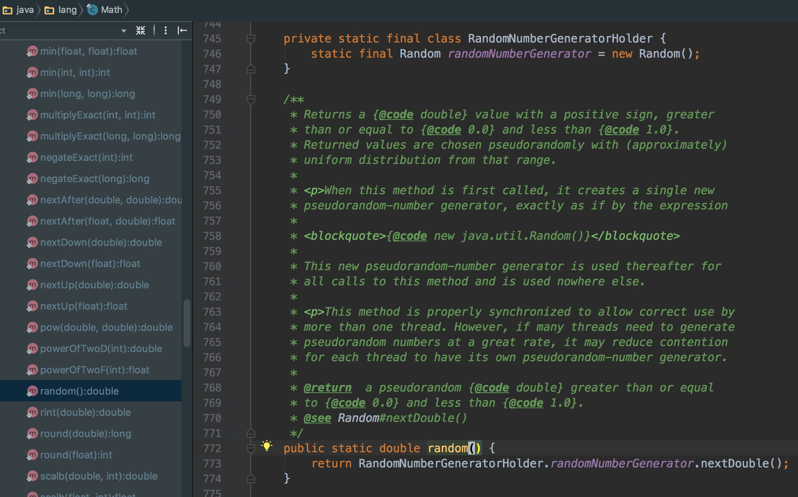

# Holder模式

[java单例的几种实现方式](http://www.cnblogs.com/CodeGuy/p/3580486.html)
[Java的单例模式与延时加载 写得很到位](http://blog.sina.com.cn/s/blog_6fd0fd4b0101326l.html)
[使用静态内部类实现延迟加载单例模式](http://www.javaweb1024.com/java/Javajichu/2015/03/25/454.html)
[Java静态内部类加载](http://blog.csdn.net/zhang_yanye/article/details/50344447)
    
[加载一个类时，其内部类是否同时被加载？引申出单例模式的另一种实现方式](http://yongliang567.iteye.com/blog/904467)

[关于java内部类加载顺序的问题](https://www.oschina.net/question/2273217_217864)

