# java9 和java8
[Kotlin可以拯救Java程序员，但Java9程序员不用！](http://posts.careerengine.us/author/57cd07148dbb450d4a4638a8/posts)

[java9的亮点](https://www.sohu.com/a/194022860_115128)


java9的启动时间config-server started app 20秒->3秒 jvm runing 32s->10s 

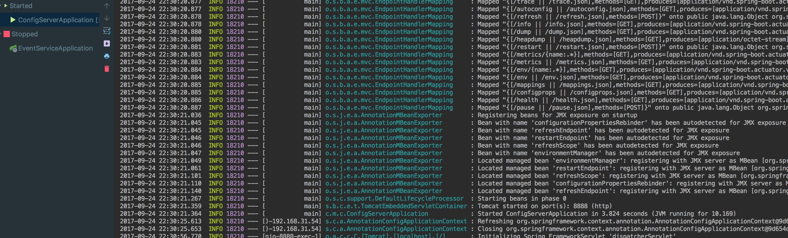

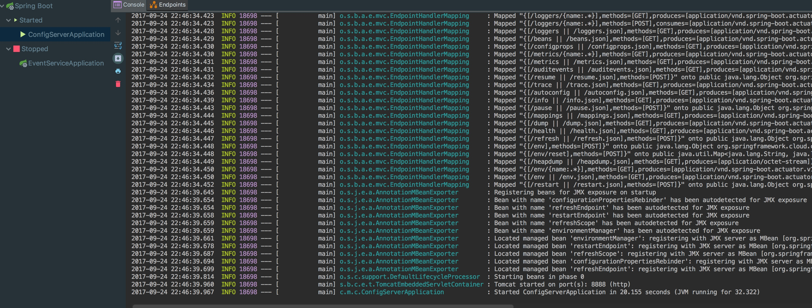


关于9-ea的bug 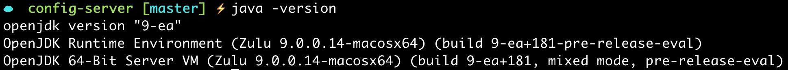
解析: 
https://github.com/jqno/equalsverifier/issues/172
https://blog.codefx.org/java/java-9-migration-guide/

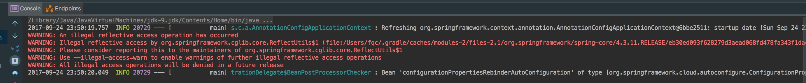


15s 21s  -> 27s 38s
java9
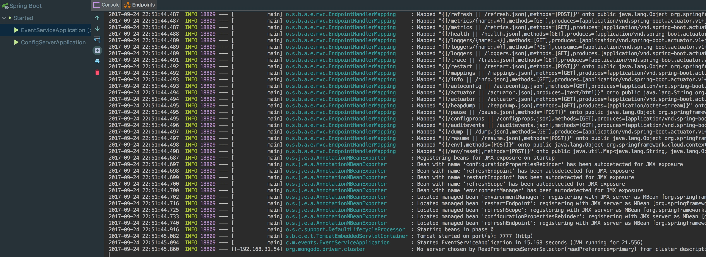

java8
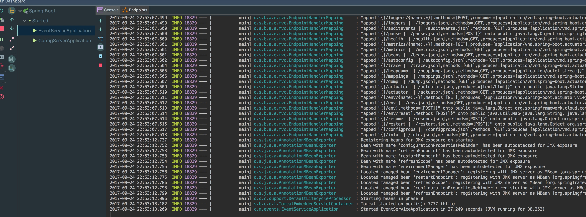

从官网下载最新最权威的版本，再进行测试
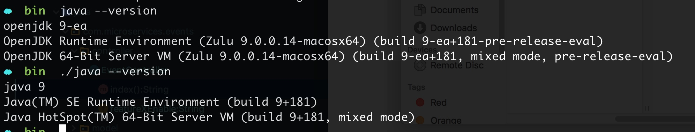

3s 10.1s
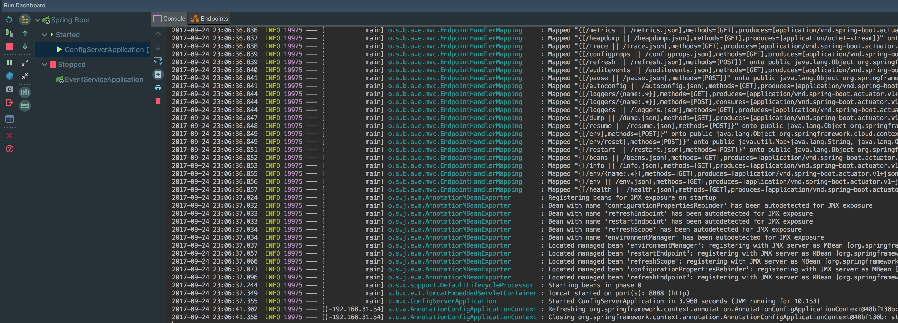
13s 19s
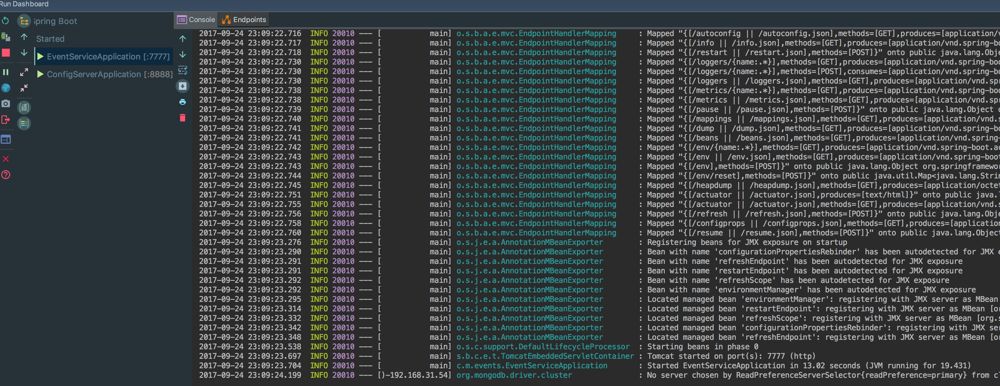

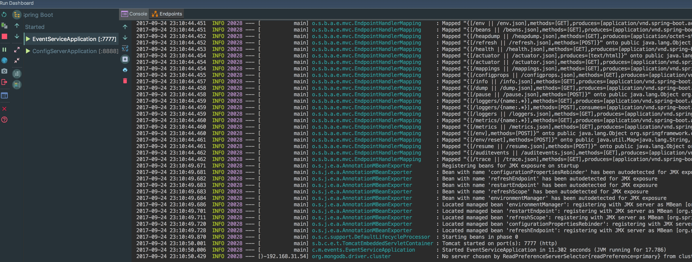

java9 会主动

```
org.springframework.dao.DataAccessResourceFailureException: Timed out after 30000 ms while waiting for a server that matches ReadPreferenceServerSelector{readPreference=primary}. Client view of cluster state is {type=UNKNOWN, servers=[{address=localhost:27017, type=UNKNOWN, state=CONNECTING, exception={com.mongodb.MongoSocketOpenException: Exception opening socket}, caused by {java.net.ConnectException: Connection refused (Connection refused)}}]; nested exception is com.mongodb.MongoTimeoutException: Timed out after 30000 ms while waiting for a server that matches ReadPreferenceServerSelector{readPreference=primary}. Client view of cluster state is {type=UNKNOWN, servers=[{address=localhost:27017, type=UNKNOWN, state=CONNECTING, exception={com.mongodb.MongoSocketOpenException: Exception opening socket}, caused by {java.net.ConnectException: Connection refused (Connection refused)}}]
```
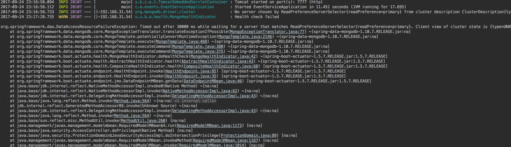


而1.8的版本 没有任何显示....
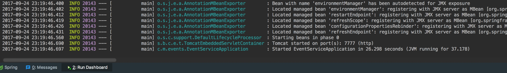


java8 和idea的bug

http://www.jianshu.com/p/454a13ea65dc

这样会损失很多其他功能，别误导人家，朋友～

 赞  回复
清净安宁： 这个不清楚唉，我朋友告诉我的，这个是笔记，你有其他的方法没，能分享下不？
2017.05.27 11:56  回复
echoops： @清净安宁 哈哈 就是不管他，也没事～ 或者升级到8或者9的最新版本，7不行
2017.05.27 13:40  回复
echoops： @清净安宁 I don't recommend disabling IntelliJ IDEA launcher agent, though. It's used for such features as graceful shutdown (Exit button), thread dumps, workarounds a problem with too long command line exceeding OS limits, etc. Losing these features just for the sake of hiding the harmless message is probably not worth it, but it's up to you.

[这是原文](https://stackoverflow.com/questions/43003012/objc3648-class-javalaunchhelper-is-implemented-in-both) 

[原因解释  Mac 上 Class JavaLaunchHelper is implemented in both 报错](http://blog.csdn.net/lizhaowei213/article/details/68951671)

