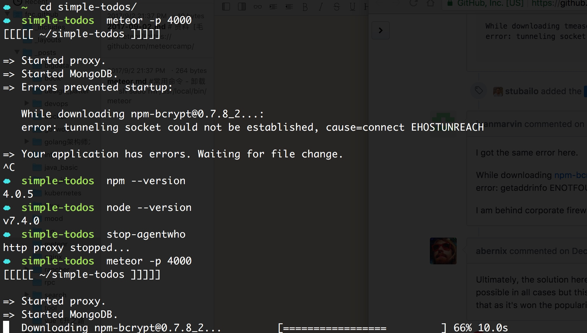
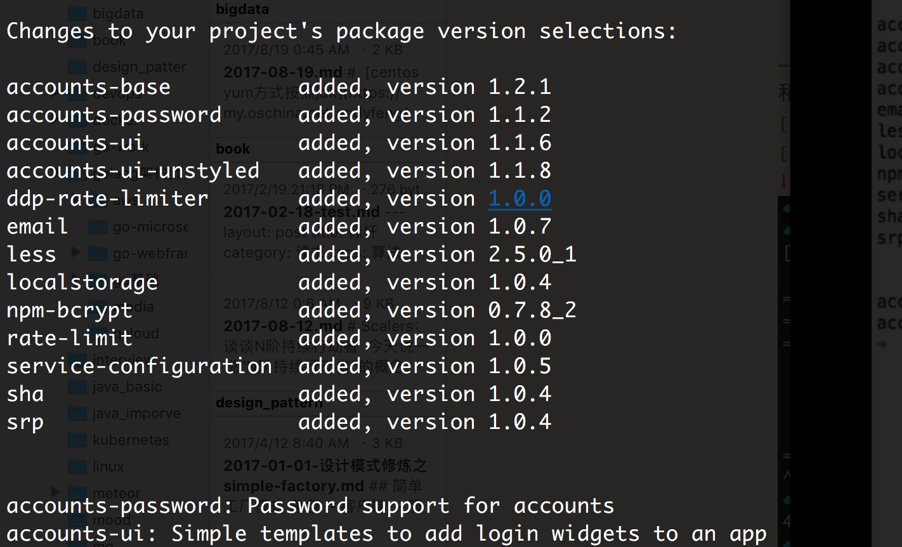
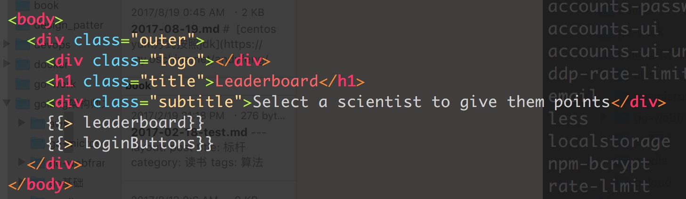

#常用命令
- 卸载 

```sh
sudo rm /usr/local/bin/meteor
rm -rf ~/.meteor
```

- 安装指定版本

最好开启科学上网
```sh
curl "https://install.meteor.com/?release=1.x" | sh
```

可以看到中途过程网络的不稳定性 翻墙可节省大量时间
```sh
☁  ~  curl "https://install.meteor.com/?release=1.2" | sh
  % Total    % Received % Xferd  Average Speed   Time    Time     Time  Current
                                 Dload  Upload   Total   Spent    Left  Speed
100  7782    0  7782    0     0   5254      0 --:--:--  0:00:01 --:--:--  5251
Downloading Meteor distribution
#############                                                             19.0%
curl: (18) transfer closed with 108528558 bytes remaining to read
Retrying download in 5 seconds...
######################                                                    30.8%
curl: (18) transfer closed with 92685945 bytes remaining to read
Retrying download in 5 seconds...
########################################                                  56.1%
curl: (18) transfer closed with 58722627 bytes remaining to read
Retrying download in 5 seconds...
################################################################          90.1%
curl: (18) transfer closed with 12766220 bytes remaining to read
Retrying download in 5 seconds...
######################################################################## 100.0%

Meteor 1.2 has been installed in your home directory (~/.meteor).
Writing a launcher script to /usr/local/bin/meteor for your convenience.

To get started fast:

  $ meteor create ~/my_cool_app
  $ cd ~/my_cool_app
  $ meteor

Or see the docs at:

  docs.meteor.com
```

- 验证版本

```sh
meteor --version
```

- meteor create --list

- meteor create --example name


- 注意代理的问题
和我遇到的(下面截图)类似的issue，最终将我的http代理先停掉就好了，是网络的原因。
[](https://github.com/percolatestudio/atmosphere/issues/427)
[](https://github.com/meteor/meteor/issues/4934)



- meteor add accounts-password accounts-ui


多了一些其他的依赖包

- 编辑 leaderboard.html 
添加 {{> loginButtons}}




