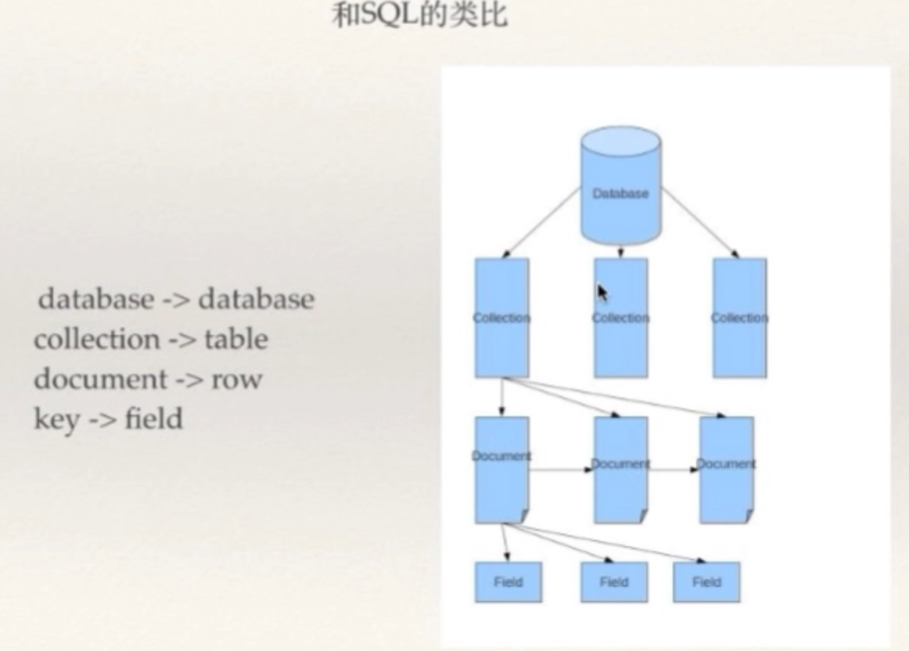
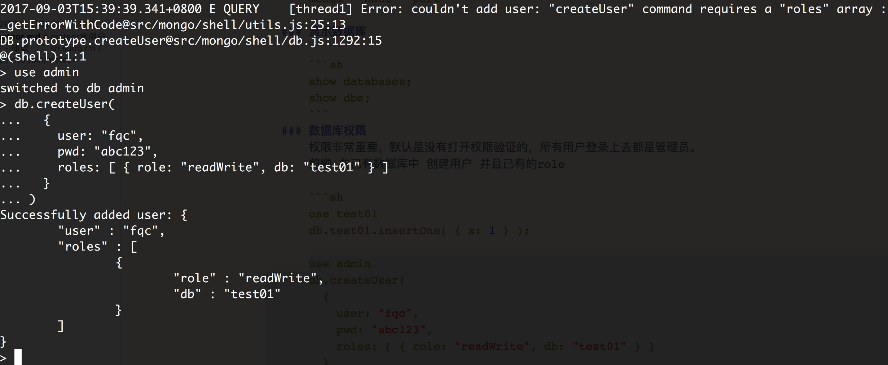
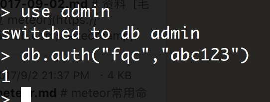
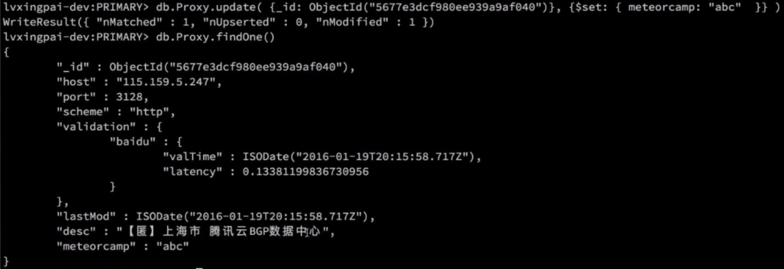
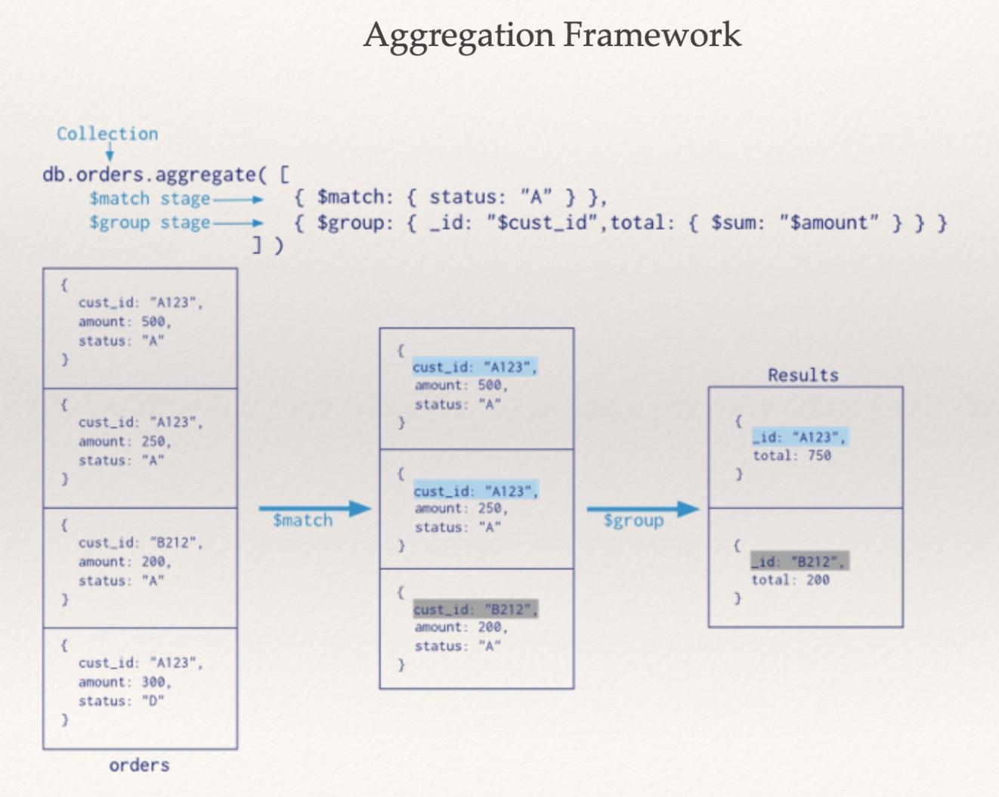
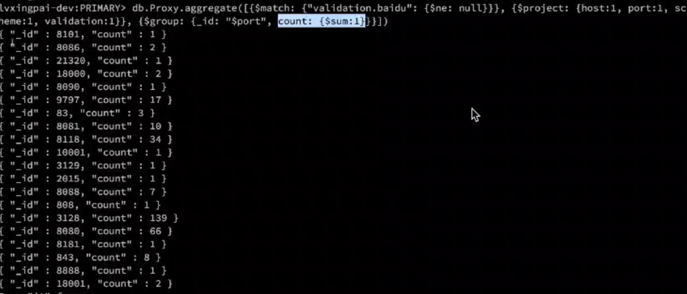
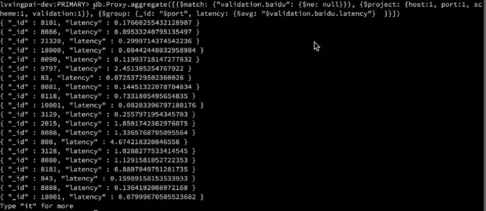
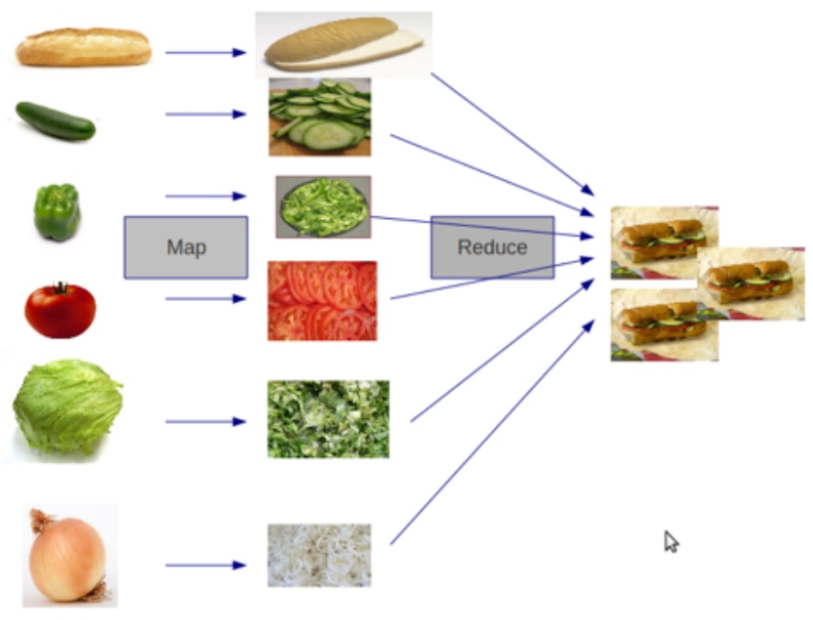

# meteor常用命令
- 卸载 

```sh
sudo rm /usr/local/bin/meteor
rm -rf ~/.meteor
```

- 安装指定版本

最好开启科学上网
```sh
curl "https://install.meteor.com/?release=1.x" | sh
```

可以看到中途过程网络的不稳定性 翻墙可节省大量时间
```sh
☁  ~  curl "https://install.meteor.com/?release=1.2" | sh
  % Total    % Received % Xferd  Average Speed   Time    Time     Time  Current
                                 Dload  Upload   Total   Spent    Left  Speed
100  7782    0  7782    0     0   5254      0 --:--:--  0:00:01 --:--:--  5251
Downloading Meteor distribution
#############                                                             19.0%
curl: (18) transfer closed with 108528558 bytes remaining to read
Retrying download in 5 seconds...
######################                                                    30.8%
curl: (18) transfer closed with 92685945 bytes remaining to read
Retrying download in 5 seconds...
########################################                                  56.1%
curl: (18) transfer closed with 58722627 bytes remaining to read
Retrying download in 5 seconds...
################################################################          90.1%
curl: (18) transfer closed with 12766220 bytes remaining to read
Retrying download in 5 seconds...
######################################################################## 100.0%

Meteor 1.2 has been installed in your home directory (~/.meteor).
Writing a launcher script to /usr/local/bin/meteor for your convenience.

To get started fast:

  $ meteor create ~/my_cool_app
  $ cd ~/my_cool_app
  $ meteor

Or see the docs at:

  docs.meteor.com
```

- 验证版本

```sh
meteor --version
```

- meteor create --list

- meteor create --example name


- 注意代理的问题
和我遇到的(下面截图)类似的issue，最终将我的http代理先停掉就好了，是网络的原因。
[](https://github.com/percolatestudio/atmosphere/issues/427)
[](https://github.com/meteor/meteor/issues/4934)


- meteor add accounts-password accounts-ui


多了一些其他的依赖包

- 编辑 leaderboard.html 
添加 {{> loginButtons}}


# mongodb
meteor的核心技术ddp 基于mongodb
关系型数据库的理念  

 - 关系代数
 - 经典数据库模型
    - 完备的事务
    - 良好的数据模型
    - 强的数据一致性
 - modern web的新理念挑战   
    - 现代互联网 需要性能、高拓展性、高可用性
 
 现在的很多互联网应用并非需要事务，强的一致性，我们可以使用nosql换取极大的开发便利及性能提升。nosql运动开始风行。
 
mongodb的理念


面向文档的数据库，抛弃了范式，引入了文档嵌入。数据的一致性有损失，无法换取数据的强一致，但是查询时性能大大提高，查询一次订单其任何信息都可以查询到并且没有任何的连接，空间使用率相对低些，但是效率大大提高。

## mongodb modelling


两边的方式mongodb的两种模型形式，但左边我们并不推荐使用，因为其本质就是一种join操作。性能低，程序不好写。
首选基于文档嵌入的方式，替代join。

数据库的crud和admin管理其实非常简单，没啥可学的，知道就行了。真正的难点在于`数据模型建立`，对数据的抽象，数据库应用的精髓所在。  



## mongo 常用操作


### 连接

```sh
mongo $ip:$host
mongo --host --port 
```
### 显示数据库

```sh
show databases;
show dbs;
```
### 数据库权限
权限非常重要，默认是没有打开权限验证的，所有用户登录上去都是管理员。
前题 **在已有数据库中 创建用户 并且已有的role**

```sh
use test01
db.test01.insertOne( { x: 1 } );

use admin
db.createUser(
  {
    user: "fqc",
    pwd: "abc123",
    roles: [ { role: "readWrite", db: "test01" } ]
  }
)
```




```sh
use admin
db.auth("fqc","abc123")
```


### 显示数据库的表

```sh
show collections;
```

### 


### 查询
count()
findOne()
find({field:""}).pretty()

embedded复杂类型 使用DOT Notation查询


### 查询并排序
查询find返回后的cursor
指定字段 1或-1 1:正序 从小到大排列  -1 逆序

### 指定字段
find参数的第二个json条件
要的话为1 比如 {name:1}

### 指定范围 分页
limit(5) 前5条
skip(10).limit(5) 11-15条

### 强大但需慎用的where

如果有很复杂的需求，可以自定义查询逻辑。 
但是注意

1. $where要慎用，因为where没有办法很好的使用索引，索引查询效率会特别低。
2. 和其他的操作符组合使用，要用的话可以在通过其他操作符返回相对较小的数据集然后再使用where，就会提高查询效率。
3. 全局使用where就是要找挂的....
4. 原理是 this做了全表扫描，每条数据都和其绑定到了一起。

```sh
({$where:function(){return this.port==8080}},{port:1})
```

### update
$set更新或添加属性 
$unset 去除属性



schema free是很强大的利器，但是用不好，也是对自己的毁灭..数据的混乱以及可维护 都是噩梦。如果用得好开发效率会提升很多。

### mongo数据类型 数组
建立空数组 []


追加元素到数组 $push


唯一的 集合
$addToSet 


 
## mongo aggregation framework



pipline 的思想

通常第一个阶段是match阶段

```sh
db.Proxy.aggregate([{$match:{validation:{$ne:null}}},{$project:{host:1,port:1,schema:1,validation:1}},{$group:{_id:"$port ",count:{$sum:1}}])
```









后续看文档[mongodb讲义](https://github.com/gomaster-me/meteor101-1/blob/master/day3_4/MongoDB%E8%AE%B2%E4%B9%89.pdf)


## 实战


atmospherejs.com

### 包管理
#### meteor add 方式
 
```sh
meteor add kadira:flow-router
``` 
#### 编辑配置文件方式


