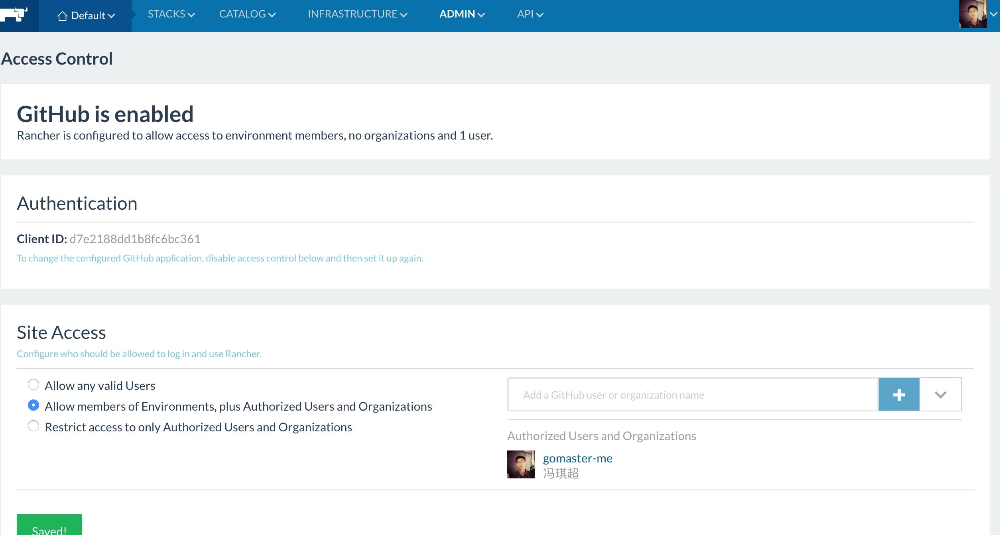
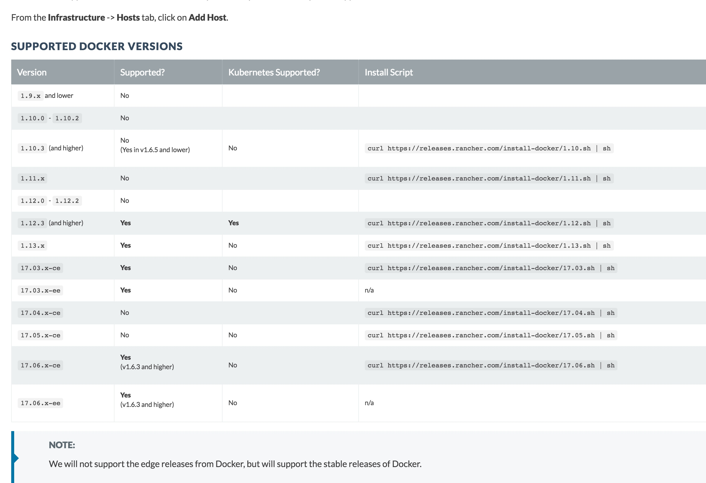

# rancher的使用

## 安装
需要先看一下下面章节的docker版本的选择
[rancher的安装](https://github.com/rancher/rancher#installation)


```sh
~$ docker run -d --restart=unless-stopped -p 8080:8080 --name rancher-master rancher/server:v1.6.7
```
`The UI and API are available on the exposed port 8080.`


## 使用
[官方文档](http://rancher.com/docs/rancher/v1.6/en/)


## add a host


目前的rancher manager 在aws 52.80.83.100 8080上，
我将第五步骤的脚本拷贝到我的阿里云一台主机上


在第六步中rancher提示 执行第五步操作后会在aws的rancher 管理页面上看到添加的机器。
果然检测到了


很有意思，通过后台查看可以看到


在aws的rancher监控与以下在阿里云节点上手动操作是一致的


master节点需要做权限控制，可以使用github与rancher的校验设置。按部就班操作即可。



## docker 版本的选择
由于看到
t
所以查看rancher支持的docker版本，在这途中发现k8s的支持版本也是有所权衡的。



发现使用阿里云卸载docker后在安装总是无法顺利进行，于是直接在aws上开了个新的实例，快速实验
```sh
curl -sSL http://acs-public-mirror.oss-cn-hangzhou.aliyuncs.com/docker-engine/internet | sh /dev/stdin 1.12.3
```

docker 加速器
```sh
curl -sSL https://get.daocloud.io/daotools/set_mirror.sh | sh -s http://bbfa5e62.m.daocloud.io
```

centos
```sh
https://docs.docker.com/cs-engine/1.12/#install-on-suse-linux-enterprise-123


执行
yum list docker-engine.x86_64  --showduplicates |sort -r  #查看可用的version
sudo yum install docker-engine.x86_64 1.12.6.cs11-1.el7.centos packages.docker.com_1.12_yum_repo_main_centos_7
```

## docker磁盘挂载问题
[Docker中的device or resource busy问题分析](http://niusmallnan.com/2016/12/27/docker-device-resource-busy/)


[容器的思考](http://www.sohu.com/a/131907106_198222)

