# es

```sh
wget https://download.elastic.co/elasticsearch/elasticsearch/elasticsearch-1.7.2.tar.gz
```


[es 1.7 aws discovery](https://www.elastic.co/guide/en/elasticsearch/reference/1.7/modules-discovery-ec2.html)

[es aws plugin](https://github.com/elastic/elasticsearch-cloud-aws)


```sh
bin/plugin install elasticsearch/elasticsearch-cloud-aws/VERSION
```


[es on aws](http://pavelpolyakov.com/2014/08/14/elasticsearch-cluster-on-aws-part-2-configuring-the-elasticsearch/)

[aws 配置es](http://www.awshao.com/%E5%9C%A8aws%E4%B8%8A%E9%85%8D%E7%BD%AEelasticsearch/)


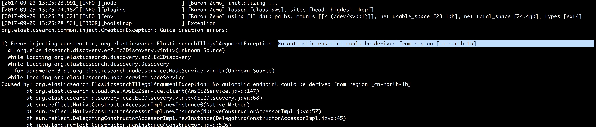


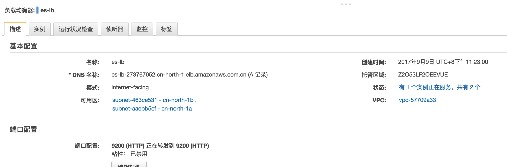

重启一遍服务即可
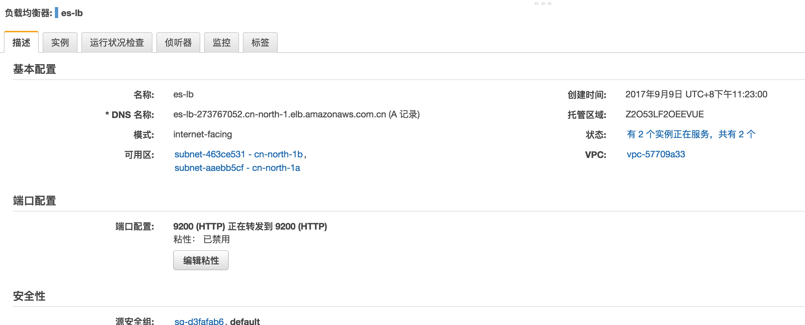


```yml
cluster.name: awstutorialseries
cloud.aws.access_key: AK********7I3A
cloud.aws.secret_key: B+W*******hYC9Vrbt1RS3eg5D
cloud.aws.region: cn-north-1
discovery.type: ec2
discovery.ec2.tag.Name: "AWS Tutorial Series - Elasticsearch"
http.cors.enabled: true
http.cors.allow-origin: "*"
```


elk大功告成

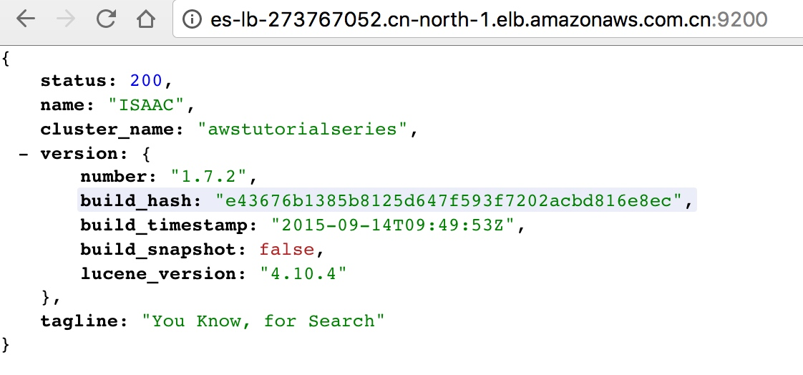

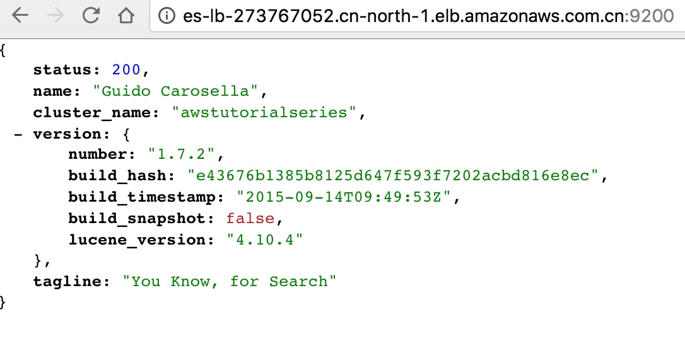

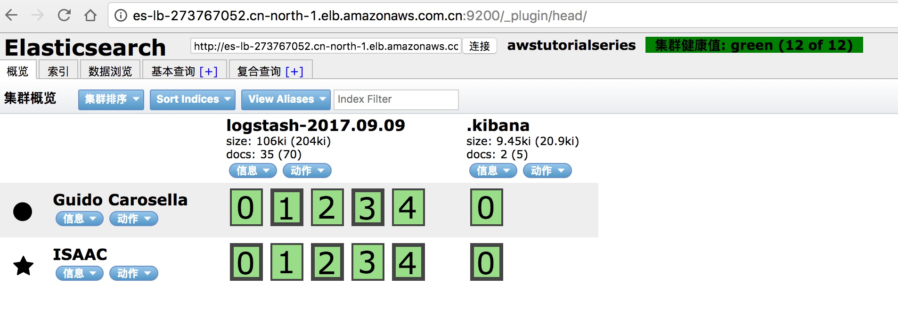

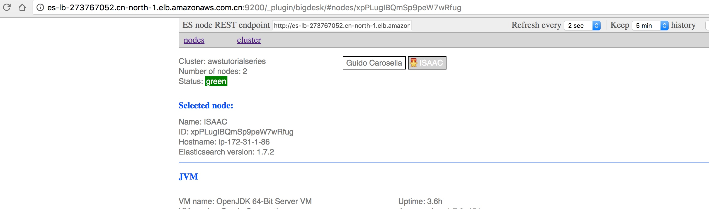


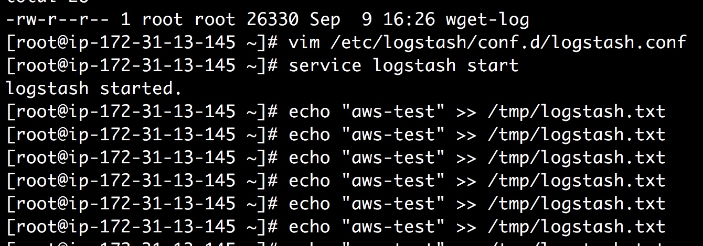


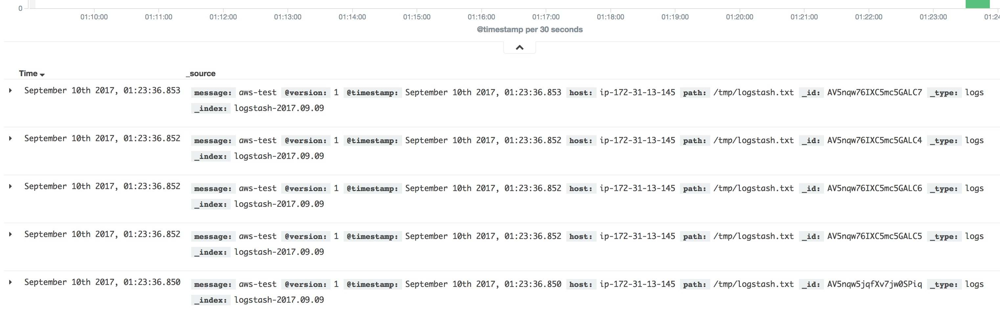

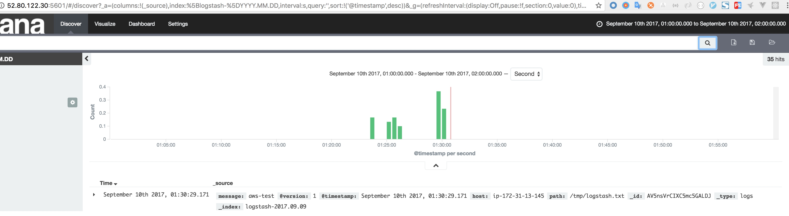


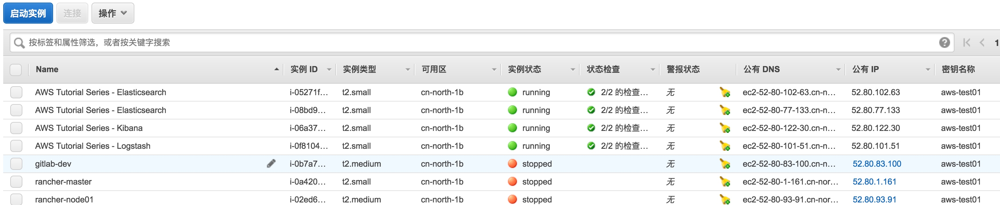


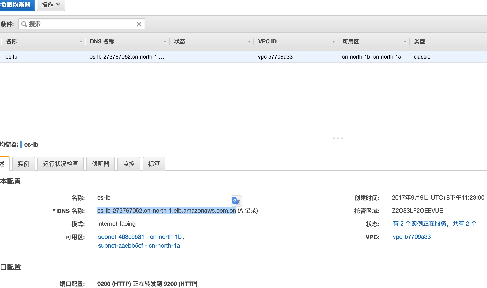


# 资料
[aws elk](https://www.youtube.com/watch?v=ge8uHdmtb1M&list=PL5zjQdAWZiUyxxHI72D_O5i77jlJrxKZr)

[aws elk](https://github.com/andrewpuch/elasticsearch-logstash-kibana-tutorial)

```
Amazon Linux AMI 2015.09

Elasticsearch 1.7.2

Commands

sudo su

yum update -y

cd /root

wget https://download.elastic.co/elasticsearch/elasticsearch/elasticsearch-1.7.2.noarch.rpm

yum install elasticsearch-1.7.2.noarch.rpm -y

rm -f elasticsearch-1.7.2.noarch.rpm

cd /usr/share/elasticsearch/

./bin/plugin -install mobz/elasticsearch-head

./bin/plugin -install lukas-vlcek/bigdesk

./bin/plugin install elasticsearch/elasticsearch-cloud-aws/2.7.1

./bin/plugin --install lmenezes/elasticsearch-kopf/1.5.7

cd /etc/elasticsearch

nano elasticsearch.yml

Config

cluster.name: awstutorialseries

cloud.aws.access_key: ACCESS_KEY_HERE

cloud.aws.secret_key: SECRET_KEY_HERE

cloud.aws.region: us-east-1

discovery.type: ec2

discovery.ec2.tag.Name: "AWS Tutorial Series - Elasticsearch"

http.cors.enabled: true

http.cors.allow-origin: "*"

Commands

service elasticsearch start

Logstash 1.5.4-1

Commands

sudo su

yum update -y

cd /root

wget https://download.elastic.co/logstash/logstash/packages/centos/logstash-1.5.4-1.noarch.rpm

yum install logstash-1.5.4-1.noarch.rpm -y

rm -f logstash-1.5.4-1.noarch.rpm

nano /etc/logstash/conf.d/logstash.conf

Config

input { file { path => "/tmp/logstash.txt" } } output { elasticsearch { host => "ELASTICSEARCH_URL_HERE" protocol => "http" } }

Commands

service logstash start

Kibana 4.1.2

Commands

sudo su

yum update -y

cd /root

wget https://download.elastic.co/kibana/kibana/kibana-4.1.2-linux-x64.tar.gz

tar xzf kibana-4.1.2-linux-x64.tar.gz

rm -f kibana-4.1.2-linux-x64.tar.gz

cd kibana-4.1.2-linux-x64

nano config/kibana.yml

Config

elasticsearch_url: "ELASTICSEARCH_URL_HERE"

Commands

nohup ./bin/kibana &

Navigate In Browser

http://KIBANA_URL:5601/
```

