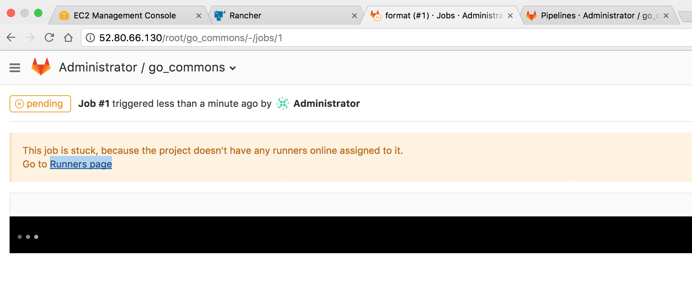
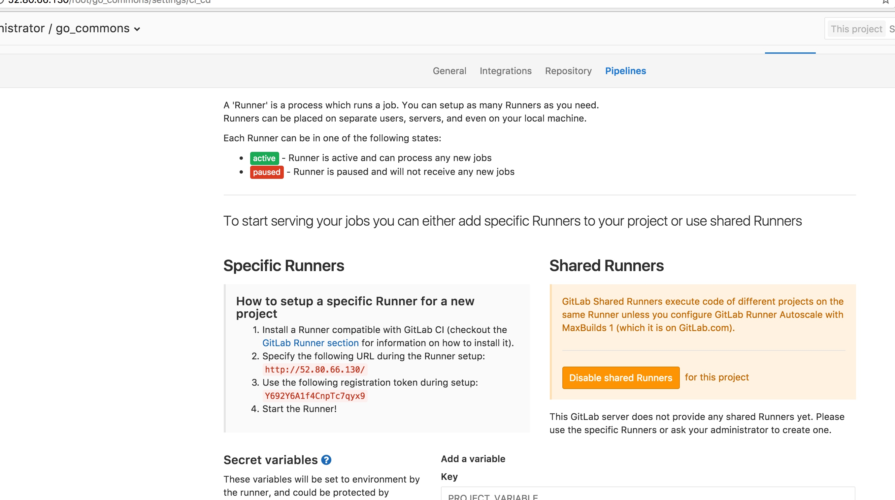
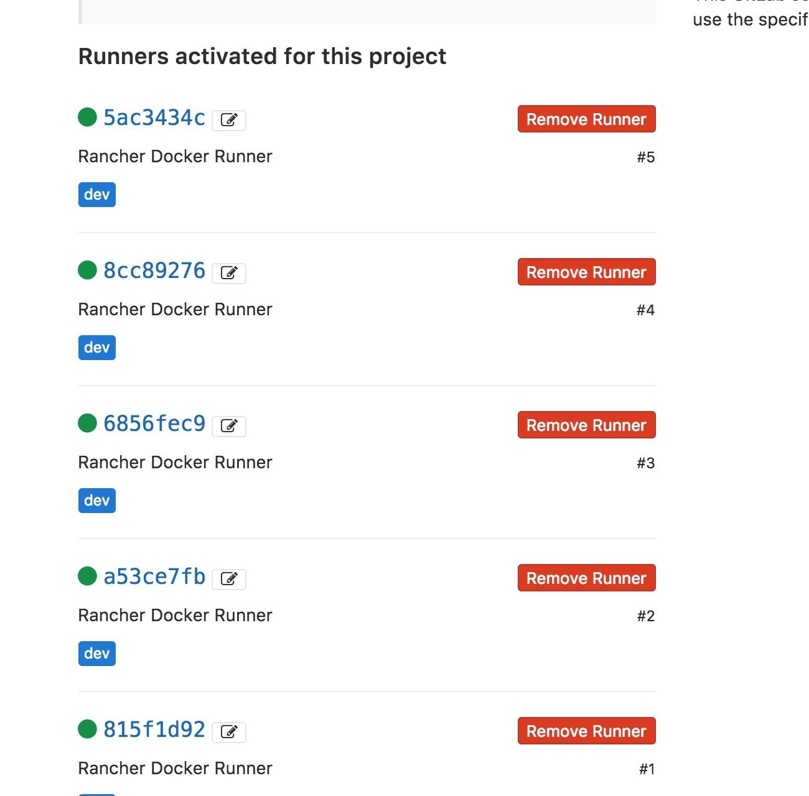
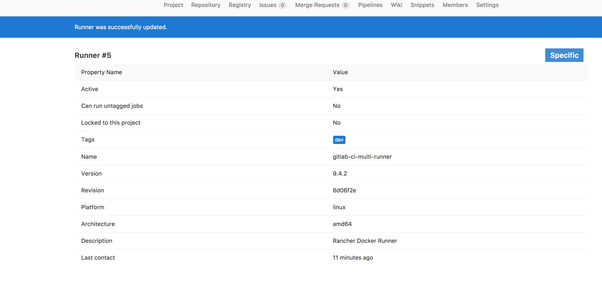
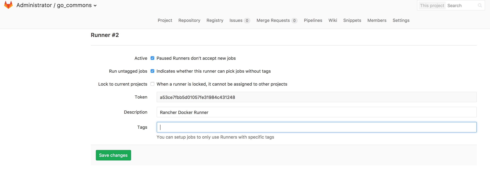
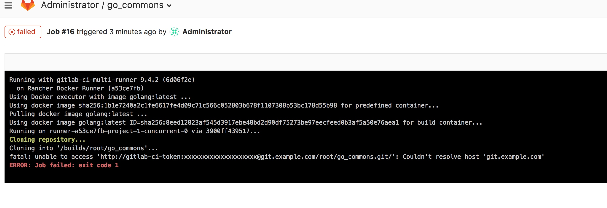
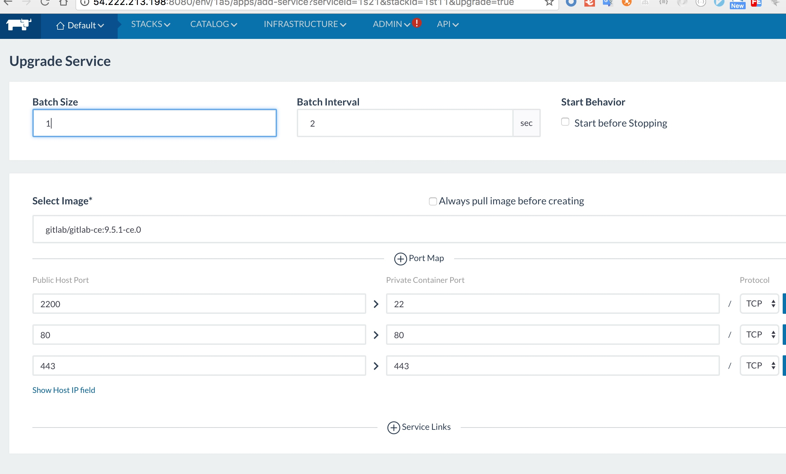

# aws docker rancher 

```sh
sudo apt-get update -y &&
curl -sSL http://acs-public-mirror.oss-cn-hangzhou.aliyuncs.com/docker-engine/internet | sh /dev/stdin 1.12.3 &&
sudo usermod -aG docker ubuntu &&
curl -sSL https://get.daocloud.io/daotools/set_mirror.sh | sh -s http://bbfa5e62.m.daocloud.io
```












重点：run untagged Jobs


ok啦  哈哈



[gitlab runner 遇到的几个坑](http://www.jianshu.com/p/d91387b9a79b)

[](https://forum.gitlab.com/t/activated-specific-runner-is-not-working/7002/2)

https://about.gitlab.com/features/gitlab-ci-cd/

https://about.gitlab.com/features/gitlab-ci-cd/

gitlab的hostname 一定要写上，否则runner的构建路径是错误的，如上图。


注意22->22 端口 将publish端口改为2200否则远程ec2的ssh 22端口会起冲突。 



使用rancher修改升级服务，修改服务配置真是so easy

