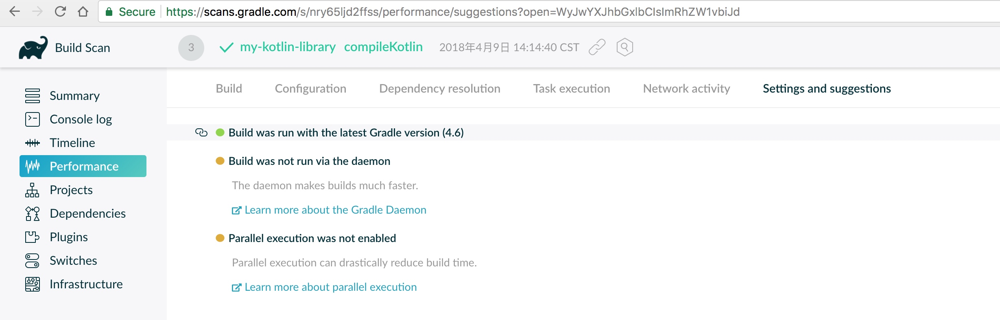
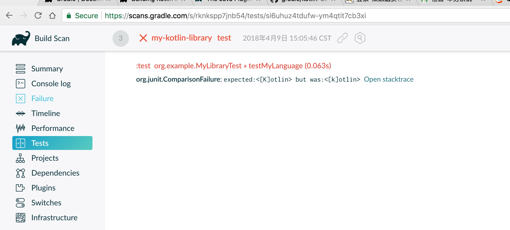

# gradle reference
gradle官网: https://gradle.org/
官方文档: https://gradle.org/docs/

# gradle kotlin reference
[Building Kotlin JVM Libraries](https://guides.gradle.org/building-kotlin-jvm-libraries/?_ga=2.157532090.1853779712.1523155301-882981205.1522649474) 
[Gradle Kotlin DSL](https://github.com/gradle/kotlin-dsl)    

# 手动安装配置gradle 推荐

```sh
$ sudo mkdir /opt/gradle
$ sudo unzip -d /opt/gradle gradle-4.6-bin.zip
$ ls /opt/gradle/gradle-4.6
LICENSE  NOTICE  bin  getting-started.html  init.d  lib  media
```

```sh
export PATH=$PATH:/opt/gradle/gradle-4.6/bin
source ~/.bashrc
```
如果通过环境变量设置无效的话，就设置软连接

```sh
ln -s gradle /opt/gradle/gradle-4.6/bin/gradle
```

测试

```sh
gradle -v
```


[build-scan](https://gradle.com/build-scans)




gradle test --info 如果测试不通过，可以看到详细的错误信息

通过build-scan `Tests`菜单也可以看到。


# 


```sh
plugins {
    base
    `build-scan`
    kotlin("jvm") version "1.2.31"
}

buildScan {
    setLicenseAgreementUrl("https://gradle.com/terms-of-service")
    setLicenseAgree("yes")

    publishAlways()
}

repositories {
    jcenter()
}

dependencies {
    //"org.jetbrains.kotlin:kotlin-gradle-plugin:$kotlin_version"
    implementation(kotlin("stdlib", "1.2.31"))
    testImplementation("junit:junit:4.12")
}
```

# test
http://www.baeldung.com/mockito-junit-5-extension
https://medium.com/@dSebastien/using-junit-5-with-spring-boot-2-kotlin-and-mockito-d5aea5b0c668 
https://www.youtube.com/watch?v=Zc1VZM855NI  moito master juint5


kotlin springboot
http://www.it610.com/article/4866003.htm

