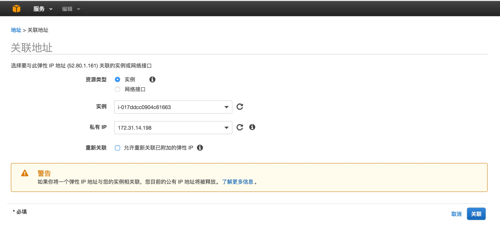
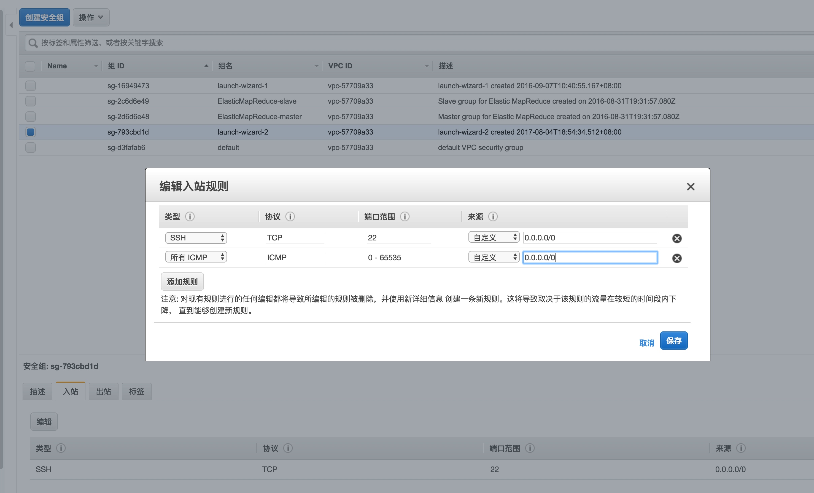
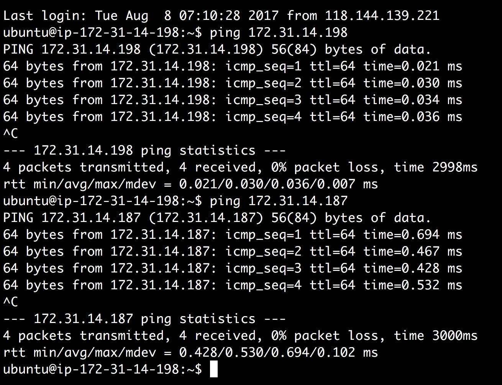

# 
## aws的ip
[AWS 的几个”坑”](https://www.nosa.me/2014/09/14/aws%E7%9A%84%E5%87%A0%E4%B8%AA%E5%9D%91/)
[aws官网vps](http://docs.aws.amazon.com/zh_cn/AmazonVPC/latest/UserGuide/vpc-ip-addressing.html)
[aws官网弹性地址](http://docs.aws.amazon.com/zh_cn/AmazonVPC/latest/UserGuide/vpc-eips.html)
[百度百科弹性ip地址](https://baike.baidu.com/item/%E5%BC%B9%E6%80%A7IP%E5%9C%B0%E5%9D%80)
>弹性IP地址是在 EC2 启动实例时，自动地为每个实例分配一个私有 IP 地址和一个公共IP地址。
中文名 弹性IP地址 地    方  EC2 启动实例 分    类 私有 公共 IP 地址 通    过  Internet
当然，可以使用公共 IP 地址通过 Internet 访问实例。但是，在每次启动实例时，这个地址都会变。如果使用某种动态 DNS 映射把 DNS 名称连接到 IP 地址，那么把变化传播到整个 Internet 花费的时间可能长达 24 小时。为了解决这个问题，EC2 引入了弹性 IP 地址的概念。弹性 IP 地址是与您的 EC2 账户相关联的静态 IP 地址，而不是与实例相关联；除非显式地把它释放回 EC2，它会一直与您的账户相关联。

## ec2集群间相互ping
[ec2 ping](http://yyyummy.blog.51cto.com/8842100/1612358)

打开之后才可以ping通

