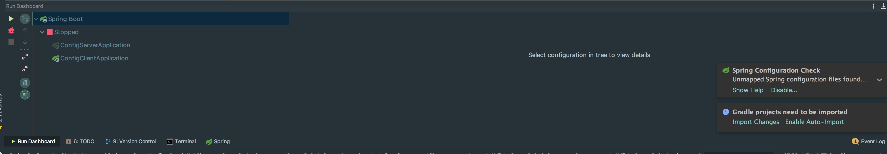

# golang IDE

[Implement interfaces in Goglang, the Go IDE](https://www.youtube.com/watch?v=dN1KOz_cDn0)

[JetBrains Go IDE Overview](https://www.youtube.com/watch?v=o3igXAE9eDo)

shift+h 复合vim的习惯 shift+l
但是定制后发现在常规输入状态下H和L都需要在切换caps lock键很不方便，有冲突，
所以改为alt+h alt+l

一直卡顿的原因

删掉.idea文件重新导入即可

查看之前的settings

2017.9.13号 2017.2版本 自动检测 很赞

和mac的冲突，目前这俩没使用过，先取出掉。

自定义调整选项的顺序

springboot application Run dashboard

cmd+shift+f12 最大化editor
cmd+f2 stop
cmd+1 project view
cmd+2 spring dashboard
cmd+3 自定义的 start app
alt+l/h 左右移动
esc
shift+esc 
alt+cmd+左右 比如属性版本切换
cmd+shift+n 比如查找pom文件
cmd+n 查找类
alt+cmd+b
cmd+f12

