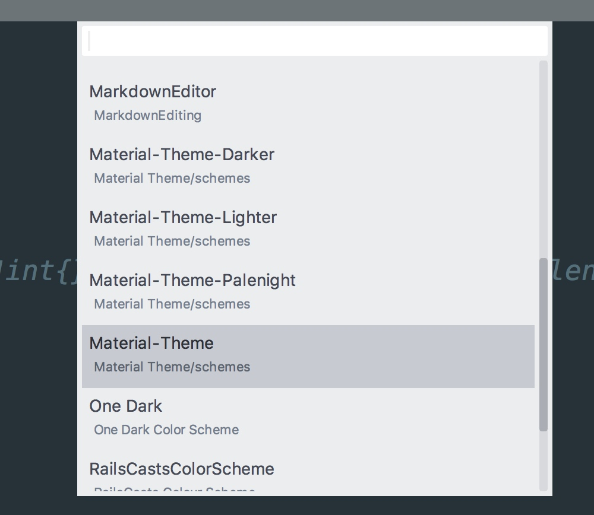
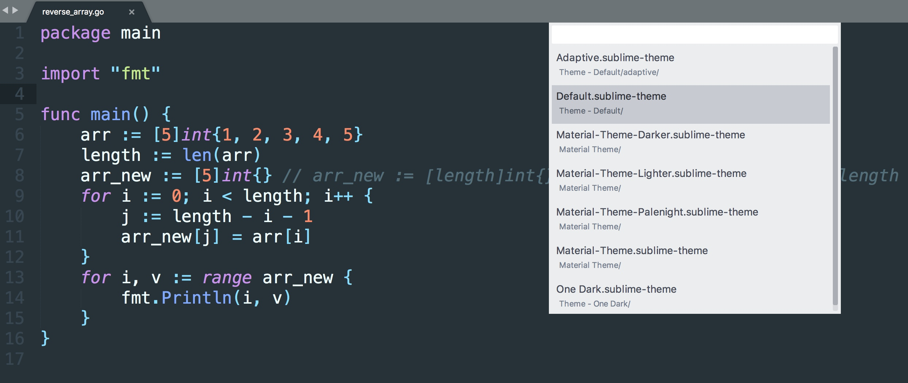

# 
color theme:

theme:  

command pannel shit+cmd+p
sidebar  cmd+k,cmd+b
cmd+ cmd-  font controll

key map-> key bindings 

cmd +[ / ] 左右缩进
cmd+l 选择当前行
cmd+enter 向下插入一行 向上插入一行
shift+cmd+enter向上插入一行
option + 鼠标拖动 块状操作 同时进入多点编辑模式

格式化 reindent lines

查看操作的命令名称 
`ctrl+反引号`打开工作台   
输入`sublime.log_commands(True)`
通过命令行中的自动打印，就可以看到命令名称，命令参数设置了。

几个插件
advanced new file -> alt+cmd+n 支持tab目录自动补齐
syncedsidebar 侧边栏同步。

跳转，跳回。
cmd+p > go to anything  技巧:1. 可以加目录名缩小搜索范围。 2.可以加代码行号，通过:n的方式 3.通过加@可以列出文件中的函数名称 4. 通过#符号查找字符串

查找
cmd+f 本文件中查找  上一处/下一处 enter/shift+enter
alt+cmd+f 查找替换 
cmd+shift+f 指定目录查找  或者 find in folder 方式。 多文件中使用F4或shift+F4上下切换。
cmd+d 选择同一单词

编辑完跳回上一文件  ctrl+-  如果是多个跳过了，则可以ctrl+shift+-
shift+cmd+a 选择<>text<>中的text

ctrl+space complete 搜狗拼音冲突，将搜狗拼音修改为ctrl+alt+space

sublime code intel

构建任务系统
xxx.sublime-build
保存 cmd+b 

