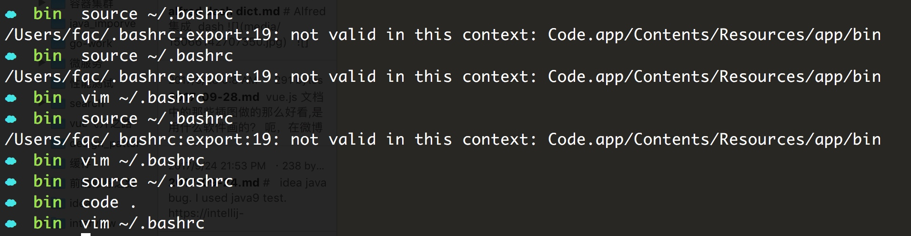

# code 的设置


某次重装后 cmd+shift+p install cmd不好使，所以手工指定下路径，注意mac 路径中的空格问题


```sh
export PATH="$PATH:/Applications/Visual Studio Code.app/Contents/Resources/app/bin"
```

   但是，最终确定是版本的问题，我下的inspbider版本，是预览抢先版本，果断下了稳定版本，一切ok.....

