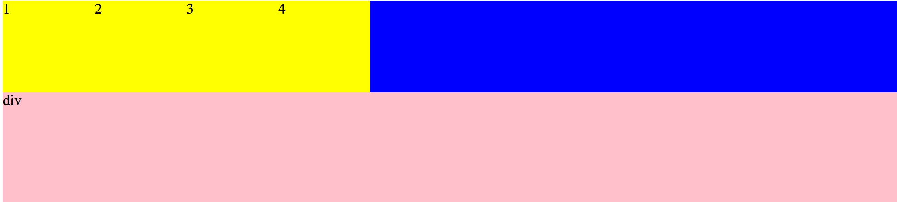

## 一. 写页面的几点注意
### 1.1 将页面的结构看成盒子
当一个盒子重复出现，且样式相同，我们将这些盒子统称为列表，每个盒子就是该列表中的项(一般用ul[使用较多]或ol)

实际应用中，我们只需要写出一个盒子，其他的进行复制就好
### 1.2 全局重置元素内置样式
每个元素都有自带的css属性(内置属性)，那么每个浏览器对这些属性的解析是不同的，为了保证每个浏览器解析一致，我们需要进行全局样式的重新定义，也就是给每个元素的初始值设置相同值。

### 1.3 盒子模型的属性书写顺序 
从外到内，从宽到高。

```css
body,ul,h2,p {
    marin:0;  
    padding:0;  
}
```

## 二. 网页的三种基本布局
### 2.1 自然布局(文档流)  
遵循元素的自带属性，比如从块级元素独占一行，从上到下，从左到右。

```html
<div style="width:100px;height:200px;background-color:red;"></div>
<span style="backgroud-color:yellow;">行内元素只能用内容撑开，宽高的设置是无效的</span>
<span style="backgroud-color:yellow;">行内元素只能用内容撑开，宽高的设置是无效的</span>
<span style="backgroud-color:yellow;">行内元素只能用内容撑开，宽高的设置是无效的</span>
<span style="backgroud-color:yellow;">行内元素只能用内容撑开，宽高的设置是无效的</span>
```
注意:**行内元素只能用内容撑开，宽高的设置是无效的。且行内元素是在一行内容显示，只要父级盒子宽度足够**

### 2.2 流动布局(一左一右、左中右式的布局)
可以让元素脱离自身的属性，改变其原有位置，进行网页排布。
可以查看第三章节浮动

### 2.3 层布局（不同平面的布局）
改变元素本身的层级关系，可以达到一个元素在另一个元素上的效果。
可以查看第三章节浮动

## 三. 浮动

从流动布局开始
### 3.1  为什么需要浮动
浮动是利用float属性，将元素改成**浮动元素**。
#### 3.1.1 实例
```html
<html>
	<head lang="zh">
		<meta http-equiv="Content-Type" content="text/html;charset=UTF-8">
		<style type="text/css">
			ul {
				background-color: red;
			}

			li {
				border: solid white 1px;
				width: 100px;
				height: 100px;
				background-color: yellow;
				/*display:inline-block;*/
				/*float:left/right/none/inherit;*/
			}
		</style>
	</head>

	<body>
		<ul>
			<li>1</li>
			<li>2</li>
			<li>3</li>
			<li>4</li>
		</ul>
	</body>
</html>
```
#### 3.1.2 注意事项

1. **块级元素在不给宽度的时候，宽度为父级元素内容的宽度。不给高度的时候，高度则为自身内容的高度** (综合上述示例来看，ul>li*4, ul的宽度为body的宽度，高度为内容4个li的高度。)
2. body在没有清除默认样式的情况下，会有默认的8px边距。
3. `display:inline-block`的缺陷

* 首先盒子间距问题，如果不设置`ul {font-size:0}`盒子间距会比实际大。
* 其次是盒子模型的基线对齐问题，行内元素和行内块级元素 默认的垂直对齐方式是基线对齐。并不是顶部，底部，中间对齐，是基线对齐。所谓基线对齐是指内容的基线。

总结:使用`display:inline-block`如果盒子元素有变化会影响表现，并且空格也会影响间距。

使用浮动可以解决上述问题。

### 3.2 浮动属性
#### 3.2.1 float:left
从左到右依次浮动在一行.
添加上该属性之后，显示情形确实是li都依次从左到右排开，浮动了上去。
**但是ul却不再显示了。** 通过查看模型，可以看到宽度依然未变，但是高度为0，也就是未识别到li的高度。通过之前的注意项:块级元素的高度是由内容的高度填充的，那么此时父级的高度为0，则说明子级别的元素则是脱离文档流的，是浮动的。
**如果将自然布局看成是文档流，那么浮动元素则脱离了这个层级，来到了该文档流之上的平面，所有的浮动元素在这个平面上继续进行排布**  

#### 3.2.2 float:right
从右到左依次浮动在一行.
与float:left一样，不过是方向相反。

#### 3.2.3 float:none
当添加行内样式时`<li style="float:none">4</li>`，该li将清除浮动样式，从浮动元素变为块级元素，li.4将展示原始块级元素属性，从上到下，从左到右占一行，而其他三个li则依然是浮动在其他平面上。ul此时的高度则是li.4的高度。

#### 3.2.4 float:inherit
继承父级元素的浮动属性

```html
<html>
	<head lang="zh">
		<meta http-equiv="Content-Type" content="text/html;charset=UTF-8">
		<style type="text/css">
			ul {
				background-color: red;
				float: left;
			}

			li {
				border: solid white 1px;
				width: 100px;
				height: 100px;
				background-color: yellow;
				float: inherit;
			}
		</style>
	</head>

	<body>
		<ul>
			<li>1</li>
			<li>2</li>
			<li>3</li>
			<li style="float:none;">4</li>
		</ul>
	</body>
</html>
```

大多数属性都有该值，但只有跟文字相关的内容才继承(并不常用) ie7版本以下的浏览器是不支持的。

**浮动元素的兄弟元素，如果是在文档流内，是无法识别浮动元素的，那么这个元素就会跑到浮动元素的后面进行文档流内的正常排布**
**文字、图片和小的表单元素会围绕着浮动元素进行排布**

#### 3.2.5 浮动元素宽高
浮动元素在不设置宽高的情况下，它的宽高是由本身内容决定的。
浮动元素的宽高大小随内容，注意是浮动元素，此时和是否为块级元素和行内元素是无关的。浮动元素不分块级元素和行内元素。

#### 3.2.6 浮动元素的特点
1. 脱离文档流 (文档流内的盒子不会去识别这些浮动的盒子)
2. 文字、图片、表单会围绕着浮动元素进行排布
3. 所有的元素设置浮动属性后，都可以在一行显示，都可以直接设置盒子模型的所有属性，不设置宽高的情况下，宽高是本身内容决定的。
4. 浮动元素来到的是同一个平面，所以浮动元素之间是可以互相识别的。

### 3.3 清除浮动
为了保证浮动元素和自然布局的元素排布正常(页面不混乱)，就**需要清除掉浮动元素对其他元素的影响**。  
#### 3.3.1 实例代码
如何使得ul包含主4个li，并且添加ul的兄弟元素div的时候，可以让其变为自然文档流，而不是div包含着li。
简单来说，要解决的问题是:让ul识别到li。

```html
<html>
	<head lang="zh">
		<meta http-equiv="Content-Type" content="text/html;charset=UTF-8">
		<style type="text/css">
			body ul {
				margin: 0;
				padding: 0;
			}

			ul {
				list-style: none;
				background-color: blue;
				border: dashed white 1px;
			}

			li {
				background-color: yellow;
				width: 100px;
				height: 100px;
				border: solid red 1px;
				float: left;
			}
			div{
				height:500px;
				background-color: pink;
			}
		</style>
	</head>

	<body>
		<ul>
			<li>1</li>
			<li>2</li>
			<li>3</li>
			<li>4</li>
			<p id="clear01"></p>
		</ul>
		<div>div</div>
	</body>
</html>

```

#### 3.3.2 清除浮动
1、 给ul内增加一个**文档流内的元素**，并且这个元素在所有浮动元素的后面，并且带有clear属性。    
clear:both 清除浮动影响，与该元素无关，清除前面的浮动元素对其父级元素的影响。
float:none 去除浮动属性

注意增加的是文档流内的元素，如果是浮动元素，给其增加上clear属性，则是清除的是其前面的浮动元素对其自身的影响。该浮动还是浮动。

```css
#clear01 {
    clear: both;
}
```

2、给ul元素增加`overflow:hidden`属性.(溢出浮动，本意并非清除浮动，该属性恰巧可以达到该效果， css3之后弃用该清除方式，一定不用，宁可用第三种方式告诉写死...why? 会将边缘的样式隐藏）
3、 给ul高度，无论ul内容有无，ul有高度了。(由于浮动元素在另一个平面，所以ul元素的高度为0，div也进而可以占有ul的位置开始排布)
`ul {height:102px}`


#### 3.3.3 伪元素清除
我们推荐使用clear属性进行清除浮动，但是我们在ul中添加其他元素是不符合规范的，那么该如何解决呢？

1、 添加li的样式方式，可以实现，缺点是代码太长
`<li style="clear:both;float:none;width:0;height:0;border:0"></li>`

2、添加伪元素方式
通过css向某个元素内添加一个不存在的元素。

```html
<!doctype html>
<html lang="en">
	<head>
		<style type="text/css">
			div {
				background-color: red;
				width: 300px;
				height: 300px;
			}

			div:after{
				display: block;
				background-color: yellow;
				width: 100px;
				height: 100px;
				content: "";
			}
		</style>
	</head>
	<body>
		<div></div>
	</body>
</html>
```

3、 使用伪元素清除浮动(最常用的方式)

```html
<html>
	<head lang="zh">
		<meta http-equiv="Content-Type" content="text/html;charset=UTF-8">
		<style type="text/css">
			body ul {
				margin: 0;
				padding: 0;
			}

			ul {
				list-style: none;
				background-color: blue;
			}

			ul:after{
				display: block;
				content: '';
				clear:both;
			}
			li {
				background-color: yellow;
				width: 100px;
				height: 100px;
				float: left;
			}
			div{
				height:500px;
				background-color: pink;
			}
		</style>
	</head>

	<body>
		<ul>
			<li>1</li>
			<li>2</li>
			<li>3</li>
			<li>4</li>
			<p id="clear01"></p>
		</ul>
		<div>div</div>
	</body>
</html>
```



