# 0、 介绍
## swarm 介绍
docker官方原生提供的docker集群解决方案。最新版本在docker中已经内置了该模块，叫swarm mode。 
还有其他的项目swarm kit以及老版本的swarm需要区别下。

swarm node将swarm kit集成到了docker里面，成为docker的一部分。通过docker使用swarm kit提供的集群功能的一种方式。

1. docker的集群方案
2. Swarmkit的使用体验
3. Swarm node的集群和节点管理
4. Swarm的网络管理
5. Docker的Volume存储管理
6. 使用Service来管理集群中的服务
7. 使用功能Stack来编排集群中的服务组
 (服务编排中还有task概念，它和容器一一对应的，这里就不再单独拿出来讲)
 
## Swarm的发展历史
2013 Docker engine (docker daemon)
2015 Docker Toolbox (docker machine,swarm, compose)
2016 Swarm mode (Swarmkit/Swarm mode/Distributed Application Bundles)
1.12之后 docker中集成了swarmkit，内置的集群功能。同时推出了新的标准Distributed Application Bundles

所以老版本的swarm基本是略过去了，只看swarm mode 和swarmkit

## Swarm/Swarm mode/Swarmkit的关系
代码级别已经耦合到了docker
/swarmkit(可以先从swarm kit讲起)
重点放到docker内置的 swarm mode (swarm mode是使用swarm kit的)


# 一、 Swarm基础

## swarmkit
是docker的单独子项目，主要完成基于docker的任务编排的系统。
github docker/swarmkit

### 编译swarmkit

```
git clone https://github.com/docker/swarmkit.git

cd swarmkit/

ls

docker run --rm -it -v `pwd`:/go/src/github.com/docker/swarmkit -w /go/src/github.com/docker/swarmkit/ golang:1.7 make binaries
```
将当前目录挂载到一个容器中，进入目录，容器为golang1.7的容器，执行构建。

需要提前配置好golang


```sh
wget https://storage.googleapis.com/golang/go1.8.5.linux-amd64.tar.gz

tar -C /usr/local -xzf go1.8.5.linux-amd64.tar.gz

export PATH=$PATH:/usr/local/go/bin
```

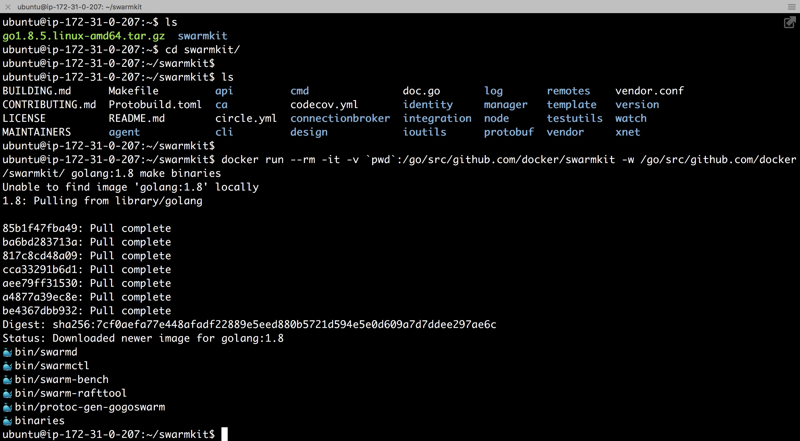


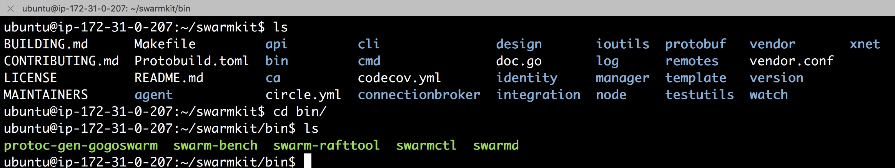

拷贝`swarmctl 和swarmd` 两个主要命令到`/usr/local/bin/`目录下


```sh
ubuntu@ip-172-31-0-207:~$ swarmd --version
swarmd github.com/docker/swarmkit v1.12.0-1745-ga254273
```


### swarmkit的主节点和从节点

swarmkit节点情况

两个主要命令 `swarmd, swarmctl`
swarmctrl客户端
swarmd 集群服务的管理端
每个节点的角色 `swarmd manager` 和 `swarmd worker`
都会执行实际的任务，区别在于客户端发送任务的时候都是发给的manager节点。 即manager节点接收命令，然后由manager节点同步给集群其他worker节点。 任务会在任意一个被分配任务的节点去执行。  

### 创建集群

创建swarm集群之前，需要先创建一个swarmd manager节点

```sh
swarmd -d --state-dir /tmp/node-mgmt-01 --listen-control-api /tmp/mgmt-01.sock --hostname mgmt-01 >/tmp/mgmt-01.log 2>&1 &
```
此时得到swarmkit单节点的一个集群。
使用swarmctl命令前需要给其指定一个连接swarm manager地址

```
export SWARM_SOCKET=/tmp/mgmt-01.sock
swarmctl ls
swarmctl node ls  # 能够看到集群节点的状态
```

添加一个新的节点
1. 首先需要manager节点的ip地址
`ip addr show eth0` 查看机器的网卡 
2. 同时需要让swarm节点能够加入集群的token
3. token可以通过swarmctl cluster inspect default 查看到`Join Tokens`,Worker节点或者Manager节点
4. 到另外一个节点(已经与装好了swarmkit的环境),使用`swarmd --join-addr $ip --join-token $token --swarm-node-work-01 >/tmp/work-01.log 2>&1 &` 加入到一个swarm集群
5. 再次查看集群状态 swarmctl node ls。 发现没有启动起来，需要排查日志
6. cat /tmp/work-01.log 可以查看运行日志 
7.ping 网络ok ，发现端口不通， 需要在创建的时候指定端口参数 

```sh
swarmd --join-addr $ip:4242 --join-token ...  log ..&
```
执行后， cat /top/work-01.log 基本就会node is ready
没有写任何的状态，表明其实worker节点

8. 启动一个nginx服务 1.11.1-alpine

```sh
swarmctl service create --name nginx --image nginx:1.11.1-alpine
```
默认启动包含一个容器服务
查看容器的服务实例 `swarmctl service ls `
如果replicas 为0/1 的状态，一般表明是在下载镜像
可以看到日志
`swarmctl service logs nginx ` 如果没有启动来，其实是看不了的
可以通过`swarmctl service inspect nginx`来查看service状态

9. 对服务的操作
现在是1个容器，如果想要将该服务进行快速的拓展，我们可以使用

```sh
swarmctl service update nginx --replicas 6
swarmctl service ls
swarmctl service inspect nginx  # 可以看到两台节点个分配了3个service实例
单独登录到服务器上 docker ps 我们也可以看到每个docker里有3个实例
```
10. 服务升级
swarmctl service update .. 可以修改容器，那么我们可以指定其他参数，
比如images，想要升级服务，其实只需要指定相应的镜像即可。

```sh
swarmctl service update nginx --image nginx:1.11.5-alpine --update-parallelism 2 --update-delay 4s

watch -n1 "swarmctl service inspect nginx" # 不断的查看集群节点的状态
```
切换过程是逐步逐步切换的过程，就是对外服务不中断的情况下，完成对服务的升级。

最后 swarm的很多命令来自于swarmkit 命令很多都是一一对应的。

秒级扩容

动态滚动升级
swarmkit rolling update 
由于swarm mode是重点，并且swarm mode的命令基本和swarmkit的命令是一一对应的，所以swarmkit就只是做些了解

## docker网络
docker对网络的管理
### docker network

#### 命令`docker network`
docker1.9之后 增加了`docker network`命令，该命令可以用来管理docker容器集群中的容器网络。在最早的docker版本中，容器只是单纯的运行应用的容器平台，它是不会管理存储，网络这些额外的内容，后来docker慢慢从运行时隔离工具，变为任务编排或者更加倾向于任务部署的工具以后，对于**网络管理的需求**以及**跨界点网络通讯**的需求慢慢称为docker所需要处理的一部分。


#### 网络实例类型Driver bridge host null
执行`docker network ls`，可以看到docker默认的内置了预定义好了三个网络实例，分别属于不同的类型。

```sh
ubuntu@ip-172-31-0-207:~$ docker network ls
NETWORK ID          NAME                DRIVER              SCOPE
64d6dc5cfaab        bridge              bridge              local
68b2d6d7905d        host                host                local
ac44e690bfb8        none                null                local
```
driver 为null，没有挂网卡，即容器不能与其他容器节点通信
host 该容器可以与主机共享一个网络空间，并不做网络隔离。
bridge 传统的docker网络，所有在一个bridge网络下的容器节点，可以相互之间通信，并且与主机的网络是隔离开的。

#### 自定义网络 docker network create

##### 创建
另外:
我们在创建容器集群的时候，可以选择容器网络类型之外，也可以单独定义用户自己的网络。

```sh
docker network create b1 --driver bridge 
```

验证`ifconfig`   

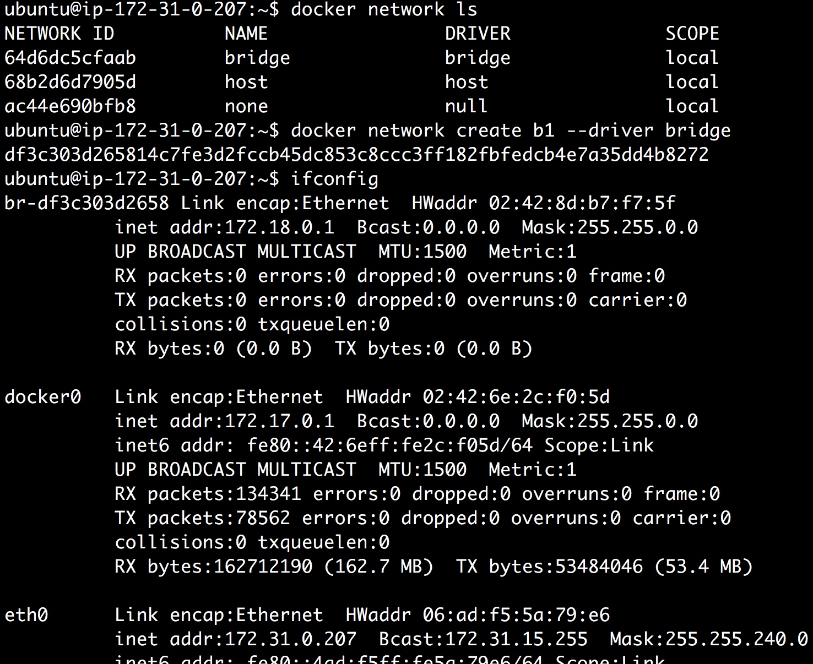
我们看到多出了一个网卡 b1-df3c.....

##### 新网络的作用是什么呢?


```sh
docker network create b2 --driver bridge
```
也就是当我们启动容器的时候，可以指定某一个容器在某一个网络中运行。当我们没有指定网络的时候，默认都是在name 为`bridge`的网络。

###### 案例: 网络隔离

三个容器，两个网络a1,a3在b1网络，a2在b2网络中

```sh
docker run --network b1 --name a1 -dt alpine sh
docker run --network b2 --name a2 -dt alpine sh
docker run --network b1 --name a3 -dt alpine sh
```

a1---> ping ---->a2，找不到该容器
a1---> ping ---->a3， ok，a1中包含了a3的域名记录。这说明对于bridge或者overlay类型的网络，网络里面会将属于当前网络的所有容器的名称会自动将它所属的ip进行域名映射。


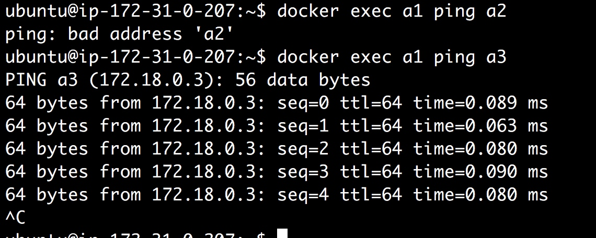

如果不使用名称作为域名，而是使用ip地址，看能否联通呢？通过操作实践看，也是ok的。

```sh
~$ docker inspect -f {{.NetworkSettings.Networks.b1.IPAddress}} a1
172.18.0.2
~$ docker inspect -f {{.NetworkSettings.Networks.b1.IPAddress}} a2
<no value> ## 注意这里的层级不对,应该是b2，所以是no value
~$ docker inspect -f {{.NetworkSettings.Networks.b2.IPAddress}} a2
172.19.0.2
~$ docker inspect -f {{.NetworkSettings.Networks.b1.IPAddress}} a3
172.18.0.3

~$ docker exec a1 ping 172.19.0.2
PING 172.19.0.2 (172.19.0.2): 56 data bytes ## ping 失败

~$ docker exec a1 ping 172.18.0.2
PING 172.18.0.2 (172.18.0.2): 56 data bytes
64 bytes from 172.18.0.2: seq=0 ttl=64 time=0.091 ms
64 bytes from 172.18.0.2: seq=1 ttl=64 time=0.066 ms

~$ docker exec a1 ping 172.18.0.3
PING 172.18.0.3 (172.18.0.3): 56 data bytes
64 bytes from 172.18.0.3: seq=0 ttl=64 time=0.104 ms
64 bytes from 172.18.0.3: seq=1 ttl=64 time=0.085 ms

```


发现这里有意思的是a2能够ping通b1网关,同时a1，a3也能ping通b2网关  

```sh
~$ docker inspect -f {{.NetworkSettings.Networks.b1.Gateway}} a3
172.18.0.1

~$ docker inspect -f {{.NetworkSettings.Networks.b2.Gateway}} a2
172.19.0.1

~$ docker exec a2 ping 172.19.0.1
PING 172.19.0.1 (172.19.0.1): 56 data bytes
64 bytes from 172.19.0.1: seq=0 ttl=64 time=0.056 ms
64 bytes from 172.19.0.1: seq=1 ttl=64 time=0.071 ms

~$ docker exec a2 ping 172.18.0.1
PING 172.18.0.1 (172.18.0.1): 56 data bytes
64 bytes from 172.18.0.1: seq=0 ttl=64 time=0.075 ms
64 bytes from 172.18.0.1: seq=1 ttl=64 time=0.076 ms
64 bytes from 172.18.0.1: seq=2 ttl=64 time=0.086 ms
64 bytes from 172.18.0.1: seq=3 ttl=64 time=0.101 ms

~$ docker exec a1 ping 172.19.0.1
PING 172.19.0.1 (172.19.0.1): 56 data bytes
64 bytes from 172.19.0.1: seq=0 ttl=64 time=0.074 ms
64 bytes from 172.19.0.1: seq=1 ttl=64 time=0.094 ms

~$ docker exec a3 ping 172.19.0.1
PING 172.19.0.1 (172.19.0.1): 56 data bytes
64 bytes from 172.19.0.1: seq=0 ttl=64 time=0.050 ms
64 bytes from 172.19.0.1: seq=1 ttl=64 time=0.046 ms
64 bytes from 172.19.0.1: seq=2 ttl=64 time=0.038 ms
```

docker进行网络管理以后，网络就形成了一个独立的访问隔离单元。在同一个网络中的容器是可以相互连通的，不同的网络之间的容器不能连通，实际上是属于不同的网络namespace，不同网段，相互之间不能连通。

过去的docker，不管是网桥还是host，容器之间是不能够跨节点通信的，如果是不同的两个节点里面分别启动不同的容器，即便加入到了同一个网络里面，实际上也是不同的网络，他们之间是不能通过通过ip地址连接的。 docker1.9之后，增加了overlay网络类型，最新版本还增加了mac vlan? 类型，这些网络类型都是可以跨界点通信的。 

#### overlay网络 跨节点网络通信
overlay网络需要存储网络信息的单元，这部分功能是和swarm做到一起的。因此需要先创建swarm集群。

```sh
~$ docker swarm init
Swarm initialized: current node (7mbhp5eyxzslx268yzme7818j) is now a manager.

To add a worker to this swarm, run the following command:

    docker swarm join \
    --token SWMTKN-1-37dxwbiqslw43pctz2ymr5tl7yeikm9dq13ccx3g62y4ywqu0e-016mwr0qrkdcsg1iz5wmbr0km \
    172.31.0.207:2377

To add a manager to this swarm, run 'docker swarm join-token manager' and follow the instructions.
```

三个节点加入到swarm集群。

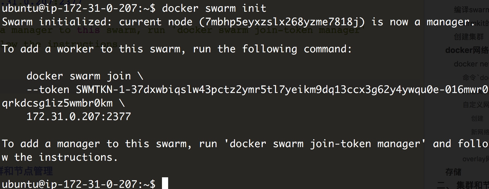
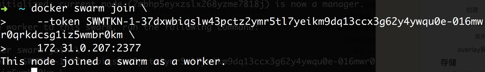

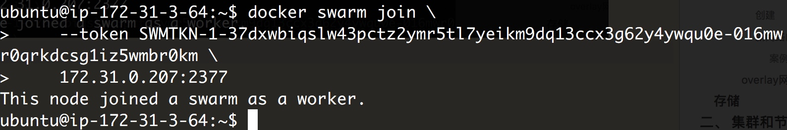

我们看到创建完成swarm集群后，多出了两个网络
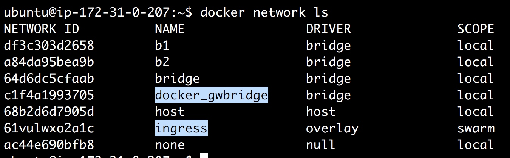
接下来我们创建新的网络层

```
docker network create demo-swarm-01 --driver overlay
```

查看集群节点`docker node ls `

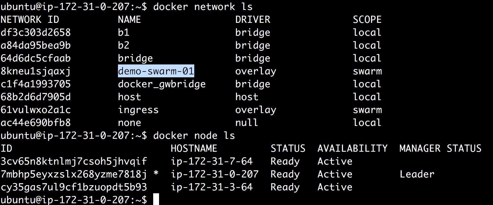
特别注意: scope
docker scope里是swarm

## 存储

# 二、 集群和节点管理

# 三、 服务和编排

# 四、 集成Web UI界面

# 五、 在项目交付中使用 Swarm(pipline)


------------

# swarm 最佳实践
3台机器跑5个容器，正常情况下如果用单台机器就可以跑5个，剩下的机器是闲置的。
设想一下，我们想把这5个容器均匀的分布在3台机器上，这时候我们做什么，根据什么将容器跑在那台机器上，都是面临的问题。swarm就是解决这个问题的。


```sh
docker-machine create -d virtualbox manager

docker-machine create -d virtualbox agent1
```

**集群操作方便**
如何在多台机器上创建服务，通过管理节点来在不同的agent节点启动多个服务，而不是需要我们登录A机器，B机器手工的启动服务
服务还可以**弹性扩容**
协议是http的无状态的，一个服务->5个 负载能力变强。
一个manager，2个agent 通过manager启动，看它是否会自动的均匀部署在2个agent上。

服务的管理 创建删除更新都有 

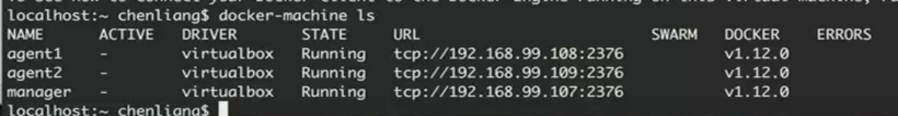


--------------------------------------------
## swarm集群的创建
```sh
docker swarm init --advertise-addr 172.31.10.232
```


```sh
[centos@ip-172-31-10-232 ~]$ sudo docker swarm init --advertise-addr 172.31.10.232
Swarm initialized: current node (cjf4zoly60k2t8by341lub80c) is now a manager.

To add a worker to this swarm, run the following command:

    docker swarm join --token SWMTKN-1-4yjbelemovucuvd7qm3yeha3rfs3akou85q09bqihldifalql7-961r6px81shky9pu78ytu9q49 172.31.10.232:2377

To add a manager to this swarm, run 'docker swarm join-token manager' and follow the instructions.
```
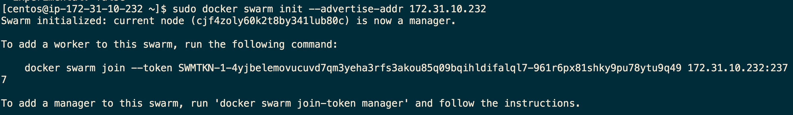

查看当前的集群状态，我们看到了已经

```sh
[centos@ip-172-31-10-232 ~]$ sudo docker node ls
ID                            HOSTNAME                                       STATUS              AVAILABILITY        MANAGER STATUS
cjf4zoly60k2t8by341lub80c *   ip-172-31-10-232.cn-north-1.compute.internal   Ready               Active              Leader
```


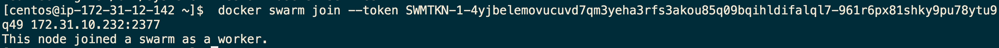

在worker节点上


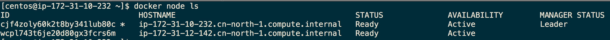

将其他机器加入到节点
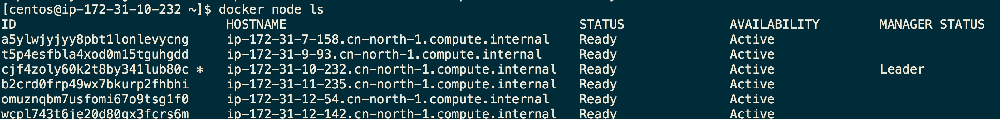

docker service ls


 如果忘记命令，可以备忘
 
```sh
docker swarm join-token manager
docker swarm join-token worker
```
##  集群的状态理解
### AVAILABILITY
显示**调度程序**是否可以**将任务分配给节点**：
* Active 意味着调度程序可以将任务分配给节点。
* Pause 意味着调度程序不会将新任务分配给节点，但现有任务仍在运行。
* Drain 意味着调度程序不会向节点分配新任务。调度程序关闭所有现有任务并在可用节点上调度它们。

### MANAGER STATUS
显示节点是属于manager或者worker
* 没有值 表示不参与群管理的工作节点。
* Leader 意味着该节点是使得群的所有群管理和编排决策的主要管理器节点。
* Reachable 意味着节点是管理者节点正在参与Raft共识。如果领导节点不可用，则该节点有资格被选为新领导者。
* Unavailable 意味着节点是不能与其他管理器通信的管理器。如果管理器节点不可用，您应该将新的管理器节点加入群集，或者将工作器节点升级为管理器。

### 查看节点信息
manager节点
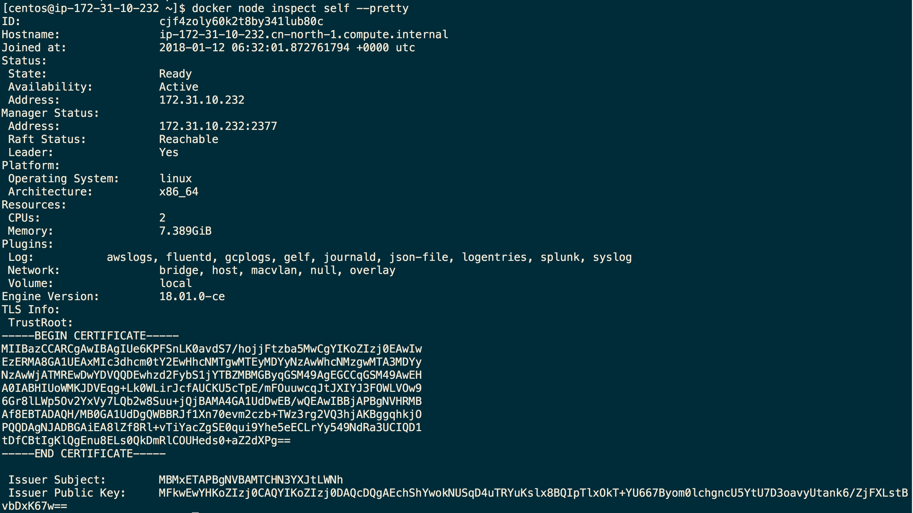

worker节点不能看
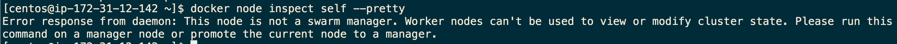

在manager节点上查看worker节点，观察发现到worker节点和manager节点不同的是没有manager status字段信息
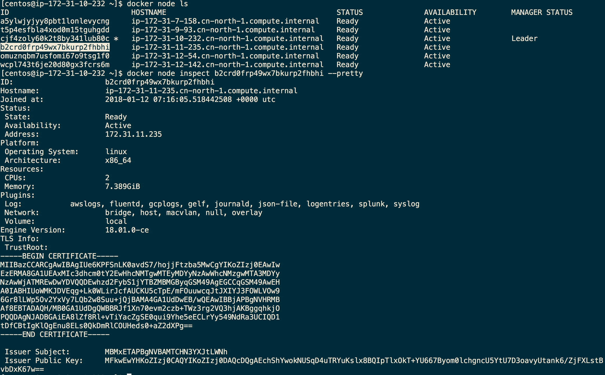

## 更新节点的可见性状态

```sh
docker node update --availability Drain b2crd （修改节点为不可用状态）
docker node update --availability Active b2crd (修改节点为可用状态)
```
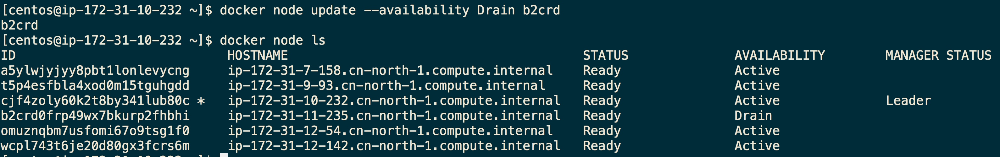

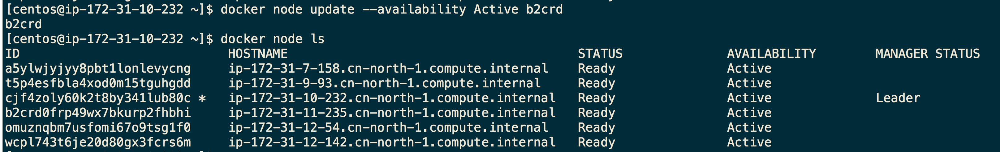

提高manager节点的可用性
如果想把manager节点，只做为调试的节点，不参于容器的运行，可以按照上面的方式 **把manager节点设置为Drain.这样所有的容器运行进，都不会在manager节点上创建或者运行容器，可以提高manager的高可用性**。

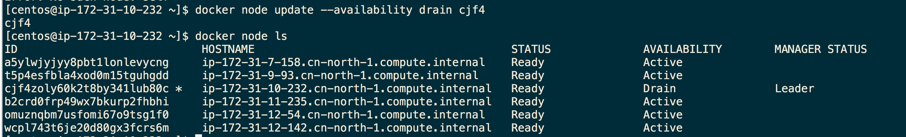


注意以下代码并非是 将swarm节点提升为manager，而是加入集群时就设定为manager
docker swarm join --token SWMTKN-1-4yjbelemovucuvd7qm3yeha3rfs3akou85q09bqihldifalql7-bokr2lma82i9hjpmjfoopaoti 172.31.10.232:2377


而是采用 docker node --help
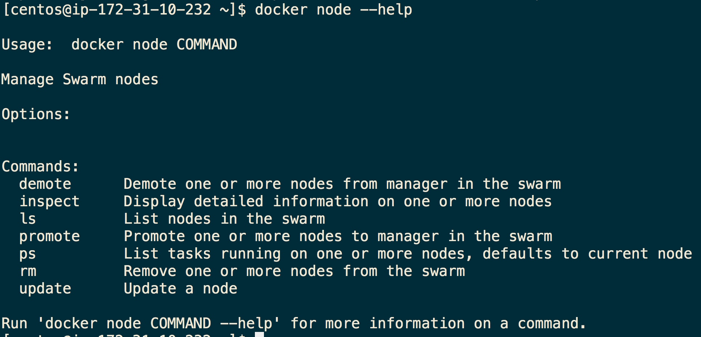

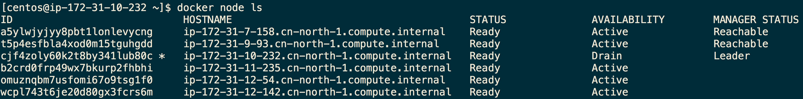

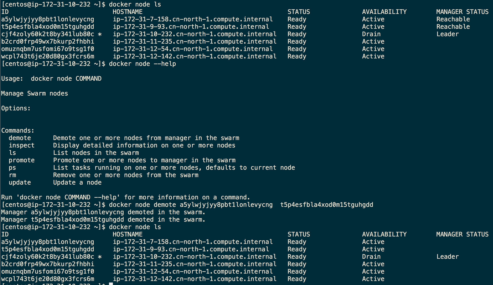

退出集群


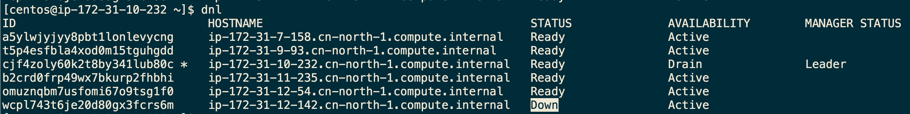
注意 `alias dnl='docker node ls'`

退出集群，其实也退出了集群

```sh
$ docker swarm leave
Node left the default swarm.
The node will still appear in the node list, and marked as down. It no longer affects swarm operation, but a long list of down nodes can clutter the node list. To remove an inactive node from the list, use the node rm command.
```

重新加入集群，还是和之前的执行是一样的。离开就是离开了

worker节点leave之后
```sh
 docker swarm join --token SWMTKN-1-4yjbelemovucuvd7qm3yeha3rfs3akou85q09bqihldifalql7-961r6px81shky9pu78ytu9q49 172.31.10.232:2377
```

经过验证后，发现确实又新起来了一个节点，id是不一样了。之前leave的节点down的状态还在
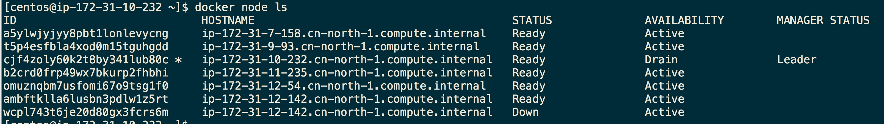


删除节点 `docker node rm $id`
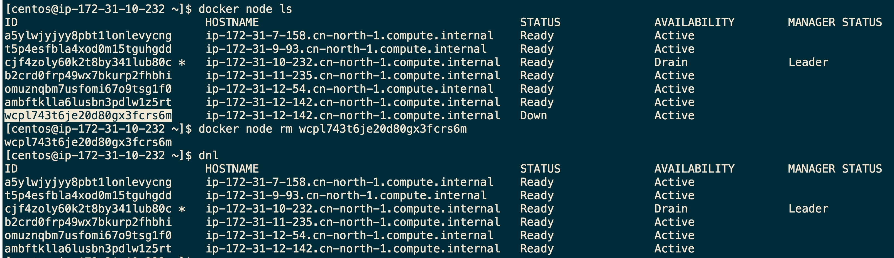


建议维护奇数节点的manager
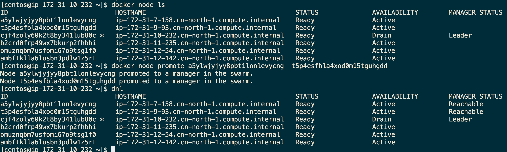


## docker api doc
https://docs.docker.com/engine/reference/commandline/swarm_leave/


# 基于springcloud开发的微服务在docker swarm集群中跨host主机通信的一种解决方案
[Cannot find a way to configure Eureka client with Docker swarm mode #1820](https://github.com/spring-cloud/spring-cloud-netflix/issues/1820)
[](http://blog.csdn.net/alaska_bibi/article/details/78414922?locationNum=4&fps=1)

[](http://fengyilin.iteye.com/blog/2401156)
http://fengyilin.iteye.com/blog/2400949
[docker swarm的坑的一些总结](http://chenzhijun.me/2018/01/08/docker-swarm-practice/)
[基于Spring cloud的微服务应用部署到docker中，通过ribbon/zuul不能访问？](https://segmentfault.com/q/1010000012502580)
[使用docker-compose编排spring-cloud微服务时顺序问题](https://segmentfault.com/q/1010000010694312)
[阿里云 专家Docker Swarm运行Spring Cloud应用（二）：Eureka高可用](https://yq.aliyun.com/articles/73493?spm=5176.100239.blogcont73491.12.4e1607aeVlihk6)
[springcloud-eureka集群-健康检测](http://blog.csdn.net/wgxaszc8/article/details/79064867)
http://www.docker.org.cn/thread/181.html  zuul的配置

[阿里云 docker springcloud](https://yq.aliyun.com/teams/11/type_blog-cid_62-page_1)

[Spring Cloud with Spring Config and Eureka in high availability using docker swarm](http://pscode.rs/spring-cloud-with-spring-config-and-eureka-in-high-availability-using-docker-swarm/
)
[](http://www.360doc.com/content/17/0925/19/2708086_690125085.shtml)

[SpringCloud和docker之微服务-apigateway(四)](http://www.troylc.cc/spring-cloud/2017/03/19/spirng-cloud-apigateway.html)

[Deploy Spring Cloud App into docker cluster using swarm](https://stackoverflow.com/questions/41822521/deploy-spring-cloud-app-into-docker-cluster-using-swarm)

[spring cloud auth](http://www.wisely.top/2017/06/14/spring-cloud-oauth2-zuul/)
[微服务API网关NGINX、ZUUL、Spring Cloud Gateway与](http://www.jdon.com/49248)

[ 大规模 WebSocket 集群项目 AnyIM 实战](http://www.spring4all.com/article/209)

[](https://bitsofinfo.wordpress.com/2017/05/19/microservices-spring-cloud-docker/)


 docker logs -f xxxxxxid
 
 
 
 
 
 
 
 
 
 
 
 
 

