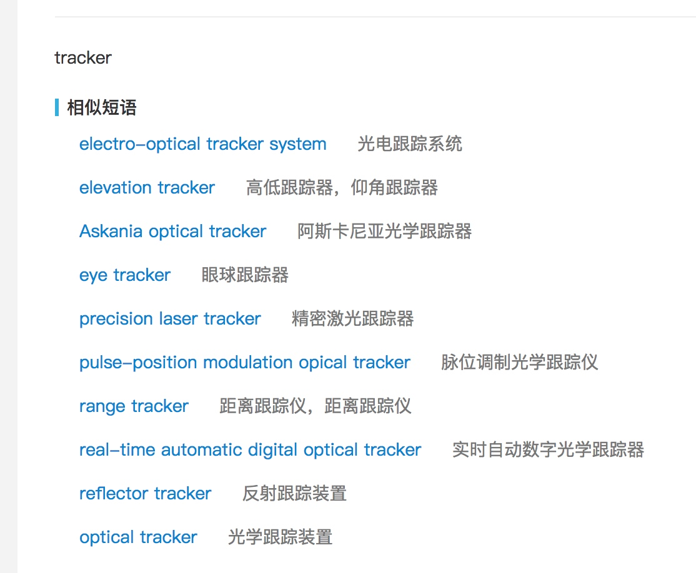

# HC-Gateway    Interceptor-Tracker(拦截追踪系统)

网关中间件的两大核心: 

- **代理**(拦截转发) -> 请求响应转发(基础功能) -nginx 高性能/高可用/高可靠
- **Plugin**
    - Log-Plugin -> **状态流转记录**(此网关的核心业务)
    - 限流
    - 权限
    - ...

任务列表:
技术选型: 要承载多语言平台 语言平台无关性java php
         http协议
         性能考虑  
技术架构: 
    前后端完全分离
    

基于nginx+lua写插件       

网关核心业务设计梳理              2天 19 20（18号凌晨车务上线通宵）
构建网关(实现请求响应网络转发)     4天  23 24 25 26
lua                           3天 26-27-2 

状态流转记录开发                 12天 3-4 7-11 14-18
21天

1 2 0

| 主状态 | 子状态 | 结果 |
| --- | --- | --- |
| 1  | 2  | 0 |

表结构设计  

- 状态字典表     流程ID(ProcessId)  主节点状态(ParentState) 子节点状态(SubState)  处理结果(Result) **为了性能考虑将其冗余** 

- 当前状态表     客户ID(CustomerId) 合同ID(ContractId) (流程ID)ProcessId 主节点状态(ParentState) 子节点状态(SubState)  处理结果(Result) (操作时间)OperateTime  StaffId (业务员/操作人)  **没有意义的一张表，因为时序表中直接取最大即可**

时序状态表  
    进件ID 进件编号  
    客户ID(CustomerId)
    合同ID(ContractId)  合同编号 
    流程ID(ProcessId)   
    主节点状态(ParentState) 
    子节点状态(SubState)  
    处理结果(Result 成功 失败 超时(冻结，业务自动作废等))    
    业务失败/拒绝原因(BussinessFailReason)
    操作时间(OperateTime)
    操作业务员 (OperatorId) 
    放款业务员(LoanOperatorId)

系统用户表     
系统日志表

前端设计

200w

一天的平均进件7000件算 按20个状态更新 14万次变更状态 评估20万的量更新数据

进件约60个状态
合同约20个状态

1 0400 0000

------------------
4月21号 13:00-16:00 数据库选型为 InfluxDB 时序数据库 
16:00-19:00 后端技术选型 webflux jpa

[webflux tutorial](https://www.logicbig.com/tutorials/spring-framework/spring-webflux.html)

系统对接 服务Ready，给出接口文档，以swagger的形式发布

接口规范
数据库构建
集成swagger
日志规范
异常
前端对接
集成jenkins

[Spring 5 WebFlux and JDBC: To Block or Not to Block](https://dzone.com/articles/spring-5-webflux-and-jdbc-to-block-or-not-to-block)

spring5 cookbook
https://www.packtpub.com/mapt/book/application_development/9781787128316/1/ch01lvl1sec8/installing-java-development-kit-1.8

由于influxdb目前还未被支持为reactive 所以，考虑直接使用mongo
而mongo部分的作为时间序列的数据 

http://www.mongoing.com/presentations/mongodb-iot

[Angular 4 + Spring WebFlux + Spring Data Reactive MongoDB example | Full-Reactive Angular 4 Http Client – Spring Boot RestApi Server](http://javasampleapproach.com/reactive-programming/angular-4-spring-webflux-spring-data-reactive-mongodb-example-full-reactive-angular-4-http-client-spring-boot-restapi-server)

[龙之春的博客](http://joshlong.com/)
[mongodb的性能测试2013](http://san-yun.iteye.com/blog/1777111)
[mongodb遍历万亿级数据，论索引的重要性](https://blog.csdn.net/carterslam/article/details/78789704)
[100亿MongoDB瓦片出图 性能测试报告](https://blog.csdn.net/supermapping/article/details/77199084)

[mongodb - 作为时间序列数据库的MongoDB](https://ask.helplib.com/mongodb/post_1090213)
[重新定义数据库历史的时刻——时间序列数据库Schwartz认为InfluxDB最有前途，Elasticsearch也不错](http://www.cnblogs.com/bonelee/p/6737098.html)
[时间序列数据处理的角逐：MongoDB vs. Cassandra](https://www.csdn.net/article/2013-08-23/2816679-time-series-data-mongdb-vs-cassandra)

[高性能网站实战](https://www.csdn.net/article/1970-01-01/2818488)

=============
spring data mongo webflux

https://bclozel.github.io/webflux-workshop/ webflux的很好的文档
https://thepracticaldeveloper.com/2017/11/04/full-reactive-stack-with-spring-webflux-and-angularjs/
http://javasampleapproach.com/reactive-programming/angular-4-spring-webflux-spring-data-reactive-mongodb-example-full-reactive-angular-4-http-client-spring-boot-restapi-server

这部分的内容需要
https://github.com/mohitsinha/spring-boot-webflux-reactive-mongo/blob/aebb48db9e88d78da6063a6e21bc5b7f4904b961/src/main/java/com/spring/example/models/Person.java

https://medium.com/@hantsy/reactive-programming-with-spring-5-3bfc5d324ba0

https://github.com/callicoder/spring-webflux-reactive-rest-api-demo

http://juliuskrah.com/blog/2017/05/18/crud-operations-on-mongodb-with-spring-data/

https://github.com/cyclic-reference/mongo-images

https://github.com/ciazhar/spring-webflux-mongo-security

https://stackoverflow.com/questions/37118047/how-to-show-query-while-using-query-annotations-with-mongorepository-with-spring

0
down vote
For ReactiveMongo add this property to your .properties file

http://www.jb51.net/article/133539.htm

