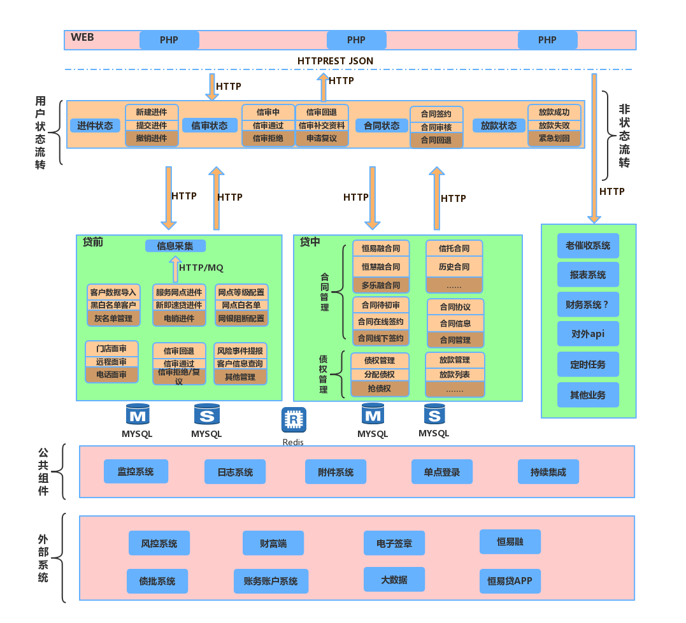
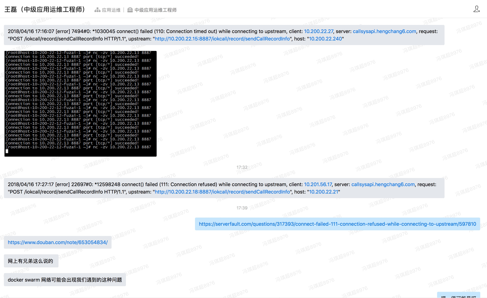
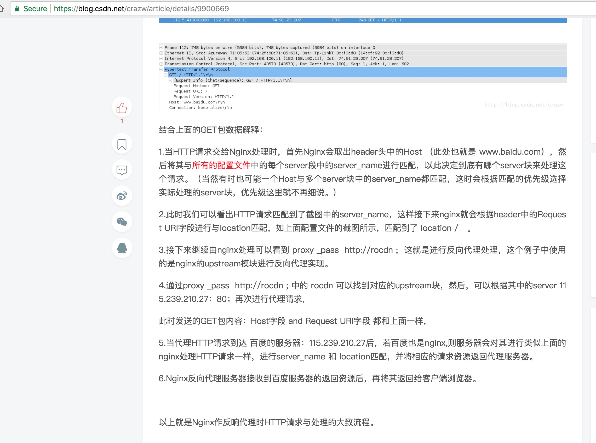
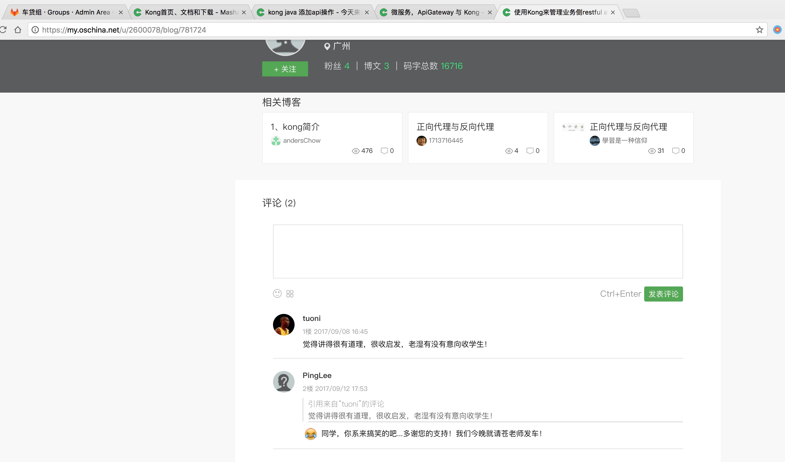
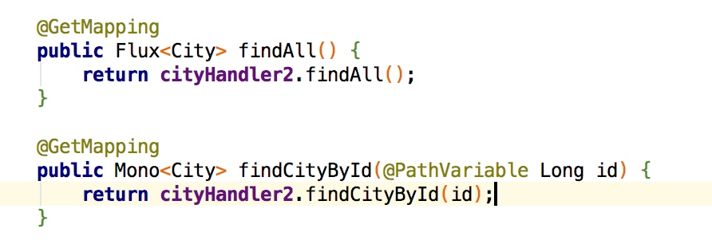
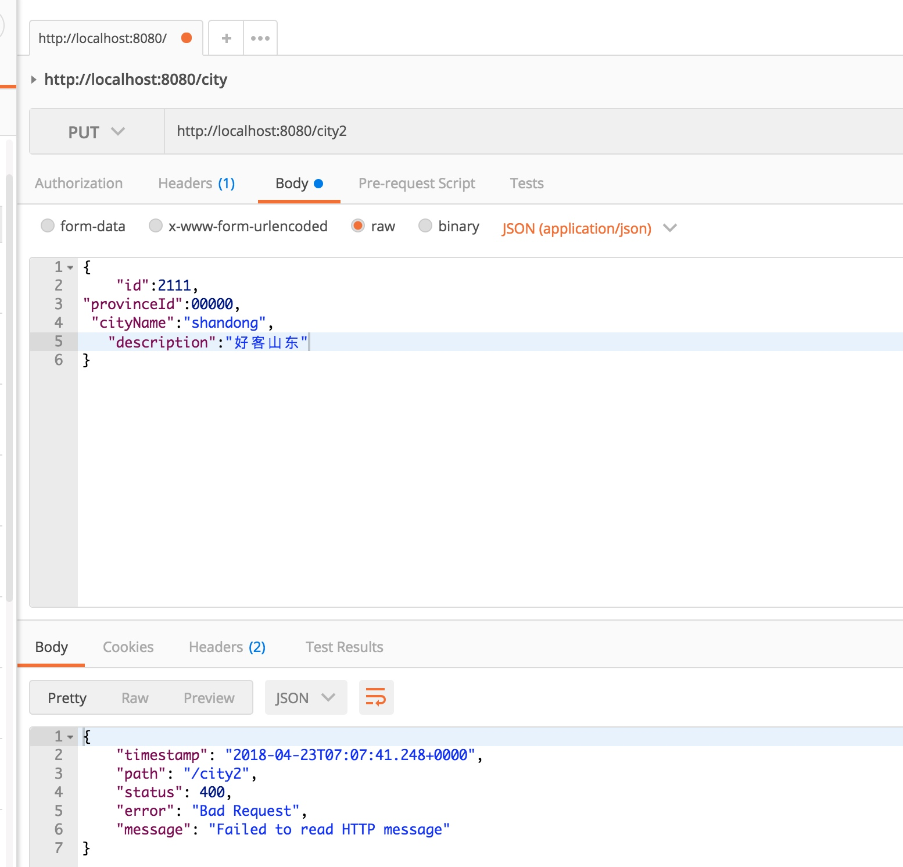
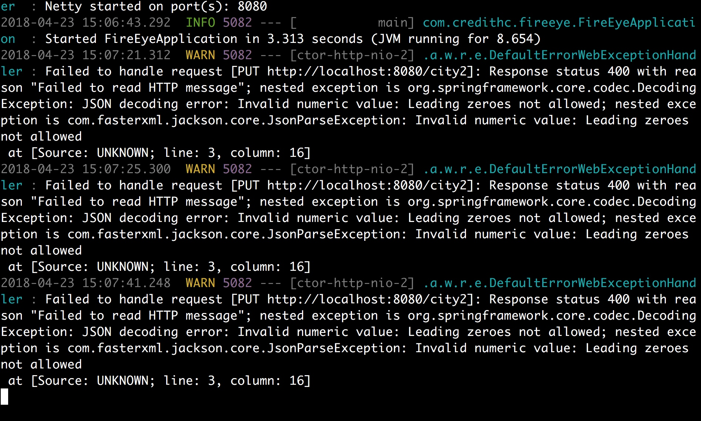
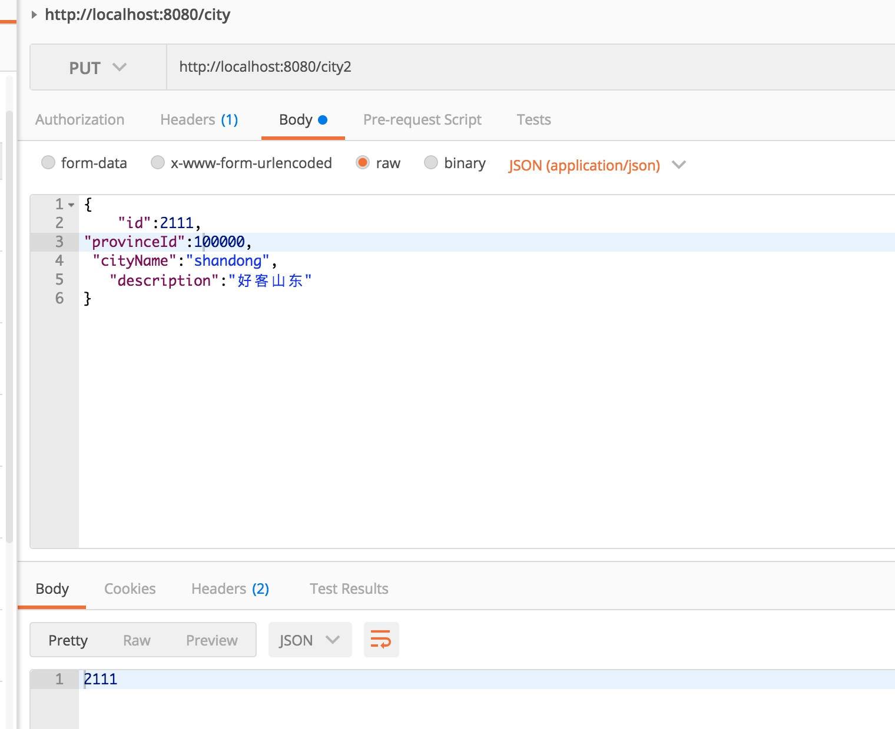

## 概念
keyword:  
nginx kong openresty lua java 代理或网关
spring cloud gateway
zuul
ibm Microgateway
keyword: nodejs 做请求转发 中间层做处理  
 拦截器 过滤
sidecar

网关 过滤器 拦截器 转发器 代理

[Red Hat: API 层是微服务架构成功的关键](https://segmentfault.com/a/1190000003783603)
[一个可插拔远程服务框架的诞生](https://segmentfault.com/a/1190000011955545)
[API 聚合网关技术选型参考](http://www.th7.cn/db/Oracle/201611/214106.shtml)  
[一个简单可参考的 API 网关架构设计（内含代码）](http://www.10tiao.com/html/773/201803/2247487606/1.html)

## webflux

[基于 spring webflux 的高性能 rest api 网关](http://www.bijishequ.com/detail/587538?p=)

* [demo](https://github.com/wangguobo/demo-spring-webflux-api-gateway)


## side car
[spring cloud side_car](https://cloud.spring.io/spring-cloud-netflix/multi/multi__polyglot_support_with_sidecar.html)

[SpringCloud（第 018 篇）Zuul 服务 API 网关微服务之代理与反向代理](https://www.webfalse.com/read/207386/11936592.html)

## cloud gateway
[Spring-Cloud-Gateway 源码解析 —— 网关初始化](http://www.spring4all.com/article/339)

## kong

**oschina tree的kong专题**  
1. [【微服务】网关Kong整合SpringBoot和Consul设计](https://my.oschina.net/tree/blog/1605726)
2. [【微服务】Kong 添加多后端Api](https://my.oschina.net/tree/blog/1603344)
3. [【微服务】网关Kong使用插件，自定义错误返回](https://my.oschina.net/tree/blog/1603474)
4. [【微服务】Spring-Boot整合Consul （自定义服务配置及健康检查）](https://my.oschina.net/tree/blog/1600117)

**oschina chinamerp的kong专题**
[kong的限流](https://my.oschina.net/chinamerp/blog/851613)
[kong的分析文章](https://my.oschina.net/chinamerp/blog)

**csdn kong系列**
[【kong系列一】之 API网关 & kong 概述](https://blog.csdn.net/li396864285/article/details/77371385)


**Get Started**
[Mashape Api 网关 Kong 以及相关的oschina kong文章](https://www.oschina.net/p/kong)
[KONG基础使用](https://yq.aliyun.com/articles/63180)
[kong 集群搭建部署参考](https://blog.csdn.net/li396864285/article/details/79283719)
[Kong 网关API安装部署以及应用实例----------腾云驾雾](http://blog.51cto.com/xinsir/2058768)

**进阶**
[云框架发布KONG API Gateway主题，开源求助攻～](https://my.oschina.net/u/3449331/blog/907230)    
* [代码](https://github.com/cloudframeworks-apigateway/user-guide-apigateway)  


[kong lua openresty](https://moonbingbing.gitbooks.io/openresty-best-practices/others/kong/intro.html)

**实战**
[智能停车平台线上系统优化处理总结](https://my.oschina.net/tree/blog)
[使用Kong来管理业务侧restful api](https://my.oschina.net/u/2600078/blog/781724)
[基于 openresty 的后端应用健康检查-动态上下线](https://leokongwq.github.io/2018/01/31/openresty-health-check-dynamic-up-down.html)  


**理论**
[微服务，ApiGateway 与 Kong](https://my.oschina.net/xiaominmin/blog/1599090)
[Kong：Nginx支持的API管理解决方案](https://sdk.cn/news/1596)

**性能测试**
[Node.js, Go, Python, OpenResty Benchmark](https://yq.aliyun.com/articles/63179?spm=a2c4e.11153940.blogcont63180.28.4dca517cX5Thph)

[用lua扩展你的Nginx(写的非常好)](https://blog.csdn.net/xu_ya_fei/article/details/41964495)
[使用Nginx+Lua(OpenResty)开发高性能Web应用](http://jinnianshilongnian.iteye.com/blog/2280928)

[使用java操作kong](https://my.oschina.net/u/2499632/blog?&search=kong)
[Elasticsearch通过Mysql binlog同步数据进行索引在Grafana进行报表展示](https://my.oschina.net/tree/blog/1593443)
[基于Metricbeat+Elasticsearch+Kibana+Grafana搭建运维主](https://my.oschina.net/majiajue/blog/1615910)

plan： kong lua springboot? kotlin? webflux? consul?(or spring cloud consul)?zk?
lua 2天 （https://github.com/EmmyLua/IntelliJ-EmmyLua ）
kong 3天
kotlin的方式

https://getkong.org/docs/0.12.x/lua-reference/ api

[关于Kong API Gateway测试的心得](http://www.nxops.cn/post/88.html)
[kong的部署](http://www.nxops.cn/post/97.html)
[OpenResty最佳实战](https://moonbingbing.gitbooks.io/openresty-best-practices/others/kong/intro.html)
[Kong的0.11.0版本](https://cyukang.com/2017/09/12/kong-new-release.html)

## reactor
[spring reactor](http://www.baeldung.com/spring-reactor)
[Web on Reactive Stack](https://docs.spring.io/spring/docs/current/spring-framework-reference/web-reactive.html)
[Building Reactive Rest APIs with Spring WebFlux and Reactive MongoDB](https://www.callicoder.com/reactive-rest-apis-spring-webflux-reactive-mongo/)
[spring reactive sample](https://github.com/hantsy/spring-reactive-sample)
[Reactive microservices with Spring 5](https://piotrminkowski.wordpress.com/2017/02/16/reactive-microservices-with-spring-5/)

## 其他开源API
[IBM 开源 API 微网关](https://www.zybuluo.com/xuemingdeng/note/742492)  
[TW 技术雷达 Kong](https://assets.thoughtworks.com/assets/technology-radar-vol-17-cn.pdf)

[API 网关,准备造的一个轮子](https://github.com/edgar615/direwolves)

## node
[前后端分离的探讨](https://www.zhihu.com/question/28207685)
[淘宝FED团队 前后端分离的思考与实践](http://taobaofed.org/blog/2014/04/09/practice-of-separation-of-front-end-from-back-end-2/)
[图解基于node.js实现前后端分离](http://www.imooc.com/article/6721)
[Nodejs在前后端分离中的作用与地位应该怎么去理解？](https://cnodejs.org/topic/565ebb193cda7a91276ff887)
[Node.js 淘宝实现前后端分离了？而且还在 Java 和前端 JS 间架了 NodeJS？](https://ruby-china.org/topics/20291)
[实现真正意义上的前后端分离------由淘宝引入nodejs引发的思考](http://www.cnblogs.com/miketwais/articles/webdeveloperment.html)
[淘宝前后端分离实践](https://juejin.im/entry/595bc4096fb9a06ba73d31d4)
[淘宝前后端分离模式](http://velocity.oreilly.com.cn/2014/index.php?func=session&id=3)

## vertx
[Akka 和 VertX 比较](https://blog.csdn.net/he_wolf/article/details/39449633)

[vertx 学习成果](http://www.voidcn.com/article/p-xrzvsisb-bpn.html)
[segmentfault vertx](https://segmentfault.com/t/vert.x/blogs)
[vertx 学习成果](https://blog.csdn.net/it_ontway/article/details/52067357)
[vertx 使用分享](http://www.yixiangzhan.com/tag/vertx/)
[Vertx 与 Spring 配合完成 DML 操作](http://www.yixiangzhan.com/detail/pGpBe7zr.html)
[Vert.x 技巧：使用 EventBus Interceptor 拦截消息](https://www.jianshu.com/p/c9f899b23ede)
[Vert.x 入坑须知（1）](https://www.jianshu.com/p/2ab64267ae2c)
[vertx-事件总线](https://leokongwq.github.io/2017/11/17/vertx-event-bus.html)
[Vert.x 技术内幕 | Event Bus 源码分析 (Local 模式)](http://www.sczyh30.com/posts/Vert-x/vertx-advanced-local-event-bus-internal/)
[使用 Vert.x 构建 Web 服务器和消息系统](https://segmentfault.com/a/1190000005713918)
[Vert.x 3: 服务代理](https://segmentfault.com/a/1190000011947857)
[使用 vert.x 2.0, RxJava 和 mongoDB 创建一个简单 RESTful 服务](http://tcxiang.iteye.com/blog/2290255)
[使用 Apache API 监控 Uber 的实时数据，第 3 篇：使用 Vert.x 的实时仪表板](https://cloud.tencent.com/developer/article/1035348)

## other

[数据异构的武器-BINLOG+MQ](https://www.webfalse.com/read/207386/11936609.html)




## todo
部署kong，查看api





## 反向代理
https://www.jianshu.com/p/bed000e1830b
http://www.cnblogs.com/ghj1976/p/5140159.html
http://www.cnblogs.com/ghj1976/p/5145019.html
[nginx 反向代理（Reverse Proxy）与耗时记录](http://www.cnblogs.com/ghj1976/p/5140159.html)

[](https://www.zhihu.com/question/19761434)
[](https://blog.csdn.net/chenyufeng1991/article/details/73695157)
[nginx实现数据转发与负载均衡](https://blog.csdn.net/chenyufeng1991/article/details/73695157)
[nginx作反向代理时的HTTP请求处理全过程解释](https://blog.csdn.net/crazw/article/details/9900669)
[Nginx反向代理转发tomcat](https://blog.csdn.net/mlc1218559742/article/details/53117520)






## java instrument

[全链路监控（一）：方案概述与比较](https://juejin.im/post/5a7a9e0af265da4e914b46f1)
[APM Server端Java探针调研](https://blog.csdn.net/hello2mao/article/details/77488073)
[字节码操纵框架ASM分析](https://blog.csdn.net/ohcezzz/article/details/78416176)
[深入字节码操作：使用ASM和Javassist创建审核日志](https://blog.csdn.net/lihenair/article/details/69948918)
[](http://download.forge.objectweb.org/asm/asm4-guide.pdf)
[](http://s3-eu-west-1.amazonaws.com/presentations2012/30_presentation.pdf)
[](http://www.instrument.com/)
[](http://asm.ow2.org/current/asm-transformations.pdf)
[](https://juejin.im/post/5a7a9e0af265da4e914b46f1)
[Zipkin 和 Pinpoint 选型对比](http://www.tangrui.net/2016/zipkin-vs-pinpoint.html)
[jwt-cli: A Shell Library to Decode JSON Web Tokens (JWT Tokens)](https://www.javacodegeeks.com/2018/04/jwt-cli-a-shell-library-to-decode-json-web-tokens-jwt-tokens.html)


## 时间序列数据库

[我们为什么需要一个时序数据库？](http://www.infoq.com/cn/news/2017/07/Why-time-series-database)
[东岳网络工作室--上海交大--时间序列数据库漫谈](https://blog.dongyueweb.com/%E6%97%B6%E9%97%B4%E5%BA%8F%E5%88%97%E6%95%B0%E6%8D%AE%E5%BA%93%E6%BC%AB%E8%B0%88.html)
[时序数据库技术体系－时序数据存储模型设计](http://hbasefly.com/2017/11/19/timeseries-database-2/)
[tsdb的一篇布道文](https://blog.timescale.com/time-series-data-why-and-how-to-use-a-relational-database-instead-of-nosql-d0cd6975e87c)
[知乎关于时序数据库的选型](https://www.zhihu.com/question/50194483)
[十分钟看懂时序数据库 - 存储](https://juejin.im/entry/5915614f8d6d8100585e753d)
[为什么时序数据库会成为新趋势](http://tech.it168.com/a2017/0828/3167/000003167498.shtml)
[时序数据库概览](https://www.cnblogs.com/wenBlog/p/8297100.html)

[深度解读！时序数据库HiTSDB：分布式流式聚合引擎](https://blog.csdn.net/b0Q8cpra539haFS7/article/details/79999782)

timescaledb 类sql方式，需要与pg联合使用
druid ts查询感觉复杂

mongo 
[Schema Design for Time Series Data in MongoDB](https://www.mongodb.com/blog/post/schema-design-for-time-series-data-in-mongodb)
[mongo series](https://www.mongodb.com/presentations/mongodb-time-series-data)
influx
[influx使用之谈](https://toutiao.io/posts/viqzdg/preview)
[时间序列数据库调研之InfluxDB](http://blog.fatedier.com/2016/07/05/research-of-time-series-database-influxdb/)
[influxdb中文文档](https://jasper-zhang1.gitbooks.io/influxdb/content/Concepts/key_concepts.html)
[influxdb官方文档](https://docs.influxdata.com/influxdb/v1.2/query_language/functions)
[浅析时间序列数据](https://www.jianshu.com/p/67dffc3b69ee)
[时序列数据库武斗大会之TSDB名录 Part 1](http://liubin.org/blog/2016/02/25/tsdb-list-part-1/)
[数据库 – 存储时间序列数据,关系还是非？](https://codeday.me/bug/20170419/12017.html)
[时间序列大数据平台建设经验谈](https://blog.csdn.net/bluishglc/article/details/79277455)
[时间序列数据库](https://www.jianshu.com/p/2fb567e2baee?utm_campaign=maleskine&utm_content=note&utm_medium=seo_notes&utm_source=recommendation)

[influxdb的常用操作](https://www.linuxdaxue.com/influxdb-study-influxdb-aggregations-funcitons.html)
[饿了么influxdb的实践之路](http://gitbook.cn/books/59395d3d5863cf478e6b50ba/index.html)
[influx with spring ](http://www.baeldung.com/java-influxdb)
[spring data influxdb](https://github.com/miwurster/spring-data-influxdb)
[version eye spring-data-influxdb : 1.6](https://www.versioneye.com/java/com.github.miwurster:spring-data-influxdb/1.6)


##  数据库选型
看量级 
200万合同 每个合同多少状态? 
[MongoDB数据量大于2亿后遇到的问题 及原因分析](https://blog.csdn.net/miyatang/article/details/55509419)
[知乎关于亿级数据量使用hbase或mongo的讨论](https://www.zhihu.com/question/45440393)
[一个拥有过亿用户的表，如何设计](https://www.v2ex.com/t/46866)
[Ruby 请教一下至少千万级别数据库的选择方案](https://ruby-china.org/topics/33703)
[MongoDB在58同城百亿量级数据下的应用实践](https://www.jianshu.com/p/ea35f248cc68)

## 审计系统设计
[keyword](https://www.google.co.uk/search?q=Java+%E5%AE%A1%E8%AE%A1%E7%B3%BB%E7%BB%9F%E8%AE%BE%E8%AE%A1&ei=64XZWpXvJqqfgAbZ2pv4Bg&start=10&sa=N&biw=1920&bih=1006)
[系统设计与架构笔记:审计日志系统的设计](http://www.cnblogs.com/sharpxiajun/archive/2012/01/19/2327278.html)
[安全审计系统-设计思路与架构](https://ask.hellobi.com/blog/marey_marey111/2545)
[](http://www.th7.cn/Design/ui/201803/887258.shtml)
https://hongyuxie.github.io/MyResume_CN/
##other
https://blog.csdn.net/li396864285/article/details/79205124
https://blog.csdn.net/t4i2b10X4c22nF6A/article/details/79062764
https://cyukang.com/2013/09/26/gotous.html 
[jwt-cli: A Shell Library to Decode JSON Web Tokens (JWT Tokens)](https://www.javacodegeeks.com/2018/04/jwt-cli-a-shell-library-to-decode-json-web-tokens-jwt-tokens.html)


zipkin
https://spring.io/blog/2016/02/15/distributed-tracing-with-spring-cloud-sleuth-and-spring-cloud-zipkin
https://www.google.co.uk/search?q=prometheus+vs+zipkin&ei=uWHYWqTqOaaMgAaw976AAQ&start=10&sa=N&biw=1920&bih=1006

https://www.cncf.io/wp-content/uploads/2018/01/CNCF_Webinar_Intro_Jaeger_v1.0_-_2018-01-16.pdf

https://www.google.co.uk/search?ei=_mHYWrSqPMX3gQaj7Zn4DA&q=jaeger+tracing&oq=jaeger+tracing&gs_l=psy-ab.3..0l10.17808.22007.0.22243.8.8.0.0.0.0.506.1627.2-1j1j1j1.4.0....0...1.1.64.psy-ab..4.4.1627...0i67k1j0i131i67k1j0i10k1.0.YRX5DoHbzM8

https://github.com/jaegertracing/jaeger

https://www.jaegertracing.io/docs/features/

https://github.com/opentracing/specification/blob/master/specification.md#references-between-spans

http://118.26.170.236/pages/viewpage.action?pageId=13175982


## 技术选型
java
    webflux: 微服务体系结构，WebFlux 和 MVC 可以混合使用。尤其开发 IO 密集型服务的时候，选择 WebFlux 去实现。
    编程模型:  
    注解控制层。和 MVC 保持一致，WebFlux 也支持响应性 @RequestBody 注解。
功能性端点。基于 lambda 轻量级编程模型，用来路由和处理请求的小工具。和上面最大的区别就是，这种模型，全程控制了请求 - 响应的生命流程

前端
db

[spring官网boot GA说明](https://spring.io/blog/2018/03/01/spring-boot-2-0-goes-ga)
[Spring Boot 2.0正式发布，升还是不升呢？](https://blog.csdn.net/dyc87112/article/details/79429006)
[](https://my.oschina.net/go4it/blog/1632721)
[](https://github.com/Yurisa/operator-web)
[](https://github.com/Exrick/xmall)

[小豹网关](http://www.xbgateway.com/)


仅仅2.32s


-----------

陶建辉，1994年毕业于中国科大，同年到美国印第安纳大学攻读天体物理博士。从1997年起，在美国芝加哥Motorola、3Com等公司从事2.5G、3G、WiFi等无线互联网的研发工作，为国际顶尖无线数据专家。2008年3月回北京创业，创办和信，致力于提供移动互联网的IP Push和IP实时消息服务。2010年9月，和信被全球知名的芯片厂商联发科技收购。2013年初再次创业，创办快乐妈咪，打造“硬件+应用+服务”的模式，专注于母婴智能硬件和母婴健康服务。2016年3月，快乐妈咪被太平洋网络收购。

休整一年后，2017年初，陶建辉再度创业，专注时序空间数据的实时高效的处理，包括采集、存储、查询和分析。凭借其创新的存储格式和搜索算法，推出的实时数据引擎的性能远超行业标杆，可以广泛用于物联网和金融大数据领域。


----
网关/实时数据时序数据引擎


[我是如何在天猫、蚂蚁金服、百度等大厂面试中被拒的](https://www.jianshu.com/p/386dfd9efb66?utm_campaign=maleskine&utm_content=note&utm_medium=pc_all_hots&utm_source=recommendation)


[认清楚深入研究与搬运工的区别，适当选择](https://blog.csdn.net/DP29syM41zyGndVF/article/details/79990335)
[完整微服务案例](https://blog.csdn.net/ServiceComb/article/details/80024886)
[](https://blog.csdn.net/crazy246/article/details/79823184)


一眼就能看出的问题 - 经验
1. json 转换插件问题
2. 负载均衡问题
3. jeeplus的 windown tab问题 

无法一眼就看出的 debug 顺藤摸瓜  自上而下 自下而上 


[webflux kotlin](https://github.com/bastman?tab=overview&from=2018-04-20)




```Java
Error starting ApplicationContext. To display the conditions report re-run your application with 'debug' enabled.
2018-04-23 14:48:49.798 ERROR 4725 --- [           main] o.s.boot.SpringApplication               : Application run failed

org.springframework.beans.factory.BeanCreationException: Error creating bean with name 'webHandler' defined in class path resource [org/springframework/boot/autoconfigure/web/reactive/WebFluxAutoConfiguration$EnableWebFluxConfiguration.class]: Initialization of bean failed; nested exception is org.springframework.beans.factory.BeanCreationException: Error creating bean with name 'requestMappingHandlerMapping' defined in class path resource [org/springframework/boot/autoconfigure/web/reactive/WebFluxAutoConfiguration$EnableWebFluxConfiguration.class]: Invocation of init method failed; nested exception is java.lang.IllegalStateException: Ambiguous mapping. Cannot map 'cityWebFluxController2' method
public reactor.core.publisher.Mono<com.credithc.fireeye.example.ex.domain.City> com.credithc.fireeye.example.ex.webflux.controller.CityWebFluxController2.findCityById(java.lang.Long)
to {[/city2],methods=[GET]}: There is already 'cityWebFluxController2' bean method
public reactor.core.publisher.Flux<com.credithc.fireeye.example.ex.domain.City> com.credithc.fireeye.example.ex.webflux.controller.CityWebFluxController2.findAll() mapped.
```
同一个类中的路由映射一样了，需要有相应的参数区分。



说明provinceId有问题 不能以00000为值，0开头的勿用



瞬间修改ok了



