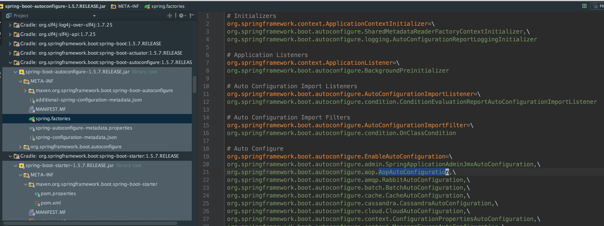
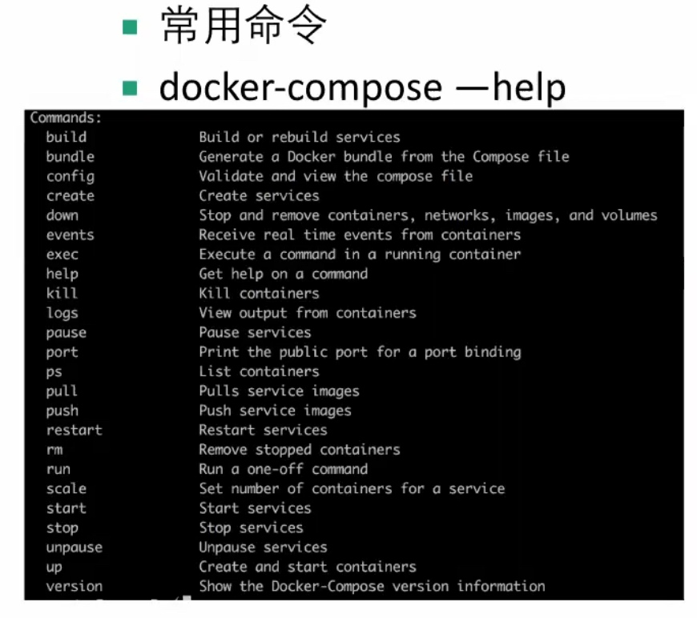
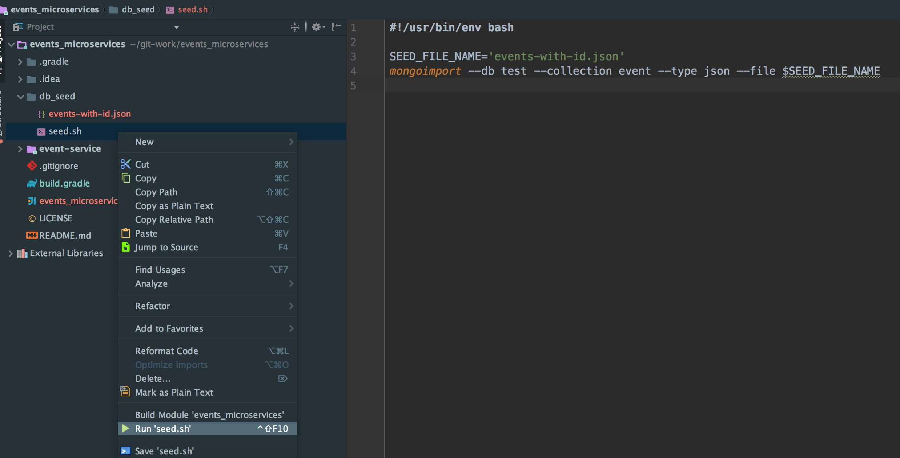
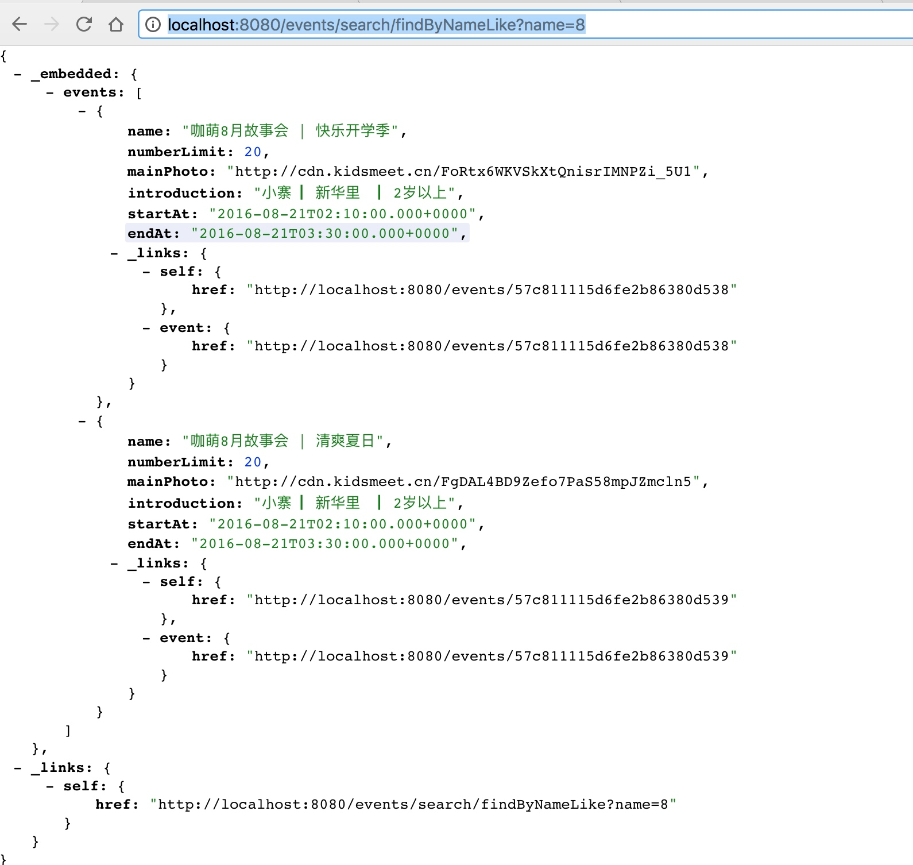
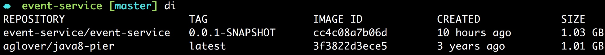
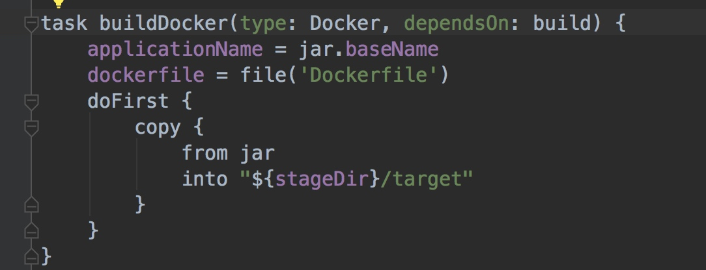

## install sdk
	-- sdk install java
	-- sdk install springboot
	-- sdk install gradle
	
	# 环境准备
1. install sdkman and using it to install that needed

```sh
curl -s "https://get.sdkman.io" | bash
source "/Users/fqc/.sdkman/bin/sdkman-init.sh"
sdk install java
sdk install gradle
sdk install springboot
```


注意：开启了科学上网(翻墙)代理


## install docker

```sh
curl -sSL http://acs-public-mirror.oss-cn-hangzhou.aliyuncs.com/docker-engine/internet | sh /dev/stdin 1.12.3
```

docker 加速器
```sh
curl -sSL https://get.daocloud.io/daotools/set_mirror.sh | sh -s http://bbfa5e62.m.daocloud.io
```

mac版本


## install sublime3 and VinTage和VinTageEx plugin

## new WebApp.groovy  && spring run

由于安装了spring-cli，所以可以直接命令行`spring run springboot-app`。其中springboot-app只需要是springboot的文件即可，不论是java版本还是groovy版本，都可直接运行。

###groovy版本
```groovy
@RestController
class WebApp{
	@RequestMapping("/")
	String greeting(){
		"greeting from groovy"
	}
}
```

just run `spring run WebApp.groovy`


### java版本
```java
package springbootdemo 
import org.springframework.boot.SpringApplication; 
import org.springframework.boot.autoconfigure.SpringBootApplication; 
import org.springframework.web.bind.annotation.RequestMapping; 
import org.springframework.web.bind.annotation.RestController; 

@RestController
@SpringBootApplication
public class WebApp2{
	@RequestMapping("/")
	public String greetings(){
		return "Greetings from spring boot";
	}
	public static void main(String[] args) {
		SpringApplication.run(WebApp2.class,args)
	}
}
```

just run `spring run WebApp2.java`

notice: just create file and run. the spring-cli will download the dependency. until now, it has no any config file . even pom,gradle script or properties. just one file groovy or java.


## 使用gradle创建springboot工程
### config build.gradle

```gradle
buildscript {

	ext {
		springBootVersion = '1.5.7.RELEASE'
	}

	dependencies {
		classpath("org.springframework.boot:spring-boot-gradle-plugin:${springBootVersion}")
	}

}

apply plugin: ‘java'
apply println 'idea'
apply plugin: 'spring-boot'

jar {
	baseName = 'myapp'
	version = '0.0.1-SNAPSHOT'
}

allprojects {
    repositories {
        maven{ url 'http://maven.aliyun.com/nexus/content/groups/public'}
        maven{ url 'http://maven.aliyun.com/nexus/content/repositories/jcenter'}
    }
}

dependencies {
	compile('org.springframework.boot:spring-boot-starter-web')
	compile("org.springframework.boot:spring-boot-starter-test")
}
```

### 配置gradle仓库国内地址
[repository server](https://xiexianbin.cn/java/2016/12/18/change-gradle-maven-repo-url)


```sh
allprojects {
    repositories {
        maven{ url 'http://maven.aliyun.com/nexus/content/groups/public'}
        maven{ url 'http://maven.aliyun.com/nexus/content/repositories/jcenter'}
    }
}
```

### spring boot cli方式执行创建
`spring init --list` 列出spring的生态环境项目
`spring init -dweb --build gradle myapp` 使用gradle脚本和web依赖创建spring工程。

## 运行gradle springboot项目

有两种方式  

1.  在gradle中指定springboot插件可以使用功能`bootRun`
2.  使用fat jar的方式 `gradle clean build && java -jar ...` ,`gradle clean build -x test`可以忽略测试，(测试构建很耗时)


- gradle
    - `./gradlew bootRun (project level)`使用当前的gradle可以统一约束团队的gradle版本
    - `gradlew bootRun  (global level or youself level)`

其中gradle文件夹下的gradle-wrapper.proerties中的版本可以控制，团队成员下载好代码，直接`./gradlew bootRun`将会自动下载对应版本的gradle。


- fat jar

```sh
gradle clean build 
java -jar ...
```


## import to IDEA


## @SpringBootApplication注解的作用


springbootApplication注解首先有标注的作用
也就是说将test相关的代码注释掉，这里就可以将该注解去除掉。




## 配置文件

注意两点`---`和层级关系，错一个都不行
```yml
spring:
  profiles: dev
server:
  port: 9999

---
spring:
  profiles:
    active: prod
server:
  port: 8888

---
spring:
  profiles: test
server:
  port: 7777
```

## 开启
actuator

```sh
compile('org.springframework.boot:spring-boot-starter-actuator')
```


当访问`/env`的时候打印出该日志信息。


## management.security.enabled
很多springboot提供的系统级别api默认是开启权限验证的。开发时可以先关闭掉
management.security.enabled = false
## 日志配置


```sh
compile('org.springframework.boot:spring-boot-starter-logging')
```


[Spring Boot 日志配置方法(超详细)](http://www.jb51.net/article/118849.htm)

[SpringBoot干货系列（七）：默认日志logback配置解析
](http://www.qingpingshan.com/rjbc/java/246216.html)


## dockerfile


注意以下两种方式都可以


通常为了降低单元测试或行为测试的隔离性，比如一个服务需要底层基础设施服务，如mongodb服务等，注入一些数据，不依赖别人环境，同时不需要访问其他环境。docker-compose所做的就是将很多container依赖组装起来。


注意 一些配置最好能在docker-compose中配置，不用修改源码，更加方便。




## 文档的重要性

拿不准的，最好先看文档。 `-SPRING_PROFILES_ACTIVE:prod`和`-SPRING_PROFILES_ACTIVE=prod`实验多少次都不会成功。 

```sh
gradle clean build && java -jar build/libs/myapp-0.0.1-SNAPSHOT.jar -SPRING_PROFILES_ACTIVE:prod
```


```sh
gradle clean build && java -jar -Dspring.profiles.active=prod build/libs/myapp-0.0.1-SNAPSHOT.jar                                                             
```

[springboot属性配置官方手册](https://docs.spring.io/spring-boot/docs/current/reference/html/howto-properties-and-configuration.html)


## 编写微服务
### 编写Dockerfile文件

实际的Dockerfile

```sh
FROM java:8

RUN mkdir /app
WORKDIR /app

ADD build/libs/myapp-0.0.1-SNAPSHOT.jar /app
RUN ln -s /app/myapp-0.0.1-SNAPSHOT.jar /app/myapp-latest.jar

EXPOSE 9999
CMD ["java","-jar","/app/myapp-latest.jar"]

# CMD java -jar /app/myapp-latest.jar
# RUN java -jar /app/myapp-latest.jar  永远不会运行成功
```

**RUN指定的命令是在镜像构建过程中执行的，CMD指定的命令是在容器运行中执行的**。

### 构建镜像

注意切换到有Dockerfile的目录
```sh
docker build -t myapp:myapp1.0 .
```
### 设置开机重启docker容器服务


```sh
docker run -d -p 9997:9999 --restart=always myapp:myapp
```


## 构建spring data rest服务


## 将json文件导入mongodb





注意现在本地跑起来没问题，再放入docker执行。




###hal browser
add 

```sh

```


### gradle docker plugin

[使用gradle生成Spring Boot应用的Docker Image](http://www.jdon.com/dl/best/docker-containers-with-gradle-in-4-steps.html)


运行成功！

但是面临一个尴尬的问题，镜像竟然如此之大...
而在之前的myapp也是很大...


[Alpine Linux，一个只有5M的Docker镜像](http://www.infoq.com/cn/news/2016/01/Alpine-Linux-5M-Docker)
[Docker官方镜像将会使用Alpine Linux替换Ubuntu](http://dockone.io/article/1014)

其原因在于
from aglover/java8-pier



[Smaller Java images with Alpine Linux](https://developer.atlassian.com/blog/2015/08/minimal-java-docker-containers/)

[Spring Boot with Docker](https://spring.io/guides/gs/spring-boot-docker/)

## lstat .. :no such file or directory


该问题在于上下文的构建路径。调整下即可。
比如 报错就是build/libs...找不到。 之前使用docker build .(当前路径的Dockerfile)。
而使用了gradle docker plugin之后

构建的上下文路径就变了 是build目录下了


修改路径后构建成功！而且使用了Dockerfile中的基础镜像，小了将近一半，从1.03G到600M，灵活。


接着可以进行再瘦身，寻找apline docker java
[Lean, Mean, Java Virtual Machine: Making Your Docker 7x Lighter With Alpine Linux](http://blog.takipi.com/lean-mean-java-virtual-machine-making-your-docker-7x-lighter-with-alpine-linux/)

实际上jar包就19.8m约20m ，然后java8的基础镜像为643m 整个的服务镜像为663m很合理
大部分就是基础镜像占用了绝大部分的空间大小。

[java OFFICIAL REPOSITORY](https://hub.docker.com/_/java/) 


java:alpine本身是145m，加上工程19.8m，165m合理。 


再次进化，脚本中没法添加忽略测试(`depondsOn: build`中没法再加`-x test`了，对groovy语言不熟，不确定)，


那就在命令行执行的时候加上，果然也奏效


`docker run -it $image /bin/sh `进入到容器


可以看启动日志 交互的方式. 可以不关闭服务而退出的方式是:`ctrl+q+P`


完美！！ 注意端口映射哈！！


### docker use spring profile


## docker compose up


因为gradle插件配置的和Dockerfile其有冲突。 其中gradle插件的doFirst可以忽略


注释掉之后


解决方案：
因为gradle插件的执行上下文为 build/docker。它将文件拷贝到了build/docker/下，jar在其target下，而Dockerfile也单独拷贝了一份。因此，docker-compose文件不能够在该项目当前路径上下文`build: .`，而应改为`build/docker`


## docker-compose 一键构建打包启动

```sh
gradle clean build -x test && gradle buildDocker -x test && docker-compose up --build
```


访问也ok


### 向mongo容器导入测试数据

```sh
#!/usr/bin/env bash

SEED_FILE_NAME='events-with-id.json'

CONTAINER_ID=$(docker ps | awk '/_mongo/ {print $1}')
echo $CONTAINER_ID
echo $(dirname $0)/

docker cp $(dirname $0)/$SEED_FILE_NAME $CONTAINER_ID:/data
docker exec $CONTAINER_ID mongoimport --db test --collection event --type json --file /data/$SEED_FILE_NAME
```


刷新页面，成功看到测试数据。


## 其他资料
[Crafting perfect Java Docker build flow](https://codefresh.io/blog/java_docker_pipeline/)

