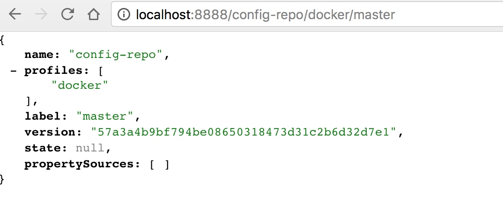

# 
[How to set base url for rest in spring boot?](https://stackoverflow.com/questions/32927937/how-to-set-base-url-for-rest-in-spring-boot)


```
A bit late but the same question brought me here before reaching the answer so I post it here. Create (if you still don't have it) an application.properties and add

server.contextPath=/api
So in the previous example if you have a RestController with @RequestMapping("/test") you will access it like localhost:8080/api/test/{your_rest_method}

```
question source: [how do i choose the url for my spring boot webapp](https://stackoverflow.com/questions/24452072/how-do-i-choose-the-url-for-my-spring-boot-webapp)


## config 访问



