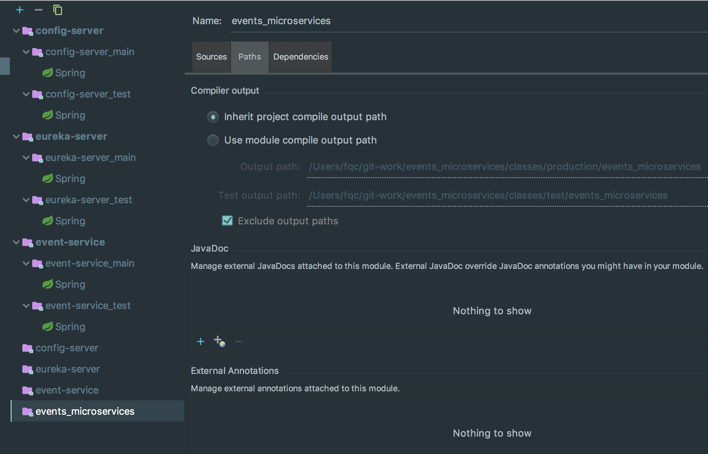

# 构建config-server
##一、构建工程

```sh
spring init -dweb --build gradle config-server  --group="com.microservice"
```

补充gradle的国内仓库,并且加上一些依赖。为了方便，今后可以统一拷贝下面的脚本模板。

```sh
buildscript {
	ext {
		springBootVersion = '1.5.7.RELEASE'
	}
	repositories {
		mavenCentral()
	}
	dependencies {
		classpath("org.springframework.boot:spring-boot-gradle-plugin:${springBootVersion}")
		classpath('se.transmode.gradle:gradle-docker:1.2')
	}
}

apply plugin: 'java'
apply plugin: 'idea'
apply plugin: 'org.springframework.boot'
apply plugin: "io.spring.dependency-management"
apply plugin: 'docker'
apply plugin: 'application'

//apply plugin: 'spring-boot'//The plugin id 'spring-boot' is deprecated. Please use 'org.springframework.boot' instead.
//1.4.x的spring-boot 在1.5中建议使用org.springframework.boot替代。

group = 'com.microservice'
//name = 'eureka-server'
applicationName = 'eureka-server'
version = '0.0.1-SNAPSHOT'
sourceCompatibility = 1.8
targetCompatibility = 1.8

allprojects{
	repositories {
			maven { url 'http://maven.aliyun.com/nexus/content/groups/public' }
			maven { url 'http://maven.aliyun.com/nexus/content/repositories/jcenter' }
			mavenCentral()
			jcenter()
	}
}

distDocker {
	exposePort(8080)
}

task buildDocker(type: Docker, dependsOn: build) {
	applicationName = jar.baseName
	dockerfile = file('Dockerfile')
	doFirst {
		copy {
			from jar
			into "${stageDir}/target"
		}
	}
}

dependencies {
	compile('org.springframework.boot:spring-boot-starter-web')
	compile('org.springframework.boot:spring-boot-starter-actuator')
	testCompile('org.springframework.boot:spring-boot-starter-test')
}

dependencyManagement {
	imports {
		mavenBom "org.springframework.cloud:spring-cloud-dependencies:Camden.SR6"
	}
}

```

### 正确的结构





##二、添加cloud config依赖

```sh
dependencies{
    compile('org.springframework.cloud:spring-cloud-config-server')
    compile('org.springframework.cloud:spring-cloud-starter-bus-amqp')
}

dependencyManagement {
     imports {
          mavenBom "org.springframework.cloud:spring-cloud-dependencies:Camden.SR5"
     }
}
```
config-server依赖可以开启config server
bus-amqp依赖可以开启多客户端配置刷新。在config server和config client中都可以添加。
还需要添加spring-cloud的仓库依赖管理

##三、标注@EnableConfigServer

在springboot application类上添加 @EnableConfigServer注解

```java
package com.micro.configserver;

import org.springframework.boot.SpringApplication;
import org.springframework.boot.autoconfigure.SpringBootApplication;
import org.springframework.cloud.config.server.EnableConfigServer;

@SpringBootApplication
@EnableConfigServer
public class ConfigServerApplication {

	public static void main(String[] args) {
		SpringApplication.run(ConfigServerApplication.class, args);
	}
}

```

## 四、 构建config-repo
文件格式：`{label}/{application}-{profile}.{yml|properties}`
例如 user-service.yml 默认lable为master分支

label: 版本控制的标签label，git默认为master分支，svn默认为trunk分支
application: 在config-client中定义的 spring.application.name关联.实际上通过测试，是和config-repo中的文件名关联
profile: 在config-client中定义的spring.profiles.active关联

自定义配置信息： 
`feature.x.enable=true`


##五、配置config-repo地址
配置`spring.cloud.config.server.git.uri`=${config-repo-uri}

```yaml
server:
  port: 8020
spring:
  cloud:
    config:
      server:
        git:
          uri: https://github.com/gomaster-me/config-repo
management:
  security:
    enabled: false
---
spring:
  profiles: docker
  cloud:
    config:
      server:
        git:
          uri: https://github.com/gomaster-me/config-repo
  rabbitmq:
    host: rabbitmq
```

## 六、访问配置中心仓库配置

`http://{ServerHost}:{Port}/{Application}/{Profile}/{Label}`

```
http://localhost:8020/event/docker
```

# 构建config-client
## 一、构建工程
```sh
spring init -dweb --build gradle user-service  --group="com.microservice"
```

补充gradle的国内仓库,并且加上一些依赖。为了方便，今后可以统一拷贝下面的脚本模板。

```sh
buildscript {
    ext {
        springBootVersion = '1.5.7.RELEASE'
    }
    repositories {
        maven { url 'http://maven.aliyun.com/nexus/content/groups/public' }
        mavenCentral()
    }
    dependencies {
        classpath("org.springframework.boot:spring-boot-gradle-plugin:${springBootVersion}")
        classpath('se.transmode.gradle:gradle-docker:1.2')
    }
}

apply plugin: 'java'
apply plugin: 'idea'
apply plugin: 'org.springframework.boot'
apply plugin: "io.spring.dependency-management"
apply plugin: 'docker'
apply plugin: 'application'

//apply plugin: 'spring-boot'//The plugin id 'spring-boot' is deprecated. Please use 'org.springframework.boot' instead.
//1.4.x的spring-boot 在1.5中建议使用org.springframework.boot替代。

group = 'com.microservice'
version = '0.0.1-SNAPSHOT'
sourceCompatibility = 1.8
targetCompatibility = 1.8

allprojects {
    repositories {
        maven { url 'http://maven.aliyun.com/nexus/content/groups/public' }
        maven { url 'http://maven.aliyun.com/nexus/content/repositories/jcenter' }
        mavenCentral()
        jcenter()
    }
}

distDocker {
    exposePort(8080)
}

task buildDocker(type: Docker, dependsOn: build) {
    applicationName = jar.baseName
    dockerfile = file('Dockerfile')
    doFirst {
        copy {
            from jar
            into "${stageDir}/target"
        }
    }
}

dependencies {
    compile('org.springframework.boot:spring-boot-starter-web')
    compile('org.springframework.boot:spring-boot-starter-actuator')
    compile('org.springframework.cloud:spring-cloud-config-server')
    compile('org.springframework.cloud:spring-cloud-starter-bus-amqp')
    testCompile('org.springframework.boot:spring-boot-starter-test')
}


dependencyManagement {
     imports {
          mavenBom "org.springframework.cloud:spring-cloud-dependencies:Camden.SR5"
     }
}

```


## 二、添加依赖


```sh
dependencies {
    compile('org.springframework.boot:spring-boot-starter-actuator')
    compile('org.springframework.cloud:spring-cloud-starter-config')
    compile('org.springframework.cloud:spring-cloud-config-client')
    compile('org.springframework.cloud:spring-cloud-starter-bus-amqp')
    testCompile('org.springframework.boot:spring-boot-starter-test')
}
dependencyManagement {
    imports {
        mavenBom "org.springframework.cloud:spring-cloud-dependencies:Camden.SR5"
    }
}
```
## 三、
## 四、


1.5.7release bus refresh


https://github.com/spring-cloud/spring-cloud-config/issues/657
https://github.com/spring-cloud/spring-cloud-bus/issues/59
https://github.com/spring-cloud/spring-cloud-bus/issues/55


config-server的权限问题


开放权限后。之后需要权限的设置。内部开发，密码等安全措施


