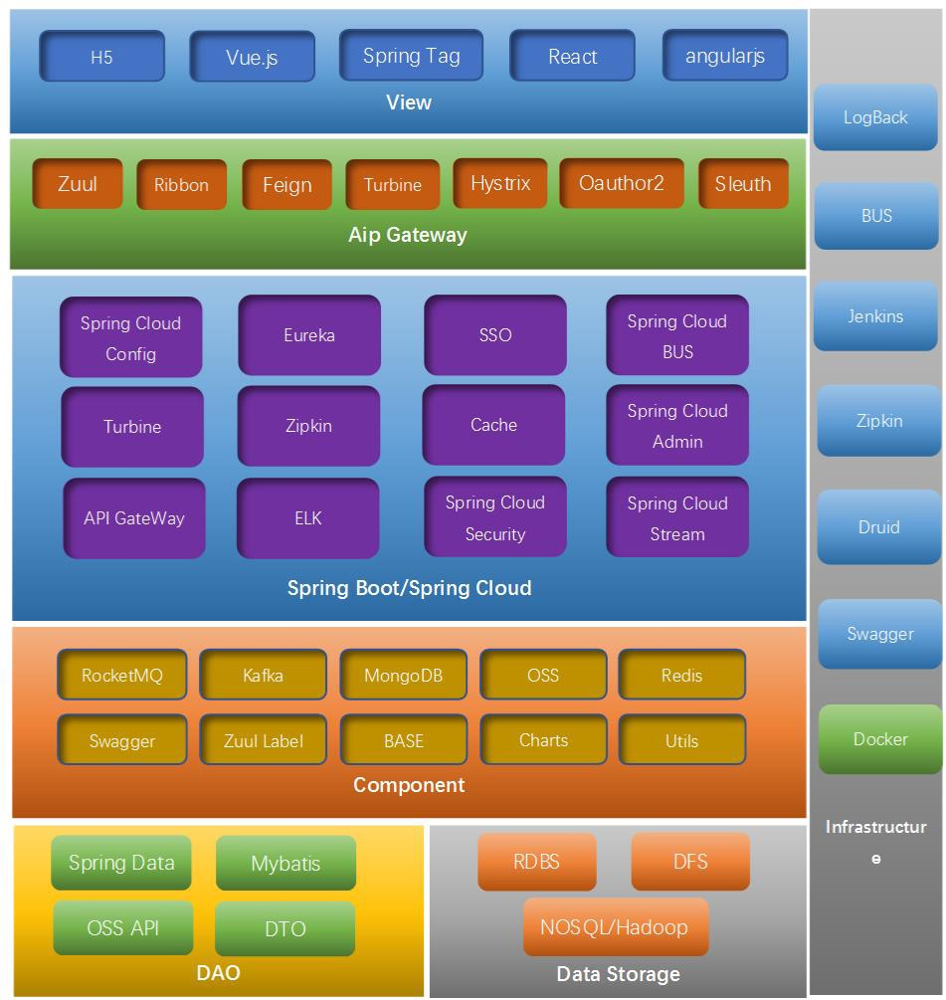
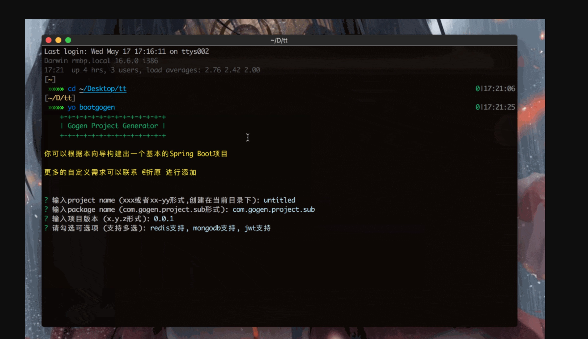
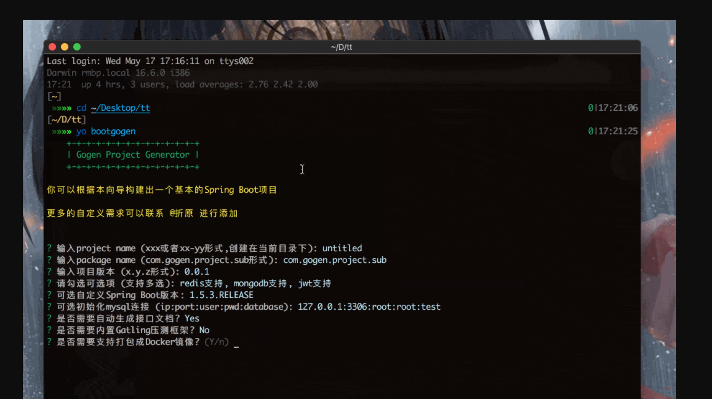
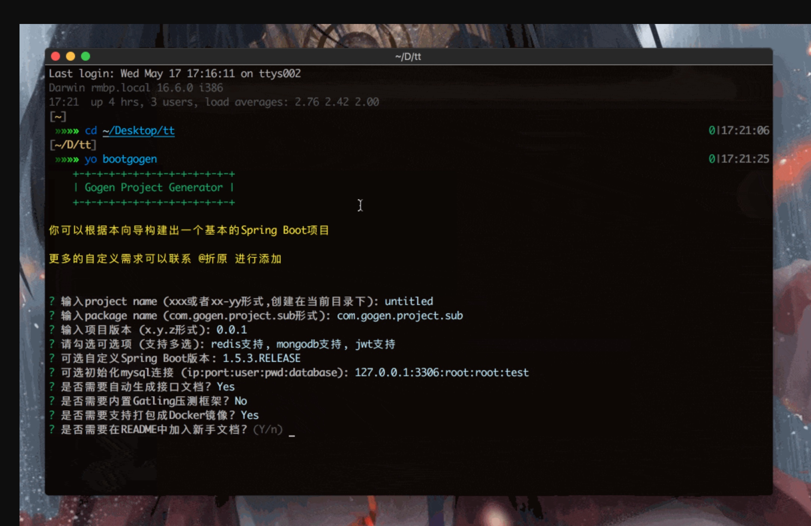

## 微服务
[微服务实践 马丁文章的翻译版本之一](https://www.zybuluo.com/bergus/note/459504)
[基于微服务和Docker容器技术的PaaS云平台架构设计](http://dockone.io/article/2455)
[为什么Docker对于创业公司有意义？](http://dockone.io/article/2854)
[airbnb使用微服务十条经验](http://dockone.io/article/2811)
[大家觉得现在的微服务架构最需要什么？](http://dockone.io/question/426)
[你以为是微服务或Docker？其实是组织架构！](http://blog.jobbole.com/105592/)
[老黃聊架構：微服務架構落地之前，需要想清楚的幾個關鍵問題](http://www.gegugu.com/2016/04/05/9627.html)
[微服务开发指南](http://www.echojb.com/develop-method/2017/06/10/421755.html)
[使用微服务，你考虑好了吗？](http://dockone.io/article/1808)
## docker 容器微服务
[docker微服务最佳实践](https://www.zybuluo.com/bergus/note/609584)
## swarm rancher k8s
[Docker官方将支持Kubernetes，容器编排大战宣告结束](http://www.infoq.com/cn/news/2017/10/Docker-Kubernetes-Swarm)


## swarm
[swarm界面安装](http://juestnow.blog.51cto.com/1515305/1882708)
[Swarm的进化和大规模应用 以阿里云为例](http://www.aliyunhn.com/Home/Article/detail/id/1113.html)
## 服务编排 springcloud & swarm

- 零、
    - [Docker与容器服务扩展机制](https://yq.aliyun.com/video/play/357)
    - [阿里 李斌 基于Docker的微服务实战：以Spring Cloud为例](https://yq.aliyun.com/video/play/335) [git](https://github.com/binblee)
    - [阿里技术专家 李斌 Docker Swarm运行Spring Cloud应用（一）：部署](https://yq.aliyun.com/articles/73491)
    - [这个中秋，DOCKER与微服务更配呦！  阿里架构师讲 springcloud](http://www.debugrun.com/a/XkVSyUB.html)
- 一、 代码人生 代码+博客 赞！
 - [docker-swarm部署spring-cloud的微服务](https://www.toutiao.com/i6409949864527921665/) 
 - [博客](http://www.troylc.cc/) 
 - [配套代码](https://github.com/troychn/spring-cloud-docker-microservice)   


- 二、服务编排 swarm

  - [安装docker并运行docker swarm模式](https://my.oschina.net/lhztt/blog/789502)
  - [Spring cloud + Swarm mode 实战一：portus/harbor部署镜像私有仓库](http://www.tk4479.net/timedifier2/article/details/78102977)
  - [Spring cloud + Swarm mode 实战二：部署微服务](http://www.tk4479.net/timedifier2/article/details/78135970)
 
  该作者有一些列围绕docker spring cloud的内容  
  
  - [基于docker部署的微服务架构（一）：服务注册中心](https://my.oschina.net/lhztt/blog/789694)
  - [基于docker部署的微服务架构（二）： 服务提供者和调用者](https://my.oschina.net/lhztt/blog/789823)
  - ....
  - [ 基于docker部署的微服务架构（七）： 部署ELK日志统计分析系统](https://my.oschina.net/lhztt/blog/792916)
  - [基于docker部署的微服务架构（八）： 日志数据保存到MongoDB数据库](https://my.oschina.net/lhztt/blog/793630)     
   
- 三、
- [Re：从0开始的微服务架构：（一）重识微服务架构](http://www.infoq.com/cn/articles/micro-service-architecture-from-zero?utm_campaign=rightbar_v2&utm_source=infoq&utm_medium=articles_link&utm_content=link_text)
- [Re：代码给你，看如何用Docker支撑微服务](http://www.infoq.com/cn/articles/micro-service-architecture-from-zero-part05)

- 四、 
    - [spring cloud & docker 多宿主机，多节点扩展部署]()
    - [几种常见的微服务架构方案——ZeroC IceGrid、Spring Cloud、基于消息队列、Docker Swarm](http://blog.csdn.net/broadview2006/article/details/76063076)
- 五、
 [DockOne微信分享（九十六）：爱油科技基于SpringCloud的微服务实践](https://yq.aliyun.com/articles/225292?spm=5176.100239.blogcont228964.34.Z3hq5i)
 [swarm msa](https://www.youtube.com/watch?v=Sg3OhUhGGL4)
## 服务编排 springcloud k8s
    [为啥选择k8s作为服务治理平台](http://edu.csdn.net/course/detail/2512)
    [融数数据基于Kubernetes的微服务治理和构建平台 ](http://edu.csdn.net/course/play/5142)
    [阿里官方 k8s部署文档](https://www.alibabacloud.com/help/zh/doc-detail/53752.htm?spm=a3c0i.o53768zh.b99.246.3df7bcd7I6u4Eo)
    [](https://t.goodrain.com/t/spring-cloud-vs-kubernetes/253)
    [Kubernetes和Spring Cloud哪个部署微服务更好？](https://yq.aliyun.com/articles/228964?spm=5176.100239.blogcont73491.30.mgnofx)
    [使用Rancher部署K8S时需要注意的软件版本问题](http://blog.csdn.net/CSDN_duomaomao/article/details/77676657) [配套视频](http://blog.csdn.net/csdn_duomaomao/article/details/76156334) [第二季](http://blog.csdn.net/csdn_duomaomao/article/details/78418128)
    
    [k8s gitlab ci/cd](https://mritd.me/)
## 服务编排 springcloud rancher
[Build MicroService With Spring Cloud And Rancher](http://www.10tiao.com/html/356/201607/2247483797/1.html)
[code for (Example Project Run Spring Cloud Application In Rancher)](https://github.com/yunlzheng/spring-cloud-with-rancher.git)
    [爱油科技rancher spring cloud gitlab实践](http://starlight36.com/aboutme)
    [rancher成都技术分享](https://www.cnrancher.com/event/docker-cicd-chengdu-meetup/)
    [成都活动 | Docker与持续交付技术沙龙](http://dockone.io/article/1796)
    [服务0侵入方式的服务注册与发现选型](http://springcloud.cn/?/article/38)
    [将spring cloud打包docker镜像然后用rancher等可视化工具管理](http://www.cnblogs.com/waterlufei/p/6627280.html)
    [简单的Micro Service 2 =>架构 rancher](http://www.jianshu.com/p/dd18f3bd652e)
[简单的Micro Service 4 =>Demo 安装与测试 代码](http://www.jianshu.com/p/93930d715205)
[简单的Micro Service 3 =>服务需求与设计](http://www.jianshu.com/p/216b059e4507)
## docker团队基础设施搭建
[dDockOne技术分享（三十四）：搭建企业私有Docker Registry实战分享](http://dockone.io/article/852)
## 鉴权
[认证鉴权与API权限控制在微服务架构中的设计与实现（四）](http://dockone.io/article/2833)
## 微服务和测试
[测试微服务之建立测试文化](http://www.infoq.com/cn/news/2017/10/micro-service-build-test-culture?utm_campaign=rightbar_v2&utm_source=infoq&utm_medium=news_link&utm_content=link_text)

## spring cloud eureka vs consul
[](http://dev.dafan.info/detail/404598?p=32-5)
## devops ci/cd
[基于容器编排的dev/ops流程](http://dockone.io/article/2756)


## swarm or k8s
[docker 编排工具 2017最佳选择是 swarm/kubernetes/Mesos ？](https://www.zhihu.com/question/55391506)

```
总结一下对k8s和swarm的看法：1. 上手。swarm上手比k8s简单得多。新手学习swarm，只需稍微了解一下  命令，一天上手，一周就能玩得很溜。而新手学习k8s，免不了要先学一堆新概念，然后才能动手折腾，没人指  点少不了各种磕磕碰碰，因此新手学k8s半个月起步，三个月手熟。2. 功能。k8s功能比swarm强。k8s一整套  解决方案用起来，运维太轻松了。swarm不是说它不好，但目前还是玩具级别。3. 发展。k8s社区比swarm和  mesos活跃。github的星数、提交数、贡献者都是swarm和mesos的好多倍。代码迭代也很快，十天八天一个   patch版本，三两个月一个minor版本。4.硬件要求。k8s起步的硬件要求略高，新版的master节点要跑近10   个k8s容器，并且需要1～3台机器专门跑k8s master节点。总的来说，docker公司更懂容器，但google更懂  集群管理。选择docker+kubernetes，就是选择了正确的大腿。编辑于 2017-08-26
```

[Docker 管理工具的选择：Kubernetes 还是 Swarm?](http://dockone.io/article/2556?utm_medium=hao.caibaojian.com&utm_source=hao.caibaojian.com)
非常中肯的建议`首先，你需要理解容器的概念。然后你需要有一个编排工具来处理容器的调度和管理。最终选择谁取决于技术偏好和需求。`

```
Docker 容器技术已经成为推动云技术发展最重要的技术之一。如果你还没有使用容器技术，那么你很可能很快就会使用到它，不管以什么样的方式。

使用这种技术有两个步骤。首先，你需要理解容器的概念。然后你需要有一个编排工具来处理容器的调度和管理。最终选择谁取决于技术偏好和需求。
```
[选择焦虑症のKubernetes 与 Docker Swarm](http://www.jianshu.com/p/07daa3a16878)

```
kubernetes使用flannel（一个使用go写的虚拟网络的开源系统）构造容器间的网络通信。它还内置有负载均衡。除此之外，它的“服务发现”使用了etcd（一个使用golang编写的开源虚拟网络系统）。然而，使用kubernetes是有代价的。首先，它用一个不同的命令行接口，不同的编程接口及不同的YAML文件定义等。换言之，你不能使用docker命令行接口也不能用docker compose来定义容器。为了使用kubernetes，所有所有的东西都需要从头开始。这就好像这个工具并不是为了docker写的一样（这个在某种程度上确实是）。kubernetes把集群带到了一个全新的高度，代价是学习曲线比较陡。

而docker-swarm 使用了一个不同的方式。它是docker原生的集群工具。

最方便的部分是它暴露了docker标准的编程接口，意味着你之前一直在使用的任何与docker沟通的工具（docker命令行接口，docker compose，dokku，krane等等），都可以无缝的在docker swarm上使用。

这个其实是个双刃剑，毁誉参半。一直可以使用自己得心应手熟悉的工具，这再好不过了，然而，这样意味着我们又被docker紧紧的“耦合”了（而非业界一直追求的松耦合”）。如果你需要的都能满足，那皆大欢喜。可是如果不是呢，要是你有特殊需求这些API满足不了怎么办？这是就不得不去耍一些“小聪明”。

接下来我们具体分析两者提供的功能

Swarm团队决定使用跟Docker相同的API接口，因此我们看到这些之前有如此好的兼容性。结果就是，你可以使用几乎所有之前的东西，只是在更大级别的集群中使用而已。没有新的东西要去做，不需要去重复配置参数，也不需要去新学习什么。不管你是直接使用Docker CLIgipj使用Swarm，这些API接口是基本上一致的。不好的方面是如果你想Swarm去做某件事，但是这个在Docker API中没有，这样你就悲催了。简单来说，如果你在找一个工具，可以部署使用Docker API的容器到集群中，那么 Swarm就是解决方案。另一方面，如果你想要一个工具，可以解决Docker API办不到的事情，你就应该去试试 Kubernetes了。这就是功能性（ Kubernetes）VS. 简易性（Swarm）。

....
选择

当需要在Docker Swarm 和 Kubernetes做出选择时，可以考虑如下几点。你是否想依赖于Docker自己来解决集群的问题。如果是，选择Swarm。如果某些功能在Docker中不支持，那它也非常可能在Swarm中找不到，因为Swarm是依赖于Docker API的。另外一方面，如果你想要一个工具可以解决Docker的限制，Kubernetes将是不错的选择。Kubernetes不是基于Docker，而是基于Google多年对于管理容器的经验。它是按照自己的方式来行事。

真正的问题是Kubernetes这种自我的方式（与Docker非常的不同）相比于它提供的优点是否值得。或者，我们是不是应该押宝在Docker本身上，期待Docker将来会解决这些难题。在回答这些问题之前，请先看一下Docker1.9之后的版本。它已经有个网络配置及持久化卷。也有了所谓的“除非死掉 才去重启”的策略，这次方便去管理那些讨厌的错误。现在Kubernetes 和 Swarm之间的差异又少了3个。实际上，现如今，Kubernetes 相对于 Swarm的优势很少了。另一方面，Swarm使用了Docker API意味着你可以共用命令的配置。个人认为，我倾向于押宝于Docker引擎变得越来越好，这样Docker Swarm也会受益。这两者之间的差异已经非常小。两个都是可用于生产环境，但是Swarm更易于去配置，易于使用，并且可以重用在上集群之前的配置，不需要在集群和非集群环境下重复工作。

我个人的建议是使用Docker Swarm。而 Kubernetes太“任性”了，不易于配置，与Docker CLI，API差别太大，并且在Docker1.0之后，相对于Swarm来说没有太多的优势。他们之间其他的差距影响真的是不太大。但是Docker Swarm更易于配置。

其他

使用kubernetes的好处是在其前后基于Google对container管理几十年的经验，比如Borg。
使用某个特定容器其实并不是特别重要的事，最主要的还是集群技术。kubernetes类似于数据库操作领域的hibernate/ibates，即解耦合。在需要的时候我们可以使用Rocket替换Docker，对使用者透明。kubernetes这个功能在swarm中是找不到的。在生产环境中，如果需要，对于上层是透明的，没有任何影响。
不得不承认，Swarm更多的是一个部署工具，而Kubernetes是用于HA（高可用）架构的大规模的编配平台。
Kubernetes是介于中间的产品，没有Swarm那么简单友好，也没有Mesos那么功能强大。因此很有可能是在Mesos上层使用Docker，而非与Kubernetes集成。
人们使用Mesos是因为它本身不是为了Docker或者容器设计的，它只是个集群抽象层。人们用就是因为它是唯一一个既支持部署应用程序又可以同时管理hadoop。（将来有可能不一定）
如果我是个开发人员，我会选择 Compose+Swarm,它简单易用。但是如果我是CTO，我会选择k8s，因为这样我就不用关于Docker API的兼容性问题了。

.....

作者：CloudsDocker
链接：http://www.jianshu.com/p/07daa3a16878
來源：简书
著作权归作者所有。商业转载请联系作者获得授权，非商业转载请注明出处。
```
[Docker 集群，你们用 Swarm 还是 Kubernetes？](https://www.v2ex.com/t/342101)
## rancher k8s
[原生加速中国区Kubernetes安装](https://www.cnrancher.com/kubernetes-installation/)
[Docker拥抱k8s早有预兆，Docker现何去何从？](https://www.cnrancher.com/docker/)
[民生保险搭建企业级集成交付微服务平台的实践](https://www.cnrancher.com/ranchernews/minsheng-insurance/)
[Docker宣布拥抱k8s，k8s将一统天下？](https://www.cnrancher.com/ranchernews/docker-and-k8s/)
## 国外站点
[Part 1: Creating microservice using Spring Cloud, Eureka and Zuul](https://piotrminkowski.wordpress.com/2017/02/05/part-1-creating-microservice-using-spring-cloud-eureka-and-zuul/)

[dzone Deploying Microservices: Spring Cloud vs. Kubernetes](https://dzone.com/articles/deploying-microservices-spring-cloud-vs-kubernetes)

[baeldung](http://www.baeldung.com/spring-cloud-netflix-eureka)
[spring guru](https://springframework.guru/)

[swarm or k8s](https://www.youtube.com/watch?v=nqeqmVVOlrY)
[springcloud+docker微服务博文](http://www.kennybastani.com/2015/07/spring-cloud-docker-microservices.html)
相关代码

[spring-cloud-microservice-example](https://github.com/kbastani/spring-cloud-microservice-example)


## 构建容器监控系统
[docker技术入门与应用实战](http://edu.csdn.net/course/detail/6164)

## spring5
springframework.io
[pivotal](https://content.pivotal.io/spring/chicago-services-assemble-apply-mvp-principles-to-create-cutting-edge-microservices)

## springcloud生态
[spring关注者](http://2147775633.iteye.com/blog/2396108)

[Spring Cloud云服务架构 - 企业分布式微服务云架构构建](http://springcloud.cn/?/article/6749)
微服务  模块化  高并发  分布式
稳定压倒一切  为企业提供安全、稳定、统一、服务化的框架
分布式、微服务、云架构
JAVA语言开发、跨平台、高性能、高可用、安全、服务化、模块化、组件化、驱动式开发模式


[sc中国](http://springcloud.cn/)
[spring4all](http://spring4all.com/)
[翟永超博客](http://blog.didispace.com/)
[周立博客](http://www.itmuch.com/)
[泥瓦匠博客](bysocket.com)


## springboot项目自动生成器
[](https://github.com/Slahser/generator-bootgogen)







