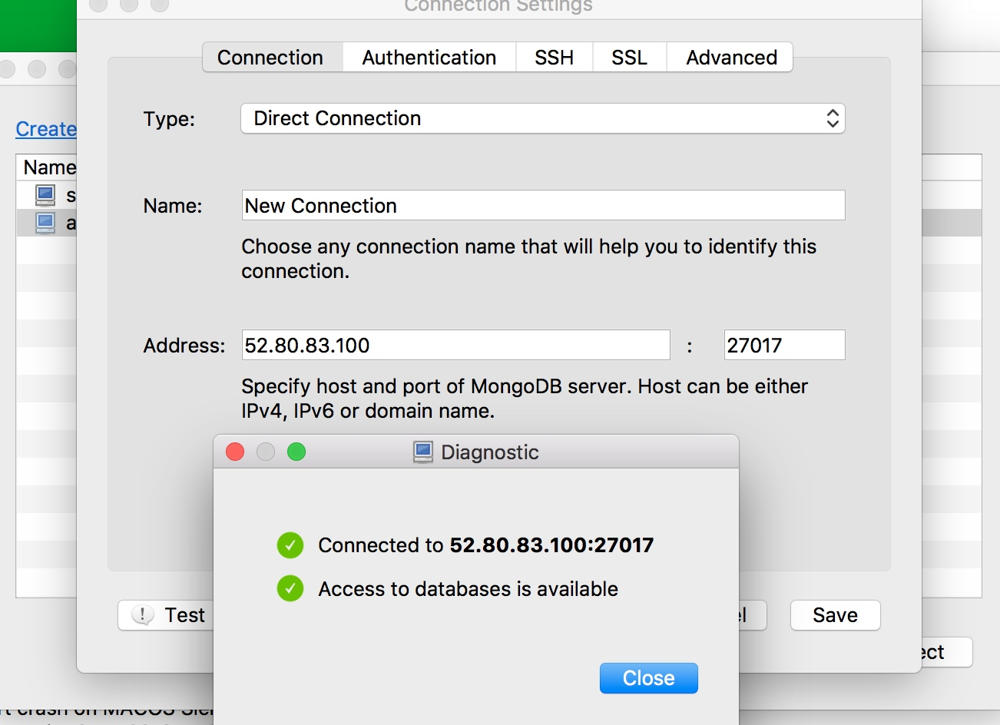

# 
[install](https://docs.mongodb.com/master/tutorial/install-mongodb-on-ubuntu/?_ga=2.265524232.681108377.1504368240-739410429.1504368240)

[golang mongo](http://blog.csdn.net/wangshubo1989/article/details/77567598?hmsr=studygolang.com&utm_medium=studygolang.com&utm_source=studygolang.com)

[aws mongodb 连接问题](https://www.aptible.com/documentation/enclave/troubleshooting/mongodb-error.html)
 
其实问题并不是那样的，我将bindIp注释掉，改为公有ip或弹性ip或私有ip都是不行的。最终通过
[Installing Mongodb on AWS EC2 Instance](https://www.youtube.com/watch?v=WreoGJbZTao)该视频中的第8分15秒到17秒解决...
如下登录成功！！

