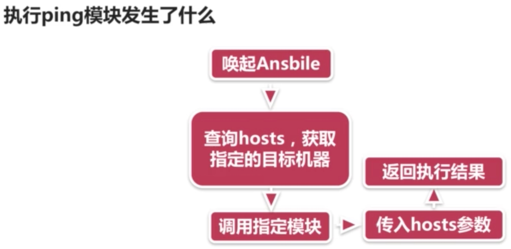
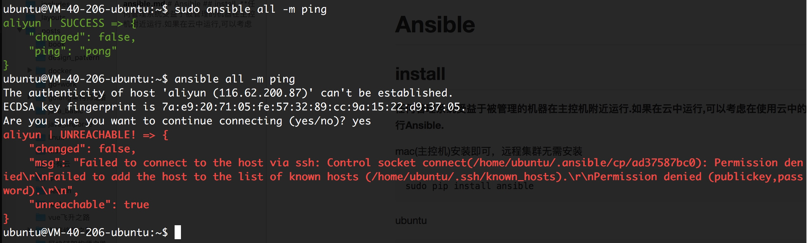

# Ansible
## install

**任何管理系统受益于被管理的机器在主控机附近运行.如果在云中运行,可以考虑在使用云中的一台机器来运行Ansible.**

mac(主控机)安装即可，远程集群无需安装

```sh
sudo pip install ansible
```

ubuntu


```sh
sudo apt-get install software-properties-common
sudo apt-add-repository ppa:ansible/ansible
sudo apt-get update
sudo apt-get install ansible
```

## 验证
`ansible --version`

## 添加一台机器


```sh
sudo vim /etc/ansible/hosts
$add ip
```


```sh
$ ssh-keygen
$ ssh-copy-id remote-ip
$ ssh remote-ip
```

```sh
vim /etc/hosts
ip AreaDNSName
```

```sh
ansile all -m ping
ansible aliyun -m ping
```

`ansible all -m ping ` 
1. ansible命令主体  ansible/ansible-playbook
2. pattern 目标机器或机器群 all指代所有 具体ip或名称 或 正则
3. -m 指定使用的模块 这里使用ping模块
4. 参数 没有则不写

`ansible all -a 'ls' `




## 注意



