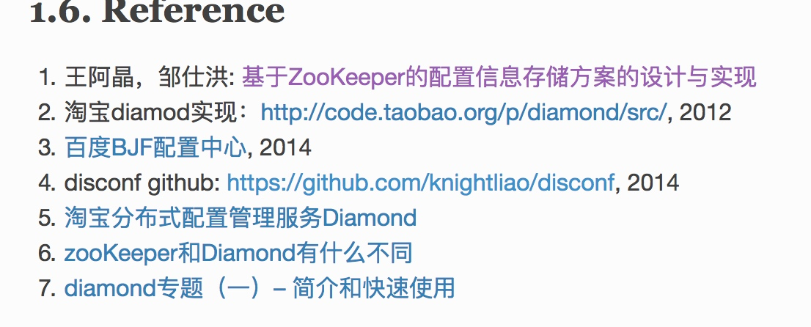

## 介绍,亮点:缓存
ag-admin
ag-gate
ag-cache
可以自定义每个key的有效时常
具有独立的管理界面
vue + element

v1版
基础配置管理
    用户管理
    菜单管理
    用户组管理
    数据字典
系统监控

v2版
基础配置管理
    用户管理
    菜单管理
    角色权限管理
    角色类型管理
    操作日志管理
    
角色按角色组管理  ->系统网我们说角色，或岗位或部门 其实都是人的合集，我们把其抽象成角色类型。

角色类型 管理员-分配权限

操作日志

## 项目架构图

--------------------------------

## 概要

1. 环境准备
0. spring cloud 之 what, why?
1. 搭建微服务架构
2. 使用sb搭建微服务脚手架
3. 服务间调用 了解应用Feign Hystrix Robbion **扩展内部服务调用鉴权**
4. API GateWay搭建，扩展Zuul层实现用户身份用户身份认证，实现无状态服务开发和设计
5. 前后端分离交互
6. 实战中的坑与解决方案

## 环境准备
mysql redis(oauth派发的token做管理)
jdk1.8  多线程特性 lambda collection 
IDEA
MAVEN
模板
ag-admin-learning 启动演示

------------
## Eureka
###   目录  
    原理
    高可用
    服务注册与失效事件处理
    Eureka常见的坑点与解决方案

### Eureka原理
    图(网上很多的，想想还是没有必要自己画了)，还是来更加实战的内容。
    Eureka Server <-> Eureka Client
    之间有Zone的概念
    Server之间有一套规则的，使用rest接口，心跳注册续约（30s），默认注销时间(90s)，缓存server中的信息
    提供服务发现的机制，每个客户端启动的时候会向server端发送注册自己的信息
    EurekaServer通过两两注册的方式(复制)完成服务注册表的同步从而完成高可用
    每个client启动之后，会周期性的向服务器端发送一个心跳，告知server端还存活着，保持c->s间的通信，防止服务(client)失效，或者服务端没有心跳检测客户端服务是否存活的话(默认注销时间90s)，那么其他服务就不可能发现该信息。
    默认注销90s的含义是: 当服务失效后，server端还是会继续检测3次，也就是90s后如果客户端服务还是挂的，则会在管理页面上启动保护模式，通知开发者该服务已经宕掉。
    Eureka client 会缓存eureka server的信息，好处是eureka server如果宕掉，则可以根据本地缓存的信息获取到其他存活节点信息，继续保持服务存活，也是高可用的一种保障。
    服务端心跳检测，健康检查，客户端缓存机制，灵活性，可用性，可伸缩性。
    
    实践中了解真知。

### Eureka中的Event 服务失效后如何拓展实现
手动服务停掉后，the self pre.. is turned off. 

那么生产环境中，该如何获取服务停掉的通知呢?
如何获取服务停掉的事件。
spring cloud eureka中的event包扩展了一些事件。

EurekaInstanceCanceledEvent 失效事件 eureka客户端注册失效时的事件(实例服务宕机事件)
EurekaInstanceRegisteredEvent 注册事件(服务注册成功)
EurekaInstanceRenewedEvent 心跳事件 (心跳成功每次触发一次)
EurekaRegistryAvaiableEvent 可用事件 (Eureka Server可以被其他客户端注册的时候触发)
EurekaServerStartedEvent 启动事件
ApplicationListener: Spring事件监听器 - 服务拓展失效通知

和以后的运维密切相关，服务宕机后，怎么迅速将该服务重新拉起来。
从代码中了解，spring cloud eureka 本身基于spring contex封装后扩展了一系列事件

### 拉取ag-admin-learning 演示代码原理
#### 1.实现EurekaServer的服务监听
ace-center(project) 注册中心 实现一个监听器  App CenterBootstrap
listener/ EurekaInstanceCanceledEvent implements ApplicationListener
@override
onApplicationEvent(ApplicationEvent applicationEvent)
EurekaServer服务启动可用后，触发EurekaRegistryAvaiableEvent，说明可以被其他客户端注册

其他事件需要配合启动的服务才能来发现观测
接下来监听服务注册成功
#### 2.注册实例服务（Eureka Client注册到EurekaServer）
ace-uc
eureka的注册很简单，我们将服务指向了一个defauleZone:http://localhost:8761/eureka 一个eureka中心
application name: user-center

#### 关键代码
添加注解 @SpringBootApplication
@EnableEurekaClient 成为一个Eureka的客户端
@EnableDiscoveryClient 让其可以发现Eureka的其他客户端 实例服务

pom中
1.spring-cloud-starter-eureka
2.spring-boot-starter-actuator 添加暴露一些监控的接口 
#### 演示
启动uc-center 观察CenterBootstarp Eureka服务端
然后关闭ucenter 在观察服务端
通过启动和关闭，都能在服务端看到相应信息

#### 拓展服务失效通知(devops提升效率提升运维)
event.getInstanceInfo().getHost name port 等都可以获取到相应的相关节点信息。
这实际上对于我们做一些数据的聚合，对异常的拉起，与命令行的结合，就可以很灵活

拓展消息提醒 邮件、手机、短信、微信等。
实现ApplicationListener即可啦 服务拓展失效通知。
有确认的过程
#### 高可用演示
关键点: eureka server互相注册 
       eureka client 每个节点都配置server的配置中心，防止某个中心宕机，实例服务无法工作。
## 配置中心
spring cloud config提供 Config Server 和Config Client 来提供可拓展的配置服务。
可以使用配置服务中心的几种管理所有的服务的各种环境的配置文件。
配置中心采用git方式配置存储文件，因此很容易部署修改，有助于对环境配置进行版本管理。

原理图 高可用
git config server  config client
使用eureka服务注册发现 实现高可用

拓展 使用spring-cloud-bus rabbitmq可以进行动态配置修改，不用停机。

### 其他配置中心
协程的阿波罗
百度的[disconf](http://disconf.readthedocs.io/zh_CN/latest/design/src/%E5%88%86%E5%B8%83%E5%BC%8F%E9%85%8D%E7%BD%AE%E7%AE%A1%E7%90%86%E5%B9%B3%E5%8F%B0Disconf.html)

截图有意思

## Eureka常见问题

### 1. 无法快速踢出已经关停的节点
Eureka本身是开启自我保护模式的。 默认的续约时间为30s，在实际过程中，我们会经常遇到它不会踢出已经关停的节点的问题（因为它开启了自我保护模式）。
解决方案: 配置中
eureka.server.enable-self-preservation  设置为false
eureka.server.eviction-interval-timer-in-ms 心跳 清理的间隔，每个多少秒清理这些节点，筛选那些已经失效的节点，就将其踢出。

在ace-center(注册中心) 服务端配置

eureka.client.enable-self-preservation: true ## 设置为false，关闭自我保护
fetchRegistry:false # fetchRegistry表示是否从EurekaServer中获取注册信息。 为true时，可以启动，但报异常:Can't execute request on any known server

演示: 1. 默认开启自我保护时，服务下线后是什么状况    
     2. 红字不见

### 2. 多网卡环境下的IP选择
经常出现在eureka客户端的时候 
docker部署Eureka client的时候，因为其会选择IP合法(标准IPV4地址)，索引值最小(eho0,eh1中eth0优先)且不在忽略列表中(application.properties中配置忽略哪些网卡)的网卡地址作为服务ip。

解决方案
多网卡时指定ip，docker部署推荐(因为docker ip是虚拟生成的，随机的)
eureka.instance.prefer-ip-address true
eureka.instance.ip-address 127.0.0.1

### 3. 服务感知慢

Eureka的wiki上有一句话，大意是一个服务启动后最长可能需要2分钟才能被其他服务感知。负载均衡找不到已经看到的实例服务(等待一段时间，最长为心跳时间)
解决方案 设置刷新时间
eureka.instance.leaseRenewallIntervalInSeconds. 
官方建议 在生产中，最好坚持使用哦任职，因为在服务内部有一些计算，他们对续约做出假设。
而开发中，我们可以调整该时间 (心跳时间)  

在配置uc-center之前 已经配置了路由表的指向 也就是ace-gteway已经在跑 
路由的设置规则讲解

### 4.bean的定义 EurekaServerBootstrap冲突
### 5.包的定义 ComponentScan .. classLoader 寻找配置

 
    

 

 

