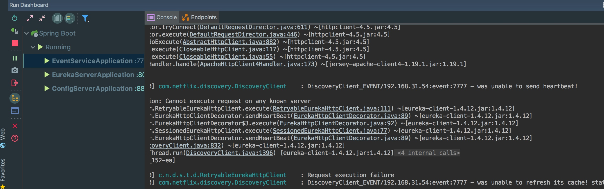

# 个人介绍

#0.  微服务的趋势
微服务 15-16年有了指数级的增长

# 此次的目标

(知识点与技术选型)
微服务的理论基础与核心原则 学习和了解微服务的出发点 落地基础

微服务架构在实施过程中有一套生态系统  
如何使用工具开发服务实现服务，服务实施过程中，随着规模的增加，如何完成服务的注册发现，
如何通过使用中心化的配置能够降低服务中配置信息变更时所带来的成本。 

同时mobile h5 app pc 都会有对服务的请求依赖，我们使用api网关去屏蔽内部服务的调用关系。  
(注册发现，配置中心，API网关，服务调用，熔断等)

不是银弹。 其实并不像很多网站上的文章所写的能够带来那么大的收益，微服务实施过程中其实非常依赖很多基础设施，比如devops，持续交付等，微服务并不是什么银弹，本质是更细粒度的分布式系统。分布式系统本身存在的复杂度也是微服务系统所面临的挑战。


持续流水线很重要，服务的拆分的越细，越会将服务频繁的部署到不同的环境中去。

devops(监控、告警、日志聚合、自动化部署)
devops的实施程度，包括自动化程度，也是决定了微服务能否在企业或者团队内部中实施成功的重要的点，我们需要对服务监控，对异常状况告警，同时在服务运行的过程中所产生的日志做聚合来帮助我们更快的定位问题，另外服务部署到不同环境时，比如测试环境，类生产环境，生产环境都希望能够通过自动化的方式完成高效的部署。

同时目前docker生态系统发展非常迅猛，docker的快速发展和生态的完善直接决定了微服务能否用更低的成本来实施的关键点。通过docker我们可以将服务打成不同的镜像，通过swarm或k8s 做docker的容器集群管理，或者使用rancher等。


# msa架构生态系统 
微服务实施过程中 相当重要的一幅图

从上往下走，包扩使用服务网关 API Gateway的方式将外部请求和内部请求进行隔离
第二部分 微服务(通常包括核心服务和聚合服务[通常是由多个服务的聚合]) 我们也会在案例中进行聚合服务的体现。  
在第二部分的右边呢，则是持续交付和流水线， 工程实践 非常重要的工程实践


再向下则是 在整个微服务实施以后，存在很多的支撑性的问题，比如说日志的收集，每个服务的监控和包括告警，以及服务的授权认证，还有是否需要中央的注册server帮助我们做服务的注册和发现，以及配置和容错等等 都属于服务的支撑部分。

最后一部分则是基础设施部分
包括典型的IaaS  aws 
pass  heroku / cloud foundry/ baidu/SINA SAE等
caas docker 等

做微服务架构的生态系统的最重要的主线。

# 主要内容
服务的构建
核心理论基础
架构生态系统
具体组件 案例

没有docker的生产环境，我们也可以很快的使用docker compose在本地运行服务。

# 案例应用架构图

# 单体应用以及 典型的单体应用架构

以java为例，基本都是三层架构，典型的是springmvc或strus 或2作为ui 前端部分 ，中间部分使用spring的ioc组装service，对于数据访问使用hibernate或mybatis实现。对于这种系统，我们通常在设计的时候或逻辑上分成三层，但是在发布的时候，我们会将它打成一个包，运行在容器tomcat或jetty的一个进程上。虽然我们把它在逻辑上进行了分层，但是最终落地部署的时候都还是一种中心化的方式进行部署，这是单体应用的核心点。

# 单体应用的优势
易于开发

易于测试

易于部署

易于伸缩

# 单体应用面临的挑战
随着单体应用的不断庞大，随着业务逻辑越来越复杂，尤其是最近这几年互联网的应用对于交付周期的要求上，单体应用会呈现出越来越多的挑战。
典型的包括四点
1. 维护成本增加
我们知道随着业务本身的演进，我们的系统尤其是单体应用会变得越来越复杂，不仅仅是应用本身，也包括团队。
比如说对于应用，如果我们的测试机制不完善的话，当应用变得越来越复杂，比如说上了50万或百万行代码后，对于开发人员实现代码或修复缺陷的风险就比较高了。有可能会修复的缺陷越多，就会导致潜在的缺陷越来越多。再加上团队成员本身的流动，所以这些知识就会慢慢的流失。因此维护成本会逐渐随着单体应用变得复杂而成本增加。
2. 新人培养成本周期长
我们可以想一下，当新人加入团队或者当自己作为一个新人加入团队的时候，需要多长时间熟悉业务，包括配置环境，和把应用安装起来，有些对于一些非常复杂的应用可能要花几周 甚至是上月的时间去了解文旦，安装环境去运行应用，所以对于新人而言培养周期非常长，而且对于企业也是一种浪费。
3. 交付周期长
对于整个单体应用而言，随着应用规模越来越大，整个交付周期就会越来越长，原因在于从代码的编译，静态检查，测试，到打包 到功能验证，很多企业对于最后回归测试的时候需要好几天，需要3天或者一周的时间对于过去打的包做回归测试。这就导致整个应用的交付周期比较长。 
4. 可伸缩性差
之前说过单体的易于伸缩核心点是指只是基于克隆的方式。对于现在很多复杂的应用，其实应用本身在业务场景上或者伸缩业务点是不一样的，但是对于单体应用上，我们把所有功能集中在了一个发布包内了，所以我们没有办法根据实际的要求来伸缩，也就是沃恩没有办法做到按照业务来做伸缩，只能对整个系统来做伸缩，因此他的伸缩效率和对资源的使用率就比较低。
所以这就是单体应用在发展过程中锁面临的挑战，也是我们目前很多遗留系统所面临的挑战

# 什么是微服务架构
马丁福勒在 2014年3月在其一篇博文最先提出来的。

翻译

总结红色字体 微服务的特征
我们会将大的应用程序分成小的服务，服务之间会通过轻量级的通信机制互相协作，每个服务可以被独立部署，考虑到不同的场景，我们可以选择合适的语言和工具对服务进行构建。


# 微服务的认识误区  及不是什么...
# soa 与微服务
soa有集中式的service消息总线，能够集中的控制，解决信息孤岛问题。
而本质 微服务的目的不是为了开发，而是为了企业或组织架构能够快速的交付产品功能。更希望强调的是每个微服务都能够独立的开发测试部署，基于业务场景做快速交付。
微服务和soa在实施层面上不一样。

# 微服务架构...部门的事
这点非常重要，在实施微服务的时候会带来很多挑战，因为对于微服务架构而言，它的核心出发点是企业或者组织能够快速的交付业务价值。所以才是希望把整个架构做成一个松耦合的系统，因此对于交付业务价值它一定不是仅仅由研发来决定的，它也会涉及到产品，分析，开发，测试，部署，运维包括性能调优，他是不同部门之间协作，才能做好微服务的实施和落地的。


# 一、 服务注册发现/配置中心/消息总线
eureka/config server/cloud bus/rabbitmq/idea
## 1. 启动 configserver
idea中开启configserver  报错。
解决 因为使用了cloud bus。所以需要依赖rabbitmq

- 命令行方式
gradle/maven/ java -jar...都可以
- docker方式

可以访问: http://127.0.0.1:8888/event/docker/master
讲解配置文件 部署的环境切换 文件配置切割

## 2. 开启rabbitmq

```
brew services restart rabbitmq
```

执行命令的时候会 输错 restop .. 
然后ctrl+p ,alt+f alt+b 终端的快捷键的演示。所以在此会说下内容
在执行命令的过程中，演示系统快捷键

最后这里 可以再演示下 ctrl+r  提示补全

这一步主要是为了看 rabbitmq和config server的关联界面 connections
第二是工具的便捷性 演示系统快捷键 idea快捷键 终端快捷键 chrome+vimium 的联合使用

我们可以看到其实在connection中已经有config-server的连接了。

## 3.  启动EventService
此时启动是报错的，因为配置了EurekaServer，需要作为客户端注册连接到EurekaServer，并与之保持心跳通信


由于eureka服务没有启动，我们会看到很多心跳连接错误。 


此时再看rabbitmq，这时是由两个连接了。
## 4. 开启EurekaServer


## 5. 访问服务发现中心
此时 实例服务一个也没有 看到event-service发送心跳还是不成功


刚好，30s做一次心跳检测。 失败


## v1.0版本的演示
v1.0
此时代码我会做成v1.0的config-server 和 cloud-bus 和 eureka通信的基本演示  。 
- eureka server与客户端的通信
- cloud-bus rabbitmq的简单通信关联


这时 我会演示下 git/tig/sourceTree/github/gitlab
我可以将git ssh github/gitlab的key 连接简单演示下。
sourceTree 检出响应的标签版本代码。

此时 可以演示下github sshkey 界面，中途觉得太麻烦，告知大家正常忘记的话，可以这样找。

```
☁  events_microservices [master] ⚡  pbcopy < ~/.ssh/id_rsa.pub                                                   [master↑1|●1
☁  events_microservices [master] ⚡ gp                                                                            [master↑1|●1
Counting objects: 14, done.
Delta compression using up to 4 threads.
Compressing objects: 100% (9/9), done.
Writing objects: 100% (14/14), 1.06 KiB | 0 bytes/s, done.
Total 14 (delta 4), reused 0 (delta 0)
remote: Resolving deltas: 100% (4/4), completed with 4 local objects.
To git@github.com:gomaster-me/events_microservices.git
   d7b9c4b..dad5ee5  master -> master
☁  events_microservices [master] ⚡  ssh -T git@github.com                                                          [master|●1
Hi gomaster-me! You've successfully authenticated, but GitHub does not provide shell access.
```

但是我们可以加快速度，提升效率，使用ctrl+r（前提是自己做过）
v2.0 2.0 我会将其修复。
## 6. 分析错误原因
我们分析 其实是客户端没有连到服务器端
此时我们检查服务器端配置 8000端口
而客户端写的为8010。 

## V1.1 代码演示


所以2.0 代码迁出 ，重启event-service客户端(eureka)服务. 注(config server)目前未连接到eureka上[但是这种认识是错误的，我们可以观察到rabbitmq此时是有两个连接的，我们可以下线event-server，而config-server还是存活的，一旦下线，rabbitmq中的连接也就都没有了，这里呢，最终的意识是我们的spring cloud bus，而非eureka有关联，但的确是在该版本config-server没有连接到eureka上]。(不会有啥业务压力的)


虽然启动时有些错误(mongodb的)，但是我们看到确实已经能否注册到eureka server上了。


[eureka常见问题总结以及最佳实践总结](http://www.itmuch.com/spring-cloud-sum-eureka/)

注意: 基础服务最好都先起来，再启动主体业务服务。否则可能起不起来。 只要顺序合理了，这里的服务v1.1的服务肯定能够注册上去。(除了mongo的错误 这不是事儿，因为没做配置)


我们看到mongo代码，虽然event配置中我们没有看到mongo配置，但它是走的默认配置


然后接下来告诉大家在spring.factors


但是没有找到，我们觉得在这里，就继续看该包下的内容


我们看到向下看其他包，看到了mongodb-..config包下


接下来我们再看AbstractMongoConfiguration 但alt+cmd+b也没有实现，


我们看到构造中有MongoProperties，于是乎找进去


autoconfiguration很重要


## ConfigServer架构图原理

## Eureka 架构图
画图讲解下https://www.processon.com/diagrams 我的流程模板中画下 eureka-server eureka-client的架构原理

## Eureka高可用架构原理

-----
接下来我们需要解决下


# 二、 服务调用/网关/容器化
## 由第一步的mongo缺失，而引导到容器化上
首先呢，我们上面的案例中，mongodb缺失，所以没有真正意义的跑起来，还没有和数据库集成。传统上我们需要官网下载安装赋予权限并配置，时间花费长，耗时耗力。并且最头疼的是环境依赖问题。(没有网络的话就...)

而docker则很方便，我们获取的是软件+环境

## 先给大家带来直观感受 nginx服务

```
docker run -d --name my-nginx -p 80:80 nginx
```

## 接下来直接使用mongo镜像

## 容器化我们的服务

## 使用docker compose编排服务

## 


# 三、 CI(持续集成) Gitlab 


----
## 补充一些坑 系统软件升级/墙的问题等

0. 墙的问题
1. mac升级vim不可用...


https://www.vv726.top/v2ex/385721


